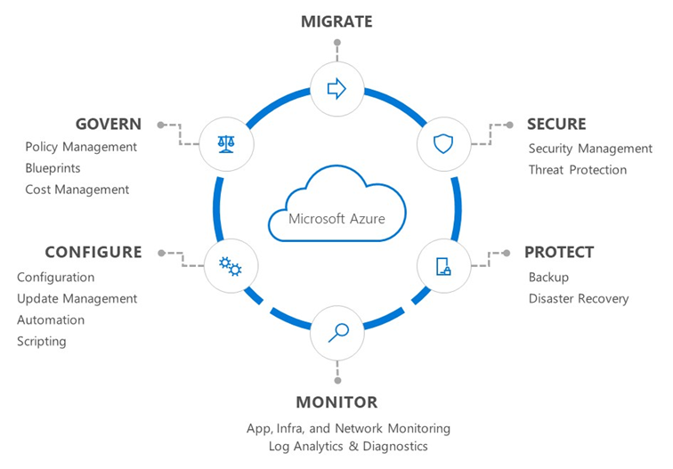

# Overview of Azure server management services

Azure server management services provide customers with a consistent experience for managing their servers at-scale. These services cover both Linux and Windows operating systems and can be used in production, development, and test environments. Additionally, they can support Azure IaaS virtual machines, physical servers, and virtual machines that are hosted either on-premises or in other hosting environments. 

Azure server management services suite includes the services shown in the following diagram. 

The guidance in this section of the Microsoft Cloud Adoption Framework provides an actionable and prescriptive plan for deploying server management services in your environment. This plan is meant to help orient you quickly to these services, guiding you through an incremental set of management stages for all environment sizes.

For simplicity, we've categorized this guidance into three stages:

<!-- markdownlint-disable MD026 -->

## Why use Azure management services?

Azure management services offer the following benefits:

- **Native to Azure.** Management services are built into and natively integrated with Azure Resource Manager. These services are continuously improved to provide new features and capabilities.
- **Windows and Linux**. Windows and Linux machines have the same consistent management experience.
- **Hybrid.** The management services cover Azure IaaS virtual machines as well as physical and virtual servers that are hosted on-premises or in other hosting environments.
- **Security.** Microsoft devotes substantial resources to all forms of security. This investment not only protects the Azure cloud infrastructure, but also extends the resulting technologies and expertise to protect customers' resources wherever they reside.

## Next steps

Familiarize yourself with the [tools, services, and planning](./prerequisites.md) involved with adopting the Azure server management suite.

> [!div class="nextstepaction"]
> [Prerequisite tools and planning](./prerequisites.md)
