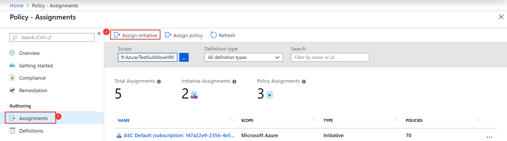
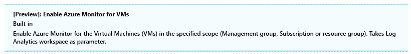
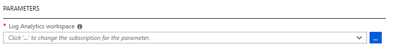
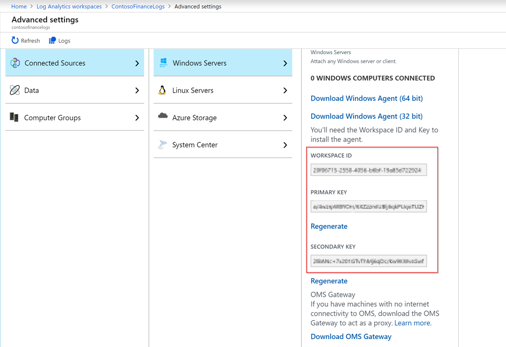
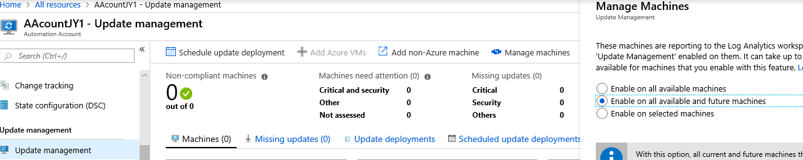
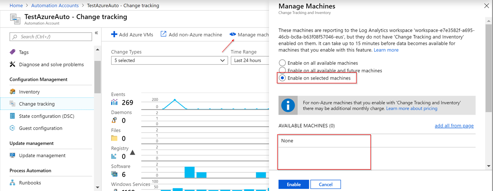

# Configure Azure management services at scale

Onboarding the Azure management services to your servers involves two tasks: deploying service agents to your servers and enabling the management solutions. This article covers the following processes that will allow you to complete these tasks:

- [Deploying required agents to Azure VMs using Azure Policy](#deploy-extensions-to-azure-vms-using-azure-policy)
- [Deploying required agents to on-premises servers](#install-required-agents-on-on-premises-servers)
- [Enable and configuring solutions](#enable-and-configure-solutions)

> [!NOTE]
> Create the required [Log Analytics workspace and Azure Automation account](./prerequisites.md#create-a-workspace-and-automation-account) before onboarding virtual machines to Azure management services.

## Deploy extensions to Azure VMs using Azure Policy

All of the management solutions discussed in [Azure management tools and services](./tools-services.md) require the Log Analytics agent to be installed on Azure virtual machines (VMs) and on-premises servers. You can onboard your Azure VMs at scale by using Azure Policy. Assign policy to ensure that the agent is installed on all your Azure VMs and connected to the correct Log Analytics workspace.

Azure Policy has a built-in [policy initiative](/azure/governance/policy/overview#initiative-definition) that includes both the Log Analytics agent and the [Microsoft Dependency agent](/azure/azure-monitor/insights/vminsights-onboard#the-microsoft-dependency-agent), which is required by Azure Monitor for VMs.

<!-- TODO: Add these when available.
- [Preview]: Enable Azure Monitor for virtual machine scale sets.
- [Preview]: Enable Azure Monitor for VMs.
 -->

> [!NOTE]
> For more information about various agents for Azure monitoring, see [Overview of the Azure monitoring agents](/azure/azure-monitor/platform/agents-overview).

### Assign policies

To assign the policies listed in the preceding section:

1. In the Azure portal, go to **Azure Policy** > **Assignments** > **Assign initiative**.

    

2. On the **Assign Policy** page, select the **Scope** by clicking the ellipsis (…), and then select either a management group or subscription. Optionally, select a resource group. A scope determines which resources or group of resources the policy is assigned to. Then choose **Select** at the bottom of the **Scope** page. 

3. Select the ellipsis (…) next to **Policy definition** to open the list of available definitions. You can filter the initiative definition by entering **Azure Monitor** in the **Search** box:

    

4. The **Assignment name** is automatically populated with the policy name that you selected, but you can change it. You can also add an optional description to provide more information about this policy assignment. The **Assigned by** field is automatically filled based on who is signed in. This field is optional and custom values can be entered.

5. For this policy, select **Log Analytics workspace** for the Log analytics agent to associate.

    

6. Check the **Managed Identity location**. If this policy is the type [DeployIfNotExists](https://docs.microsoft.com/azure/governance/policy/concepts/effects#deployifnotexists), it will require a managed identity to deploy the policy. In the portal, the account will be created as indicated with the check box selection.

7. Select **Assign**.

After completing the wizard, the policy assignment will be deployed to the environment. It can take up to 30 minutes for the policy to take effect. You can test it by creating new VMs after 30 minutes and then checking if the Microsoft Monitoring Agent (MMA) is enabled on the VM by default.

## Install required agents on on-premises servers

> [!NOTE]
> Create the required [Log Analytics workspace and Azure Automation account](./prerequisites.md#create-a-workspace-and-automation-account) before onboarding servers to Azure management services.

For on-premises servers, you'll need to download and install the [Log Analytics agent and the Microsoft Dependency agent](/azure/azure-monitor/insights/vminsights-enable-hybrid-cloud) manually and configure them to connect to the correct workspace. Do so by specifying the Workspace ID and key information, which you can find by going to your Log Analytics workspace in the Azure portal and selecting **Settings** > **Advanced settings**.



## Enable and configure solutions

To enable solutions, you need to configure the Log Analytics workspace. Onboarded Azure VMs and on-premises servers will get the solutions from the Log Analytics workspaces they are connected to. 

The following solutions are covered in this section:

- [Update Management](#update-management)
- [Change Tracking and Inventory](#change-tracking-and-inventory-solutions)
- [Azure Activity Log](#azure-activity-log)
- [Azure Log Analytics Agent Health](#azure-log-analytics-agent-health)
- [Antimalware Assessment](#antimalware-assessment)
- [Azure Monitor for VMs](#azure-monitor-for-vms)
- [Azure Security Center](#azure-security-center)

### Update Management

Update Management, Change Tracking, and Inventory solutions require both a Log Analytics workspace and an Automation account. To ensure these resources are properly configured, we recommend that you onboard through the Automation account. For more information, see [Onboard Update Management, Change Tracking, and Inventory solutions](/azure/automation/automation-onboard-solutions-from-automation-account).

We recommend enabling the Update Management solution for all servers. Update Management is free for Azure VMs and on-premises servers. If you enable Update Management through your Automation account, a [scope configuration](/azure/automation/automation-onboard-solutions-from-automation-account#scope-configuration) is created in the workspace. You'll need to manually update the scope to include machines covered by the update service.

To cover all existing servers, as well as future servers, you need to remove the scope configuration. To do so, view your Automation account in the Azure portal, and select **Update Management** > **Manage machine** > **Enable on all available and future machines**. Enabling this setting allows all Azure VMs connected to the workspace to use Update Management.



### Change Tracking and Inventory solutions

To onboard the Change Tracking and Inventory solutions, follow the same steps as for Update Management. For more information about onboarding these solutions from your Automation account, see [Onboard Update Management, Change Tracking, and Inventory solutions](/azure/automation/automation-onboard-solutions-from-automation-account).

The Change Tracking solution is free for Azure VMs and costs $6 per node per month for on-premises servers. This cost covers Change Tracking, Inventory, and Desired State Configuration. If you would like to enroll only specific on-premises servers, you can opt in those servers. We recommend that you onboard all your production servers.

#### Opt in via the Azure portal

1. Go to the Automation account that has Change Tracking and Inventory enabled.
2. Select **Change tracking**.
3. Select **Manage machines** on the right top pane.
4. Select **Enable on selected machines**, and select the machines to be enabled by clicking **Add** next to the machine name.
5. Select **Enable** to enable the solution for those machines.



#### Opt in by using saved searches

Alternatively, you can configure the scope configuration to opt in on-premises servers. Scope configuration uses saved searches. 

To create or modify the saved search, use the following steps:

1. Go to the Log Analytics workspace that is linked to your Automation account that you configured in the preceding steps.

2. Under **General**, select **Saved searches**.

3. In the **Filter** box, enter **Change Tracking** to filter the list of saved searches. In the results, select **MicrosoftDefaultComputerGroup**.

4. Enter the computer name or the VMUUID to include the computers that you want to opt in for Change Tracking.

    ```kusto
    Heartbeat
    | where AzureEnvironment=~"Azure" or Computer in~ ("list of the on-premises server names", "server1")
    | distinct Computer
    ```

    > [!NOTE] 
    > The server name must exactly match the value included in the expression, and it shouldn't contain a domain name suffix.

5. Select **Save**.

6. By default, the Scope Configuration is linked to the **MicrosoftDefaultComputerGroup** saved search and will be automatically updated.

### Azure Activity Log

[Azure Activity Log](https://docs.microsoft.com/azure/azure-monitor/platform/activity-logs-overview) is also part of Azure Monitor. It provides insight into subscription-level events that occur in Azure.

To add this solution:

1. In the Azure portal, open **All services** and select **Management + Governance** > **Solutions**.
2. In the **Solutions** view, select **Add**.
3. Search for **Activity Log Analytics** and select it.
4. Select **Create**.

You will need to specify the **Workspace name** of the workspace that you created in the previous section where the solution is enabled.

### Azure Log Analytics Agent Health

The Azure Log Analytics Agent Health solution gives you insight into the health, performance and availability of your Windows and Linux servers.

To add this solution:

1. In the Azure portal, open **All services** and select **Management + Governance** > **Solutions**.
2. In the **Solutions** view, select **Add**.
3. Search for **Azure Log Analytics agent health** and select it.
4. Select **Create**.

You will need to specify the **Workspace name** of the workspace that you created in the previous section where the solution is enabled.

After creation is complete, the workspace resource instance displays **AgentHealthAssessment** when you select **View** > **Solutions**.

### Antimalware Assessment

The Antimalware Assessment solution helps you identify servers that are infected or at increased risk of infection by malware.

To add this solution:

1. In the Azure portal, open **All services** and select **Management + Governance** > **Solutions**.
2. In the **Solutions** view, select **Add**.
3. Search for **Antimalware Assessment** and select it.
4. Select **Create**.

You will need to specify the **Workspace name** of the workspace that you created in the previous section where the solution is enabled.

After creation is complete, the workspace resource instance displays **AntiMalware** when you select **View** > **Solutions**.

### Azure Monitor for VMs

You can enable [Azure Monitor for VMs](/azure/azure-monitor/insights/vminsights-overview) through the view page for the VM instance, as described in the previous article, [Enable management services on a single VM for evaluation](./onboard-single-vm.md). You should not enable solutions directly from the **Solutions** page as you did for the other solutions described in this article. For large-scale deployments, it may be easier to use [automation](./onboarding-automation.md) to enable the correct solutions in the workspace.

### Azure Security Center

In this guidance, we recommend that you onboard all the servers to the Azure Security Center's *Free* tier by default. This option gives you a basic level of security assessments and actionable security recommendations for your environment. Upgrading to Security Center's *Standard* tier offers additional benefits, which are discussed in detail on the [Security Center pricing page](/azure/security-center/security-center-pricing).

To enable the Azure Security Center Free tier, use the following steps:

1. Go to the **Security Center** portal page.
2. Select **Security policy** under **POLICY & COMPLIANCE**.
3. Find the Log Analytics workspace resource that you have created in the rightmost pane.
4. Select **Edit settings >** for that workspace.
5. Select **Pricing tier**.
6. Choose the **Free** option.
7. Select **Save**.

## Next steps

Learn how to use automation to onboard servers and create alerts.

> [!div class="nextstepaction"]
> [Automate onboarding and alert configuration](./onboarding-automation.md)
