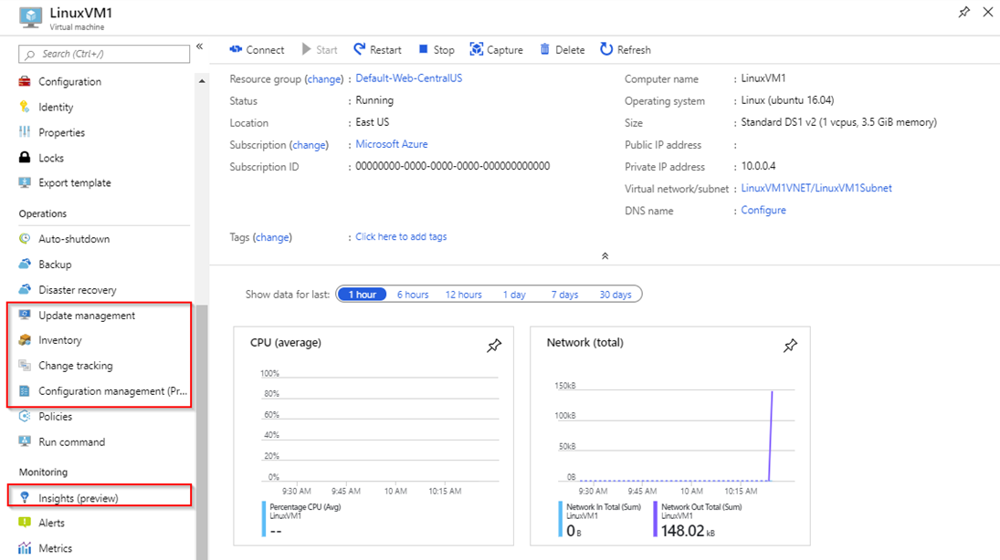

# Enable management services on a single VM for evaluation

Learn how to enable management services on a single VM for evaluation.

> [!NOTE]
> Create the required [Log Analytics workspace and Azure Automation account](./prerequisites.md#create-a-workspace-and-automation-account) before onboarding virtual machines to Azure management services.

Onboarding individual virtual machines (VMs) to the Azure server management services is simple in the Azure portal. The portal allows you to become familiar with these services before onboarding them to your VMs. When you select a VM instance, all the solutions discussed in the list of [management tools and services](./tools-services.md) appear under either the **Operations** menu or the **Monitoring** menu. You can select each solution and follow the wizard to onboard it.

## Related resources

For more information about onboarding individual VMs to each solution, see:

- [Onboard Update Management, Change Tracking, and Inventory solutions from Azure virtual machine](/azure/automation/automation-onboard-solutions-from-vm)
- [Onboard Azure Monitoring for VM](/azure/azure-monitor/insights/vminsights-enable-single-vm)

## Next steps

Learn how to use Azure Policy to onboard Azure VMs at scale.

> [!div class="nextstepaction"]
> [Configure Azure management services for a subscription](./onboard-at-scale.md)
