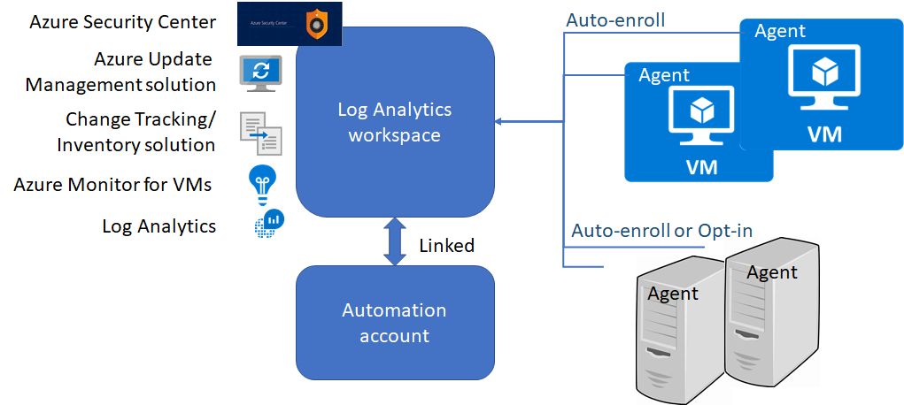

# Phase 2: Onboarding Azure server management services

Once you are familiar with the [tools](./tools-services.md) and [planning](./prerequisites.md) involved in Azure management services, the second phase provides step-by-step guidance for onboarding these services for use with your Azure resources. Start by evaluating this onboarding process before adopting it broadly in your environment.

> [!NOTE]
> The automation approaches discussed in later sections of this guidance are targeted at greenfield deployments that do not already have servers deployed to the cloud. They require you have the Owner role on a subscription to create all the required resources and policies. If you already have Log Analytics workspace and Automation account resources created, it's recommended that you pass these resources in the appropriate parameters when launching the example automation scripts.

## Onboarding processes

This section of the guidance covers the following onboarding processes:

- **Enable management services on a single VM for evaluation using the portal**. Use this process to familiarize yourself with the Azure server management services.
- **Configure management services for a subscription using the portal**. This process will help you configure the Azure environment so that any new VMs provisioned will automatically use management services. Use this approach if you prefer the portal experience.
- **Using Azure Automation to configure management services for a subscription**. This process is fully automated. You only need to create a subscription, and the scripts will configure the environment to use management services for any newly provisioned VM. Use this approach if you are familiar or want to learn to use PowerShell scripts and Resource Manager templates.

The procedures for each of these approaches are different.

This guidance covers both Azure virtual machines and on-premises servers. The following diagram shows the recommended deployment model for management services. Note that the sequence of onboarding steps when using the Azure portal will differ from the automated onboarding steps, as the portal experience offers a simper onboarding experience.

> [!NOTE]
> As show in the diagram above, the Log Analytics agent has both an *auto-enroll* and *opt-in* configuration for on-premises servers. *Auto-enroll*  means that when Log analytics agent is installed on a server and configured to connect to a workspace, the solutions enabled on that workspace will be automatically apply to the server. *Opt-in* means that even if the agent is installed and connected to the workspace, the solution will not be applied unless it’s added to the server's scope configuration in the workspace.

## Next steps

Learn how to onboard a single VM using the portal to evaluate the onboarding process.

> [!div class="nextstepaction"]
> [Onboard a single Azure VM for evaluation](./onboard-single-vm.md)
