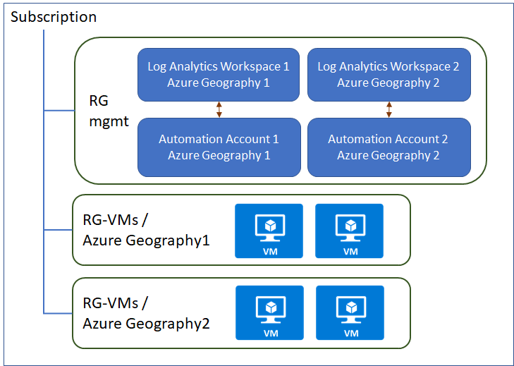
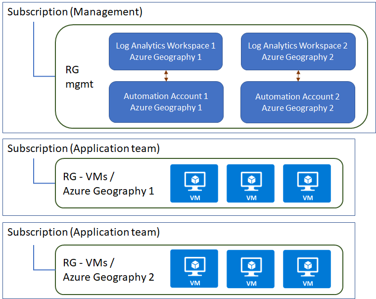
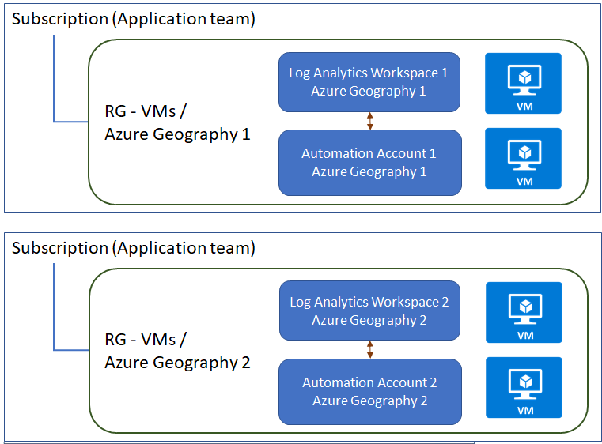

# Phase 1: Prerequisite planning for Azure server management services

In this phase, you'll become familiar with the Azure server management suite of services, and plan how to deploy the resources needed to implement these management solutions.

## Understand the tools and services

Review [Azure server management tools and services](./tools-services.md) for a detailed overview of the management areas that are involved in ongoing Azure operations and the Azure services and tools that help support you in these areas. Meeting your management requirements will involve using several of these services together. These tools are referenced often throughout this guidance.

The following sections discuss the planning and preparation required to use these tools and services.

## Log Analytics workspace and Automation account planning

Many of the services you will use to onboard Azure management services require a Log Analytics workspace and a linked Azure Automation account.

A [Log Analytics workspace](/azure/azure-monitor/learn/quick-create-workspace) is a unique environment for storing Azure Monitor log data. Each workspace has its own data repository and configuration. Data sources and solutions are configured to store their data in particular workspaces. Azure monitoring solutions require all servers to be connected to a workspace, so that their log data can be stored and accessed.

Some of the management services require an [Azure Automation](/azure/automation/automation-intro) account. By using this account and Azure Automation's capabilities, you can integrate Azure services and other public systems to deploy, configure, and manage your server management processes.

The following Azure server management services require a linked Log Analytics workspace and Automation account to function:

- [Azure Update Management](/azure/automation/automation-update-management)
- [Change Tracking and Inventory](/azure/automation/change-tracking)
- [Hybrid Runbook Worker](/azure/automation/automation-hybrid-runbook-worker)
- [Desired State Configuration](/azure/virtual-machines/extensions/dsc-overview)

The second phase of this guidance focuses on deploying services and automation scripts. It shows you how to create a Log Analytics workspace and an Automation account. This guidance also shows you how to use Azure Policy to ensure that new VMs are connected to the correct workspace.

The examples covered in this guidance assume a deployment that does not already have servers deployed to the cloud. To learn more about the principles and considerations involved in planning your workspaces, see [Manage log data and workspaces in Azure Monitor](/azure/azure-monitor/platform/manage-access).

## Planning considerations

When preparing the workspaces and accounts that you create for onboarding management services, consult the following discussions of issues:

- **Azure geographies and regulatory compliance**. Azure regions are organized into *geographies*. An [Azure geography](https://azure.microsoft.com/global-infrastructure/geographies/) ensures that data residency, sovereignty, compliance, and resiliency requirements are honored within geographical boundaries. If your workloads are subject to data sovereignty or other compliance requirements, workspace and Automation accounts must be deployed to regions within the same Azure geography as the workload resources they support.
- **Number of workspaces**. As a guiding principle, create the minimum number of workspaces required per Azure geography. We recommend at least one workspace for each Azure geography where your compute or storage resources are located. This initial alignment helps avoid future regulatory issues when migrating data to different geographies.
- **Data retention and capping**. You may also need to take Data retention policies or data capping requirements into consideration when creating workspaces or Automation accounts. For more information about these principles and additional considerations when planning your workspaces, see [Manage log data and workspaces in Azure Monitor](/azure/azure-monitor/platform/manage-access).
- **Region mapping**. Linking a Log Analytics workspace and an Azure Automation account is only supported between certain Azure regions. For example, if the Log Analytics workspace is hosted in the *EastUS* region, the linked Automation account must be created in the *EastUS2* region in order to be used with management services. If you have an Automation account that was created in another region, it will not be able to link to a workspace in *EastUS*. Choice of deployment region can significantly affect Azure geography requirements. Consult the [region mapping table](/azure/automation/how-to/region-mappings) to decide which region should host your workspaces and Automation accounts.
- **Workspace multihoming**. Log Analytics Agent supports multihoming in some scenarios, but the agent faces several limitations and issues when running in this configuration. Unless Microsoft has recommended using multihoming for your scenario, we don’t recommend configuring multihoming on the Log Analytics agent.

## Resource placement examples

There are several different models for choosing the subscription in which you place the Log Analytics workspace and Automation account. In short, you should place the workspace and Automation accounts in a subscription owned by the team that is responsible for implementing the Update Management and Change Tracking and Inventory services.

The following examples illustrate some ways that workspaces and Automation accounts can be deployed.

### Placement by geography

For small and medium environments with a single subscription and several hundred resources that span multiple Azure geographies, create one Log Analytics workspace and one Azure Automation account in each geography.

You can create a workspace and an Azure Automation account—one pair—in each resource group and deploy the pair in the corresponding geography to the virtual machines. Alternatively, if your data compliance policies do not dictate that resources reside in specific regions, you can create one pair to manage all the virtual machines. We also recommended that you place the workspace and Automation account pairs in separate resource groups to provide more granular role-based access control (RBAC).

The example in the following diagram has one subscription with two resource groups, each located in a different geography.

### Placement in a management subscription

For larger environments that span multiple subscriptions and have a central IT department that owns monitoring and compliance, create pairs of workspaces and Automation accounts in an IT management subscription. In this model, virtual machine resources in a geography store their data in the corresponding geography workspace in the IT management subscription. Application teams who need to run automation tasks, but who don't require linked workspace and Automation accounts, can create separate Automation accounts in their own application subscriptions.

### Decentralized placement

In an alternative model for large environments, responsibility for patching and management can lie with the application development team. In this case, you should place the workspace and Automation accounts pairs in the application team subscriptions alongside their other resources.

  

## Create a workspace and Automation account

After you've decided how best to place and organize workspace and account pairs, you'll need to ensure that you've created these resources before starting the onboarding process. The automation examples included later in this guidance create a workspace and Automation account pair for you. However, if you don't have an existing workspace and Automation account pair, you'll need to create one if you want to onboard by using the portal.

To create a Log Analytics workspace through the Azure portal, see [Create a workspace](/azure/azure-monitor/learn/quick-create-workspace#create-a-workspace). Next, create a matching Automation account for each workspace by following the steps in [Create an Azure Automation account](/azure/automation/automation-quickstart-create-account).

> [!NOTE]
> When creating an Automation account through the Azure portal, the default behavior attempts to create Run As accounts for both Azure Resource Manager and the classic deployment model resources. If you don't have classic VMs in your environment and you are not the co-administrator on the subscription, the portal will create a Run As account for Resource Manager, but it will generate an error when deploying the classic Run As account. If you don't intend to support classic resources, you can ignore this error.
>
> You can also create Run As accounts using [PowerShell](/azure/automation/manage-runas-account#create-run-as-account-using-powershell).

## Next steps

Learn how to [onboard your servers](./onboarding-overview.md) to Azure management services.

> [!div class="nextstepaction"]
> [Onboard to Azure server management services](./onboarding-overview.md)
