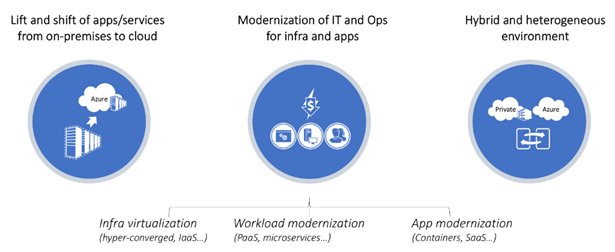

# Cloud monitoring guide: Introduction

The cloud presents a fundamental shift in the way that enterprises procure and use technology resources. In the past, enterprises assumed ownership and responsibility of all levels of technology, from infrastructure to software. Now, the cloud offers the potential for enterprises to provision and consume resources as needed.

While the cloud offers nearly unlimited flexibility in terms of design choices, enterprises seek proven and consistent methodology for the adoption of cloud technologies. Each enterprise has different goals and timelines for cloud adoption, making a one-size-fits-all approach to adoption nearly impossible.

This digital transformation is also enabling an opportunity to modernize your infrastructure, workloads, and applications. Depending on business strategy and objectives, adopting a hybrid cloud model is likely part of the migration journey from on-premises to fully operating in the cloud. During this journey, IT teams are challenged to adopt and realize rapid value from the cloud. IT must also understand how to effectively monitor the application or service migrating to Azure, and continue delivering effective IT operations/DevOps.

Stakeholders want to use cloud-based, software as a service (SaaS) monitoring and management tools. They need to understand what services and solutions deliver in order to achieve end-to-end visibility, reduce costs, and focus less on infrastructure and maintenance of traditional software-based IT operations tools.

However, IT often prefers to use the tools they have already made a significant investment in. This supports their service operations processes to monitor both cloud models, with the eventual goal of transitioning to a SaaS-based offering. This choice is not only because it takes time planning, resources, and funding to switch. It's also due to confusion about which products or Azure services are appropriate or applicable to achieve the transition.

The goal of this guide is to provide a detailed reference to help enterprise IT managers, business decision makers, application architects, and application developers understand:

* Azure monitoring platforms, with an overview and comparison of their capabilities.
* The best-fit solution for monitoring hybrid, private, and Azure native workloads.
* The recommended monitoring approach for both infrastructure and applications as a whole, from end-to-end. This includes deployable solutions for these common workloads migrating to Azure.

This guide isn't a how-to guide for using or configuring individual Azure services and solutions, but does reference those sources when applicable or available. After reading this guide, you'll understand how to successfully operate a workload following recommended practices and patterns.

If you are unfamiliar with Azure Monitor and System Center Operations Manager and you would like to get a better understanding of what makes them unique and how they compare to each other before going any further, review the [Overview of our monitoring platforms](./platform-overview.md).

## Audience

This guide is primarily useful for enterprise administrators, IT operations, IT security and compliance, application architects, workload development owners, and workload operations owners.

## How this guide is structured

This article is part of a series. The following articles are meant to be read together, in order:

* Introduction (this article)
* [Monitoring strategy for cloud deployment models](./cloud-models-monitor-overview.md)
* [Collecting the right data](./data-collection.md)
* [Alerting](./alert.md)

## Products and services

A selection of software and services are available to monitor and manage a variety of resources hosted in Azure, your corporate network, or other cloud providers. They are:

* System Center Operations Manager
* Azure Monitor, which now includes Log Analytics and Application Insights
* Azure Policy and Azure Blueprints
* Azure Automation
* Azure Logic Apps
* Azure Event Hubs

This first version of the guide covers our current monitoring platforms - Azure Monitor and System Center Operations Manager, and outlines our recommended strategy for monitoring each of the cloud deployment models. Also included is the first set of monitoring recommendations, starting with data collection and alerting.

## Next steps

> [!div class="nextstepaction"]
> [Monintoring strategy for cloud deployment models](./cloud-models-monitor-overview.md)
