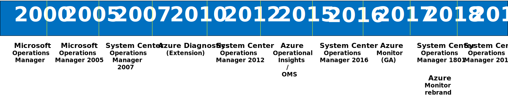
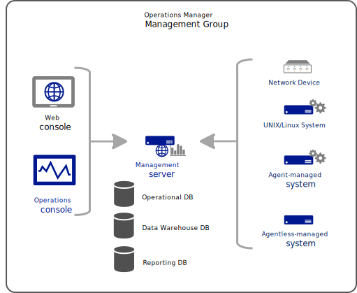
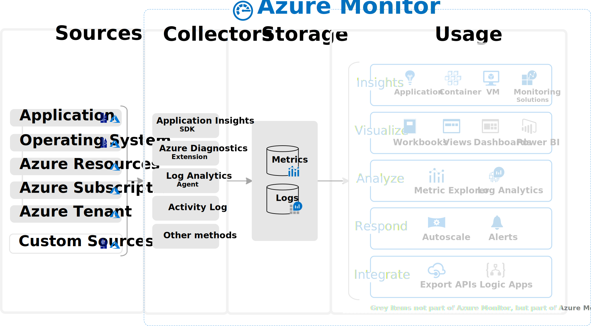
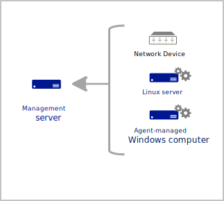

# Cloud monitoring guide: Overview of the Azure monitoring platform

Microsoft provides a range of monitoring capabilities from two products: System Center Operations Manager for on-premises environments, and Azure Monitor for the cloud. These offerings deliver core monitoring services, such as alerting, service uptime tracking, application and infrastructure health monitoring, diagnostics, and analytics.

Many organizations are embracing the latest practices for DevOps agility and cloud innovations to manage their heterogenous environments. Yet they are also concerned about their ability to make appropriate and responsible decisions regarding how to monitor those workloads.

This article compares the current offerings available, and outlines our recommended strategy based on the following factors:

- Your current investment in Operations Manager or other monitoring platforms on your corporate network, and whether it’s tightly integrated with your IT operations processes.
- Your migration approach to Azure. This approach can be a staged one, extending your corporate network to Azure, or redesigning applications and services to run natively in Azure by using a combination of IaaS and PaaS resources.

Our strategy includes support for monitoring infrastructure (compute, storage, and server workloads), application (end-user, exceptions, and client), and network resources to deliver a complete, service-oriented monitoring perspective.

Every journey has a story. Before we dive into the detailed overview, let’s start with a brief look at where it all began when we entered the monitoring field, and how our strategy has evolved over time.

## Story of System Center Operations Manager

In 2000, we entered the operations management field with Microsoft Operations Manager (MOM) 2000. In 2007, we introduced a reengineered version of the product named System Center Operations Manager. It moved beyond simple monitoring of a Windows server and concentrated on robust, end-to-end service and application monitoring, including heterogenous platforms, network devices, and other application or service dependencies. It's an established, enterprise-grade monitoring platform for on-premises environments, in the same class as IBM Tivoli or HP Operations Manager in the industry. It has evolved to support monitoring compute and platform resources running in Azure, Amazon Web Services (AWS), and other cloud providers.

Operations Manager monitors these different platforms, devices, applications, and infrastructure services with a management pack. Defined in a management pack are all the elements required for monitoring an IT service or application, including the service model, health model, discovery rules, views, and reports. After the management pack is imported into the management group, it automatically detects if the agent is running the components supporting the application or IT service. If so, it runs the workflows that proactively monitor them.

As an extensible platform, Operations Manager is supported by a broad ecosystem of partners and communities that provide a variety of solutions. These solutions include:

- Management packs to monitor non-Microsoft applications, vendor hardware, and other technologies, to deliver full-stack monitoring or to automate and extend features of Operations Manager.
- Visualization products that include advanced dashboarding capabilities and engaging data visualizations. These help to easily analyze the data on any browser or device in the enterprise.
- Integration with other ITSM products or orchestration tools, to support incident recording, configuration management, and incident autoremediation.
- Custom code to automate and extend Operations Manager, by using published APIs.

## Story of Azure Monitor

When Azure cloud was released in 2010, monitoring of cloud services was provided with the Azure Diagnostics agent, which delivered a way to collect diagnostic data from Azure compute and platform resources. In addition to viewing this data in the Azure portal, you can use Azure Storage to view the data with one of several available tools, such as Server Explorer in Visual Studio and Azure Storage Explorer.

This capability was considered a general monitoring tool. It lacked many features that were available in enterprise-class monitoring platforms, and it wasn’t consistent between each service that supported this method. In addition, as new Azure services were released, each provided its own monitoring method. Azure services lacked an overall, common monitoring methodology and framework. For these reasons, we began working on Azure Insights. It provided a common framework to collect platform metrics and logs from any Azure service that started using the framework.

In 2015, Azure Operational Insights was made generally available. It delivered the Log Analytics analysis service that collected and searched data from machines in Azure, on-premises, or other cloud environments, and it connected to System Center Operations Manager. Intelligence packs delivered different pre-packaged management and monitoring configurations. These contained a collection of query and analytic logic, visualizations, and data collection rules for such scenarios as capacity planning, security auditing, health assessments, and alert management. As part of this release, Azure Operational Insights was added to the new Operations Management Suite (OMS). OMS intended to provide a unified IT management experience for organizations by bringing together a collection of IT management solutions, including automation, backup, recovery, and security.

Early on, Microsoft realized the need for a common monitoring framework and began working on Azure Insights. This service collected and routed platform metrics and logs from any Azure service into a central pipeline. In 2016, we rebranded Azure Insights as Azure Monitor, which was released in March 2017. Even before release, we began consolidation of the various alerting capabilities into the newly branded Azure Monitor.

In 2018, Azure Monitor expanded to include several different services that were originally developed for independent functionality:

- **Log Analytics** provided rich analytical insight of log data from services and applications. It shared the same agent as Operations Manager to collect monitoring data from VMs both in the cloud and on-premises. Monitoring solutions in Log Analytics were like management packs in Operations Manager, providing packaged logic to monitor a particular product or service.
- **Application Insights** grew from Application Performance Monitoring in Operations Manager. It provided rich monitoring of web applications written in a variety of languages. Application Insights collects details on application performance, requests and exceptions, and traces.
- **Azure Insights** (briefly branded Azure Monitor) provided core metrics and resource diagnostics logs for only Azure platform resources. It also included alerting and notification based on those metrics. The notification system included the ability to integrate with partner applications through webhooks and ITSM software. Later, it also integrated with Azure Logic Apps and Azure Automation, in addition to common notification methods such as voice, SMS, and email.
- **Azure Network Watcher** to monitor, diagnose, and view metrics for resources in an Azure virtual network.

Now that you understand the history, let’s review the way Operations Manager monitors applications and infrastructure services, and understand the advantages Azure Monitor provides as a SaaS monitoring platform for organizations.

## Infrastructure requirements

### Operations Manager

Operations Manager requires significant infrastructure to support a management group, which is a basic unit of functionality. At a minimum, a management group consists of one or more management servers, a SQL Server, hosting the operational and reporting data warehouse database, and agents. The complexity of a management group design depends on a number of factors, such as the scope of workloads to monitor, how many devices or computers support the workloads, and if you require high availability and site resiliency.

Each of these components requires infrastructure and software within your corporate network that must be maintained.

### Azure Monitor

Azure Monitor is a SaaS service, where all the infrastructure supporting it is running in the Azure cloud and is managed by Microsoft. It's designed to do monitoring, analytics, and diagnostics at scale, and is available in all national clouds. Core parts of the infrastructure (collectors, metrics and logs store, and analytics) are necessary to support Azure Monitor.

## Data collection

### Operations Manager

#### Agents

Operations Manager only collects data directly from agents installed on [Windows computers](https://docs.microsoft.com//system-center/scom/plan-planning-agent-deployment?view=sc-om-1807#windows-agent). It can accept data from the Operations Manager SDK, but this is typically used for partners extending the product with custom applications, not for collecting monitoring data. It collects data from other sources, such as [Linux computers](https://docs.microsoft.com/system-center/scom/plan-planning-agent-deployment?view=sc-om-1807#linuxunix-agent) and network devices, by using special modules that run on the Windows agent remotely accessing these other devices.

The Operations Manager agent can collect from multiple data sources on the local computer, such as the event log, custom logs, and performance counters. It can also run scripts, which can collect data from the local computer or from external sources. You can write custom scripts to collect data that can’t be collected by other means, or from a variety of remote devices that can’t otherwise be monitored.

#### Management packs

Operations Manager performs all monitoring with workflows (rules, monitors, and discoveries). These are packaged together in a [management pack](https://docs.microsoft.com/system-center/scom/manage-overview-management-pack?view=sc-om-2019), and deployed to agents. Management packs are available for a variety of products and services that include predefined rules and monitors. You can also author your own management pack for your own applications and custom scenarios.

#### Workflows

Management packs can contain hundreds of workflows, and a single agent simultaneously runs all workflows from all the management packs it has loaded. Each instance of each workflow runs independently, and acts immediately on the data that it collects. This is how Operations Manager can achieve near real-time alerting and the current health state of monitored resources.

For example, a monitor might sample a performance counter every few minutes. If that counter exceeds a threshold, it immediately sets the health state of its target object, which immediately triggers an alert. A scheduled rule might watch for a particular event to be created, and immediately fire an alert when that event is created in the local event log.

Because workflows are isolated from each other and work from the individual sources of data, Operations Manager has challenges correlating data between multiple sources. It’s also difficult to react to data after it’s been collected. You can run workflows that access the Operations Manager database, but this scenario isn’t common and it's typically used for a limited number of special purpose workflows.

### Azure Monitor

#### Data sources

Azure Monitor collects data from a variety of sources, including Azure infrastructure and platform resources, agents on Windows and Linux computers, and monitoring data collected in Azure storage. Any REST client can write log data to Azure Monitor by using an API, and you can define custom metrics for your web applications. Some metric data can be routed to different locations, depending on its usage. For example, you might use the data for "fast-as-possible" alerting, or for long-term trend analysis searched in conjunction with other log data.

#### Monitoring solutions and insights

Monitoring solutions use the logs platform in Azure Monitor to provide monitoring for a particular application or service. They typically define data collection from agents or from Azure services, and provide log queries and views to analyze that data. They typically don’t provide alert rules, meaning that you must define your own alert criteria based on collected data.

Insights use the logs and metrics platform of Azure Monitor to provide a customized monitoring experience for an application or service in the Azure portal. They might provide health monitoring and alerting conditions, in addition to customized analysis of collected data.

#### Workflows

Azure Monitor separates data collection from actions taken against that data, which supports distributed microservices in a cloud environment. It consolidates data from multiple sources into a common data platform, and provides features or performing such monitoring tasks as analysis, visualization, and alerting base on that collected data.

Monitor stores all data collected either as logs or as metrics, and different features of Monitor rely on either. Metrics contain numerical values in time series that are well suited for near real-time alerting and fast detection of issues. Logs contain text or numerical data, and are supported by a powerful query language that make them especially useful for performing complex analysis.

Because Monitor separates data collection from actions against that data, it might not be able to provide near real-time alerting in many cases. You must retrieve all log data by using a log query, which is scheduled in alerts. This behavior allows Monitor to easily correlate data from all monitored sources, and you can interactively analyze data in a variety of ways.

## Health monitoring

### Operations Manager

Management Packs in Operations Manager include a service model that describes the components of the application being monitored and their relationship. Monitors identify the current health state of each component based on data and scripts on the agent. Health states roll up so that you quickly view the summarized health state of monitored computers and applications.

### Azure Monitor

Azure Monitor doesn’t provide a standard means of implementing a service model or monitors that indicate the current health state of any service components. Because monitoring solutions are based on standard features of Azure Monitor, they don’t provide state level monitoring. The following features of Azure Monitor can be helpful:

- **Application Insights** builds a composite map of your web application, and provides a health state for each application component or dependency. This includes alerts status and drill-down to more detailed diagnostics, if your app uses Azure services.
- **Azure Monitor for VMs** delivers a health monitoring experience for the guest Azure VMs, similar to Operations Manager, when monitoring Windows and Linux virtual machines. It evaluates the health of key operating system components from the perspective of availability and performance to determine the current health state. When it determines the guest VM is experiencing sustained resource utilization, disk space capacity, or an issue related to core operating system functionality, it generates an alert to bring this state to your attention.
- **Azure Monitor for containers** monitors the performance and health of Azure Kubernetes Services or Azure Container Instances. It collects memory and processor metrics from controllers, nodes, and containers that are available in Kubernetes through the Metrics API. It also collects container logs, and inventory data about containers and their images. Pre-defined health criteria based on the performance data collected help you identify if there is a resource bottleneck or capacity issue. You can also understand the overall performance, or the performance from a specific Kubernetes object type (pod, node, controller, or container).

## Analyzing data

### Operations Manager

Operations Manager provides four basic ways to analyze data after it’s collected.

- With **Health Explorer**, you can find out which monitor is reflecting a health state issue and review knowledge about the monitor and possible causes for actions related to it.

- **Views** are predefined visualizations of collected data, such as a graph of performance data or a list of monitored components and their current health state. Diagram views visually present the service model of an application.

- **Reports** allow you to summarize historical data stored in the Operations Manager data warehouse. You can customize the data that views and reports are based on, but there is no feature to allow for complex or interactive analysis of collected data.

- **Operations Manager Command Shell**, which extends Windows PowerShell with an additional set of cmdlets, can query and visualize collected data. This includes graphs and other visualizations, natively with PowerShell, or with the Operations Manager HTML-based web console.

### Azure Monitor

Azure Monitor has a powerful analytics engine that allows you to interactively work with detailed or aggregated log data. Views and dashboards allow you to visualize query data in different ways from the Azure portal, and import into Power BI. Monitoring solutions include queries and views to present the data they collect. Insights such as Application Insights, Azure Monitor for VMs, and Azure Monitor for containers include customized visualizations to support interactive monitoring scenarios.

## Alerting

### Operations Manager

Operations Manager creates alerts in response to important events on an agent, when a performance threshold is crossed, and when the health state of a monitored component changes. It includes complete management of alerts, allowing you to set their resolution and assign them to different operators. You can set notification rules that specify which alerts will send proactive notifications.

Management packs include various predefined alerting rules for different critical conditions in the application being monitored. You can tune these rules to the particular requirements of your environment.

### Azure Monitor

Azure Monitor allows you to create alerts based on a metric crossing a threshold, or based on a scheduled query returning results. Alerts based on metrics can achieve near real-time results, while scheduled queries have a longer response time, depending on the speed of data ingestion and indexing. Instead of being limited to a specific agent, log query alerts in Azure Monitor allow you to analyze data across all data stored in multiple workspaces. These alerts also include data from a specific Application Insights app by using a cross-workspace query.

While monitoring solutions can include alert rules, typically you create them based on your own requirements.

## Workflows

### Operations Manager

Management packs in Operations Manager contain hundreds of individual workflows, and determine both what data to collect and what action to perform with that data. For example, a rule might sample a performance counter every few minutes, storing its results for analysis. A monitor might sample the same performance counter, and compare its value to a threshold to determine the health state of a monitored object. Another rule might run a script to collect and analyze some data on an agent computer, and fire an alert if it returned a particular value.

Workflows in Operations Manager are independent of each other, so analysis across multiple monitored objects is difficult. These monitoring scenarios must be based on data after it's collected, which is possible but can be difficult, and isn’t common.

### Azure Monitor

Azure Monitor separates data collection from actions and analysis taken from that data. Agents and other data sources write log data to a Log Analytics workspace, and metric data to the metric database, without any analysis of that data or knowledge of how it might be used. Monitor performs alerting and other actions from the stored data, which allows you to perform analysis across data from all sources.

## Extending base platform

### Operations Manager

Operations Manager implements all monitoring logic in a management pack, which you either create yourself or obtain from us or a partner. When you install a management pack, it automatically discovers components of the application or service on different agents, and deploys appropriate rules and monitors. The management pack contains health definitions, alert rules, performance and event collection rules, and views, to provide complete monitoring supporting the infrastructure service or application.

The Operations Manager SDK enables Operations Manager to integrate with third-party monitoring platforms or ITSM software. The SDK is also used by some partner management packs to support monitoring network devices, and deliver custom presentation experiences like the Squared Up HTML5 dashboard or our Visio integration.

### Azure Monitor

Azure Monitor collects metrics and logs from Azure resources, with little to no configuration. Monitoring solutions add logic for monitoring an application or service, but still work within the standard log queries and views in Monitor. Insights, such as Application Insights and Azure Monitor for VMs, use the Monitor platform for data collecting and processing, and also provide additional tools to visualize and analyze the data. You can combine data collected by insights with other data, by using core Monitor features such as log queries and alerts.

Monitor supports several methods to collect monitoring or management data from Azure or external resources. You can then extract and forward data from the metric or log stores to your ITSM or monitoring tools, or perform administrative tasks by using the Azure Monitor REST API.

## Next step

> [!div class="nextstepaction"]
> [Monitoring Azure cloud applications](./cloud-app-howto.md)
