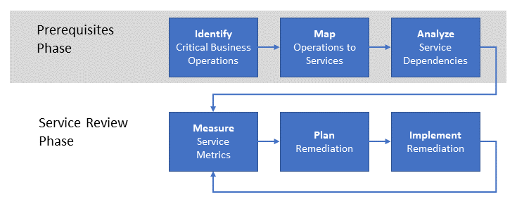

# Establishing an operational fitness review

As your enterprise begins to operate workloads in Azure, the next step is to establish an **operational fitness review** process to enumerate, implement, and iteratively review the **non-functional** requirements for these workloads. _Non-functional_ requirements are related to the expected operational behavior of the service. There are five essential categories of non-functional requirements referred to as the [pillars of software quality](../../guide/pillars.md): scalability, availability, resiliency (including business continuity and disaster recovery), management, and security. The purpose of an operational fitness review process is ensuring that your mission critical workloads meet the expectations of your business with respect to the quality pillars.

For this reason,  your enterprise should undertake an operational fitness review process to fully understand the issues that result from running the workload in a production environment, determine how to remediate the issues, then resolve them. This article outlines a high-level operational fitness review process that your enterprise can use to achieve this goal.

## Operational fitness at Microsoft

From the outset, the development of the Azure platform has been a continuous development and integration project undertaken by many teams across Microsoft. It would be very difficult to ensure quality and consistency for a project of Azure's size and complexity without a robust process for enumerating and implementing the fundamental non-functional requirements on a regular basis.

These processes followed by Microsoft form the basis for those outlined in this document.

## Understanding the problem

As you learned in [Getting started](../../cloud-adoption/getting-started/overview.md), the first step in an enterprise's digital transformation is identifying the business problems to be solved by adopting Azure. The next step is to determine a high-level solution to the problem, such as migrating a workload to the cloud, or adapting an existing on-premises service to include cloud functionality. Finally, the solution is designed and implemented.

During this process, the focus is often on the _features_ of the service. That is, there are a set of desired _functional_ requirements for the service to perform. For example, a product delivery service requires features for determining the source and destination locations of the product, tracking the product during delivery, customer notifications, and others.

In contrast, the _non-functional_ requirements relate to properties such as the service's [availability](../../checklist/availability.md), [resiliency](../../resiliency/index.md), and [scalability](../../checklist/scalability.md). These properties differ from the functional requirements because they do not directly affect the final function of any particular feature in the service. However, these non-functional requirements are related to the _performance_ and _continuity_ of the service.

Some non-functional requirements can be specified in terms of a service level agreement (SLA). For example, with regard to service continuity, an availability requirement for the service can be expressed as a percentage such as **available 99.99% of the time**. Other non-functional requirements may be more difficult to define and may change as production needs evolve. For example, a consumer-facing service might start facing unanticipated throughput requirements after a surge of popularity.

![NOTE] Defining the requirements for resiliency, including explanations of RPO, RTO, SLA, and related concepts, are explored in more depth in [Designing resilient applications for Azure](../../resiliency/index.md#define-your-availability-requirements).

## Operational fitness review process

The key to maintaining the performance and continuity of an enterprise's services is to implement an _operational fitness review_ process.

At a high level, the process has two phases. In the prerequisites phase, the requirements are established and mapped to supporting services. This occurs less frequently; perhaps annually or when new operations are introduced. The output of the prerequisites phase is used in the flow phase. The flow phase occurs more frequently; we recommend monthly.

### Prerequisites phase

The steps in this phase are intended to capture the necessary requirements for conducting a regular review of the important services.

- **Identify critical business operations**. Identify the enterprise's **mission critical** business operations. Business operations are independent from any supporting service functionality. In other words, business operations represent the actual activities that the business needs to perform and are supported by a set of IT services. The term _mission critical_, or alternatively _business critical_, reflects a severe impact to the business if the operation is impeded. For example, an online retailer may have a business operation such as "enable a customer to add an item to a shopping cart" or "process a credit card payment". If either of these operations were to fail, a customer would be unable to complete the transaction and the enterprise would fail to realize sales.

- **Map operations to services**. Map these business operations to the services that support them. In the above shopping cart example, several services may be involved: an inventory stock management service, a shopping cart service, and others. In the credit card payment example above, an on-premises payment service may interact with a third-party payment processing service.

- **Analyze service dependencies**. Most business operations require orchestration between multiple supporting services. It is important to understand the dependences between the services and the flow of mission critical transactions through these services. You should also consider the dependencies between on-premises services and Azure services. In the shopping cart example, the inventory stock management service may be hosted on-premises and ingest data input by employees from a physical warehouse, but it may store data in an Azure service such as [Azure storage](/azure/storage/common/storage-introduction) or a database such as [Azure Cosmos DB](/azure/cosmos-db/introduction).

An output from these activities is a set of **scorecard metrics** for service operations. The metrics are categorized in terms of non-functional criteria such as availability, scalability, and disaster recovery. Scorecard metrics express the criteria that the service is expected to meet operationally. These metrics can be expressed at any level of granularity that is appropriate for the service operation.

The scorecard should be expressed in simple terms to facilitate meaningful discussion between the business owners and engineering. For example, a scalability scorecard metric could be expressed as _green_ for performing at the desired criteria, _yellow_ for failing to meet the desired criteria but actively implementing a planned remediation, and _red_ for failing to meet the desired criteria with no plan or action.

It is important to emphasize that these metrics should directly reflect business needs.

### Service review phase

The service review phase is core of the operational fitness review process.

- **Measure service metrics**. Using the scorecard metrics, the services should be monitored to ensure that they meet the business expectations. This means that service monitoring is essential. If you are not able to monitor a set of services with respect to the non-functional requirements, then the corresponding scorecard metrics should be considered red. In this case, the first step for remediation is to implement the appropriate service monitoring.
For example, if the business expects a service to operate with 99.99% availability, but there is no production telemetry in place to measure the availability, you should assume that you're not meeting the requirement.

- **Plan remediation**. For each service operation with metrics that fall below an acceptable threshold, determine the cost of remediating the service to bring operation to an acceptable metric. If the cost of remediating the service is greater than the expected revenue generation of the service, move on to consider the non-tangible costs such as customer experience. For example, if customers have difficulty placing a successful order using the service, they may choose a competitor instead.

- **Implement remediation**. After the business owners and engineering converge on a plan, it should be implemented. The status of the implementation should be reported whenever scorecard metrics are reviewed.

This process is iterative, and ideally your enterprise should have a team dedicated to owning it. This team should meet regularly to review existing remediation projects, kick off the fundamentals review of new workloads, and track the enterprise's overall scorecard. The team should have the authority to ensure accountability for remediation teams that are behind schedule or fail to meet metrics.

## Structure of the operational fitness review team

The operational fitness review team is composed of the following roles:

1. **Business owner**. This role provides knowledge of the business to identify and prioritize each "mission critical" business operation. This role also compares the mitigation cost to the business impact and drives the final decision on remediation.

2. **Business advocate**. This role is responsible for breaking down business operations into discreet parts and mapping those parts to on-premises and cloud services and infrastructure. The role requires deep knowledge of the technology associated with each business operation.

3. **Engineering owner**. This role is responsible for implementating the services associated with the business operation. These individuals may participate in the design, implementation, and deployment of any solutions for solving non-functional requirement issues uncovered by the operational fitness review team.

4. **Service owner**. This role is responsible for operating the business's applications and services. These individuals collect logging and usage data for these applications and services. This data is used both to identify issues and verify fixes once deployed.

## Operational fitness review meeting

We recommend that your operational fitness review team meet on a regular basis. For example, the could team meet on a monthly cadence and report status and metrics to senior leadership on a quarterly basis.

The details of the process and meeting should be adapted to fit your specific needs. We recommend the following tasks as a starting point:

1. The business owner and business advocate enumerate and determine the non-functional requirements for each business operation, with input from the engineering and service owners. For business operations that have been previously identified, the priority is reviewed and verified. For new business operations, a priority in the existing list is assigned.

2. The engineering and service owners map the **current state** of business operations to the corresponding on-premises and cloud services. The mapping is composed of a list of the components in each service, oriented as a dependency tree. Once the list and dependency tree are generated, the **critical paths** through the tree are determined.

3. The engineering and service owners review the current state of operational logging and monitoring for the services listed in the previous step. Robust logging and monitoring are critical, in order to identify service components that contribute to failuring to meet non-functional requirements. If sufficient logging and monitoring are not in place, a plan must be created and implemented to put them in place.

4. Scorecard metrics are created for new business operation. The scorecard is composed of the list of constituent components for each service identified in step 2, aligned with the non-functional requirements and a metric representing how well the component meets the requirement.

5. For those constituent components that fail to meet non-functional requirements, a high-level solution is designed and an engineering owner is assigned. At this point, the business owner and business advocate should establish a budget for the remediation work, based on the expected revenue of the business operation.

6. Finally, a review is conducted of the ongoing remediation work. Each of the scorecard metrics for work in progress is reviewed against the expected metrics. For constituent components that are meeting metrics, the service owner presents logging and monitoring data to confirm that the metric is met. For those constituent components that are not meeting metrics, each engineering owner explains the issues that are preventing metrics from being reached and any new designs for remediation.

## Recommended resources

- [Pillars of software quality](../../guide/pillars.md).
This section of the Azure Application Architecture guide describes the five pillars of software quality: Scalability, availability, resiliency, management, and security.
- [Ten design principles for Azure applications](../../guide/design-principles/index.md).
This section of the Azure Application Architecture guide discusses a set of design principles to make your application more scalable, resilient, and manageable.
- [Designing resilient applications for Azure](../../resiliency/index.md).
This guide starts with a definition of the term resiliency and related concepts. Then it describes a process for achieving resiliency, using a structured approach over the lifetime of an application, from design and implementation to deployment and operations.
- [Cloud Design Patterns](../../patterns/index.md).
These design patterns are useful for engineering teams when building applications on the pillars of software quality.