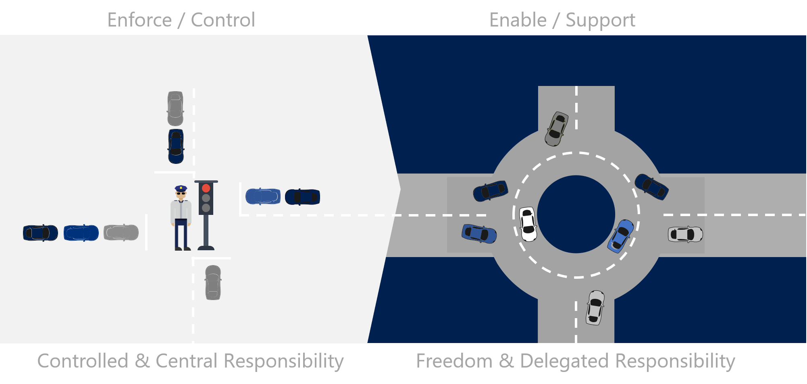

# Cloud center of excellence

Business and technical agility are core objectives of most IT organizations. Cloud center of excellence (CCoE) is a function that creates a balance between speed and stability.

## Function structure

CCoE requires collaboration between each of the following capabilities:

- Cloud adoption (specifically solution architects)
- Cloud strategy (specifically the program and project managers)
- Cloud governance
- Cloud platform
- Cloud automation

## Impact and cultural change

When this function is properly structured and supported, the participants can accelerate innovation and migration efforts while reducing the overall cost of change and increasing business agility. When successfully implemented, this function can produce noticeable reductions in time-to-market. As team practices mature, increases in quality indicators can be seen, including reliability, performance efficiency, security, maintainability, and customer satisfaction. These gains in efficiency, agility, and quality are especially vital if the company plans on implementing large-scale cloud migration efforts or has a desire to use the cloud to drive innovations associated with market differentiation.

When successful, a CCoE model will create a significant cultural shift in IT. The fundamental premise of a CCoE approach is that IT serves as a broker, partner, or representative to the business. This model is a paradigm shift away from the traditional view of IT as an operations unit or abstraction layer between the business and IT assets.

The following image provides an analogy for this cultural change. Without a CCoE approach, IT tends to focus on providing control and central responsibility, acting like the stoplights at an intersection. When the CCoE is successful, the focus is on freedom and delegated responsibility, which is more like a roundabout at an intersection.

Neither of the approaches illustrated in the analogy image above is right or wrong, they're just alternative views of responsibility and management. If the desire is to establish a self-service model that allows business units to make their own decisions while adhering to a set of guidelines and established, repeatable controls, then a CCoE model could fit within the technology strategy.

## Key responsibilities

The primary duty of the CCoE team is to accelerate cloud adoption through cloud-native or hybrid solutions.

The objective of the CCoE is to:

- Help build a modern IT organization through agile approaches to capture and implement business requirements.
- Use reusable deployment packages that align with security, compliance, and service management policies.
- Maintain a functional Azure platform in alignment with operational procedures.
- Review and approve the use of cloud-native tools.
- Over time, standardize and automate commonly needed platform components and solutions.

## Meeting cadence

The CCoE is a function staffed by four high demand teams. It is important to allow for organic collaboration and track growth through a common repository/solution catalog. Maximize natural interactions, but minimize meetings. When this function matures, the teams should try to limit dedicated meetings. Attendance at recurring meetings, like release meetings hosted by the cloud adoption team, will provide data inputs. In parallel, a meeting after each release plan is shared can provide a minimum touch point for this team.

## Solutions and controls

Each member of the CCoE is tasked with understanding the necessary constraints, risks, and protections that led to the current set of IT controls. The collective efforts of the CCoE should turn that understanding into cloud-native (or hybrid) solutions or controls, which enable the desired self-service business outcomes. As solutions are created, they are shared with various teams in the form of controls or automations that serve as guardrails for various efforts. Those guardrails help to route the free-flowing activities of various teams, while delegating responsibilities to the participants in various migration or innovation efforts.

Examples of this transition:

| Scenario | Pre-CCoE solution | Post-CCoE solution |
|---------|---------|---------|
| Provision a production SQL Server | Network, IT, and data platform teams provision various components over the course of days or even weeks. | The team requiring the server deploys a PaaS instance of Azure SQL Database. Alternatively, a preapproved template could be used to deploy all of the IaaS assets to the cloud in hours. |
| Provision a development environment | Network, IT, Development, and DevOps teams agree to specs and deploy an environment. | The development team defines their own specs and deploys an environment based on allocated budget. |
| Update security requirements to improve data protection | Networking, IT, and security teams update various networking devices and VMs across multiple environments to add protections. | Cloud governance tools are used to update policies that can be applied immediately to all assets in all cloud environments. |

## Negotiations

At the root of any CCoE effort is an ongoing negotiation process. The CCoE team negotiates with existing IT functions to reduce central control. The trade-offs for the business in this negotiation are freedom, agility, and speed. The value of the trade-off for existing IT teams is delivered as new solutions. The new solutions provide the existing IT team with one or more of the following benefits:

- Ability to automate common issues.
- Improvements in consistency (reduction in day-to-day frustrations).
- Opportunity to learn and deploy new technical solutions.
- Reductions in high severity incidents (fewer quick fixes or late-night pager-duty responses).
- Ability to broaden their technical scope, addressing broader topics.
- Participation in higher-level business solutions, addressing the impact of technology.
- Reduction in menial maintenance tasks.
- Increase in technology strategy and automation.

In exchange for these benefits, the existing IT function may be trading the following values, whether real or perceived:

- Sense of control from manual approval processes.
- Sense of stability from change control.
- Sense of job security from completion of necessary yet repetitive tasks.
- Sense of consistency that comes from adherence to existing IT solution vendors.

In healthy cloud-forward companies, this negotiation process is a dynamic conversation between peers and partnering IT teams. The technical details may be complex, but are manageable when IT understands the objective and is supportive of the CCoE efforts. When IT is less than supportive, the following section on enabling CCoE success can help overcome cultural blockers.

## Enabling CCoE success

Before proceeding with this model, it is important to validate the company's tolerance for a growth mindset and IT's comfort with releasing central responsibilities. As mentioned above, the purpose of a CCoE is to exchange control for agility and speed.

This type of change takes time, experimentation, and negotiation. There will be bumps and set backs during this maturation process. However, if the team stays diligent and isn't discouraged from experimentation, there is a high probability of success in improving agility, speed, and reliability. One of the biggest factors in success or failure of a CCoE is support from leadership and key stakeholders.

### Key stakeholders

IT Leadership is the first and most obvious stakeholder. IT managers will play an important part. However, the support of the CIO and other executive-level IT leaders is needed during this process.

Less obvious is the need for business stakeholders. Business agility and time-to-market are key motivations for CCoE formation. As such, the key stakeholders should have a vested interest in these areas. Examples of business stakeholders include line-of-business leaders, finance executives, operations executives, and business product owners.

### Business stakeholder support

CCoE efforts can be accelerated with support from the business stakeholders. Much of the focus of CCoE efforts is centered around making long-term improvements to business agility and speed. Defining the impact of current operating models and the value of improvements is valuable as a guide and negotiation tool for the CCoE. Documenting the following items is suggested for CCoE support:

- Establish a set of business outcomes and goals that are expected as a result of business agility and speed.
- Clearly define pain points created by current IT processes (such as speed, agility, stability, and cost challenges).
- Clearly define the historical impact of those pain points (such as lost market share, competitor gains in features and functions, poor customer experiences, and budget increases).
- Define business improvement opportunities that are blocked by the current pain points and operating models.
- Establish timelines and metrics related to those opportunities.

These data points are not an attack on IT. Instead, they help CCoE learn from the past and establish a realistic backlog and plan for improvement.

**Ongoing support and engagement:**
CCoE teams can demonstrate quick returns in some areas. However, the higher-level goals, like business agility and time-to-market, can take much longer. During maturation, there is a high risk of the CCoE becoming discouraged or being pulled off to focus on other IT efforts.

During the first six to nine months of CCoE efforts, we recommend that business stakeholders allocate time to meet monthly with the IT leadership and the CCoE. There is little need for formal ceremony to these meetings. Simply reminding the CCoE members and their leadership of the importance of this program can go along way to driving CCoE success.

Additionally, we recommend that the business stakeholders stay informed of the progress and blockers experienced by the CCoE team. Many of their efforts will seem like technical minutiae. However, it is important for business stakeholders to understand the progress of the plan, so they can engage when the team looses steam or becomes distracted by other priorities.

### IT stakeholder support

**Support the vision:** A successful CCoE effort requires a great deal of negotiation with existing IT team members. When done well, all of IT contributes to the solution and feels comfortable with the change. When this is not the case, some members of the existing IT team may want to hold on to control mechanisms for various reasons. Support of IT stakeholders will be vital to the success of the CCoE when those situations occur. Encouragement and reinforcement of the overall goals of the CCoE is important to resolve blockers to proper negotiation. On rare occasions, IT stakeholders may even need to step in and break up a deadlock or tied vote to keep the CCoE progressing.

**Maintain focus:** A CCoE can be a significant commitment for any resource-constrained IT team. Removing strong architects from short-term projects to focus on long-term gains can create difficulty for team members who aren't part of the CCoE. It is important that IT leadership and IT stakeholders stay focused on the goal of the CCoE. The support of IT leaders and IT stakeholders is required to deprioritize the disruptions of day-to-day operations in favor of CCoE duties.

**Create a buffer:** The CCoE team will experiment with new approaches. Some of those approaches won't align well with existing operations or technical constraints. There is a real risk of the CCoE experiencing pressure or recourse from other teams when experiments fail. Encouragement and buffering the team from the consequences of "Fast Fail" learning opportunities is important. It's equally important to hold the team accountable to a growth mindset, ensuring that they are learning from those experiments and finding better solutions.

## Next steps

Cloud center of excellence requires both a [cloud platform capabilities](./cloud-platform.md) and [cloud automation capabilities](./cloud-automation.md). The next step is to align [cloud platform capabilities](./cloud-platform.md).

> [!div class="nextstepaction"]
> [Align a cloud platform capabilities](./cloud-platform.md)
