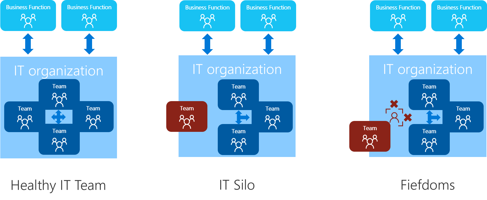

# Organizational antipatterns: Silos and fiefdoms

Success in any major change to business practices, culture, or technology operations requires a growth mindset. At the heart of the growth mindset is an acceptance of change and the ability to lead in spite of ambiguity.

Some antipatterns can block a growth mindset in organizations that want to grow and transform, including micromanagement, biased thinking, and exclusionary practices. Many of these blockers are personal challenges that create personal growth opportunities for everyone. But two common antipatterns in IT require more than individual growth or maturity: silos and fiefdoms.

These antipatterns are a result of organic changes within various teams, which result in unhealthy organizational behaviors. To address the resistance caused by each antipattern, it's important to understand the root cause of this formation.

## Healthy, organic IT teams

It's natural to create a division of labor across IT. It's healthy to establish teams that have similar expertise, shared processes, a common objective, and an aligned vision. It's also natural for those teams to have their own microculture, shared norms, and perspectives.

Healthy IT teams focus on partnering with other teams to promote the successful completion of their duties. Healthy IT teams seek to understand the business goals that their technology contribution is designed to support. The details and fiscal impact might be fuzzy, but the team's value contribution is often understood within the team.

Although healthy IT teams have a passion for the technology that they support, they're open to change and willing to try new things. Such teams are often the earliest and strongest contributors to [cloud center of excellence (CCoE)](./cloud-center-excellence.md) efforts. Their contribution should be heavily encouraged.

### Natural resistance to change

At times, the microcultures within healthy IT teams might react poorly to executive or top-down decisions to drive change. This reaction is natural, as collectives of human beings with shared norms often cooperate to overcome external threats.

Changes that affect the team's day-to-day jobs, sense of security, or autonomy can be viewed as a risk to the collective. Signs of resistance are often an early indicator that the team members don't feel like they are part of the decision-making process.

When cloud architects and other leaders invest in abolishing personal biases and driving for inclusion of the existing IT teams, this resistance is likely to lessen quickly and dissolve over time. One tool available to cloud architects and leaders to create inclusive decision making is the formation of a CCoE.

### Healthy friction

It's easy to confuse resistance with friction. Existing IT teams can be knowledgeable regarding past mistakes, tangible risks, tribal knowledge about solutions, and undocumented technical debt. Unfortunately, even the healthiest IT teams can fall in the trap of describing these important data points as part of a specific technical solution, which shouldn't be changed. This approach to communication masks the teams' knowledge, creating a perception of resistance.

Providing these teams with a mechanism for communicating in future-looking terminology will add data points, identify gaps, and create healthy friction around the proposed solutions. That extra friction will sand down rough edges on the solutions and drive longer-term values. Simply changing the conversation can create clarity around complex topics and generate energy to deliver more successful solutions.

The guidance on [defining corporate policy](../governance/corporate-policy.md) is aimed at facilitating risk-based conversations with business stakeholders. However, this same model can be used to facilitate conversations with teams that are perceived as cloud resistant. When the perception of resistance is widespread, it might be wise to include resistance resolution practices in the charter for a [cloud governance team](./cloud-governance.md).

## Antipatterns

The organic and responsive growth within IT that creates healthy IT teams can also result in antipatterns that block transformation and cloud adoption. IT silos and fiefdoms are different from the natural microcultures within healthy IT teams. In either pattern, the team focus tends to be directed toward protecting their "turf". When team members are confronted with an opportunity to drive change and improve operations, they will invest more time and energy into blocking the change than finding a positive solution.

As mentioned earlier, healthy IT teams can create natural resistance and positive friction. Silos and fiefdoms are a different challenge. There is no documented leading indicator for either antipattern. These antipatterns tend to be identified after months of [cloud center of excellence](./cloud-center-excellence.md) and [cloud governance team](./cloud-governance.md) efforts. They're discovered as the result of ongoing resistance.

Even in toxic cultures, the efforts of the CCoE and the cloud governance team should help drive cultural growth and technical progress. After months of effort, a few teams might still show no signs of inclusive behaviors and stand firm in their resistance to change. These teams are likely operating in one of the following antipattern models: silos and fiefdoms. Although these models have similar symptoms, the root cause and approaches to addressing resistance is radically different between them.

## IT silos

Team members in an IT silo are likely to define themselves through their alignment to a small number of IT vendors or an area of technical specialization. However, don't confuse IT silos with IT fiefdoms. IT silos tend to be driven by comfort and passion, and are generally easier to overcome than the fear-driven motives behind fiefdoms.

This antipattern often emerges from of a common passion for a specific solution. IT silos are then reinforced by the team's advanced skills as a result of the investment in that specific solution. This superior skill can be an accelerator to cloud adoption efforts if the resistance to change can be overcome. It can also become a major blocker if the silos are broken down or if the team members can't accurately evaluate options. Fortunately, IT silos can often be overcome without any significant changes to the organizational chart.

### Addressing resistance from IT silos

IT silos can be addressed through the following approaches. The best approach will depend on the root cause of the resistance.

**Create virtual teams:** The [organizational readiness](./index.md) section of the Cloud Adoption Framework describes a multilayered structure for integrating and defining four virtual teams (v-teams). One benefit of this structure is cross-organization visibility and inclusion. Introducing a [cloud center of excellence](./cloud-center-excellence.md) creates a high-profile aspirational team that top engineers will want to participate in. This helps create new cross-solution alignments that aren't bound by organizational-chart constraints, and will drive inclusion of top engineers who have been sheltered by IT silos.

Introduction of a [cloud strategy team](./cloud-strategy.md) will create immediate visibility to IT contributions regarding cloud adoption efforts. When IT silos fight for separation, this visibility can help motivate IT and business leaders to properly support those resistant team members. This process is a quick path to stakeholder engagement and support.

**Consider experimentation and exposure:** Team members in an IT silo have likely been constrained to think a certain way for some time. Breaking the one-track mind is a first step to addressing resistance.

Experimentation and exposure are powerful tools for breaking down barriers in silos. The team members might be resistant to competing solutions, so it's not wise to put them in charge of an experiment that competes with their existing solution. However, as part of a first workload test of the cloud, the organization should implement competing solutions. The siloed team should be invited to participate as an input and review source, but not as a decision maker. This should be clearly communicated to the team, along with a commitment to engage the team more deeply as a decision maker before moving into production solutions.

During review of the competing solution, use the practices outlined in [Define corporate policy](../governance/corporate-policy.md) to document tangible risks of the experiment and establish policies that help the siloed team become more comfortable with the future state. This will expose the team to new solutions and harden the future solution.

**Be "boundaryless":** The teams that drive cloud adoption find it easy to push boundaries by exploring exciting, new cloud-native solutions. This is one half of the approach to removing boundaries. However, that thinking can further reinforce IT silos. Pushing for change too quickly and without respect to existing cultures can create unhealthy friction and lead to natural resistance.

When IT silos start to resist, it's important to be boundaryless in your own solutions. Be mindful of one simple truth: cloud-native isn't always the best solution. Consider hybrid solutions that might provide an opportunity to extend the existing investments of the IT silo into the future.

Also consider cloud-based versions of the solution that the IT silo team uses now. Experiment with those solutions and expose yourself to the viewpoint of those living in the IT silo. At minimum, you will gain a fresh perspective. In many situations, you might earn enough of the IT silo's respect to lessen resistance.

**Invest in education:** Many people living in an IT silo became passionate about the current solution as a result of expanding their own education. Investing in the education of these teams is seldom misplaced. Allocate time for these individuals to engage in self-learning, classes, or even conferences to break the day-to-day focus on the current solution.

For education to be an investment, some return must come as a result of the expense. In exchange for the investment, the team might demonstrate the proposed solution to the rest of the teams involved in cloud adoption. They might also provide documentation of the tangible risks, risk management approaches, and desired policies in adopting the proposed solution. Each will engage these teams in the solution and help take advantage of their tribal knowledge.

**Turn roadblocks into speed bumps:** IT silos can slow or stop any transformation. Experimentation and iteration will find a way, but only if the project keeps moving. Focus on turning roadblocks into merely speed bumps. Define policies that everyone can be temporarily comfortable with in exchange for continued progression.

For instance, if IT security is the roadblock because its security solution can't monitor compromises of protected data in the cloud, establish data classification policies. Prevent deployment of classified data into the cloud until an agreeable solution can be found. Invite IT security into experimentation with hybrid or cloud-native solutions to monitor protected data.

If the network team operates as a silo, identify workloads that are self-contained and don't have network dependencies. In parallel, experiment, expose, and educate the network team while working on hybrid or alternative solutions.

**Be patient and be inclusive:** It's tempting to move on without support of an IT silo. But this decision will cause disruptions and roadblocks down the road. Changing minds in members of the IT silo can take time. Be patient of their natural resistance--convert it to value. Be inclusive and invite healthy friction to improve the future solution.

**Never compete:** The IT silo exists for a reason. It persists for a reason. There is an investment in maintaining the solution that the team members are passionate about. Directly competing with the solution or the IT silo will distract from the real goal of achieving business outcomes. This trap has blocked many transformation projects.

Stay focused on the goal, as opposed to a single component of the goal. Help accentuate the positive aspects of the IT silo's solution and help the team members make wise decisions about the best solutions for the future. Don't insult or degrade the current solution, because that would be counterproductive.

**Partner with the business:** If the IT silo isn't blocking business outcomes, why do you care? There is no perfect solution or perfect IT vendor. Competition exists for a reason; each has its own benefits.

Embrace diversity and include the business by supporting and aligning to a strong [cloud strategy team](./cloud-strategy.md). When an IT silo supports a solution that blocks business outcomes, it will be easier to communicate that roadblock without the noise of technical squabbles. Supporting nonblocking IT silos will show an ability to partner for the desired business outcomes. These efforts will earn more respect and greater support from the business when an IT silo presents a legitimate blocker.

## IT fiefdoms

Team members in an IT fiefdom are likely to define themselves through their alignment to a specific process or area of responsibility. The team operates under an assumption that external influence on its area of responsibility will lead to problems. Fiefdoms tend to be a fear-driven antipattern, which will require significant leadership support to overcome.

Fiefdoms are especially common in organizations that have experienced IT downsizing, frequent turbulence in IT staff, or poor IT leadership. When the business sees IT purely as a cost center, fiefdoms are much more likely to arise.

Generally, fiefdoms are the result of a line manager who fears loss of the team and the associated power base. These leaders often have a sense of duty to their team and feel a need to protect their subordinates from negative consequences. Phrases like "shelter the team from change" and "protect the team from process disruption" can be indicators of an overly guarded manager who might need more support from leadership.

### Addressing resistance from IT fiefdoms

IT fiefdoms can demonstrate some growth by following the approaches to [addressing IT silo resistance](#addressing-resistance-from-it-silos). Before you try to address resistance from an IT fiefdom, we recommend that you treat the team like an IT silo first. If those types of approaches fail to yield any significant change, the resistant team might be suffering from an IT fiefdom antipattern. The root cause of IT fiefdoms is a little more complex to address, because that resistance tends to come from the direct line manager (or a leader higher up the organizational chart). Challenges that are IT silo-driven are typically simpler to overcome.

When continued resistance from IT fiefdoms blocks cloud adoption efforts, it might be wise for a combined effort to evaluate the situation with existing IT leaders. IT leaders should carefully consider insights from the [cloud strategy team](./cloud-strategy.md), [cloud center of excellence](./cloud-center-excellence.md), and [cloud governance team](./cloud-governance.md) before making decisions.

> [!NOTE]
> IT leaders should never take changes to the organizational chart lightly. They should also validate and analyze feedback from each of the supporting teams. However, transformative efforts like cloud adoption tend to magnify underlying issues that have gone unnoticed or unaddressed long before this effort. When fiefdoms are preventing the company's success, leadership changes are a likely necessity.
>
> Fortunately, removing the leader of a fiefdom doesn't often end in termination. These strong, passionate leaders can often move into a management role after a brief period of reflection. With the right support, this change can be healthy for the leader of the fiefdom and the current team.

> [!CAUTION]
> For managers of IT fiefdoms, protecting the team from risk is a clear leadership value. However, there's a fine line between protection and isolation. When the team is blocked from participating in driving changes, it can have psychological and professional consequences on the team. The urge to resist change might be strong, especially during times of visible change.
>
> The manager of any isolated team can best demonstrate a growth mindset by experimenting with the guidance associated with healthy IT teams in the preceding sections. Active and optimistic participation in governance and CCoE activities can lead to personal growth. Managers of IT fiefdoms are best positioned to change stifling mindsets and help the team develop new ideas.

IT fiefdoms can be a sign of systemic leadership issues. To overcome an IT fiefdom, IT leaders need the ability to make changes to operations, responsibilities, and occasionally even the people who provide line management of specific teams. When those changes are required, it's wise to approach those changes with clear and defensible data points.

Alignment with business stakeholders, business motivations, and business outcomes might be required to drive the necessary change. Partnership with the [cloud strategy team](./cloud-strategy.md), [cloud center of excellence](./cloud-center-excellence.md), and [cloud governance team](./cloud-governance.md) can provide the data points needed for a defensible position. When necessary, these teams should be involved in a group escalation to address challenges that can't be addressed with IT leadership alone.

## Next steps

Disrupting organizational antipatterns is a team effort. To act on this guidance, review the organizational readiness introduction to identify the right team structures and participants:

> [!div class="nextstepaction"]
> [Identify the right team structures and participants](./index.md)
