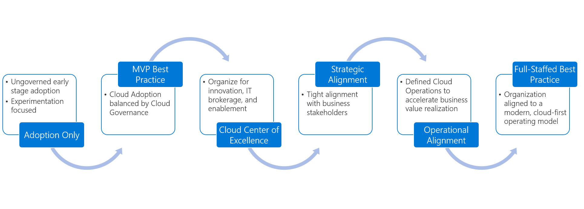
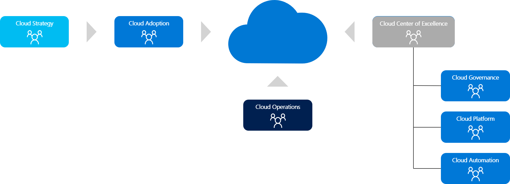
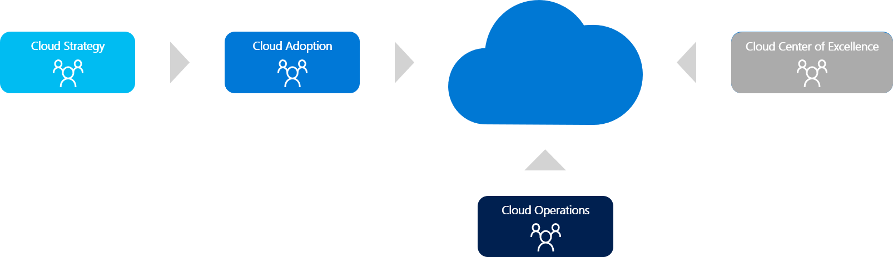

# Establish team structures

Every cloud capability is provided by someone during every cloud-adoption effort. These assignments and team structures can develop organically, or they can be purposefully and explicitly designed to match a defined team structure.

As adoption needs grow, so does the need to create balance and structure. This article provides examples of common team structures at various stages of organizational maturity. The following graphic and list outline those structures based on commonly seen maturation stages. Use these examples to find the org structure that best aligns with your operational needs.

Organizational structures tend to move through the common maturity model that's outlined here:

1. [Cloud adoption team only](#cloud-adoption-team-only)
2. [MVP best practice](#best-practice-minimum-viable-product) - Best practice: minimum viable product (MVP)
3. [Cloud center of excellence](#cloud-center-of-excellence)
4. [Strategic alignment](#strategic-alignment)
5. [Operational alignment](#strategic-alignment)
6. [Fully staffed best practice](#best-practice-fully-staffed)

Most companies start with little more than a *cloud adoption team*. But we recommend that you establish an organizational structure that more closely resembles the [MVP best practice](#best-practice-minimum-viable-product) structure.

## Cloud adoption team only

The nucleus of all cloud adoption efforts is the cloud adoption team. This team is responsible for driving the technical changes that make adoption possible. Depending on the objectives of the adoption effort, this team may include a diverse range of team members who handle a wide range of technical and business tasks.

For small or early-adoption efforts, this team might be as small as one person. In larger and late-stage efforts, it's common to have several cloud adoption teams, each with about six engineers. Regardless of size or tasks, the consistent aspect of any cloud adoption team is that it serves as the mechanism for on-boarding solutions into the cloud. For some organizations, this may be a sufficient organizational structure. The [cloud adoption team](./cloud-adoption.md) article provides more insight into the structure, composition, and function of the cloud adoption team.

> [!WARNING]
> Operating with *only* a cloud adoption team (or multiple cloud adoption teams) is considered an *antipattern* and should be avoided. At minimum, consider the [MVP best practice](#best-practice-minimum-viable-product).

## Best practice: minimum viable product

As a minimum, we recommend that you have two teams to create balance across cloud-adoption efforts. These two teams are responsible for various capabilities throughout the adoption effort.

- **Cloud adoption team:** Accountable for technical solutions, business alignment, project management, and operations of the solutions that are adopted.
- **Cloud governance team:** To balance the cloud adoption team, a cloud governance team is dedicated to ensuring excellence in the solutions that are adopted. The cloud governance team is accountable for platform maturity, platform operations, governance, and automation.

This best-practice approach is considered an MVP because it may not be sustainable. Each team is wearing many hats, as outlined in the [*responsible, accountable, consulted, informed* (RACI) charts](./raci-alignment.md).

The next sections describe a fully staffed, best-practice organizational structure and approaches to aligning the appropriate structure to your organization.

## Cloud center of excellence

One of the first signs of maturity in adoption efforts is a desire to move beyond governance to a *cloud center of excellence* (CCoE) structure. Such a structure is similar to the [MVP best practice](#best-practice-minimum-viable-product) organizational structure. But there's one fundamental difference between a cloud center of excellence model and the MVP best practice. The capabilities of the governance team are realigned to accelerate adoption and innovation.

## Strategic alignment

When the motivations that drive cloud adoption are aligned to business outcomes, it's important to add a defined cloud strategy team, as the following image illustrates. This model works well as an addition to the [MVP best practice](#best-practice-minimum-viable-product) or [cloud center of excellence](#cloud-center-of-excellence) model.

## Operational alignment

When stable IT operations are required to achieve business outcomes, it's important to add a defined cloud operations team, as the following images shows. This model works well as an addition to the [MVP best practice](#best-practice-minimum-viable-product), [cloud center of excellence](#cloud-center-of-excellence), or [strategic alignment](#strategic-alignment) model.

## Best practice: Fully staffed

At the other end of the spectrum, the following graphic outlines a fully staffed, best practice organizational structure. In this setup, there are six dedicated teams. Each team is accountable for a distinct set of capabilities.

It's impractical to maintain a fully staffed, best-practice organizational structure for long. For most companies, this model quickly creates diminishing returns when it's used to shape a traditional org chart. But it's common for large companies to define virtual teams (v-teams) in an effort to align available skills with defined capabilities. A scaled-out v-team model, like the image above or the RACI charts cited in the next section, is more sustainable.

## Next steps

After aligning to a certain level of organizational structure maturity, you can use [RACI charts](./raci-alignment.md) to align accountability and responsibility across each team.

> [!div class="nextstepaction"]
> [Align the appropriate RACI chart](./raci-alignment.md)
