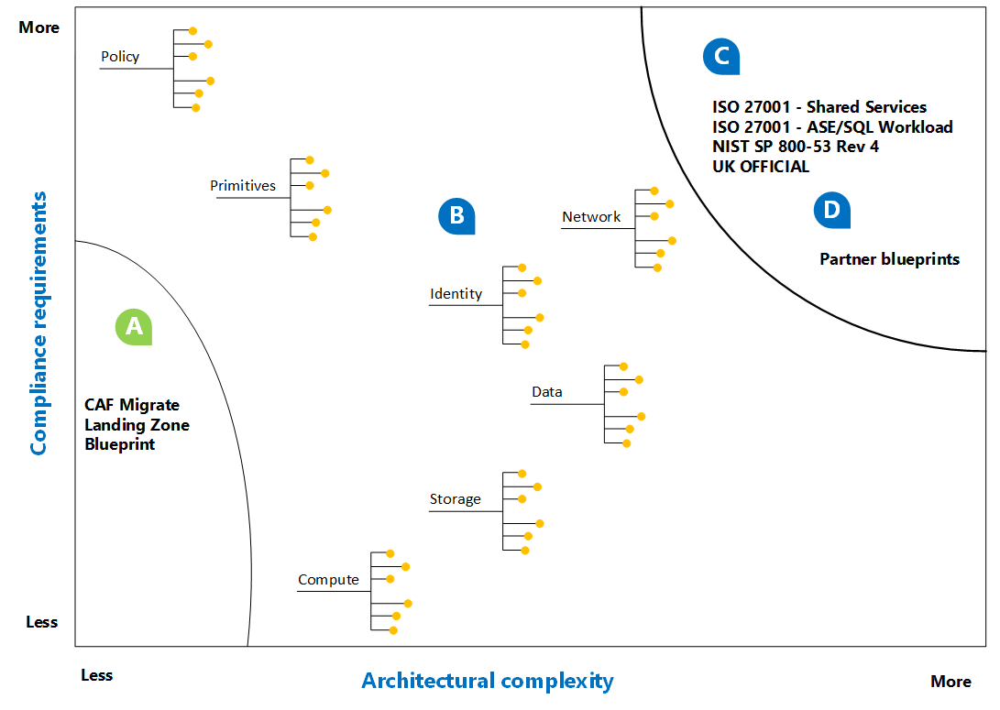

# Deploy a migration landing zone

*Migration landing zone* is a term used to describe an environment that has been provisioned and prepared to host workloads being migrated from an on-premises environment into Azure. A migration landing zone is the final deliverable of the Azure readiness guide. This article ties together all of the readiness subjects discussed in this guide and applies the decisions made to the deployment of your first migration landing zone.

The following sections outline a landing zone commonly used to establish an environment that's suitable for use during a migration. The environment or landing zone described in this article is also captured in an Azure blueprint. You can use the Cloud Adoption Framework migrate landing zone blueprint to deploy the defined environment with a single click.

## Purpose of the blueprint

The Cloud Adoption Framework migrate landing zone blueprint creates a landing zone. That landing zone is intentionally limited. It's designed to create a consistent starting point that provides room to learn infrastructure as code. For some migration efforts, this landing zone might be sufficient to meet your needs. It's also likely that you will need to change something in the blueprint to meet your unique constraints.

## Blueprint alignment

The following image shows the Cloud Adoption Framework migrate landing zone blueprint in relation to architectural complexity and compliance requirements.

- The letter A sits inside of a curved line that marks the scope of this blueprint. That scope is meant to convey that this blueprint covers limited architectural complexity but is built on relatively mid-line compliance requirements.
- Customers who have a high degree of complexity and stringent compliance requirements might be better served by using a partner's extended blueprint or one of the [standards-based blueprint samples](/azure/governance/blueprints/samples/).
- Most customers' needs will fall somewhere between these two extremes. The letter B represents the process outlined in the [landing zone considerations](../considerations/index.md) articles. For customers in this space, you can use the decision guides found in those articles to identify nodes to be added to the Cloud Adoption Framework migrate landing zone blueprint. This approach allows you to customize the blueprint to fit your needs.

## Use this blueprint

Before you use the Cloud Adoption Framework migration landing zone blueprint, review the following assumptions, decisions, and implementation guidance.

## Assumptions

The following assumptions or constraints were used when this initial landing zone was defined. If these assumptions align with your constraints, you can use the blueprint to create your first landing zone. The blueprint also can be extended to create a landing zone blueprint that meets your unique constraints.

- **Subscription limits:** This adoption effort isn't expected to exceed [subscription limits](https://docs.microsoft.com/azure/azure-subscription-service-limits). Two common indicators are an excess of 25,000 VMs or 10,000 vCPUs.
- **Compliance:** No third-party compliance requirements are needed in this landing zone.
- **Architectural complexity:** Architectural complexity doesn't require additional production subscriptions.
- **Shared services:** There are no existing shared services in Azure that require this subscription to be treated like a spoke in a hub-and-spoke architecture.

If these assumptions seem aligned with your current environment, then this blueprint might be a good place to start building your landing zone.

## Decisions

The following decisions are represented in the landing zone blueprint.

| Component | Decisions | Alternative approaches |
|---------|---------|---------|
|Migration tools|Azure Site Recovery will be deployed and an Azure Migrate project will be created.|[Migration tools decision guide](../../decision-guides/migrate-decision-guide/index.md)|
|Logging and monitoring|Operational Insights workspace and diagnostic storage account will be provisioned.|         |
|Network|A virtual network will be created with subnets for gateway, firewall, jumpbox, and landing zone.|[Networking decisions](../considerations/network-decisions.md)|
|Identity|It's assumed that the subscription is already associated with an Azure Active Directory instance.|[Identity management best practices](https://docs.microsoft.com/azure/security/azure-security-identity-management-best-practices?toc=https://docs.microsoft.com/azure/architecture/toc.json&bc=https://docs.microsoft.com/azure/architecture/bread/toc.json)         |
|Policy|This blueprint currently assumes that no Azure policies are to be applied.|         |
|Subscription design|N/A - Designed for a single production subscription.|[Scaling subscriptions](../considerations/scaling-subscriptions.md)|
|Management groups|N/A - Designed for a single production subscription.|[Scaling subscriptions](../considerations/scaling-subscriptions.md)         |
|Resource groups|N/A - Designed for a single production subscription.|[Scaling subscriptions](../considerations/scaling-subscriptions.md)         |
|Data|N/A|[Choose the correct SQL Server option in Azure](https://docs.microsoft.com/azure/sql-database/sql-database-paas-vs-sql-server-iaas?toc=https://docs.microsoft.com/azure/architecture/toc.json&bc=https://docs.microsoft.com/azure/architecture/bread/toc.json)         |
|Storage|N/A|[Azure Storage guidance](../considerations/storage-guidance.md)         |
|Naming and tagging standards|N/A|[Naming and tagging best practices](../considerations/name-and-tag.md)         |
|Cost management|N/A|[Tracking costs](../azure-best-practices/track-costs.md)|
|Compute|N/A|[Compute options](../considerations/compute-decisions.md)|

## Customize or deploy a landing zone from this blueprint

Learn more and download a reference sample of the Cloud Adoption Framework migrate landing zone blueprint for deployment or customization from [Azure Blueprint samples](https://docs.microsoft.com/azure/governance/blueprints/samples/index).

The blueprint samples are also available within the portal. For details of how to deploy a blueprint see [Azure Blueprints](./govern-org-compliance.md?tabs=azureblueprints#create-a-blueprint).

For guidance on customization that should be made to this blueprint or the resulting landing zone, see the [landing zone considerations](../considerations/index.md) articles.

## Next steps

After a migration landing zone is deployed, you're ready to migrate workloads to Azure.
For guidance on the tools and processes that are required to migrate your first workload, see the [Azure migration guide](../../migrate/azure-migration-guide/index.md).

> [!div class="nextstepaction"]
> [Migrate your first workload with the Azure migration guide](../../migrate/azure-migration-guide/index.md)
