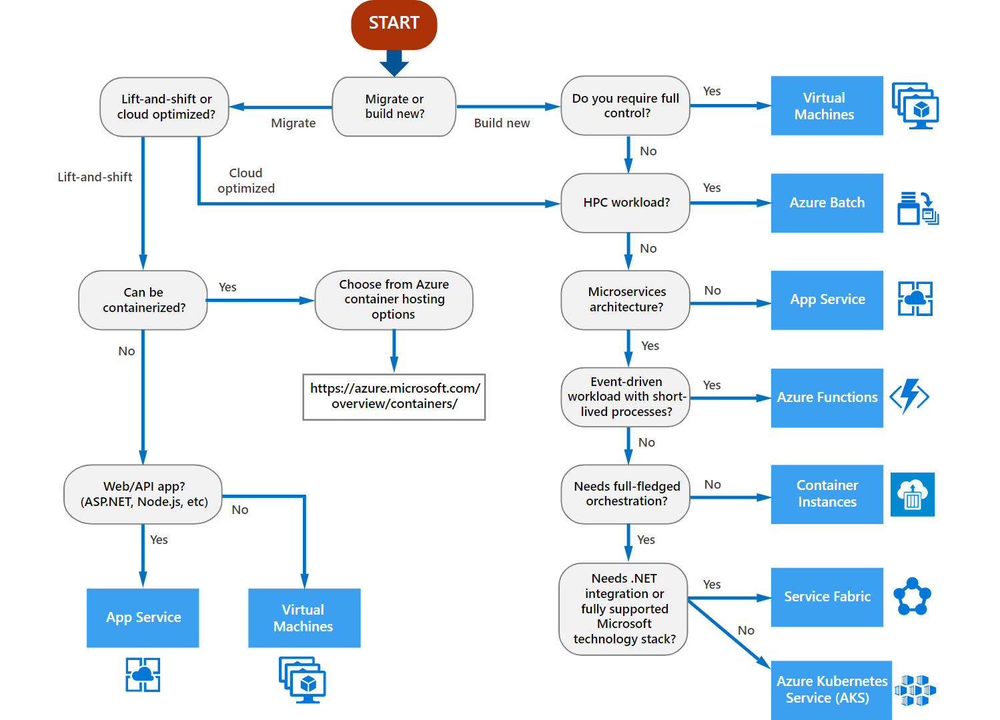

# Compute design decisions

Determining the compute requirements for hosting your workloads is a key consideration as you prepare for your cloud adoption. Azure compute products and services support a wide variety of workload computing scenarios and capabilities. How you configure your landing zone environment to support your compute requirements depends on your workload's governance, technical, and business requirements.

## Identify compute services requirements

As part of your landing zone evaluation and preparation, you need to identify all compute resources that your landing zone will need to support. This process involves assessing each of the applications and services that make up your workloads to determine your compute and hosting requirements. After you identify and document your requirements, you can create policies for your landing zone to control what resource types are allowed based on your workload needs.

For each application or service you'll deploy to your landing zone environment, use the following decision tree as a starting point to help you determine your compute services requirements:

> [!NOTE]
> Learn more about how to assess compute options for each of your applications or services in the [Azure application architecture guide](/azure/architecture/guide/technology-choices/compute-overview).

### Key questions

Answer the following questions about your workloads to help you make decisions based on the Azure compute services decision tree:

- **Are you building net new applications and services or migrating from existing on-premises workloads?** Developing new applications as part of your cloud adoption efforts allows you to take full advantage of modern cloud-based hosting technologies from the design phase on.
- **If you're migrating existing workloads, can they take advantage of modern cloud technologies?** Migrating on-premises workloads requires analysis: Can you easily optimize existing applications and services to take advantage of modern cloud technologies or will a *lift-and-shift* approach work better for your workloads?
- **Can your applications or services take advantage of containers?** If your applications are good candidates for containerized hosting, you can take advantage of the resource efficiency, scalability, and orchestration capabilities provided by [Azure container services](https://azure.microsoft.com/product-categories/containers). Both [Azure Disk Storage](/azure/virtual-machines/windows/managed-disks-overview) and [Azure Files](/azure/storage/files/storage-files-introduction) services can be used for persistent storage for containerized applications.
- **Are your applications web-based or API-based, and do they use PHP, ASP.NET, Node.js, or similar technologies?** Web apps can be deployed to managed [Azure App Service](/azure/app-service/overview) instances, so you don't have to maintain virtual machines for hosting purposes.
- **Will you require full control over the OS and hosting environment of your workload?** If you need to control the hosting environment, including OS, disks, locally running software, and other configurations, you can use [Azure Virtual Machines](https://azure.microsoft.com/services/virtual-machines) to host your applications and services. In addition to choosing your virtual machine sizes and performance tiers, your decisions regarding virtual disk storage will affect performance and SLAs related to your infrastructure as a service (IaaS)-based workloads. For more information, see the [Azure Disk Storage](/azure/virtual-machines/windows/managed-disks-overview) documentation.
- **Will your workload involve high-performance computing (HPC) capabilities?** [Azure Batch](/azure/batch/batch-technical-overview) provides job scheduling and autoscaling of compute resources as a platform service, so it's easy to run large-scale parallel and HPC applications in the cloud.
- **Will your applications use a microservices architecture?** Applications that use a microservices-based architecture can take advantage of several optimized compute technologies. Self-contained, event-driven workloads can use [Azure Functions](/azure/azure-functions/functions-overview) to build scalable, serverless applications that don't need an infrastructure. For applications that require more control over the environment where microservices run, you can use container services like [Azure Container Instances](/azure/container-instances/container-instances-overview), [Azure Kubernetes Service](/azure/aks/intro-kubernetes), and [Azure Service Fabric](/azure/service-fabric/service-fabric-overview).

> [!NOTE]
> Most Azure compute services are used in combination with Azure Storage. Consult the [storage decisions guidance](./storage-guidance.md) for related storage decisions.

## Common compute scenarios

The following table illustrates a few common use scenarios and the recommended compute services for handling them:

| **Scenario** | **Compute service** |
| --- | --- |
| I need to provision Linux and Windows virtual machines in seconds with the configurations of my choice. | [Azure Virtual Machines](https://azure.microsoft.com/services/virtual-machines) |
| I need to achieve high availability by autoscaling to create thousands of VMs in minutes. | [Virtual machine scale sets](https://azure.microsoft.com/services/virtual-machine-scale-sets) |
| I want to simplify the deployment, management, and operations of Kubernetes. | [Azure Kubernetes Service (AKS)](https://azure.microsoft.com/services/kubernetes-service) |
| I need to accelerate app development by using an event-driven serverless architecture. | [Azure Functions](https://azure.microsoft.com/services/functions) |
| I need to develop microservices and orchestrate containers on Windows and Linux. | [Azure Service Fabric](https://azure.microsoft.com/services/service-fabric) |
| I want to quickly create cloud apps for web and mobile by using a fully managed platform. | [Azure App Service](https://azure.microsoft.com/services/app-service) |
| I want to containerize apps and easily run containers by using a single command. | [Azure Container Instances](https://azure.microsoft.com/services/container-instances) |
| I need cloud-scale job scheduling and compute management with the ability to scale to tens, hundreds, or thousands of virtual machines. | [Azure Batch](https://azure.microsoft.com/services/batch) |
| I need to create highly available, scalable cloud applications and APIs that can help me focus on apps instead of hardware. | [Azure Cloud Services](https://azure.microsoft.com/services/cloud-services) |

## Regional availability

Azure lets you deliver services at the scale you need to reach your customers and partners _wherever they are_. A key factor in planning your cloud deployment is to determine which Azure region will host your workload resources.

Some compute options, such as Azure App Service, are generally available in most Azure regions. However, some compute services are supported only in select regions. Some virtual machine types and their associated storage types have limited regional availability. Before you decide which regions you will deploy your compute resources to, we recommend that you refer to the [regions page](https://azure.microsoft.com/global-infrastructure/services/?regions=all&products=azure-vmware-cloudsimple,cloud-services,batch,container-instances,app-service,service-fabric,functions,kubernetes-service,virtual-machine-scale-sets,virtual-machines) to check the latest status of regional availability.

To learn more about the Azure global infrastructure, see the [Azure regions page](https://azure.microsoft.com/global-infrastructure/regions). You can also view [products available by region](https://azure.microsoft.com/global-infrastructure/services/?regions=all&products=all) for specific details about the overall services that are available in each Azure region.

## Data residency and compliance requirements

Legal and contractual requirements related to data storage often will apply to your workloads. These requirements might vary based on the location of your organization, the jurisdiction where files and data are stored and processed, and your applicable business sector. Components of data obligations to consider include data classification, data location, and the respective responsibilities for data protection under the shared responsibility model. Many compute solutions depend on linked storage resources. This requirement also might influence your compute decisions. For help with understanding these requirements, see the white paper [Achieving Compliant Data Residency and Security with Azure](https://azure.microsoft.com/resources/achieving-compliant-data-residency-and-security-with-azure).

Part of your compliance efforts might include controlling where your compute resources are physically located. Azure regions are organized into groups called geographies. An [Azure geography](https://azure.microsoft.com/global-infrastructure/geographies) ensures that data residency, sovereignty, compliance, and resiliency requirements are honored within geographical and political boundaries. If your workloads are subject to data sovereignty or other compliance requirements, you must deploy your storage resources to regions in a compliant Azure geography.

## Establish controls for compute services

When you prepare your landing zone environment, you can establish controls that limit what resources each user can deploy. The controls can help you manage costs and limit security risks, while still allowing developers and IT teams to deploy and configure resources that are needed to support your workloads.

After you identify and document your landing zone's requirements, you can use [Azure Policy](/azure/governance/policy/overview) to control the compute resources that you allow users to create. Controls can take the form of [allowing or denying the creation of compute resource types](/azure/governance/policy/samples/allowed-resource-types). For example, you might restrict users to creating only Azure App Service or Azure Functions resources. You also can use policy to control the allowable options when a resource is created, like [restricting what virtual machine SKUs can be provisioned](https://docs.microsoft.com/azure/governance/policy/samples/allowed-skus-storage) or [allowing only specific VM images](https://docs.microsoft.com/azure/governance/policy/samples/allowed-custom-images).

Policies can be scoped to resources, resource groups, subscriptions, and management groups. You can include your policies in [Azure Blueprint](/azure/governance/blueprints/overview) definitions and apply them repeatedly throughout your cloud estate.

