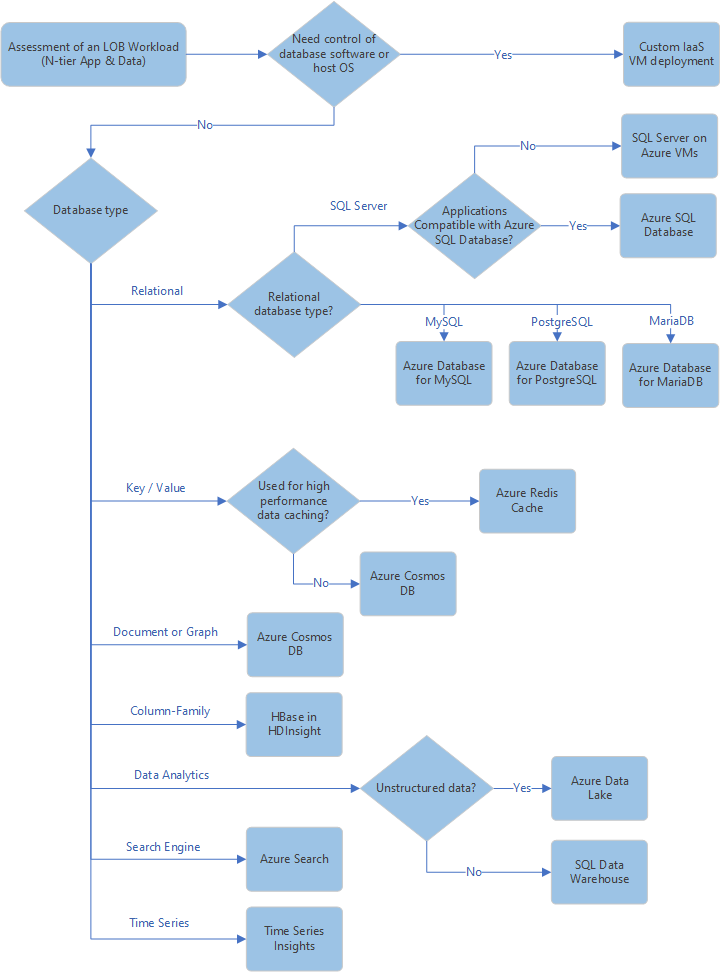

# Data design decisions

When you prepare your landing zone environment for your cloud adoption, you need to determine the data requirements for hosting your workloads. Azure database products and services support a wide variety of data storage scenarios and capabilities. How you configure your landing zone environment to support your data requirements depends on your workload governance, technical, and business requirements.

## Identify data services requirements

As part of your landing zone evaluation and preparation, you need to identify the data stores that your landing zone needs to support. The process involves assessing each of the applications and services that make up your workloads to determine their data storage and access requirements. After you identify and document these requirements, you can create policies for your landing zone to control allowed resource types based on your workload needs.

For each application or service you'll deploy to your landing zone environment, use the following decision tree as a starting point to help you determine the appropriate data store services to use:

### Key questions

Answer the following questions about your workloads to help you make decisions based on the Azure database services decision tree:

- **Do you need full control or ownership of your database software or host OS?** Some scenarios require you to have a high degree of control or ownership of the software configuration and host servers for your database workloads. In these scenarios, you can deploy custom infrastructure as a service (IaaS) virtual machines to fully control the deployment and configuration of data services. If you don't have these requirements, platform as a service (PaaS)-managed database services might reduce your management and operations costs.
- **Will your workloads use a relational database technology?** If so, what technology do you plan to use? Azure provides managed PaaS database capabilities for [Azure SQL Database](/azure/sql-database/sql-database-technical-overview), [MySQL](/azure/mysql/overview), [PostgreSQL](/azure/postgresql/overview), and [MariaDB](/azure/mariadb/overview).
- **Will your workloads use SQL Server?** In Azure, you can have your workloads running in IaaS-based [SQL Server on Azure Virtual Machines](https://azure.microsoft.com/services/virtual-machines/sql-server/) or on the PaaS-based [Azure SQL Database hosted service](/azure/sql-database/sql-database-technical-overview). Choosing which option to use is primarily a question of whether you want to manage your database, apply patches, and take backups, or if you want to delegate these operations to Azure. In some scenarios, compatibility issues might require the use of IaaS-hosted SQL Server. For more information about how to choose the correct option for your workloads, see [Choose the right SQL Server option in Azure](/azure/sql-database/sql-database-paas-vs-sql-server-iaas).
- **Will your workloads use key/value database storage?** [Azure Cache for Redis](/azure/azure-cache-for-redis/cache-overview) offers a high-performance cached key/value data storage solution that can power fast, scalable applications. [Azure Cosmos DB](/azure/cosmos-db/introduction) also provides general-purpose key/value storage capabilities.
- **Will your workloads use document or graph data?** [Azure Cosmos DB](/azure/cosmos-db/introduction) is a multi-model database service that supports a wide variety of data types and APIs. Azure Cosmos DB also provides document and graph database capabilities.
- **Will your workloads use column-family data?** [Apache HBase in Azure HDInsight](/azure/hdinsight/hbase/apache-hbase-overview) is built on Apache Hadoop. It supports large amounts of unstructured and semi-structured data in a schema-less database that's organized by column families.
- **Will your workloads require high-capacity data analytics capabilities?** You can use [Azure SQL Data Warehouse](/azure/sql-data-warehouse/sql-data-warehouse-overview-what-is) to effectively store and query structured petabyte-scale data. For unstructured big data workloads, you can use [Azure Data Lake](https://azure.microsoft.com/solutions/data-lake/) to store and analyze petabyte-size files and trillions of objects.
- **Will your workloads require search engine capabilities?** You can use [Azure Search](/azure/search/search-what-is-azure-search) to build AI-enhanced cloud-based search indexes that can be integrated into your applications.
- **Will your workloads use time series data?** [Azure Time Series Insights](/azure/time-series-insights/time-series-insights-overview) is built to store, visualize, and query large amounts of time series data, such as data generated by IoT devices.

> [!NOTE]
> Learn more about how to assess database options for each of your application or services in the [Azure application architecture guide](/azure/architecture/guide/technology-choices/data-store-comparison).

## Common database scenarios

The following table illustrates a few common use scenario requirements and the recommended database services for handling them:

| **Scenario** | **Data service** |
|-----|-----|
| I need a globally distributed, multi-model database with support for NoSQL choices. | [Azure Cosmos DB](/azure/cosmos-db/introduction) |
| I need a fully managed relational database that provisions quickly, scales on the fly, and includes built-in intelligence and security. | [Azure SQL Database](/azure/sql-database/sql-database-technical-overview) |
| I need a fully managed, scalable MySQL relational database that has high availability and security built in at no extra cost. | [Azure Database for MySQL](/azure/mysql/overview) |
| I need a fully managed, scalable PostgreSQL relational database that has high availability and security built in at no extra cost. | [Azure Database for PostgreSQL](/azure/postgresql/overview) |
| I plan to host enterprise SQL Server apps in the cloud and have full control over the server OS. | [SQL Server on Virtual Machines](/azure/virtual-machines/windows/sql/virtual-machines-windows-sql-server-iaas-overview) |
| I need a fully managed elastic data warehouse that has security at every level of scale at no extra cost. | [Azure SQL Data Warehouse](/azure/sql-data-warehouse/sql-data-warehouse-overview-what-is) |
| I need data lake storage resources that are capable of supporting Hadoop clusters or HDFS data. | [Azure Data Lake](https://azure.microsoft.com/solutions/data-lake/) |
| I need high throughput and consistent, low-latency access for my data to support fast, scalable applications. | [Azure Cache for Redis](/azure/azure-cache-for-redis/cache-overview) |
| I need a fully managed, scalable MariaDB relational database that has high availability and security built in at no extra cost. | [Azure Database for MariaDB](/azure/mariadb/overview) |

## Regional availability

Azure lets you deliver services at the scale you need to reach your customers and partners, _wherever they are_. A key factor in planning your cloud deployment is to determine what Azure region will host your workload resources.

Most database services are generally available in most Azure regions. However, there are a few regions, mostly targeting governmental customers, that support only a subset of these products. Before you decide which regions you will deploy your database resources to, we recommend that you refer to the [regions page](https://azure.microsoft.com/global-infrastructure/services/?regions=all&products=data-factory,sql-server-stretch-database,redis-cache,database-migration,sql-data-warehouse,postgresql,mariadb,cosmos-db,mysql,sql-database) to check the latest status of regional availability.

To learn more about Azure global infrastructure, see the [Azure regions page](https://azure.microsoft.com/global-infrastructure/regions). You can also view [products available by region](https://azure.microsoft.com/global-infrastructure/services/?regions=all&products=all) for specific details about the overall services that are available in each Azure region.

## Data residency and compliance requirements

Legal and contractual requirements that are related to data storage often will apply to your workloads. These requirements might vary based on the location of your organization, the jurisdiction of the physical assets that host your data stores, and your applicable business sector. Components of data obligations to consider include data classification, data location, and the respective responsibilities for data protection under the shared responsibility model. For help with understanding these requirements, see the white paper [Achieving Compliant Data Residency and Security with Azure](https://azure.microsoft.com/resources/achieving-compliant-data-residency-and-security-with-azure).

Part of your compliance efforts might include controlling where your database resources are physically located. Azure regions are organized into groups called geographies. An [Azure geography](https://azure.microsoft.com/global-infrastructure/geographies) ensures that data residency, sovereignty, compliance, and resiliency requirements are honored within geographical and political boundaries. If your workloads are subject to data sovereignty or other compliance requirements, you must deploy your storage resources to regions in a compliant Azure geography.

## Establish controls for database services

When you prepare your landing zone environment, you can establish controls that limit what data stores users can deploy. Controls can help you manage costs and limit security risks, while still allowing developers and IT teams to deploy and configure resources that are needed to support your workloads.

After you identify and document your landing zone's requirements, you can use [Azure Policy](/azure/governance/policy/overview) to control the database resources that you allow users to create. Controls can take the form of [allowing or denying the creation of database resource types](/azure/governance/policy/samples/allowed-resource-types). For example, you might restrict users to creating only Azure SQL Database resources. You can also use policy to control the allowable options when a resource is created, like [restricting what SQL Database SKUs can be provisioned](/azure/governance/policy/samples/allowed-sql-db-skus) or [allowing only specific versions of SQL server](/azure/governance/policy/samples/require-sql-12) to be installed on an IaaS VM.

Policies can be scoped to resources, resource groups, subscriptions, and management groups. You can include your policies in [Azure Blueprint](/azure/governance/blueprints/overview) definitions and apply them repeatedly throughout your cloud estate.
