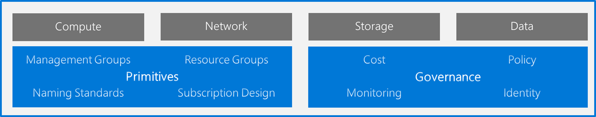

# Landing zone considerations

Landing zones are the basic building blocks of any cloud adoption environment. The term landing zone is used to describe an environment that has been provisioned and prepared to host workloads in a cloud environment, such as Azure. A fully functioning landing zone is the final deliverable of any iteration of the Cloud Adoption Framework's Ready methodology.

The image above shows the major considerations when implementing any landing zone deployment. These considerations can be broken into three categories or types of considerations: hosting, Azure fundamentals, and governance.

## Hosting considerations

All landing zones provide structure to hosting options. This structure is created explicitly through governance controls or organically through the adoption of services within the landing zone. The following articles can help you make explicit decisions that are then reflected in the blueprint or other automation scripts that create the landing zone.

- **[Compute decisions](./compute-decisions.md).** Align compute options with the purpose of the landing zone to minimize operational complexity. This decision can be enforced using automation toolchains, such as Azure Policy initiatives and landing zone blueprints.
- **[Storage decisions](./storage-guidance.md).** Select the right Azure storage solution to support your workload requirements.
- **[Networking decisions](./network-decisions.md).** Choose the networking services, tools, and architectures that will support your organization's workload, governance, and connectivity requirements.
- **[Database decisions](./data-decisions.md).** Determine which database technology is best suited for your workload requirements.

## Azure fundamentals

Each landing zone is part of a broader solution for organizing resources across a cloud environment. Azure fundamentals are the foundational building blocks for organization.

- **[Azure fundamental concepts](./fundamental-concepts.md).** Learn fundamental concepts and terms used to organize resources in Azure. Also learn how these concepts relate to one another.
- **Resource organization decision guide.** Once you understand each of the fundamentals, the resource organization decision guide can help you make decisions that will shape the landing zone.

## Governance considerations

The Cloud Adoption Framework's Govern methodologies establish a process for governing the environment as a whole. However, there are many use cases that would require governance decisions to be made on a per landing zone basis. In many scenarios, governance baselines are enforced on a per landing zone basis, even though they are established holistically. Each of these scenarios is true for the first few landing zones deployed by an organization. The following articles will help make governance-related decisions regarding this landing zone. Each decision can then be factored into the governance baselines.

- **Cost requirements.** Based on the motivation for the cloud adoption efforts and the operational commitments made regarding this environment, various cost management configurations may need to be changed for this landing zone.
- **Monitoring decisions.** Depending on the operational requirements for this landing zone, various monitoring tools could be deployed. The monitoring decisions article will help determine the most appropriate tools to deploy
- **Using role-based access control.** Azure [role-based access control (RBAC)](../azure-best-practices/roles.md) offers fine-grained group-based access management for resources organized around user roles.
- **Policy decisions**. Azure blueprint samples provide precreated compliance blueprints, each with predefined policy initiatives. Policy decisions inform the selection of the best blueprint or policy initiative based your requirements and constraints.
- **[Create hybrid cloud consistency](../../infrastructure/misc/hybrid-consistency.md)**. Create hybrid cloud solutions that provide the benefits of cloud innovation while maintaining many of the conveniences of on-premises management.
