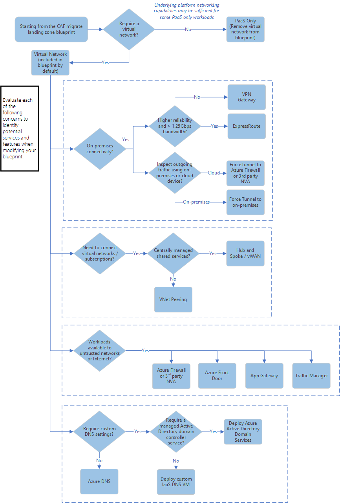

# Networking design decisions

Designing and implementing Azure networking capabilities is a critical part of your cloud adoption efforts. You'll need to make networking design decisions to properly support the workloads and services that will be hosted in the cloud. Azure networking products and services support a wide variety of networking capabilities. How you structure these services and the networking architectures you choose depends on your organization's workload, governance, and connectivity requirements.

## Identify workload networking requirements

As part of your landing zone evaluation and preparation, you need to identify the networking capabilities that your landing zone needs to support. This process involves assessing each of the applications and services that make up your workloads to determine their connectivity network control requirements. After you identify and document the requirements, you can create policies for your landing zone to control the allowed networking resources and configuration based on your workload needs.

For each application or service you'll deploy to your landing zone environment, use the following decision tree as a starting point to help you determine the networking tools or services to use:

### Key questions

Answer the following questions about your workloads to help you make decisions based on the Azure networking services decision tree:

- **Will your workloads require a virtual network?** Managed platform as a service (PaaS) resource types use underlying platform network capabilities that don't always require a virtual network. If your workloads don't require advanced networking features and you don't need to deploy infrastructure as a service (IaaS) resources, the default [native networking capabilities provided by PaaS resources](../../decision-guides/software-defined-network/paas-only.md) might meet your workload connectivity and traffic management requirements.
- **Will your workloads require connectivity between virtual networks and your on-premises datacenter?** Azure provides two solutions for establishing hybrid networking capabilities:  Azure VPN Gateway and Azure ExpressRoute. [Azure VPN Gateway](/azure/vpn-gateway/vpn-gateway-about-vpngateways) connects your on-premises networks to Azure through site-to-site VPNs similar to how you might set up and connect to a remote branch office. VPN Gateway has a maximum bandwidth of 1.25 GBps. [Azure ExpressRoute](/azure/expressroute/expressroute-introduction) offers higher reliability and lower latency by using a private connection between Azure and your on-premises infrastructure. Bandwidth options for ExpressRoute range from 50 MBps to 100 GBps.
- **Will you need to inspect and audit outgoing traffic by using on-premises network devices?** For cloud-native workloads, you can use [Azure Firewall](/azure/firewall/overview) or cloud-hosted, third-party [network virtual appliances (NVAs)](https://azure.microsoft.com/solutions/network-appliances/) to inspect and audit traffic going to or coming from the public internet. However, many enterprise IT security policies require internet-bound outgoing traffic to pass through centrally managed devices in the organization's on-premises environment. [Forced tunneling](/azure/virtual-network/virtual-networks-udr-overview) supports these scenarios. Not all managed services support forced tunneling. Services and features like [App Service Environment in Azure App Service](/azure/app-service/environment/intro), [Azure API Management](/azure/api-management/api-management-key-concepts), [Azure Kubernetes Service (AKS)](/azure/aks/intro-kubernetes), [Managed Instances in Azure SQL Database](/azure/sql-database/sql-database-managed-instance-index), [Azure Databricks](/azure/azure-databricks/what-is-azure-databricks), and [Azure HDInsight](/azure/hdinsight/) support this configuration when the service or feature is deployed inside a virtual network.
- **Will you need to connect multiple virtual networks?** You can use [virtual network peering](/azure/virtual-network/virtual-network-peering-overview) to connect multiple instances of [Azure Virtual Network](/azure/virtual-network/virtual-networks-overview). Peering can support connections across subscriptions and regions. For scenarios where you provide services that are shared across multiple subscriptions or need to manage a large number of network peerings, consider adopting a [hub and spoke networking architecture](../../decision-guides/software-defined-network/hub-spoke.md) or using [Azure Virtual WAN](/azure/virtual-wan/virtual-wan-about). Virtual network peering provides connectivity only between two peered networks. By default, it doesn't provide transitive connectivity across multiple peerings.
- **Will your workloads be accessible over the internet?** Azure provides services that are designed to help you manage and secure external access to your applications and services:
  - [Azure Firewall](/azure/firewall/overview)
  - [Network appliances](https://azure.microsoft.com/solutions/network-appliances/)
  - [Azure Front Door Service](/azure/frontdoor/front-door-overview)
  - [Azure Application Gateway](/azure/application-gateway/)
  - [Azure Traffic Manager](/azure/traffic-manager/traffic-manager-overview)
- **Will you need to support custom DNS management?** [Azure DNS](/azure/dns/dns-overview) is a hosting service for DNS domains. Azure DNS provides name resolution by using the Azure infrastructure. If your workloads require name resolution that goes beyond the features that are provided by Azure DNS, you might need to deploy additional solutions. If your workloads also require Active Directory services, consider using [Azure Active Directory Domain Services](/azure/active-directory-domain-services/overview) to augment Azure DNS capabilities. For more capabilities, you can also [deploy custom IaaS virtual machines](/azure/virtual-network/virtual-networks-name-resolution-for-vms-and-role-instances) to support your requirements.

## Common networking scenarios

Azure networking is composed of multiple products and services that provide different networking capabilities. As part of your networking design process, you can compare your workload requirements to the networking scenarios in the following table to identify the Azure tools or services you can use to provide these networking capabilities:

<!-- markdownlint-disable MD033 -->

| **Scenario** | **Networking product or service** |
| --- | --- |
| I need the networking infrastructure to connect everything, from virtual machines to incoming VPN connections. | [Azure Virtual Network](/azure/virtual-network) |
| I need to balance inbound and outbound connections and requests to my applications or services. | [Azure Load Balancer](/azure/load-balancer) |
| I want to optimize delivery from application server farms while increasing application security with a web application firewall. | [Azure Application Gateway](/azure/application-gateway)  [Azure Front Door Service](/azure/frontdoor) |
| I need to securely use the internet to access Azure Virtual Network through high-performance VPN gateways. | [Azure VPN Gateway](/azure/vpn-gateway) |
| I want to ensure ultra-fast DNS responses and ultra-high availability for all my domain needs. | [Azure DNS](/azure/dns) |
| I need to accelerate the delivery of high-bandwidth content to customers worldwide, from applications and stored content to streaming video. | [Azure Content Delivery Network](/azure/cdn) |
| I need to protect my Azure applications from DDoS attacks. | [Azure DDoS Protection](/azure/virtual-network/ddos-protection-overview) |
| I need to distribute traffic optimally to services across global Azure regions, while providing high availability and responsiveness. | [Azure Traffic Manager](/azure/traffic-manager) [Azure Front Door Service](/azure/frontdoor) |
| I need to add private network connectivity to access Microsoft cloud services from my corporate networks, as if they were on-premises and residing in my own datacenter. | [Azure ExpressRoute](/azure/expressroute) |
| I want to monitor and diagnose conditions at a network-scenario level. | [Azure Network Watcher](/azure/network-watcher) |
| I  need native firewall capabilities, with built-in high availability, unrestricted cloud scalability, and zero maintenance. | [Azure Firewall](/azure/firewall) |
| I need to connect business offices, retail locations, and sites securely. | [Azure Virtual WAN](/azure/virtual-wan) |
| I need a scalable, security-enhanced delivery point for global microservices-based web applications. | [Azure Front Door Service](/azure/frontdoor) |

<!-- markdownlint-enable MD033 -->

## Choose a networking architecture

After you identify the Azure networking services that you need to support your workloads, you also need to design the architecture that will combine these services to provide your landing zone's cloud networking infrastructure. The Cloud Adoption Framework [Software Defined Networking decision guide](../../decision-guides/software-defined-network/index.md) provides details about some of the most common networking architecture patterns used on Azure.

The following table summarizes the primary scenarios that these patterns support:

| **Scenario** | **Suggested network architecture**
| --- | --- |
| All of the Azure-hosted workloads deployed to your landing zone will be entirely PaaS-based, won't require a virtual network, and aren't part of a wider cloud adoption effort that will include IaaS resources. | [PaaS-only](../../decision-guides/software-defined-network/paas-only.md) |
| Your Azure-hosted workloads will deploy IaaS-based resources like virtual machines or otherwise require a virtual network, but don't require connectivity to your on-premises environment. | [Cloud-native](../../decision-guides/software-defined-network/cloud-native.md) |
| Your Azure-hosted workloads require limited access to on-premises resources, but you're required to treat cloud connections as untrusted. | [Cloud DMZ](../../decision-guides/software-defined-network/cloud-dmz.md) |
| Your Azure-hosted workloads require limited access to on-premises resources, and you plan to implement mature security policies and secure connectivity between the cloud and your on-premises environment. | [Hybrid](../../decision-guides/software-defined-network/hybrid.md) |
| You need to deploy and manage a large number of VMs and workloads, potentially exceeding [Azure subscription limits](/azure/azure-subscription-service-limits), you need to share services across subscriptions, or you need a more segmented structure for role, application, or permission segregation. | [Hub and spoke](../../decision-guides/software-defined-network/hub-spoke.md) |
| You have many branch offices that need to connect to each other and to Azure. | [Azure Virtual WAN](/azure/virtual-wan/virtual-wan-about) |

### Azure Virtual Datacenter

In addition using one of these architecture patterns, if your enterprise IT group manages large cloud environments, consider consulting the [Azure Virtual Datacenter guidance](../../../vdc/index.md) when you design your Azure-based cloud infrastructure. Azure Virtual Datacenter provides a combined approach to networking, security, management, and infrastructure if your organization meets the following criteria:

- Your enterprise is subject to regulatory compliance that requires centralized monitoring and audit capabilities.
- Your cloud estate will consist of more than 10,000 IaaS VMs or an equivalent scale of PaaS services.
- You need to enable agile deployment capabilities for workloads to support developer and operations teams while maintaining common policy and governance compliance and central IT control over core services.
- Your industry depends on a complex platform that requires deep domain expertise (for example, finance, oil and gas, or manufacturing).
- Your existing IT governance policies require tighter parity with existing features, even during early-stage adoption.

## Follow Azure networking best practices

As part of your networking design process, see these articles:

- [Virtual network planning](/azure/virtual-network/virtual-network-vnet-plan-design-arm?toc=https://docs.microsoft.com/azure/architecture/toc.json&bc=https://docs.microsoft.com/azure/architecture/bread/toc.json). Learn how to plan for virtual networks based on your isolation, connectivity, and location requirements.
- [Azure best practices for network security](/azure/security/azure-security-network-security-best-practices?toc=https://docs.microsoft.com/azure/architecture/toc.json&bc=https://docs.microsoft.com/azure/architecture/bread/toc.json). Learn about Azure best practices that can help you enhance your network security.
- [Best practices for networking when you migrate workloads to Azure](/azure/migrate/migrate-best-practices-networking?toc=https://docs.microsoft.com/azure/architecture/toc.json&bc=https://docs.microsoft.com/azure/architecture/bread/toc.json). Get additional guidance about how to implement Azure networking to support IaaS-based and PaaS-based workloads.
