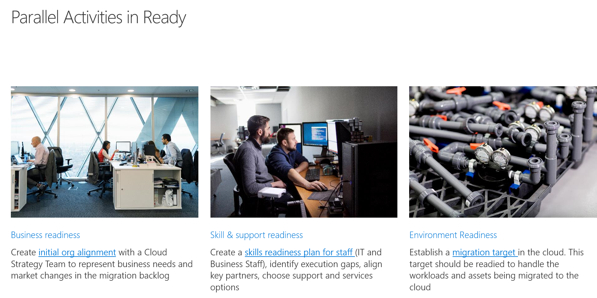
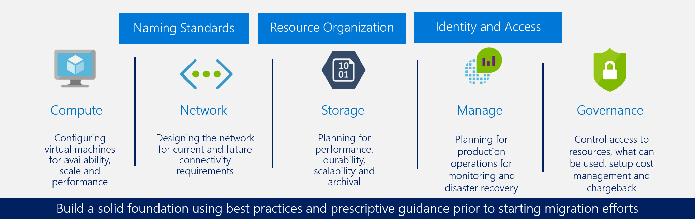

# Cloud readiness in the Cloud Adoption Framework

Coming soon: Getting ready for cloud adoption is more than just building out an Azure Foundation. This section of the Cloud Adoption Framework will help readers design a Center of Excellence, develop skills readiness for IT Staff and partner/support alignment, and establish environment readiness.

## Establish an Azure foundation

Innovate, Migrate, or Enable motions all require a similar foundation in cloud skills and a basic cloud environment. The following image outlines the components of a minimum viable product (MVP) Azure foundation. Environment readiness in this section is based on the MVP defined in the following image.

## Azure readiness guide

As a first step in completing this section, the existing [Azure readiness guide](./azure-readiness-guide/index.md) has been pulled into the Cloud Adoption Framework. Over the next 30 to 60 days, this guide will be updated to align with the Azure Foundation taxonomy and other guidance within the Cloud Adoption Framework.