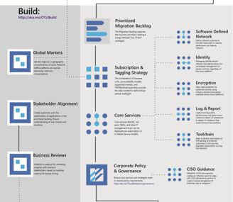

# Fusion: Build the foundation for Operational Transformation Journey (OTJ)

[Operational Transformation](overview.md) is one of the [Transformation Journeys](../overview.md) included in the [Fusion framework](../../overview.md). The objective of an Operational Transformation, is the enablement and realization of internal business outcomes. Often times these outcomes center around increased efficiencies, reduced complexity, and improved agility. This article focuses on the Build process within a transformation.

*Figure 1. Build process within Operational Transformation. Activities within the process detailed below*

Download the full size infographic: [pdf format](../../_images/operational-transformation-infographic.png) [png format](../../_images/operational-transformation-infographic.pdf)

## Business Activities

The following activities align help expand the business vision and build the relationships needed to coordinate bus/tech execution.

* [Global Markets](../../business-strategy/global-markets.md): Understanding global usage patterns and targets for delivering products and services in global markets directly impacts the technical strategy.
* [Stakeholder Alignment](../../business-strategy/stakeholder-alignment.md): Business stakeholders will be essential during user adoption. Without them, business change is impossible. During the build phased, begin socializing plans and timelines for validation and logistical alignment.
* [Business Reviews](../../business-strategy/business-reviews.md): Establish a **business review cadence** to keep stakeholders aligned. Communicating business impact, progress, and timing will prepare stakeholders for coming dependencies. 

## Culture Activities

During the "Build" Phase, cultural impact is limited to a small group of architects and technical SMEs. This process can take months to fully execute. During this time, it is suggested that the cultural focus be on continued development of the candidate pipeline and growth of technical skills in willing participants.

> [!TIP]
> The [Plan process](plan.md) can be exciting to business and technical participants. During the build process, that momentum can easily be lost. During larger or more complex build processes, it is advised that the Cloud Strategy Team continue to engage the business in planning, assessment, and architecture activities slated for early stage [Migration activities](migrate.md). In parallel, technical team members can stay engaged through the execution of additional [Technical Spikes](../../migration/plan/technical-spike-poc.md).

## Technology Activities

During the Build process, the Cloud Adoption Team prepares the Digital Estate and cloud environment for migration.

* [Prioritized Migration Backlog](../../migration/plan/migration-backlog.md): This backlog serves as the technical implementation strategy to support the business transformation strategy. During the plan stage, IT develops this plan in tandem with the business to maximize business outcomes throughout the transformation journey.
* [Subscription and Tagging Strategy](../../migration/plan/rationalize.md): The first set of technical decisions is the subscription and tagging strategy. The backlog, global markets, and cloud accounting are all inputs to influence these decisions.
* [Core Services](../../migration/plan/core-services.md): These core services will provide the foundation needed to host assets in the cloud. Prior to migration, a Minimally Viable Product (MVP) of each must be established to support assets to be deployed. At each release, these services are evolved to support planned migrations. 

* [Corporate Policy and Compliance](../../migration/plan/corporate-policy-and-compliance.md): Corporate policy and Compliance during the build phase is an effort to identify a Minimally Viable Product (MVP) for risk mitigation and controls. Much like the actual migration effort, these policies are meant to be advanced with the assets being migrated. This approach ensures adequate protection for the assets that are migrated to the cloud, with minimal intrusion in the business transformation.

    * [CISO Guidance](../../migration/plan/ciso-guidance.md): When possible, include the CISO to provide guidance and validate the MVP, even during technical spikes. This will ensure the Information Security team has time to adopt protection approaches to the cloud migration efforts.

## Next steps

Each of the sections above are designed to personalize next steps to the current activities experienced at this phase of transformation.

If none of these articles appears aligned to current activities, it could indicate that the team is still focused on the [Plan process](plan.md).

Conversely, if the Build process is complete, this journey is ready to advance to the [Migrate process](migrate.md).

> [!div class="nextstepaction"]
> [Begin Migration](migrate.md)