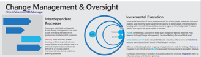

# Enterprise Cloud Adoption: Build the foundation for Operational Transformation Journey (OTJ)

[Operational Transformation](overview.md) is one of the [Transformation Journeys](../overview.md) included in the [Enterprise Cloud Adoption (ECA) framework](../../overview.md). The objective of an Operational Transformation, is the enablement and realization of internal business outcomes. Often times these outcomes center around increased efficiencies, reduced complexity, and improved agility. This article focuses on Change Management and Oversight within a transformation.

*Figure 1. Change Management & Oversight within Operational Transformation. Activities within the process detailed below*

Download the full size infographic: [pdf format](../../_images/operational-transformation-infographic.png) [png format](../../_images/operational-transformation-infographic.pdf)

## Iterative (Agile or Sprint Approaches)

An iterative approach to change management and oversight is suggested during Operational Transformation. Such an approach encourages experimentation and learning as the team matures cloud operations. Learn more about [backlog management](../../migrate/plan/iterative-change-management.md) to control change and oversee technical efforts.

Incremental execution of Operational Transformation processes tend to produce greater outcomes, improved stability, and relatively higher governance maturity at earlier stages of transformation. Leading with a Growth Mindset, allows teams to agree on a Minimally Viable Products (MVP) and organically grow rapidly from there.

## Waterfall (CMMI approaches)

Traditional approaches may be used to govern an Operational Transformation. However, the PMO team should be prepared for a high degree of drift as the Cloud Migration and Cloud Deployment teams resolve ambiguity and mature governance disciplines. This is also a high likelihood of completed tasks re-opening or requiring estimate adjustments. It is advised that the PMO baseline often and prepare stakeholders for change.