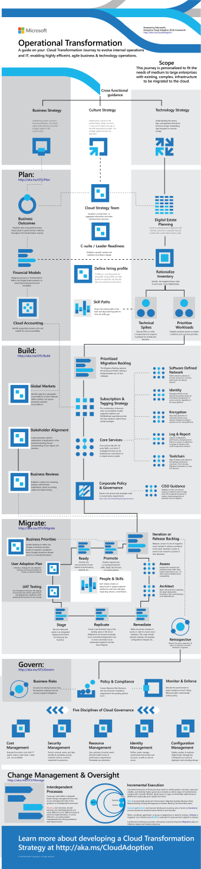

# Enterprise Cloud Adoption: Operational Transformation Journey (OTJ)

Operational Transformation is one of the [Transformation Journeys](../overview.md) included in the [Enterprise Cloud Adoption (ECA) framework](../../overview.md). The objective of an Operational Transformation, is the enablement and realization of internal business outcomes. Often times these outcomes center around increased efficiencies, reduced complexity, and improved agility. 

*Figure 1. Operational Transformation Journey infographic.*

Download the full size infographic: [pdf format](../../_images/operational-transformation-infographic.png) [png format](../../_images/operational-transformation-infographic.pdf)

# Operational Transformation Journey (OTJ) processes

The Operational Transformation Journey focuses on four core processes and a suggested approach to change management. Learn more about each of the following processes to prepare for operational transformation.

* [Plan](plan.md): This process bridges the divide between business outcomes and actionable strategies. During this process, the leadership team defines specific metrics, maps those metrics to the digital estate, and begins planning the overall migration effort.
* [Build](build.md): A number of technical and non-technical pre-requisites are required to successful migrate an environment. This process focuses on the decisions, readiness, and core infrastructure that proceeds a migration.
* [Migrate](migrate.md): Migration is an incremental process that focuses on the movement, testing, and adoption of applications or workloads in an existing digital estate.
* [Govern](govern.md): Governance of migrated assets is often a parallel, incremental process. As additional assets are migrated, business risks change. In this parallel effort, governance disciplines advance with migration efforts to mitigate risk.
* [Manage](manage.md): To aid in oversight and change management during the execution of these processes, additional guidance is included, to help customers adopt an incremental management approach during a migration.

## Next steps

Technology for technology sake, seldom produces the desired business results. Prepare for success by [Planning for Transformation](plan.md)

> [!div class="nextstepaction"]
> [Plan a Transformation](plan.md)