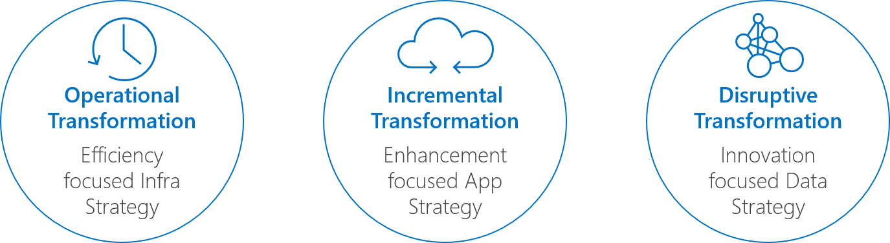

# Fusion: Transformation Journeys

The cloud is changing how companies consume technology and how business can be delivered. The cloud also enables innovation, which is key given that the goal of most organizations’ strategy is to create competitive differentiation and advantage. Cloud adoption is on the rise, with 87 percent of organizations indicating that they plan to merge their
on-premises datacenter with a hybrid cloud or the public cloud, based on a recent survey (2017 IDC Worldwide Public Cloud Services Spending Guide).  Worldwide spending on public cloud services and infrastructure is forecast to reach 160 billion USD in 2018, an increase of 23 percent over 2017.

The cloud provides the freedom to deploy, build, and manage applications on a massive, global network using existing tools and frameworks. Public and hybrid cloud solutions provide means of increasing efficiency and productivity, while simultaneously reducing IT operating expenses (OpEx). Taking advantage of scale and consumption-based billing, provides access to services that might otherwise be far beyond an organization’s means to implement.

With these benefits come increased options and increase complexity. Each Transformation Journey within the [Fusion framework](../../overview.md) is designed to reduce complexity by defining a personalized journey that fits specific customer objectives or Business Outcomes.

## Transformation Journeys

[Digital Transformation](https://enterprise.microsoft.com/en-us/digital-transformation/) is at the core of everything Microsoft does. Microsoft is passionate about helping customer's transform their businesses. Transformation Journeys create a bridge from the "Why" of Digital Transformation, into the "How" of cloud adoption. Each of these guides maps a journey which includes Business Strategy, Culture Strategy, and Technology Strategy. The goal of each Journey is to remove roadblocks to achieving success, enabling Digital Transformation through adoption of the cloud.

*Figure 1. Three Transformation Journeys in development.*

## Transformation Journey Assets & Roadmap

**[Operational Transformation](operational-transformation/overview.md)**: The majority of businesses leveraging the cloud today, are focused on transforming IT operations and other business operations. Reducing Total Cost of Ownership (TCO) by "getting out of the data center business" and Increasing Business Agility by streamlining IT operations, tend to be amongst the most common Business Outcomes.

Learn more about [Operation Transformation and Migrating to the Cloud](operational-transformation/overview.md)

**[Incremental Transformation](incremental-transformation.md)**: The pace of change in the business world continues to accelerate. To survive competitive scenarios, companies of all shapes and sizes are expected to move quickly and iterate fast. When companies attempt to grow market share or capitalize on market changes, the ability to listen, respond, and lead is a must. Incremental Transformation focuses on leveraging the cloud to ingrain development teams with a customer obsession and rapid DevOps practices. Incrementally improve application and data capacities through this transformation journey.

[Coming Spring 2019](incremental-transformation.md)

**[Disruptive Transformation](disruptive-transformation.md)**: Incremental and operational change are great; when applications, data, & processes are already driving revenue. New markets and radical disruptions of existing markets require different approaches. In today's society, data drives opportunity. New forms and sources of data are now available. Ambient technologies surround us at work and home. The average automobile generates more data per hour of driving, than the entire Apollo 11 lunar landing program. Consuming, managing, interpreting and predicting data in disruptive transformations requires modern approaches to services, applications, and data management. The cloud enables these tools and technologies; Disruptive Transformation equips businesses to use them wisely.

[Coming Summer 2019](disruptive-transformation.md)

## Next steps

Begin an [Operational Transformation](operational-transformation/overview.md) to migrate existing IT assets to the cloud.

> [!div class="nextstepaction"]
> [Operational Transformation](operational-transformation/overview.md)