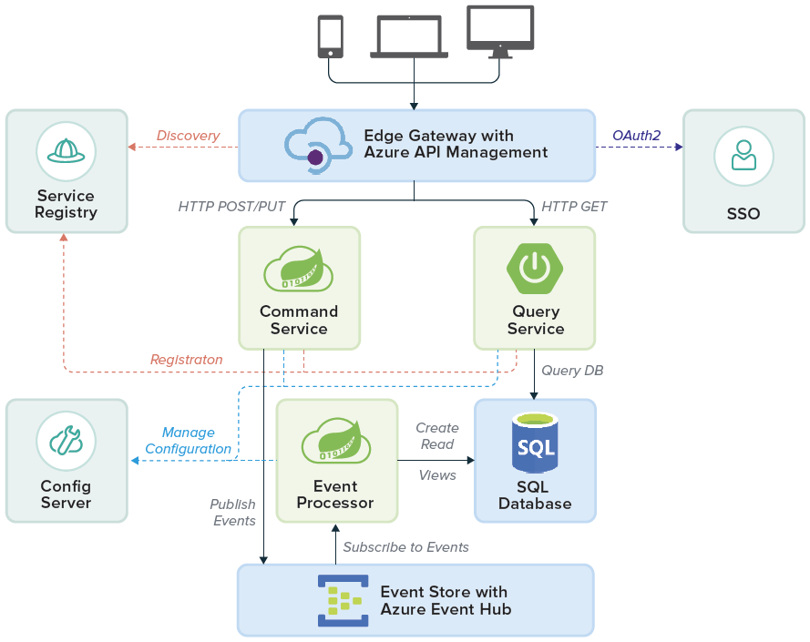

# Applications and Microservices Running on Pivotal Cloud Foundry

The following diagram shows an application architecture with some common cloud-native attributes, including:

- A modern approach to real-time data processing
- A highly distributed, scale-out pattern
- The [Command and Query Responsibility Segregation](/azure/architecture/patterns/cqrs) (CQRS) pattern. This divides the system in two distinct parts. CQRS separates the components used for writing (executing commands) from those for querying. As such, the **Command Service** and **Query Service** are independently scalable services. They are decoupled, and can be operated separately.
- An event store for processing a high-volume of transactions

## Architecture Components

- **Edge Gateway, implemented with [Azure API Management](https://azure.microsoft.com/services/api-management/).** This service facilitates communication between the API publisher and the services that consume the APIs. Other capabilities include dynamic routing, monitoring, resiliency, security, and more. In this architecture, it executes specified dynamic routing rules, and accommodates diverse inbound clients. A deeper integration is available by using a route service to bind an app to an API management proxy.

- **Service Registry, implemented as Spring Cloud Services Service Registry, tracks the services.** The Command Service and the Query Service both register with this module; the Edge Gateway uses the Service Registry to discover service locations and where requests should be routed.

- **SSO (Single Sign-On) for PCF.** The Single Sign-On service is an all-in-one solution for securing access to the application and its services. It improves security and productivity since users do not have to log in to individual components.

- **Command Service, written with Spring Cloud Data Flow, orders the system do something or change its state.** This represents part of the business logic of the application.

- **Query Service, a Spring Boot app, searches the relational database and returns relevant results.** In contrast to the Command Service, this does not change the state of the system. This service is likely to experience variable load, and can be scaled accordingly.

- **Config Server, implemented as Spring Cloud Services Config Server, stores all environmental variables.** No configuration is stored in any of the services. The Config Server stores this information and provides it on-demand. This is a cloud-native best practice, in keeping with “12 factor app” principles.

- **Event Processor, written in Spring Cloud Data Flow, works with the Command Service.** This is the other part of the application's business logic.

- **MySQL for PCF serves as the system of truth.** It returns results requested by the Query Service.

- **Event Store, based on [Azure Event Hubs](https://azure.microsoft.com/services/event-hubs/), is the high-volume event processing system.** This pattern is often referred to as “Event Sourcing”. It is a superior option for this scenario, since event streams in the past may need to be “replayed.” In contrast, systems like RabbitMQ immediately delete messages upon successful receipt. Azure Event Hubs natively supports C\# .NET clients and Java clients.

## Considerations for High Availability Across Multiple Sites

Messaging middleware and the use of event-driven architecture address HA the application level.

Distributed architectures thrive on asynchronous, message-driven communication between application services. This stands in contrast to traditional, synchronous systems that need massive bandwidth for traffic between clusters.

The event store in Figure 8 can be configured to send events to multiple sites. Now, let's examine how to discover and consume services in different locations.

## Peer Replication with Service Registry

Consider a recent real-world use case from a financial services organization, shown below. This bank has a large number of services deployed across orgs and spaces. These services need to be discovered and used across the bank. Administrators want these services consumed by apps regardless of their PCF organization and space. With Service Registry peer replication, applications can be managed within the authorization model of a space, and services can be made accessible in a controlled way across organizations.

Service Registry peer replication works across PCF installations. It also works across organizations within a single PCF installation. The diagram above shows a simple Service Registry peer replication configuration across two sites. If we look at the **West PCF** data center, the local Service Registry registers the **A** and **C** services in light blue. They are also made available for lookup in the **East PCF** data center. The same is true of services in East PCF. The Services Registry there registers the services in light green locally, then makes them available for lookup in West PCF.

Once peer replication is enabled, development and operations teams enjoy:

- Increased availability for their microservices in the face of partial failures
- Load balancing across network boundaries
- Successful discovery of services across distinct PCF installations or organizations

More details on this scenario, including code samples, are [available on the Pivotal blog](https://content.pivotal.io/blog/new-in-spring-cloud-services-1-2-multi-site-service-discovery).

## Reference Architecture: Sample Customer App

Let's consider a Sample Application written by a PCF customer. We can see how the platform enables the developers to focus on their custom code. PCF and Spring Cloud Services take care of ongoing management and operation.

## Sample App Components

The customer app features these custom services:

- Validation & State
- Enrichment Orchestration
- State
- Search
- External
- Derivation
- Audit
- Data
- (EDP) Event Data Processing

## PCF Platform Services

PCF handles the underlying management of the infrastructure and runtime dependencies. The platform also handles these essential elements:

- **Config Server** manages the Sample App's external configuration properties.

- **Service Registry** performs Service Discovery for the Sample App's microservices. It dynamically discovers and calls registered services for the Sample App.

- **Circuit Breaker Dashboard.** The Sample App includes multiple layers of distributed services. The Hystrix library (part of Spring Cloud Netflix) provides an implementation of the Circuit Breaker pattern. It can provide fallback behavior until a failing service is restored to normal operation. The Circuit Breaker Dashboard for PCF visualizes the metrics of the circuit breakers inside an app.

- **App Autoscaler.** The [App Autoscaler](http://docs.pivotal.io/pivotalcf/1-9/appsman-services/autoscaler/using-autoscaler.html) automatically adjusts capacity for this Sample App. It does so according to custom triggers and thresholds. The service adds and subtracts instances based on CPU Usage, HTTP Latency, and HTTP Throughput.

## Next Steps

Try out PCF on Azure from the [Azure Marketplace](https://azuremarketplace.microsoft.com/en-us/marketplace/apps/pivotal.pivotal-cloud-foundry). This creates a full PCF deployment, including the Azure Service Broker. 
