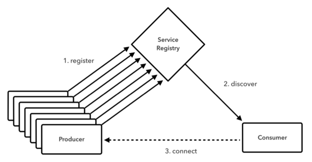
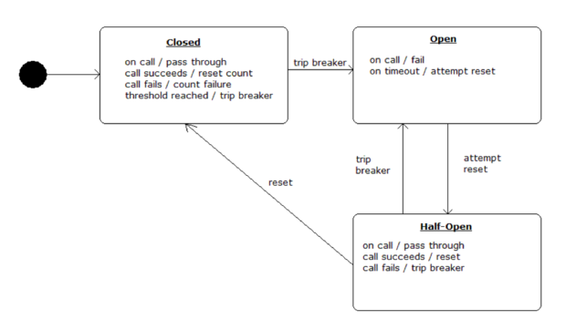

# Run Pivotal Cloud Foundry on Azure

Pivotal Cloud Foundry (PCF) is a cloud-native platform for deploying and
operating applications. PCF can run on-premises, and atop public cloud
providers like Microsoft Azure. This gives enterprises a hybrid and
multi-cloud platform.

PCF is a uniform way for you to launch, and quickly iterate, on
applications in any popular language. The platform manages many
implementation details for you. With PCF, you no longer have to think
about how to deploy, scale, and expose an app. You can instead focus on
adding business value with custom code. PCF enables developers to speed
up application development and reduce time to market.

The diagram in Figure 1 highlights important PCF components. This
architecture organizes elements according to their network affinity.

- **Infrastructure Services Virtual Network**, used by Pivotal Ops
    Manager to control the underlying infrastructure

- **Elastic Runtime Virtual Network**, used by PCF’s Elastic Runtime,
    container orchestrator, and other related services

- **App Services Virtual Network**, used by PCF managed services like
    MySQL, RabbitMQ and Spring Cloud® Services for Pivotal Cloud Foundry

*Figure 1 - An overview of selected Pivotal Cloud Foundry components.*

Let’s review each item in Figure 1.

### Infrastructure Services Virtual Network

- **CredHub.** CredHub is a forthcoming extension to Cloud Foundry.
    This feature centralizes and secures credential generation, storage,
    lifecycle management, and access. CredHub can mitigate the risk of
    leaked credentials, a common culprit in data breaches.

- **LDAP.** Lightweight Directory Access Protocol is a protocol used
    for single sign-on methods. It connects an identity management tool
    (such as [*Azure Active
    Directory*](https://azure.microsoft.com/en-us/services/active-directory/))
    and 3rd party systems. Pivotal Cloud Foundry supports LDAP and SSO
    via its [*UAA
    service*](http://docs.pivotal.io/pivotalcf/1-9/concepts/architecture/uaa.html).

- **PCF Ops Manager.** Operations Manager (“[*Ops
    Manager*](http://docs.pivotal.io/pivotalcf/1-9/customizing/index.html)”)
    is a web application used to deploy and manage PCF. Ops Manager
    communicates with the BOSH Director to deploy Elastic Runtime
    components and other services.

- **BOSH Director.** [*BOSH
    Director*](http://docs.pivotal.io/pivotalcf/1-9/customizing/vsphere-config.html)
    performs a highly automated PCF deployment based on user-provided
    configuration details.

- **NAT Gateway.** A network address translation (NAT) gateway enables
    services in a private subnet to connect to other PCF components. The
    NAT Gateway also prevents components *outside* the Infrastructure
    Services VLAN from initiating a connection with these services.
    [*Read more about configuring firewalls for
    PCF*](http://docs.pivotal.io/pivotalcf/1-9/customizing/config_firewall.html).

### Elastic RunTime Virtual Network

- **Load Balancer.** Production PCF environments use a
    highly-available [*load
    balancer.*](http://docs.pivotal.io/pivotalcf/1-9/customizing/custom-load-balancer.html)
    The load balancer route traffic to PCF Router IPs and supports SSL
    termination with wildcard DNS location. It adds appropriate
    x-forwarded-for and x-forwarded-proto HTTP headers to incoming
    requests. WebSockets can be supported as needed. Global deployments
    should use the [*Azure Traffic
    Manager*](https://azure.microsoft.com/en-us/services/traffic-manager/),
    routing to [*Azure Load
    Balancers*](https://azure.microsoft.com/en-us/services/load-balancer/)
    in different regions.

- **TCP Router.** The [*TCP
    Router*](http://docs.pivotal.io/pivotalcf/1-9/adminguide/enabling-tcp-routing.html)
    works with applications that serve requests on non-HTTP TCP
    protocols. TCP Routing terminates the TLS as close to your apps as
    possible. In this scenario, packets are not decrypted before
    reaching the application level. This configuration helps compliance
    with certain regulations.

- **HTTP Router.** The [*HTTP
    Router*](http://docs.pivotal.io/pivotalcf/1-9/concepts/http-routing.html)
    manages HTTP traffic into and out of the PCF deployment.

- **Gorouter.** The
    [*Gorouter*](http://docs.pivotal.io/pivotalcf/1-9/concepts/architecture/router.html)
    routes traffic coming into PCF to the appropriate component. For
    example, the Gorouter is used when an operator addresses the
    Platform API. It is also used when application user accesses an app
    running on a Diego Cell.

- **Platform API.** The Platform API (or [*Cloud
    Controller*](http://docs.pivotal.io/pivotalcf/1-9/concepts/architecture/cloud-controller.html))
    provides REST API endpoints for clients to access the system. It
    maintains a database with tables for orgs, spaces, services, user
    roles, and more.

- **PCF Metrics.** [*PCF
    Metrics*](http://docs.pivotal.io/pcf-metrics/1-2/index.html) stores
    logs, metrics data, and event data from applications running on PCF.
    The module renders this data visually. This treatment helps
    operators and developers better understand the application health
    and performance.

- **Log Search.** Operators can use [*PCF Log
    Search*](https://docs.pivotal.io/logsearch/index.html) to analyze
    logs from different system components. Some customers prefer Azure's
    native capabilities in this area. Options include the [*Microsoft
    Operations Management
    Suite*](https://docs.microsoft.com/en-us/azure/operations-management-suite/operations-management-suite-overview)
    (OMS) and
    [*Monitor*](https://azure.microsoft.com/en-us/blog/announcing-the-public-preview-of-azure-monitor/)
    services. Microsoft has adapted Cloud Foundry's Firehose and nozzle
    features, shown below. Users can analyze logs and metrics using this
    starter OMS visualization widget.

*Figure X - Cloud Foundry metrics and logging, shown in the Microsoft
OMS.*

- **Diego.** [*Diego is the container
    orchestrator*](http://docs.pivotal.io/pivotalcf/1-9/concepts/diego/diego-architecture.html)
    for Pivotal Cloud Foundry.

    - **Brain.** The [*Diego
        Brain*](http://docs.pivotal.io/pivotalcf/1-9/concepts/diego/diego-architecture.html#brain-components)
        distributes one-off tasks and long-running processes (LRPs) to
        Diego Cells. These processes are dynamically managed, increasing
        fault-tolerance and long-term consistency.

    - **Linux Cell.** Each Linux-based application VM has a [*Linux
        Cell*](http://docs.pivotal.io/pivotalcf/1-9/concepts/diego/diego-architecture.html)
        that executes local application start and stop actions. The Cell
        manages the containers within a VM, and reports app status and
        other data to the Log Aggregator.

    - **Windows Cell.** [*Windows
        Cells*](http://docs.pivotal.io/pivotalcf/1-9/windows/index.html)
        perform the same functions as Linux Cells, but for tasks and
        processes that require Windows and .NET components.

    - **Config Data.** [*This
        database*](http://docs.pivotal.io/pivotalcf/1-9/concepts/diego/diego-architecture.html#database-vms)
        maintains a real-time representation of the state of the Diego
        cluster. Data stored includes metadata about all desired LRPs,
        running LRP instances, and in-flight tasks. This also includes a
        consistent key-value data store to Diego.

- **Messaging.**
    [*Messaging*](https://docs.pivotal.io/pivotalcf/1-9/concepts/architecture/messaging-nats.html)
    in PCF is done via NATS, a lightweight publish-subscribe and
    distributed queueing messaging system.

- **Errand.** These instances are dedicated to [*running one-off
    errands*](https://docs.pivotal.io/tiledev/tile-errands.html) (for
    example, adding and removing Tiles).

- **Log Aggregator.** The Log Aggregator (or
    “[*Loggregator*](https://docs.pivotal.io/pivotalcf/1-9/loggregator/architecture.html)”)
    aggregates and streams logs and metrics. It collects and processes
    data from all user apps and Elastic Runtime components.

- **Azure Blob Storage.** PCF uses [*Blob
    Storage*](http://docs.pivotal.io/pivotalcf/1-9/concepts/high-availability.html#blobstore)
    to host buildpacks, droplets, packages and resources. This can be an
    object storage service or internal file system. Azure Blob storage
    is recommended for PCF deployments on Azure. [*This is supported by
    default in the recommended BOSH manifest
    files*](https://azure.microsoft.com/en-us/blog/cloud-foundry-integrating-with-azure-blob-storage-and-managed-disks/).

### Application Services Virtual Network

Customers use Pivotal Cloud Foundry's core components to deploy and
operate their apps. Developers and operators tend to extend their modern
apps with other services.

These add-ons connect via an Application Services Virtual Network. Here
are a few popular services that Azure customers often integrate into
their apps.

- **Spring Cloud Services.** [*Spring Cloud Services for Pivotal Cloud
    Foundry*](https://docs.google.com/document/d/1HkjX7DyY5szFiuwqmYmCHz-vUbXN3cQoRjFDYP8kDr0/edit#heading=h.rys80p658l9p)
    (PCF) packages server-side components of Spring Cloud projects,
    including Spring Cloud Netflix and Spring Cloud Config, and makes
    them available as services in the PCF Marketplace.

- **Azure SQL Database.** [*Azure SQL
    Database*](https://azure.microsoft.com/en-us/services/sql-database/)
    is a managed cloud database for app developers. The service makes
    building and maintaining applications easier and more productive.
    SQL Database includes built-in intelligence that learns app patterns
    and adapts to maximize performance, reliability, and data
    protection.

- **Azure Redis Cache.** [*Azure Redis
    Cache*](https://azure.microsoft.com/en-us/services/cache/) is based
    on the popular open-source Redis cache. It gives you access to a
    secure, dedicated Redis cache, managed by Microsoft and accessible
    from any application within Azure. It is available in three tiers:
    basic, standard, or premium.

- **Azure Event Hubs.** [*Azure Event
    Hubs*](https://azure.microsoft.com/en-us/services/event-hubs/) is a
    hyper-scale telemetry ingestion service that collects, transforms,
    and stores millions of events. As a distributed streaming platform,
    it offers low latency and configurable time retention enabling you
    to ingress massive amounts of telemetry into the cloud and read the
    data from multiple applications using publish-subscribe semantics.

- **Azure Service Bus.** [*Azure Service
    Bus*](https://azure.microsoft.com/en-us/services/service-bus/)
    offers a highly-reliable cloud messaging service between
    applications and services, even when one or more is offline.
    Available in every Azure region, this fully-managed service
    eliminates the burdens of server management and licensing.
    Asynchronous operations enable flexible, brokered messaging between
    client and server, along with structured first-in-first-out (FIFO)
    messaging and publish/subscribe capabilities—perfect for tasks such
    as order processing.

- **Third-Party Services.** Many different software packages can be
    integrated with Pivotal Cloud Foundry. Application performance
    management (APM), API Gateways, and NoSQL databases are some of the
    most popular categories.

- **Internal Services.** Customers may connect their own internal
    services using the service broker interface.

### Other Topics

- **Apps Manager.** [*Apps
    Manager*](http://docs.pivotal.io/pivotalcf/1-9/console/index.html),
    a web-based tool, manages roles and permissions in Pivotal Cloud
    Foundry.

- **Buildpacks**.
    [*Buildpacks*](https://docs.pivotal.io/pivotalcf/1-9/buildpacks/index.html)
    provide framework and runtime support for your applications.
    Buildpacks examine user-provided artifacts to determine
    dependencies. It also manages the configuration needed to
    communicate with bound services. When you push an application, PCF
    detects the needed buildpack. It then installs the buildpack bits
    where the application will be staged.

- **Service Brokers.** Applications depend on services from databases
    or third-party SaaS providers. A [*service
    broker*](https://docs.pivotal.io/pivotalcf/1-9/services/overview.html)
    arranges for this connection. The service broker provides the
    service instance, then the app may communicate with that instance.

## How the Platform Supports Compliance & Security

A common security mindset: “going slower reduces risk.” Pivotal and its
customers believe that the *opposite* is true. The faster systems
change, the harder they are to penetrate. That’s the core idea of
cloud-native security, and the “secure by default” features in PCF.
These features help companies meet common compliance and security
requirements.

- **Authentication.** The [*User Account and
    Authentication*](http://docs.pivotal.io/pivotalcf/1-9/concepts/architecture/uaa.html)
    (UAA) is the identity management service for PCF. It is an OAuth2
    provider, issuing tokens for client applications to use when they
    act on behalf of PCF users. UAA works with the login server to
    authenticate users with their PCF credentials. It performs [*single
    sign-on (SSO) duties*](https://docs.pivotal.io/p-identity/1-9/)
    using those credentials (or others). UAA has endpoints for managing
    user accounts, and other functions like registering OAuth2 clients.
    On Azure, customers tend to use their enterprise Azure Active
    Directory (AAD). [*PCF offers easy integration with AAD for platform
    access.*](https://docs.pivotal.io/pivotalcf/1-9/opsguide/auth-sso.html#configure-pcf-for-saml)
    In fact, it's the same as on-premise Active Directory or LDAP
    integration. You need to provide the necessary XML metadata file,
    and it's done!

- **BOSH.** [*BOSH*](https://bosh.cloudfoundry.org/docs/about.html)
    deploys Pivotal Cloud Foundry and related services. It unifies the
    management of cloud software across its lifecycle. BOSH can
    provision and deploy software over hundreds of VMs. It also performs
    monitoring, failure recovery, and software updates with
    zero-to-minimal downtime. BOSH supports many “immutable
    infrastructure” concepts. It enables two important elements of
    [*cloud-native security*](https://pivotal.io/cloud-native-security):

    - **Repair.** Repair vulnerable software as soon as updates are
        available.

    - **Repave.** Repave servers and applications from a known good
        state, and do this often. Malware thrives on vulnerable software
        and static, unchanging systems. Change the state of your
        environment frequently, and end malware-friendly conditions. Use
        BOSH to deploy your environment several times a day - all with
        no downtime and minimal manual effort.

- **CVEs, Patches, & Updates for a Broad Range of Elements.** Pivotal
    regularly patches PCF components, the underlying operating system,
    middleware, and third-party dependencies. When our security team
    identifies a "high" or "critical" CVE, they respond with a fix
    within 48 hours. These updates can applied using Ops Manager and
    other tooling, often without downtime. Refer to
    [*https://pivotal.io/security*](https://pivotal.io/security) for
    additional information.

- **Encryption of Data at Rest.** The native encryption features of
    [*Azure
    storage*](https://docs.microsoft.com/en-us/azure/storage/storage-service-encryption)
    in the deployment achieve this requirement.

- **Encryption of Data in Transit (IPSec Add-on).** The [*IPsec Add-on
    for PCF*](http://docs.pivotal.io/addon-ipsec/index.html) encrypts IP
    data in transit in a PCF deployment. This module provides internal
    system protection if a malicious actor breaches your firewall.

- **Role-Based Access Controls.** PCF supports enterprise access
    controls with [*Orgs, Spaces, Roles, and
    Permissions*](http://docs.pivotal.io/pivotalcf/1-9/concepts/roles.html).
    This feature works in concert to ensure developers and operators
    have the right level of access. The Apps Manager is a web-based tool
    to help administer these roles and permissions.

    - **Org.** An org is a development account used by an individual
        or a team. Collaborators access an org with user accounts.
        Collaborators share the org's resource quota plan, applications,
        services availability, and custom domains.

    - **User Accounts.** A user account represents an individual in a
        PCF installation. A user may have different roles in different
        spaces within an org.

    - **Spaces.** Every application and service is part of a space.
        Each org contains at least one space. A space provides a shared
        location for application development, deployment, and
        maintenance. Each space role applies only to a particular space.

    - **Roles and Permissions.** A user can have one or more roles.
        These roles defines the user’s permissions in the org and within
        specific spaces in that org.

- **SSL/TLS.** [*SSL/TLS
    certificates*](http://docs.pivotal.io/pivotalcf/1-9/adminguide/securing-traffic.html)
    can secure HTTP traffic into your Elastic Runtime deployment. To
    secure non-HTTP traffic, terminate TLS at your load balancer or at
    the application with [*TCP
    Routing*](http://docs.pivotal.io/pivotalcf/1-9/adminguide/enabling-tcp-routing.html).

## Spring Cloud Services & Steeltoe

### Overview

[*Spring Cloud Services (SCS) for
PCF*](http://docs.pivotal.io/spring-cloud-services/1-3/index.html)
includes components of [*Spring Cloud
projects*](http://cloud.spring.io/) (like [*Spring Cloud
Netflix*](https://cloud.spring.io/spring-cloud-netflix/) and [*Spring
Cloud Config*](https://cloud.spring.io/spring-cloud-config/)). SCS are
available as services in the PCF Marketplace. With SCS, you do not have
to manage or maintain these components, Pivotal does that for you.

Use SCS to create a [*Config
Server*](#config_server.png-config-server-for-pivotal-cloud-foundry),
[*Service
Registry*](#service_registry.pngservice-registry-for-pivotal-cloud-foundry),
or [*Circuit Breaker
Dashboard*](#circuit_breaker.pngcircuit-breaker-dashboard-for-pivotal-cloud-foundry)
service instance on-demand. From there, you can bind to it and consume
it. This again frees you to focus on the value added by your own
microservices.

### Config Server for Pivotal Cloud Foundry

[*Config Server for
PCF*](http://docs.pivotal.io/spring-cloud-services/1-3/config-server/)
is an externalized application configuration service. This delivers a
central place to manage an application’s external properties across all
environments.

Config Server will manage the configuration for an app as it advances
through the deployment pipeline (dev, test, prod). Developers can be
sure that an app has everything it needs to run during this process.
Config Server supports labeled versions of environment-specific
configurations.Users can manage configuration content with many tools,
including Git. We also plan future support for Vault (as well as Git and
Vault in composite fashion).

*Figure 2 - Config Server for Pivotal Cloud Foundry.*

### Service Registry for Pivotal Cloud Foundry

[*Service Registry for
PCF*](http://docs.pivotal.io/spring-cloud-services/1-3/service-registry/)
provides an implementation of the [*Service Discovery pattern, based on
Netflix
Eureka*](http://docs.pivotal.io/spring-cloud-services/1-3/service-registry/resources.html).
This is one of the key tenets of a microservice-based architecture.

Manual configuration of each client or service is difficult. It often
proves brittle in production. Instead, use Service Registry to
dynamically discover and call registered services.

*Figure 3 - Service Registry for Pivotal Cloud Foundry.*

First, a client registers with the Service Registry. The client also
provides metadata about itself, like its host and port. Once registered,
the Registry expects a regular heartbeat message from each service
instance. If the heartbeat message is not received consistently, the
Service Registry removes the instance from its registry.

### Circuit Breaker Dashboard for Pivotal Cloud Foundry

The [*Hystrix*](https://github.com/Netflix/Hystrix) library (part of
[*Spring Cloud Netflix*](https://cloud.spring.io/spring-cloud-netflix/))
provides an implementation of the [*Circuit Breaker
pattern*](http://docs.pivotal.io/spring-cloud-services/1-3/circuit-breaker/resources.html).
The [*Circuit Breaker Dashboard for
PCF*](http://docs.pivotal.io/spring-cloud-services/1-3/circuit-breaker/)
visualizes the metrics of the circuit breakers inside an app.
Cloud-native architectures are often composed of many layers of
distributed services. End-user requests may comprise multiple calls to
these services. If a lower-level service fails, that failure can cascade
up to the end user and spread to other dependent services. Heavy traffic
to a failing service can also make it difficult to repair. Hystrix
circuit breakers can prevent failures from cascading. They can also
provide fallback behavior until a failing service is restored to normal.

*Figure 4 - Circuit Breaker for Pivotal Cloud Foundry.*

When applied to a service, a circuit breaker watches for failing calls
to the service. If failures reach a certain threshold, it “opens” the
circuit. The circuit breaker automatically redirects calls to the
specified fallback mechanism. This gives the failing service time to
recover. The Circuit Breaker Dashboard provides operational visibility
into the behavior of all of the circuit breakers present in a fleet of
cloud-native services.

### Microservices for .NET with Steeltoe

Spring Cloud Services bring common microservices patterns to Java
developers. [*Steeltoe*](http://steeltoe.io/) does the same for .NET
developers. Steeltoe helps .NET client apps integrate with Spring Cloud
Services. Steeltoe also includes connector libraries for Cloud Foundry.
This handles the parsing of environment variables (VCAP\_SERVICES) for
you. As a result, extending apps with backing services like Azure SQL DB
is that much easier.

Steeltoe includes three modules:

**Service Discovery**
How do you make the interactions between your microservices reliable and
failure tolerant? For starters, you need a service registry—basically a
phone book for your microservices—so service consumers know exactly
where to find healthy service instances. Steeltoe includes a .NET client
for Netflix Eureka so your microservices can register themselves and
discover other registered services.

**Config Server**
“Strict separation of config from code” has become a cloud mandate, but
that begs the question, where do you put it? And once you’ve
externalized your config from your app, how do you track who changed
what, when? Steeltoe leverages Spring Cloud Config Server so you can
store your app’s config in a centralized, version-controlled git repo
and then load it at runtime.

**Cloud Connectors**
Steeltoe automatically wires up common backing services, because no
microservice is an island. And because it was built by Pivotal, Steeltoe
integrates elegantly with Cloud Foundry.
