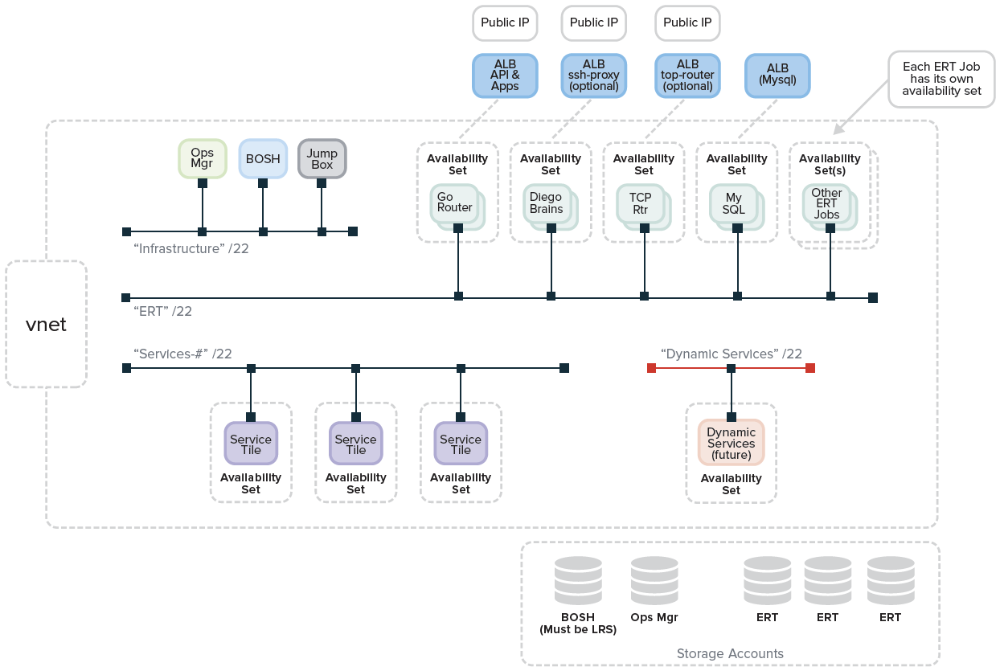
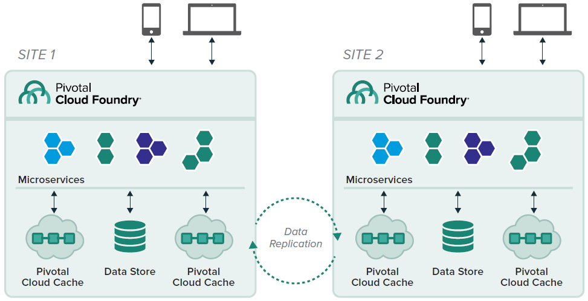

# Run Pivotal Cloud Foundry on Azure

Pivotal Cloud Foundry (PCF) is a cloud-native platform for deploying and operating applications. PCF can run on-premises or on public cloud providers such as Microsoft Azure. This gives enterprises a hybrid and multi-cloud platform.

PCF is a uniform way for to launch, and quickly iterate, applications in any popular language. The platform manages many implementation details for you. 

## Pivotal Cloud Foundry architecture

The following diagram shows the main components of PCF. This architecture organizes elements according to their network affinity. 

The network is logically subdivided:

- **Infrastructure Services**. Used by Pivotal Ops Manager to control the underlying infrastructure.

- **Elastic Runtime**. Used by PCF's Elastic Runtime, container orchestrator, and other related services.

- **App Services**. Used by PCF managed services like MySQL, RabbitMQ, and Spring Cloud Services for Pivotal Cloud Foundry.

In an Azure deployment, these divisions will correspond to subnets in an Azure virtual network (VNet).

### Infrastructure services 

- **LDAP.** Lightweight Directory Access Protocol is a protocol used for single sign-on methods. It connects an identity management tool (such as [Azure Active Directory](https://azure.microsoft.com/services/active-directory/)) and 3rd party systems. Pivotal Cloud Foundry supports LDAP and SSO via its [UAA service](http://docs.pivotal.io/pivotalcf/1-9/concepts/architecture/uaa.html).

- **PCF Ops Manager.** Operations Manager, also called [Ops Manager](http://docs.pivotal.io/pivotalcf/1-9/customizing/index.html), is a web application used to deploy and manage PCF. Ops Manager communicates with the BOSH Director to deploy Elastic Runtime components and other services.

- **BOSH Director.** [BOSH Director](http://docs.pivotal.io/pivotalcf/1-9/customizing/vsphere-config.html) performs an automated PCF deployment based on user-provided configuration details. [BOSH](https://bosh.cloudfoundry.org/docs/about.html) deploys PCF and related services. It also performs monitoring, failure recovery, and software updates with zero-to-minimal downtime. BOSH supports many "immutable infrastructure" concepts. 

- **NAT Gateway.** A network address translation (NAT) gateway enables services in a private subnet to connect to other PCF components. The NAT Gateway also prevents components *outside* the Infrastructure Services VLAN from initiating a connection with these services. For more information, see[Preparing Your Firewall for Deploying Pivotal Cloud Foundry](http://docs.pivotal.io/pivotalcf/1-9/customizing/config_firewall.html) in the Pivotal documentation.

### Elastic Runtime 

- **Load Balancer.** Production environments should use a highly-available [load balancer](http://docs.pivotal.io/pivotalcf/1-9/customizing/custom-load-balancer.html) to route traffic to the PCF Router IPs and provide SSL termination. In Azure, we recommend using [Azure Application Gateway](/azure/application-gateway/application-gateway-introduction) for the load balancer role. 

    > [!NOTE]
    > The term *load balancer* here is used in a generic sense and doesn't refer specifically to [Azure Load Balancer](https://azure.microsoft.com/services/load-balancer). 

    Multi-region deployments should use [Azure Traffic Manager](https://azure.microsoft.com/services/traffic-manager/) to route to the closest region.

- **TCP Router.** The [TCP Router](http://docs.pivotal.io/pivotalcf/1-9/adminguide/enabling-tcp-routing.html) works with applications that serve requests on non-HTTP TCP protocols. TCP Routing terminates the TLS as close to your apps as possible. In this scenario, packets are not decrypted before reaching the application level. This configuration helps compliance with certain regulations.

- **HTTP Router.** The [HTTP Router](http://docs.pivotal.io/pivotalcf/1-9/concepts/http-routing.html) manages HTTP traffic into and out of the PCF deployment.

- **Gorouter.** The [Gorouter](http://docs.pivotal.io/pivotalcf/1-9/concepts/architecture/router.html) routes traffic coming into PCF to the appropriate component. For example, the Gorouter is used when an operator addresses the Platform API. It is also used when application user accesses an app running on a Diego Cell.

- **Platform API.** The Platform API (or [Cloud Controller](http://docs.pivotal.io/pivotalcf/1-9/concepts/architecture/cloud-controller.html)) provides REST API endpoints for clients to access the system. It maintains a database with tables for orgs, spaces, services, user roles, and more.

- **PCF Metrics.** [PCF Metrics](http://docs.pivotal.io/pcf-metrics/1-2/index.html) stores logs, metrics data, and event data from applications running on PCF. The module renders this data visually, to help operators and developers better understand the application health and performance.

- **Log Search.** Operators can use [PCF Log Search](https://docs.pivotal.io/logsearch/index.html) to analyze logs from different system components. Some customers prefer Azure's native capabilities in this area. Options include the [Microsoft Operations Management Suite](/azure/operations-management-suite/operations-management-suite-overview) (OMS) and [Azure Monitor](/azure/monitoring-and-diagnostics/monitoring-overview-azure-monitor) Microsoft has adapted Cloud Foundry's Firehose and nozzle features, shown below. Users can analyze logs and metrics using this starter OMS visualization widget.

- **Diego.** [Diego](http://docs.pivotal.io/pivotalcf/1-9/concepts/diego/diego-architecture.html) is the container orchestrator for Pivotal Cloud Foundry.

    - **Brain.** The [Diego Brain](http://docs.pivotal.io/pivotalcf/1-9/concepts/diego/diego-architecture.html#brain-components) distributes one-off tasks and long-running processes (LRPs) to Diego Cells. These processes are dynamically managed, increasing fault-tolerance and long-term consistency.

    - **Linux Cell.** Each Linux-based application VM has a [Linux Cell](http://docs.pivotal.io/pivotalcf/1-9/concepts/diego/diego-architecture.html) that executes local application start and stop actions. The Cell manages the containers within a VM, and reports app status and other data to the Log Aggregator.

    - **Windows Cell.** [Windows Cells](http://docs.pivotal.io/pivotalcf/1-9/windows/index.html) perform the same functions as Linux Cells, but for tasks and processes that require Windows and .NET components.

    - **Config Data.** [This database](http://docs.pivotal.io/pivotalcf/1-9/concepts/diego/diego-architecture.html#database-vms) maintains a real-time representation of the state of the Diego cluster. Data stored includes metadata about all desired LRPs, running LRP instances, and in-flight tasks. This also includes a consistent key-value data store to Diego.

- **Messaging.** [Messaging](https://docs.pivotal.io/pivotalcf/1-9/concepts/architecture/messaging-nats.html) in PCF is done via NATS, a lightweight publish-subscribe and distributed queueing messaging system.

- **Errand.** These instances are dedicated to [running one-off errands](https://docs.pivotal.io/tiledev/tile-errands.html), such as adding and removing Tiles.

- **Log Aggregator.** The Log Aggregator (or [Loggregator](https://docs.pivotal.io/pivotalcf/1-9/loggregator/architecture.html)) aggregates and streams logs and metrics. It collects and processes data from all user apps and Elastic Runtime components.

- **Blob Storage.** Use [Azure Blob Storage](/azure/storage/) to host buildpacks, droplets, packages and resources. 

### Application services 

Customers use Pivotal Cloud Foundry's core components to deploy and operate their apps. Developers and operators may extend their applications with other services, such as [Spring Cloud Services](http://docs.pivotal.io/spring-cloud-services/), Azure services such as [SQL Database](https://azure.microsoft.com/services/sql-database/), or third-party services.

## Spring Cloud Services and Steeltoe

[Spring Cloud Services (SCS) for PCF](http://docs.pivotal.io/spring-cloud-services/1-3/index.html) includes components of [Spring Cloud projects](http://cloud.spring.io/) (like [Spring Cloud Netflix](https://cloud.spring.io/spring-cloud-netflix/) and [Spring Cloud Config](https://cloud.spring.io/spring-cloud-config/)). SCS are available as services in the PCF Marketplace. With SCS, you do not have to manage or maintain these components, Pivotal does that for you.

Use SCS to create a [Config Server](#config_server.png-config-server-for-pivotal-cloud-foundry), [Service Registry](#service_registry.pngservice-registry-for-pivotal-cloud-foundry), or [Circuit Breaker Dashboard](#circuit_breaker.pngcircuit-breaker-dashboard-for-pivotal-cloud-foundry) service instance on-demand. From there, you can bind to it and consume it. This again frees you to focus on the value added by your own microservices.

### Config Server for Pivotal Cloud Foundry

[Config Server for PCF](http://docs.pivotal.io/spring-cloud-services/1-4/common/config-server/) is an externalized application configuration service. This delivers a central place to manage an application's external properties across all environments.

Config Server will manage the configuration for an app as it advances through the deployment pipeline (dev, test, prod). Developers can be sure that an app has everything it needs to run during this process. Config Server supports labeled versions of environment-specific configurations.Users can manage configuration content with many tools, including Git. We also plan future support for Vault (as well as Git and Vault in composite fashion).

### Service Registry for Pivotal Cloud Foundry

[Service Registry for PCF](http://docs.pivotal.io/spring-cloud-services/1-4/common/service-registry/) provides an implementation of the Service Discovery pattern, based on Netflix Eureka. This is one of the key tenets of a microservice-based architecture.

Manual configuration of each client or service is difficult. It often proves brittle in production. Instead, use Service Registry to dynamically discover and call registered services.

First, a client registers with the Service Registry. The client also provides metadata about itself, like its host and port. Once registered, the Registry expects a regular heartbeat message from each service instance. If the heartbeat message is not received consistently, the Service Registry removes the instance from its registry.

### Circuit Breaker Dashboard for Pivotal Cloud Foundry

The [Hystrix](https://github.com/Netflix/Hystrix) library (part of [Spring Cloud Netflix](https://cloud.spring.io/spring-cloud-netflix/)) provides an implementation of the [Circuit Breaker](/azure/architecture/patterns/circuit-breaker) pattern. The [Circuit Breaker Dashboard for PCF](http://docs.pivotal.io/spring-cloud-services/1-3/circuit-breaker/) visualizes the metrics of the circuit breakers inside an app. Cloud-native architectures are often composed of many layers of distributed services. End-user requests may comprise multiple calls to these services. If a lower-level service fails, that failure can cascade up to the end user and spread to other dependent services. Heavy traffic to a failing service can also make it difficult to repair. Hystrix circuit breakers can prevent failures from cascading. They can also provide fallback behavior until a failing service is restored to normal.

When applied to a service, a circuit breaker watches for failing calls to the service. If failures reach a certain threshold, it "opens" the circuit. The circuit breaker automatically redirects calls to the specified fallback mechanism. This gives the failing service time to recover. The Circuit Breaker Dashboard provides operational visibility into the behavior of all of the circuit breakers present in a fleet of cloud-native services.

### Microservices for .NET with Steeltoe

Spring Cloud Services bring common microservices patterns to Java developers. [Steeltoe](http://steeltoe.io/) does the same for .NET developers. Steeltoe helps .NET client apps integrate with Spring Cloud Services. Steeltoe also includes connector libraries for Cloud Foundry. This handles the parsing of environment variables (VCAP\_SERVICES) for you. As a result, extending apps with backing services like Azure SQL DB is that much easier.

Steeltoe includes the following modules.

**Service Discovery**. How do you make the interactions between your microservices reliable and failure tolerant? For starters, you need a service registry—basically a phone book for your microservices—so service consumers know exactly where to find healthy service instances. Steeltoe includes a .NET client for Netflix Eureka so your microservices can register themselves and discover other registered services.

**Config Server**. "Strict separation of config from code" has become a cloud mandate, but that begs the question, where do you put it? And once you've externalized your config from your app, how do you track who changed what, when? Steeltoe leverages Spring Cloud Config Server so you can store your app's config in a centralized, version-controlled git repo and then load it at runtime.

**Cloud Connectors**. Steeltoe automatically wires up common backing services, because no microservice is an island. And because it was built by Pivotal, Steeltoe integrates elegantly with Cloud Foundry.

## Hosting Pivotal Cloud Foundry in Microsoft Azure

The following diagram shows an architecture for a single PCF deployment hosted in Microsoft Azure. The diagram shows core networking, consisting of an Azure virtual network (VNet) subnets for Infrastructure, ERT (Elastic Runtime), Service tiles, and Dynamic or On Demand Service tiles

This diagram shows a single PCF deployment in a single Azure Resource Group. 

### Availability sets 

In Azure, virtual machines (VMs) can be placed in to a logical grouping called an availability set. The Azure platform distributes the placement of those VMs across the underlying infrastructure to avoid single points of failure on the hardware clusters.

In this reference architecture BOSH will create multiple Availability Sets for your PCF deployment.

### IaaS architecture

Here are the core Azure architectural constructs required to deploy PCF. Pivotal recommends that customers automate their deployment with the [Azure Resource Marketplace template](https://azuremarketplace.microsoft.com/marketplace/apps/pivotal.pivotal-cloud-foundry). This reduces the likelihood of human error and makes your deployments more consistent.

The base reference approach creates a single Resource Group. The Resource Group is then populated with the required Azure constructs, such as virtual networks, network interfaces, network security groups, public IP addresses, load balancers, and and storage accounts. From there, Pivotal Operations Manager deploys PCF.

- **One service principal account bound to an Azure Active Directory (AAD) application.** This enables BOSH to interact with the API. [Pivotal.io includes useful documentation on this step](http://docs.pivotal.io/pivotalcf/1-8/customizing/azure-prepare-env.html).

- **One or two Resource Groups per PCF installation.** PCF deployments on Azure need at least one resource group. Two resource groups are an option when more control over access to Azure networking objects is desired. Here, the 'Network' Resource Group manages Azure virtual networks. The second 'PCF' Resource Group is for objects deployed with BOSH.

- **Many Availability Sets, created by BOSH for each deployment job type.** Availability sets allocate BOSH jobs across 1 or more fault or upgrade domains. This allows jobs to complete, even if Azure failures occur. Each BOSH job in a PCF release gets their own availability set. This creates many instances, so that jobs can proceed in case of a single Azure Fault Domain failure. For more information, see [Manage the availability of Windows virtual machines in Azure](/azure/virtual-machines/virtual-machines-windows-manage-availability).

- **One virtual network (VNet) with a large range of address space that is divided into subnets** Here's a typical allocation of address space within the VNet.

    - Example: 10.xxx.yyy.0/20

        - Infrastructure subnet: 10.xxx.yyy.0/26
        - Elastic Runtime subnet: 10.xxx.yyy.0/22
        - Services subnet: 10.xxx.yyy.0/22
        - Dynamic Service subnet: 10.xxx.yyy.0/22

    - Note that a subnet is a logical component, bound to a single VNet. It must exist in the the same Resource Group. In Multi Resource Group deployments, the Network and PCF resource groups should share the same region. This allows BOSH jobs in one resource group to attach networks to another.

- **Network Security Group (NSG).** The NSG manages firewall rules that apply to network interfaces. Ops Manager for Azure currently limits PCF deployments to one NSG.

- **Azure Load Balancers.** Load balancers are used as follows:

    - One for Public app access, enabling an API (or Control Path) and Apps (or Data Path)
    - One for Internal use, for example MySQL
    - One for an Optional TCP Routers, if selected
    - One for an Optional SSH Proxy

- **Storage accounts to match deployment needs.** Storage accounts are used to store the VM disks. Multiple storage accounts are suggested for two reasons. First, IOPS is capped at around 20,000, per account. Second, this avoids a single point of failure in the storage tier. Please note that customers pay for the *consumption* of storage, not the *number* of Storage Accounts. Five storage accounts should be allocated as follows.

    - One for Ops Manager
    - One for BOSH
    - Three for Elastic Runtime and other tile deployments

    We recommend Premium storage for Elastic Runtime and tile deployments. Support for [Azure Managed Disks](/azure/storage/storage-managed-disks-overview) is planned for Pivotal Cloud Foundry.

- **One jump box on the infrastructure network to provide CLI tools.** A jump box inside your PCF deployment is a handy utility. That's why a jump box is part of the [PCF Azure Resource Manager template](https://azuremarketplace.microsoft.com/en-us/marketplace/apps/pivotal.pivotal-cloud-foundry). This template includes the jump box with the recommended CLIs, so this is done for you. Manual deployments will need to create this jump box, then install recommended CLIs manually. The CLIs are listed in the [Pivotal Customer0 repo](https://github.com/c0-ops/landingpage/blob/master/azure/refarch-main.md).

- **One to five public IPs, assigned as follows.** Note that public IPs are not needed if deploying with a VPN or ExpressRoute Solution.

    - One VIP for Azure Load Balancer for CF domains (sys. and apps.)
    - One to SSH into jump box
    - One optional for VIP for Azure Load Balancer to TCP Routers
    - One optional HTTPS Ops Manager
    - One optional SSH Proxy to Diego Brains

### Network topology

The following diagram shows the Azure network elements configured in practice.

Additional guidance for this reference architecture is in the [Pivotal Customer0 Github repo](https://github.com/c0-ops/landingpage/blob/master/azure/refarch-main.md). The repo also offers configurations for multi-resource group environments.

## Hybrid considerations

The most popular hybrid configuration for enterprises is using the public cloud as an extension of an on-premises datacenter. In this scenario, applications run on-premises and in multi-tenant, elastic infrastructure. Administrators configure firewall rules in the public cloud to restrict access such that only certain IP ranges (those of a corporate network) can access the app. Customers can connect their private data centers to Azure data centers with [Azure ExpressRoute](https://azure.microsoft.com/services/expressroute/).

Here are some considerations to keep in mind for this scenario.

### Data replication

Data should be the foremost consideration in designing hybrid architectures. After all, most regulations and compliance standards apply to the treatment of data.

Traditional scenarios feature a primary site and a secondary site. The system sends database logs from the primary data center to the secondary location in regular intervals.

However, most Pivotal customers want to use bi-directional data replication, where the system replicates data in near real-time, between sites. Both sites serve traffic and process requests. This approach boosts reliability and resiliency of the application.

Pivotal Cloud Foundry customers achieve this with Pivotal Cloud Cache (PCC), a high-performance, highly available caching layer. As changes occur, PCC creates events in a replication queue, then sends them to the other site. Events can be replicated in user-specified intervals (for example, every 5 seconds), or after a defined count (for example, every 1000 events). PCC compresses and encrypts the events before sending. Upon receipt at the other site, it decompresses and decrypts the data.

Either cluster can perform read/write operations. PCC also handles de-duplication and conflict resolution. This is an important feature to ensure 100% data redundancy across locations.

### Routing site selection

If you're running an application in the public cloud and in your datacenter, choose how you want to route the traffic.

- **Go through your data center every time.** In this scenario, traffic flows through your existing global traffic manager. Administrators create routing policies based on custom rules. These policies steer requests to the most suitable site, either on-premises or the public cloud. Then, admins build firewall rules that only allow traffic from your data center to the public cloud. These rules block all other traffic into the company's public cloud instances. This hybrid setup requires a high-speed, dedicated connection between your data center(s) and the public cloud site. It is important to note that data is typically served from the on-premises site. Other application elements enjoy greater elasticity.

- **Balance traffic across public cloud nodes and your datacenter.** For this option, use DNS routing or a global load balancing service from a 3rd party. Pivotal Cloud Foundry easily supports this scenario. Create two PCF deployments, then configure each to work with the desired policies.

### Active-active or active-passive?

One of the main obstacles to achieving active-active is latency between data centers. Distributed transactions cause latency, and should be avoided whenever possible. Access data locally; resolve requests in a single DC. Data partitioning can also mitigate latency. But, this comes with its own set of issues, such as consistency, who to trust for conflict resolution, and so on.

Active-passive configurations are easier. The passive site gets an update every X seconds or Y events, as described in the [Data Replication](#data-replication) section). If the active site goes down, you simply re-route traffic to the passive location.

Another option for replication is [Azure SQL Database geo-replication.](/azure/sql-database/sql-database-geo-replication-overview) This option replicates database transactions within a region and across Azure regions.

### Deployment orchestration

Verify your CI/CD tooling and processes as you deploy asynchronous apps across different targets. Systems such as [Concourse](http://concourse.ci/) and [Spinnaker](http://www.spinnaker.io/) are particularly well-suited for this use case. [Visual Studio integrations](https://marketplace.visualstudio.com/items?itemName=ms-vsts.cloud-foundry-build-extension) also provide deployment automation to PCF instances.

## Applications and microservices running on PCF

The following diagram shows an application architecture with some common cloud-native attributes, including:

- A modern approach to real-time data processing
- A highly distributed, scale-out pattern
- The [Command and Query Responsibility Segregation](/azure/architecture/patterns/cqrs) (CQRS) pattern. This divides the system in two distinct parts. CQRS separates the components used for writing (executing commands) from those for querying. As such, the **Command Service** and **Query Service** are independently scalable services. They are decoupled, and can be operated separately.
- An event store for processing a high-volume of transactions

The architecture contains the following components:

- **Edge Gateway, implemented with [Azure API Management](https://azure.microsoft.com/services/api-management/).** This service facilitates communication between the API publisher and the services that consume the APIs. Other capabilities include dynamic routing, monitoring, resiliency, security, and more. In this architecture, it executes specified dynamic routing rules, and accommodates diverse inbound clients. A deeper integration is available by using a route service to bind an app to an API management proxy.

- **Service Registry, implemented as Spring Cloud Services Service Registry, tracks the services.** The Command Service and the Query Service both register with this module; the Edge Gateway uses the Service Registry to discover service locations and where requests should be routed.

- **SSO (Single Sign-On) for PCF.** The Single Sign-On service is an all-in-one solution for securing access to the application and its services. It improves security and productivity since users do not have to log in to individual components.

- **Command Service, written with Spring Cloud Data Flow, orders the system do something or change its state.** This represents part of the business logic of the application.

- **Query Service, a Spring Boot app, searches the relational database and returns relevant results.** In contrast to the Command Service, this does not change the state of the system. This service is likely to experience variable load, and can be scaled accordingly.

- **Config Server, implemented as Spring Cloud Services Config Server, stores all environmental variables.** No configuration is stored in any of the services. The Config Server stores this information and provides it on-demand. This is a cloud-native best practice, in keeping with "12 factor app" principles.

- **Event Processor, written in Spring Cloud Data Flow, works with the Command Service.** This is the other part of the application's business logic.

- **MySQL for PCF serves as the system of truth.** It returns results requested by the Query Service.

- **Event Store, based on [Azure Event Hubs](https://azure.microsoft.com/services/event-hubs/), is the high-volume event processing system.** This pattern is often referred to as "Event Sourcing". It is a superior option for this scenario, since event streams in the past may need to be "replayed." In contrast, systems like RabbitMQ immediately delete messages upon successful receipt. Azure Event Hubs natively supports C\# .NET clients and Java clients.

## Next steps

Try out PCF on Azure from the [Azure Marketplace](https://azuremarketplace.microsoft.com/en-us/marketplace/apps/pivotal.pivotal-cloud-foundry). This creates a full PCF deployment, including the Azure Service Broker. 
