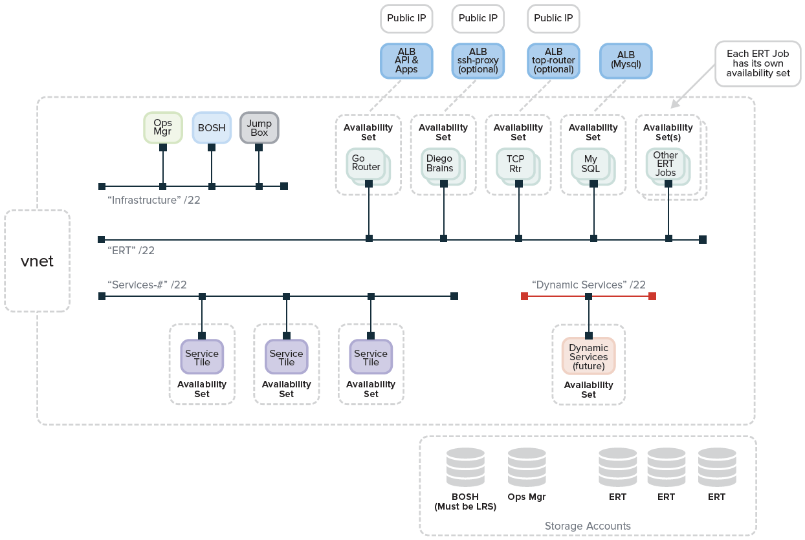
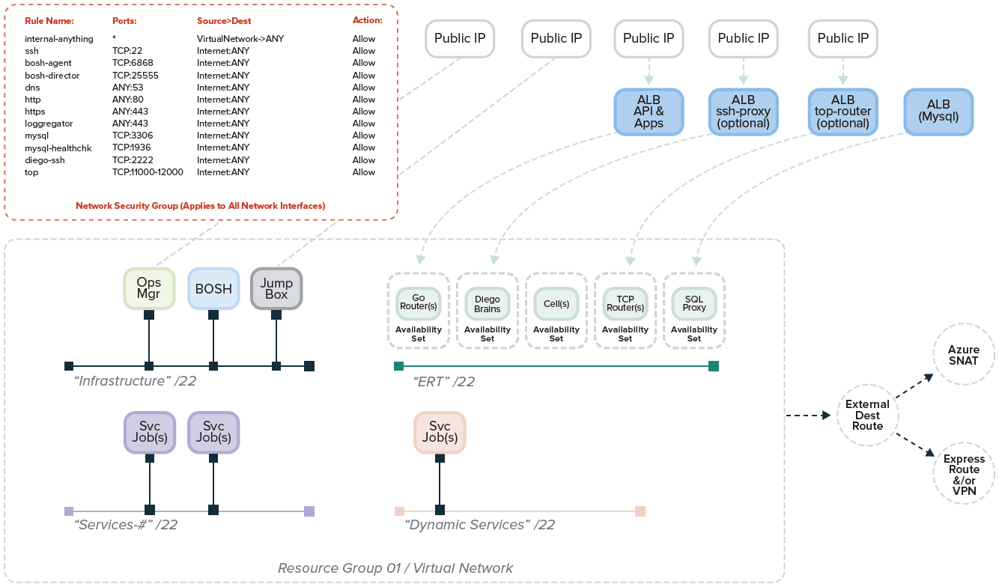
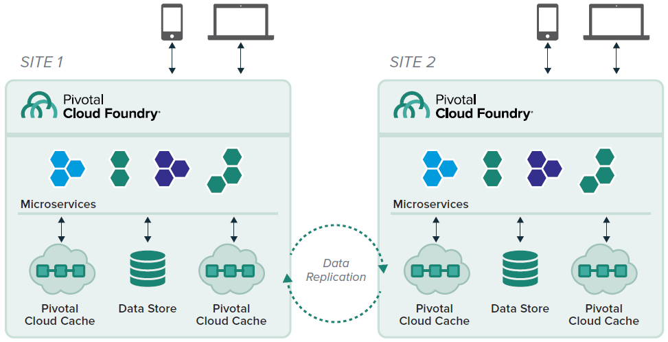

# Hosting Pivotal Cloud Foundry in Microsoft Azure

The following diagram shows an architecture for a single PCF deployment hosted in Microsoft Azure. The diagram shows core networking, consisting of an Azure virtual network (VNet) with the following subnets:

- Infrastructure
- ERT (Elastic Runtime)
- Service tiles
- Dynamic or On Demand Service tiles

This diagram shows a single PCF deployment in a single Azure Resource Group. 

### Availability Sets 

In Azure, virtual machines (VMs) can be placed in to a logical grouping called an availability set. The Azure platform distributes the placement of those VMs across the underlying infrastructure to avoid single points of failure on the hardware clusters.

In this reference architecture BOSH will create multiple Availability Sets for your PCF deployment.

### IaaS Architecture

Here are the core Azure architectural constructs required to deploy PCF. Pivotal recommends that customers automate their deployment with the [Azure Resource Marketplace template](https://azuremarketplace.microsoft.com/marketplace/apps/pivotal.pivotal-cloud-foundry). This reduces the likelihood of human error and makes your deployments more consistent.

The base reference approach creates a single Resource Group. The Resource Group is then populated with the required Azure constructs, such as virtual networks, network interfaces, network security groups, public IP addresses, load balancers, and and storage accounts. From there, Pivotal Operations Manager deploys PCF.

- **One service principal account bound to an Azure Active Directory (AAD) application.** This enables BOSH to interact with the API. [Pivotal.io includes useful documentation on this step](http://docs.pivotal.io/pivotalcf/1-8/customizing/azure-prepare-env.html).

- **One or two Resource Groups per PCF installation.** PCF deployments on Azure need at least one resource group. Two resource groups are an option when more control over access to Azure networking objects is desired. Here, the 'Network' Resource Group manages Azure virtual networks. The second 'PCF' Resource Group is for objects deployed with BOSH.

- **Many Availability Sets, created by BOSH for each deployment job type.** Availability sets allocate BOSH jobs across 1 or more fault or upgrade domains. This allows jobs to complete, even if Azure failures occur. Each BOSH job in a PCF release gets their own availability set. This creates many instances, so that jobs can proceed in case of a single Azure Fault Domain failure. For more information, see [Manage the availability of Windows virtual machines in Azure](/azure/virtual-machines/virtual-machines-windows-manage-availability).

- **One virtual network (VNet) with a large range of address space that is divided into subnets** Here's a typical allocation of address space within the VNet.

    - Example: 10.xxx.yyy.0/20

        - Infrastructure subnet: 10.xxx.yyy.0/26
        - Elastic Runtime subnet: 10.xxx.yyy.0/22
        - Services subnet: 10.xxx.yyy.0/22
        - Dynamic Service subnet: 10.xxx.yyy.0/22

    - Note that a subnet is a logical component, bound to a single VNet. It must exist in the the same Resource Group. In Multi Resource Group deployments, the Network and PCF resource groups should share the same region. This allows BOSH jobs in one resource group to attach networks to another.

- **Network Security Group (NSG).** The NSG manages firewall rules that apply to network interfaces. Ops Manager for Azure currently limits PCF deployments to one NSG.

- **Azure Load Balancers (ALBs).** Load balancers are used as follows:

    - One for Public app access, enabling an API (or Control Path) and Apps (or Data Path)
    - One for Internal use, for example MySQL
    - One for an Optional TCP Routers, if selected
    - One for an Optional SSH Proxy

- **Storage Accounts to match deployment needs.** Storage accounts are used to store the VM disks. Multiple storage accounts are suggested for two reasons. First, IOPS is capped at around 20,000, per account. Second, this avoids a single point of failure in the storage tier. Please note that customers pay for the *consumption* of storage, not the *number* of Storage Accounts. Five storage accounts should be allocated as follows.

    - One for Ops Manager
    - One for BOSH
    - Three for Elastic Runtime and other tile deployments

    We recommend Premium storage for Elastic Runtime and tile deployments. Support for [Azure Managed Disks](/azure/storage/storage-managed-disks-overview) is planned for Pivotal Cloud Foundry.

- **One jump box on the infrastructure network to provide CLI tools.** A jump box inside your PCF deployment is a handy utility. That's why a jump box is part of the [PCF Azure Resource Manager template](https://azuremarketplace.microsoft.com/en-us/marketplace/apps/pivotal.pivotal-cloud-foundry). This template includes the jump box with the recommended CLIs, so this is done for you. Manual deployments will need to create this jump box, then install recommended CLIs manually. The CLIs are listed in the [Pivotal Customer0 repo](https://github.com/c0-ops/landingpage/blob/master/azure/refarch-main.md).

- **One to five public IPs, assigned as follows.** Note that public IPs are not needed if deploying with a VPN or Express Route Solution.

    - One VIP for Azure Load Balancer for CF domains (sys. and apps.)
    - One to SSH into jump box
    - One optional for VIP for Azure Load Balancer to TCP Routers
    - One optional HTTPS Ops Manager
    - One optional SSH Proxy to Diego Brains

### Network Topology

The following diagram shows the Azure network elements configured in practice.

Additional guidance for this reference architecture is in the [Pivotal Customer0 Github repo](https://github.com/c0-ops/landingpage/blob/master/azure/refarch-main.md). The repo also offers configurations for multi-resource group environments.

## Hybrid Considerations

The most popular hybrid configuration for enterprises is using the public cloud as an extension of an on-premises datacenter. In this scenario, applications run on-premises and in multi-tenant, elastic infrastructure. Administrators configure firewall rules in the public cloud to restrict access such that only certain IP ranges (those of a corporate network) can access the app.

Here are some considerations to keep in mind for this scenario.

### Data Replication

Data should be the foremost consideration in designing hybrid architectures. After all, most regulations and compliance standards apply to the treatment of data.

Traditional scenarios feature a primary site and a secondary site. The system sends database logs from the primary data center to the secondary location in regular intervals.

However, most Pivotal customers want to use **bi-directional data replication**. Here, the system replicates data in near real-time, between sites. Both sites serve traffic and process requests. This approach boosts reliability and resiliency of the application.

Pivotal Cloud Foundry customers achieve this with Pivotal Cloud Cache (PCC), a high-performance, highly available caching layer. As changes occur, PCC creates events in a replication queue, then sends them to the other site. Events can be replicated in user-specified intervals (for example, every 5 seconds), or after a defined count (for example, every 1000 events). PCC compresses and encrypts the events before sending. Upon receipt at the other site, it decompresses and decrypts the data.

Either cluster can perform read/write operations. PCC also handles de-duplication and conflict resolution. This is an important feature to ensure 100% data redundancy across locations.

### Routing Site Selection

If you're running an application in the public cloud and in your datacenter, choose how you want to route the traffic.

- **Go through your data center every time.** In this scenario, traffic flows through your existing global traffic manager. Administrators create routing policies based on custom rules. These policies steer requests to the most suitable site, either on-premises or the public cloud. Then, admins build firewall rules that only allow traffic from your data center to the public cloud. These rules block all other traffic into the company's public cloud instances. This hybrid setup requires a high-speed, dedicated connection between your data center(s) and the public cloud site. It is important to note that data is typically served from the on-premises site. Other application elements enjoy greater elasticity.

- **Balance traffic across public cloud nodes and your datacenter.** For this option, use DNS routing or a global load balancing service from a 3rd party. Pivotal Cloud Foundry easily supports this scenario. Deploy two PCF foundations, then configure each to work with the desired policies.

### Active-Active or Active-Passive?

For this article, we define active-active as real-time HA. Active-passive is a configuration where some lag in consistency or availability is tolerable.

One of the main obstacles to achieving active-active is latency between data centers. Distributed transactions cause latency, and should be avoided whenever possible. Access data locally; resolve requests in a single DC. Data partitioning can also mitigate latency. But, this comes with its own set of issues, such as consistency, who to trust for conflict resolution, and so on.

Active-passive configurations are easier. The passive site gets an update every X seconds or Y events, as described in the [Data Replication](#data-replication) section). If the active site goes down, you simply re-route traffic to the passive location.

Another option for replication is [Azure SQL Database geo-replication.](/azure/sql-database/sql-database-geo-replication-overview) This option replicates database transactions within a region and across Azure regions.

Customers may connect their private data centers to Azure data centers with [Azure ExpressRoute](https://azure.microsoft.com/services/expressroute/).

Support for Azure Stack is planned.

### Deployment Orchestration

Continuous deployment is one [three crucial tenants for the digital era](http://www.slideshare.net/Pivotal/the-five-stages-of-cloud-native). Verify your CI/CD tooling and processes as you deploy asynchronous apps across different targets.Systems such as [Concourse](http://concourse.ci/) and [Spinnaker](http://www.spinnaker.io/) are particularly well-suited for this use case. [Visual Studio integrations](https://marketplace.visualstudio.com/items?itemName=ms-vsts.cloud-foundry-build-extension) also provide deployment automation to PCF instances.

There is one consideration to highlight: **keep track of database schema changes.** Replication errors and event mismatching will occur if schema versions are not aligned. Advance database versions together, and be able to roll them back together easily.
