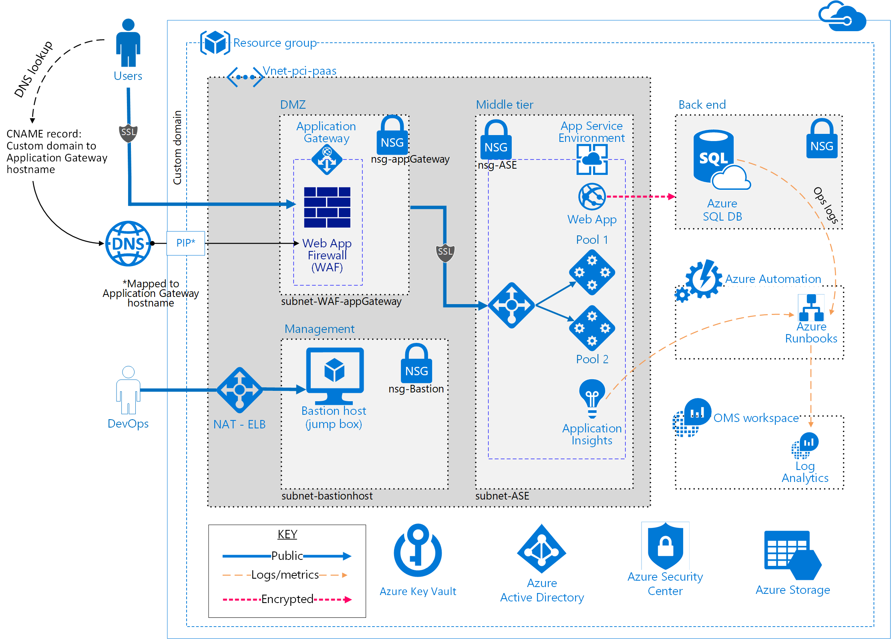

# Azure Blueprint - Payment processing solution for PCI DSS enablement 

### PUBLIC PREVIEW BETA 1


## Description
  


The Azure blueprint solution is intended to simplify azure adoption, showcase commonly used reference architecture, and teach how to deploy a secure and compliant PaaS solution for customer considering the complexities of storing sensitive payment card related data. 
The solution joint developed with Avyan consulting (Microsoft MVP partner) was designed to illustrate an end to end solution that can satisfy the needs in organizations that maybe looking for a cloud solution to reduce the burden, or cost of deployment.
This solution enables the ability to:

-	Collect, store, and retrieve payment card data while complying with stringent Payment Card Industry, Data Security Standards (PCI DSS 3.2) requirements.

This solution illustrates the management of credit card data including card number, expiration, CVC (Card Verification Check) numbers securely in a four-tier secure and compliant solution could be deployed as an end-to-end Azure solution.





### Components of this solution

-   **Reference architecture**. The reference architecture provides the design that was used for the Contoso webstore solution.
-   **Azure Resource Manager templates**. In this deployment, JavaScript Object Notation (.JSON) files provide Microsoft Azure the ability to automatically deploy the components of the reference architecture after the configuration parameters are provided during setup.
-   **PowerShell scripts**. The scripts created by [Avyan Consulting Corp](http://www.avyanconsulting.com/azureservices) solution help set up the end-to-end solution. The scripts consist of:
    -   Module installation, and Global administrator setup script script will install and verify that required PowerShell modules, and Global adminisitrator are configured correctly.
    -   A installation PowerSHell script that deploys the end to end solution. that includes the components built (https://github.com/Microsoft/azure-sql-security-sample) built by the Microsoft SQL team. 

	
## DEPLOYING THE SOLUTION

The deployment of this sample requires few steps that all can be run using Microsoft PowerShell v5. To be able to connect to the website, it is required that you provide a custom domain name, such as contoso.com. This is enabled by using the '-customHostName' switch on step2. [Details to purchase, and enable a custom domain.](https://docs.microsoft.com/en-us/azure/app-service-web/custom-dns-web-site-buydomains-web-app)
A custom domain name is not required to successfully deploy the solution for it to run, however you will not be able to connect to the website for demonstration purposes.

It is also highly advised that a clean installation of PowerShell be used to deploy the solution, or an understanding how to verify that your are running the latest modules required for the scripts to run correctly. For our example we use a Windows 10 VM that we log into, and run the following commands (note we are enabling the custom domain command)

1. Install the required modules, and set up the administrator roles correctly.
```powershell
 .\0-Setup-AdministrativeAccountAndPermission.ps1 
-azureADDomainName contosowebstore.onmicrosoft.com
-tenantId XXXXXXXX-XXXX-XXXX-XXXX-XXXXXXXXXXXX
-subscriptionId XXXXXXXX-XXXX-XXXX-XXXX-XXXXXXXXXXXX
-configureGlobalAdmin 
-installModules
 ```
 

 
 <a href="0-Setup-AdministrativeAccountAndPermission.md"> review the 0-Setup-AdministrativeAccountAndPermission for detailed usage instructions </a> 

 
 2. Install the solution-update-management 
 ```powershell
.\1-DeployAndConfigureAzureResources.ps1 
-resourceGroupName contosowebstore
-globalAdminUserName adminXX@contosowebstore.onmicrosoft.com 
-globalAdminPassword **************
-azureADDomainName contosowebstore.onmicrosoft.com 
-subscriptionID XXXXXXXX-XXXX-XXXX-XXXX-XXXXXXXXXXXX 
-suffix PCIcontosowebstore
-customHostName contosowebstore.com
-sqlTDAlertEmailAddress edna@contosowebstore.com 
-enableSSL
-enableADDomainPasswordPolicy 
```


<a href="1-DeployAndConfigureAzureResources.md"> review the 1-DeployAndConfigureAzureResources for detailed usage instructions </a> 


3. Deploy OMS logging and resources
 ```powershell
.\2-EnableOMSLoggingOnResources.ps1 
-resourceGroupName contosowebstore 
-globalAdminUserName adminXX@contosowebstore.onmicrosoft.com 
-globalAdminPassword **************
-subscriptionID XXXXXXXX-XXXX-XXXX-XXXX-XXXXXXXXXXXX
```

<a href="Payment Sample dataset.md"> review the 2-EnableOMSLoggingOnResources.ps1 or Payment Sample dataset.md for detailed usage instructions </a> 


	
## USER SCENARIO

The Payment processing solution for PCI DSS 3.2 enablement will address the following use case -

> This scenario illustrates how a fictitious webstore moved their payment card processing to a cloud based payment processing using Azure services, the solution addresses the collection of basic user information, and their payment information. The solution does not process, or resolve the purchase of the card holder data (CHD) 


### Use Case
A small webstore called, 'Contoso webstore' is ready to move their payment system to the cloud. They have selected Microsoft Azure to host the process for purchasing and to allow a  clerk to collect credit card payments from their customer.

The administrator is looking for a solution that can be quickly deployable to achieve his goals in illustrating a cloud born solution. He will use this proof-of-concept (POC) to discuss with his stakeholders how Azure can be used to accomplish:

-   Collect, store, and retrieve payment card data while complying with stringent Payment Card Industry, Data Security Standards (PCI DSS) requirements


> You will be responsible for conducting appropriate security and compliance reviews of any
solution built with the architecture used by this POC, as requirements may vary
based on the specifics of your implementation and geography. PCI DSS requires
that you work directly with an accredited Qualified Security Assessor to certify
your production ready solution.

### Elements of the Proof of Concept (POC), Demo

The POC solution is designed with the following fictitious elements
Domain site `contosowebstore.com`

User roles used to illustrate the use case, and provide insight into the user interface.

#### Role: Site and Subscription Admin

|Item      |Example|
|----------|------|
|Username: |`adminXX@contosowebstore.onmicrosoft.com`|
| Name: |`Global Admin Azure PCI Samples`|
|User type:| `Subscription Administrator and Azure Active Directory Global Administrator`|


* admin cannot read credit card information unmasked. In addition, all actions are logged.
* admin cannot manage or log into SQL database.
* admin can manage active directory, and subscription

#### Role: Sql Administrator

|Item      |Example|
|----------|------|
|Username: |`sqlAdmin@contosowebstore.onmicrosoft.com`|
| Name: |`SQLADAdministrator PCI Samples`|
| First name: |`SQL AD Administrator`|
|Last name: |`PCI Samples`|
|User type:| `Administrator`|


* sqladmin cannot view unfiltered credit card information. In addition, all actions are logged.
* sqladmin can manage SQL database.


#### Role: Clerk

|Item      |Example|
|----------|------|
|Username:| `receptionist_EdnaB@contosowebstore.onmicrosoft.com`|
| Name: |`Edna Benson`|
| First name:| `Edna`|
|Last name:| `Benson`|
| User type: |`Member`|

Edna Benson is the receptonist, and business manager. She is responsible to ensure that customer information is accurate, and billing is completed. Edna is the user loged in for all interactions of the POC DEMO website. Edna's rightsare as followes: 

* Edna can Create, read customer information *
* Edna will be able to modify customer information.
* Edna can overwrite (or replace) credit card number, expiration, and CVC verification information.


> In the `Contoso webstore` Demo User Application, you will be logged in to is configured to use **Edna** and able to test the capabilities of the deployed environment.


### contosowebstore Azure pricing sample calculation

The solution cost sample has a monthly fee structure and a use per hr. to
consider when sizing the solution. This example deployment **estimate** cost using the [Azure costing calculator](https://azure.microsoft.com/en-us/pricing/calculator/). The solution 
consist of the following items:

| **Service type** | **Custom name** | **Region** | **Description** | **Estimated Cost** | 
| ----------------- | --------------- | ----------- | -------------- | ----------------- | 
| Virtual Machines | Virtual Machines | South Central US | 1 Standard virtual machine(s), 1 Standard virtual machine(s), A2 v2 (2 cores, 4 GB RAM, 20 GB disk) size: 744 hours | $101.18 | 
| App Service | App Service | South Central US | 1 instance(s), 744 hours, size: P1, premium tier, 0 SNI connection(s), 0 IP connection(s) | $223.20 | 
| IP Addresses | IP Addresses | East US | arm type, 2 public IP Address(es) x 744 hours | $5.95 | 
| SQL Database | SQL Database | East US | 1 standard database(s) x 1 months, size: s0 | $15.03 | 
| Storage | Storage | East US | 5/GB storage: Block blob type, Basic tier, LRS redundancy | $0.10 | 
| Storage | Storage | East US | 1 GB storage Table and Queue type. Basic tier, LRS redundancy, 1 x100,000 transactions | $0.07 | 
| Storage | Storage | East US | standard-s4 Disk type with 1 Managed disks | $0.77 | 
| Application Insights | Application Insights | East US | basic tier in us-east region with 2 GBs and 0 multi-step web test(s). | $2.30 | 
| Log Analytics | Log Analytics | East US | 1 GB(s), standalone tier | $2.30 | 
| Security Center | Security Center | East US |  | $15.00 | 
| Key Vault | Key Vault | East US | 1000 operations, 0 certificate renewals, 0 HSM keys in the us-east region | $0.03 | 
| Azure Active Directory | Azure Active Directory | East US | free tier, per-user MFA billing model, 10 MFA user(s), 25001-100000 directory objects, 0 hours | $14.00 | 
| Application Gateway | Application Gateway | East US | 1 instance(s) x 1 months, 1 GB data processed, outbound transfers:: 5 GB | $93.74 | 
| | | | | **Monthly Total $473.67** |
| | | | | **Annual Total  $5,684.04** |
 
Disclaimer 
All prices shown are in US Dollar ($). This estimate was created in April 2017 

This solution used the following Azure services (details to the deployment
architecture are located in [DEPLOYMENT ARCHITECTURE](#deployment-architecture)):


>-   Application Gateway
>-   Azure Active Directory
>-   App Service Environment
>-   OMS Log Analytics
>-   Azure Key Vault
>-   Network Security Groups
>-   Azure SQL DB
>-   Azure Load Balancer
>-   Application Insights
>-   Azure Security Center
>-   Azure Web App
>-   Azure Automation
>-   Azure Automation Runbooks
>-   Azure DNS
>-   Azure Virtual Network
>-   Azure Virtual Machine
>-   Azure Resource Group and Policies
>-   Azure Blob Storage
>-   Azure Active Directory access control (RBAC)


# Deployment Architecture

The following section provides insight into the development, and implementation
elements. The descriptions in this document’s deployment strategies apply to the
following diagram:


### Network Segmentation and Security


#### Application Gateway

-   [End-to-End-SSL] (https://docs.microsoft.com/en-us/azure/application-gateway/application-gateway-end-to-end-ssl-powershell)
-   [SSL Offload][DEPRECATED](https://docs.microsoft.com/en-us/azure/application-gateway/application-gateway-ssl-portal)
-   [Disable TLS v1.0 and v1.1](https://docs.microsoft.com/en-us/azure/application-gateway/application-gateway-end-to-end-ssl-powershell)
-   [Web application firewall](https://docs.microsoft.com/en-us/azure/application-gateway/application-gateway-webapplicationfirewall-overview)(WAF mode)
-   [Prevention mode](https://docs.microsoft.com/en-us/azure/application-gateway/application-gateway-web-application-firewall-portal) with OWASP 3.0 ruleset
-   [Diagnostics logging](https://docs.microsoft.com/en-us/azure/application-gateway/application-gateway-diagnostics)
-   [Custom health probes](https://docs.microsoft.com/en-us/azure/application-gateway/application-gateway-create-gateway-portal)

#### Virtual network

-   A private virtual network with address spacing 10.0.0.0/16

#### Network security groups (NSGs)

Each of the network tiers have a dedicated NSG

-   A DMZ network security group for firewall and Application Gateway WAF
-   An NSG for management jumpbox (bastion host)
-   An NSG for the app service environment

Each of the NSGs have specific ports and protocols opened for the secure and
correct working of the solution.

In addition, the following configurations are enabled for each NSG

-   [Enabled diagnostics logs and events are stored in storage account](https://docs.microsoft.com/en-us/azure/virtual-network/virtual-network-nsg-manage-log)
-   [Connected OMS Log Analytics to the NSGs diagnostics](https://github.com/krnese/AzureDeploy/blob/master/AzureMgmt/AzureMonitor/nsgWithDiagnostics.json)

#### Subnets

-	Ensure each subnet is associated with its corresponding NSG

#### Custom domain SSL certificates

-	HTTPS traffic enabled using custom domain SSL certificate

### Data at Rest


To meet encrypted data-at-rest requirements, all [Azure Storage](https://azure.microsoft.com/en-us/services/storage/) uses the following:

#### Azure storage
-	[Storage Service Encryption](https://docs.microsoft.com/en-us/azure/storage/storage-service-encryption)

#### SQL Database

A PaaS SQL Database instance was used to showcase  security measures.

-   [AD Authentication and Authorization](https://docs.microsoft.com/en-us/azure/sql-database/sql-database-aad-authentication)
-   [Enabled Auditing logging](https://docs.microsoft.com/en-us/azure/sql-database/sql-database-auditing-get-started)
-   [Enabled Transparent Data Encryption](https://docs.microsoft.com/en-us/azure/sql-database/sql-database-auditing-get-started)
-   [Enabled SQL DB Firewall rules](https://docs.microsoft.com/en-us/azure/sql-database/sql-database-firewall-configure)(allowing for ASE worker pools and client IP management)
-   [Enabled Threat Detection](https://docs.microsoft.com/en-us/azure/sql-database/sql-database-threat-detection-get-started)
-   [Enabled Always Encrypted columns](https://docs.microsoft.com/en-us/azure/sql-database/sql-database-always-encrypted-azure-key-vault)
-	[Enabled Dynamic Data masking](https://docs.microsoft.com/en-us/azure/sql-database/sql-database-dynamic-data-masking-get-started)(using the post-deployment PowerShell script)

### Logging and Auditing

Logging using OMS, and Runbook to collect logs.
-   **Activity Logs**: Configure [Azure Activity Logs](https://docs.microsoft.com/en-us/azure/monitoring-and-diagnostics/monitoring-overview-activity-logs) to provide insight into the operations that were performed on resources in your subscription.
-   **Diagnostic Logs:** [Diagnostic Logs](https://docs.microsoft.com/en-us/azure/monitoring-and-diagnostics/monitoring-overview-of-diagnostic-logs) are all logs emitted by every resource. These logs could include Windows event system logs, Azure Blob storage, tables, and queue logs.
-   **Firewall Logs:** The Application Gateway provides full diagnostics and access logs. Firewall logs are available for Application Gateway resources that have WAF enabled.
-   **Log Archiving:** All diagnostics logs are configured to write to a centralized and encrypted Azure storage account for archival and a defined retention period (2 days). Logs are then connected to Azure Log Analytics (OMS) for processing, storing, and dashboarding.

### Secrets Management

#### Key Vault

Azure [Key Vault](https://azure.microsoft.com/en-us/services/key-vault/) helps safeguard cryptographic keys and secrets used by cloud applications and services. Stores

* **Keys** - SQL DB Column Encryption keys (customer managed keys)
* **Secrets** - Bitlocker keys for Azure Disk Encryption


### Identity Management


#### Azure Active Directory

-	[Azure Active Directory](https://azure.microsoft.com/en-us/services/active-directory/) (Azure AD) is the multi-tenant cloud-based directory and identity management service from Microsoft.

-	All users for the solution were created in Azure Active Directory, including users accessing the SQL Database.
#### Active Directory application

-	Authentication to the app is done through the [Azure AD application](https://docs.microsoft.com/en-us/azure/active-directory/develop/active-directory-integrating-applications) and associated service principals.

-	Also, the [SQL DB Column Encryption](https://docs.microsoft.com/en-us/azure/sql-database/sql-database-always-encrypted-azure-key-vault) is conducted using the AD app. Refer to [this sample](https://github.com/Microsoft/azure-sql-security-sample) from the Azure SQL DB team for more details.
-   Azure [Identity Protection] (https://docs.microsoft.com/en-us/azure/active-directory/active-directory-identityprotection) provides additional safeguards that can be implemented. such as detect potential vulnerabilities affecting your organization’s identities
, configure automated responses to detected suspicious actions that are related to your organization’s identities, and investigate suspicious incidents and take appropriate action to resolve them.

#### Role-based Access Control

-Azure [Role-based Access Control](https://docs.microsoft.com/en-us/azure/active-directory/role-based-access-control-configure)(RBAC) enables precisely focused access management for Azure. Specific configurations exist for:

-   Subscription access

-   Azure Key Vault access

### Web application and Compute

#### Web Apps

The [Web Apps](https://azure.microsoft.com/en-us/services/app-service/web/)feature in Azure App Service lets developers rapidly build, deploy, and manage powerful websites and web apps. Build standards-based web apps and APIs using .NET, Node.js, PHP, Python, and Java. Deliver both web and mobile apps for employees or customers using a single back end. Securely deliver APIs that enable additional apps and devices.

#### Azure App Service

With [App
Service](https://azure.microsoft.com/en-us/services/app-service/?b=16.52), develop powerful applications for any platform or device, faster than ever before. Meet rigorous performance, scalability, security, and compliance requirements using a single back end. [Additional reading about deploying ASE.](http://sabbour.me/how-to-run-an-app-service-behind-a-waf-enabled-application-gateway/)

#### Virtual machine

As the App Service Environment is secured and locked down, there needs to be a mechanism to allow for any DevOps releases/changes that might be necessary, such as the ability to monitor WebApp using Kudu. Virtual machine is secured behind NAT Load Balancer which allows you to connect
VM on port other than tcp 3389. 

A virtual machine was stood up as a Jumpbox / Bastion host with the following configurations:

-   [Antimalware extension](https://docs.microsoft.com/en-us/azure/security/azure-security-antimalware)

-   [OMS Monitoring extension](https://docs.microsoft.com/en-us/azure/virtual-machines/virtual-machines-windows-extensions-oms)

-   [VM Diagnostics extension](https://docs.microsoft.com/en-us/azure/virtual-machines/virtual-machines-windows-extensions-diagnostics-template)

-   [Bitlocker Encrypted Disk](https://docs.microsoft.com/en-us/azure/security/azure-security-disk-encryption)
    using Azure Key Vault (respects Azure Government, PCI DSS, HIPAA and other requirements)

-   An [AutoShutDown Policy](https://azure.microsoft.com/en-us/blog/announcing-auto-shutdown-for-vms-using-azure-resource-manager/)
    to reduce consumption of virtual machine resources when not in use.

#### App Service Environment

An [App Service Environment](https://docs.microsoft.com/en-us/azure/app-service-web/app-service-app-service-environment-intro) is a Premium service plan is used for compliance reasons. Use of this plan allowed for the following controls/configurations:

-   Host inside a secured Virtual Network and Network security rules
-   ASE configured with Self-signed ILB certificate for HTTPS communication
-   [Internal Load Balancing mode](https://docs.microsoft.com/en-us/azure/app-service-web/app-service-environment-with-internal-load-balancer) (mode 3)
-   [Disable TLS 1.0](https://docs.microsoft.com/en-us/azure/app-service-web/app-service-app-service-environment-custom-settings) – a deprecated TLS protocol from PCI DSS standpoint
-   [Change TLS Cipher](https://docs.microsoft.com/en-us/azure/app-service-web/app-service-app-service-environment-custom-settings)
-   [Control inbound traffic N/W    ports](https://docs.microsoft.com/en-us/azure/app-service-web/app-service-app-service-environment-control-inbound-traffic) 
-   [WAF – Restrict Data](https://docs.microsoft.com/en-us/azure/app-service-web/app-service-app-service-environment-web-application-firewall)
-   [Allow SQL DB traffic](https://docs.microsoft.com/en-us/azure/app-service-web/app-service-app-service-environment-network-architecture-overview)

### Azure Security Center and Azure advisor

With [Azure Security
Center](https://azure.microsoft.com/en-us/services/security-center/), you get a central view of the security state of all of your Azure resources. At a glance, you can verify that the appropriate security controls are in place and configured correctly and be able to quickly identify any resources that require attention.

[Azure Advisor](https://docs.microsoft.com/en-us/azure/advisor/advisor-overview)
- Advisor is a personalized cloud consultant that helps you follow best practices to optimize your Azure deployments. It analyzes your resource configuration and usage telemetry and then recommends solutions that can help you improve the cost effectiveness, performance, high availability, and security of your Azure resources.

#### Antimalware extension for VMs

[Microsoft Antimalware](https://docs.microsoft.com/en-us/azure/security/azure-security-antimalware)
for Azure Cloud Services and Virtual Machines is real-time protection capability that helps identify and remove viruses, spyware, and other malicious software, with configurable alerts when known malicious or unwanted software attempts to install itself or run on your Azure systems.


### Operations Management

#### Application Insights

Gain [actionable
insights](https://azure.microsoft.com/en-us/services/application-insights/) through application performance management and instant analytics.

#### Log Analytics

[Log Analytics](https://azure.microsoft.com/en-us/services/log-analytics/) is a service in Operations Management Suite (OMS) that helps you collect and analyze data generated by resources in your cloud and on-premises environments.

#### OMS Solutions

The following OMS Solutions are pre-installed with this reference solution:

-   [Activity Log Analytics](https://docs.microsoft.com/en-us/azure/monitoring-and-diagnostics/monitoring-overview-activity-logs)
-   [Azure Networking Analytics](https://docs.microsoft.com/en-us/azure/log-analytics/log-analytics-azure-networking-analytics?toc=%2fazure%2foperations-management-suite%2ftoc.json)
-   Azure SQL Analytics
-   [Change Tracking](https://docs.microsoft.com/en-us/azure/log-analytics/log-analytics-change-tracking?toc=%2fazure%2foperations-management-suite%2ftoc.json)
-   [Key Vault Analytics](https://docs.microsoft.com/en-us/azure/log-analytics/log-analytics-azure-key-vault?toc=%2fazure%2foperations-management-suite%2ftoc.json)
-   [Service Map](https://docs.microsoft.com/en-us/azure/operations-management-suite/operations-management-suite-service-map)
-   [Security and Audit](https://www.microsoft.com/en-us/cloud-platform/security-and-compliance)
-   [Antimalware](https://docs.microsoft.com/en-us/azure/log-analytics/log-analytics-malware?toc=%2fazure%2foperations-management-suite%2ftoc.json)
-   [Update Management](https://docs.microsoft.com/en-us/azure/operations-management-suite/oms-solution-update-management)

### Security Center Integration

Default deployment is intended to provide for a clean chit of security center recommendations, indicating a healthy and secure configuration state of the solution. You can review additional information about Azure Security Center in the [getting started guidance](https://docs.microsoft.com/en-us/azure/security-center/security-center-get-started). Complete the instructions at this link <https://docs.microsoft.com/en-us/azure/security-center/security-center-get-started> to enable data collections from Azure Security Center.

# Threat Model

Data Flow Diagram and sample threat model for Contoso webstore provided in the documents folder `./documents`

  


# ACKNOWLEDGMENTS and DISCLAIMER


*June 2017*

*This document is for informational purposes only. MICROSOFT AND AVYAN MAKE NO WARRANTIES, EXPRESS, IMPLIED, OR STATUTORY, AS TO THE INFORMATION IN THIS DOCUMENT. This document is provided “as-is.” Information and views expressed in this document, including URL and other Internet website references, may change without notice. Customers reading this document bear the risk of using it.*
*This document does not provide customers with any legal rights to any intellectual property in any Microsoft or Avyan product or solutions.* 
*Customers may copy and use this document for their internal, reference purposes.*
*NOTE: Certain recommendations in this paper may result in increased data, network, or compute resource usage in Azure, and may increase a customer’s Azure license or subscription costs.*
*The solution in this document is intended as a reference architecture pilot and should not be used as-is for production purposes.  Achieving PCI compliance requires that customers consult with their Qualified Security Assessor.*

*This solution was developed cooperatively by Microsoft and Avyan consulting.*


### Authors of the document 

* *Frank Simorjay (Microsoft)*  
* *Gururaj Pandurangi (Avyan Consulting)*


