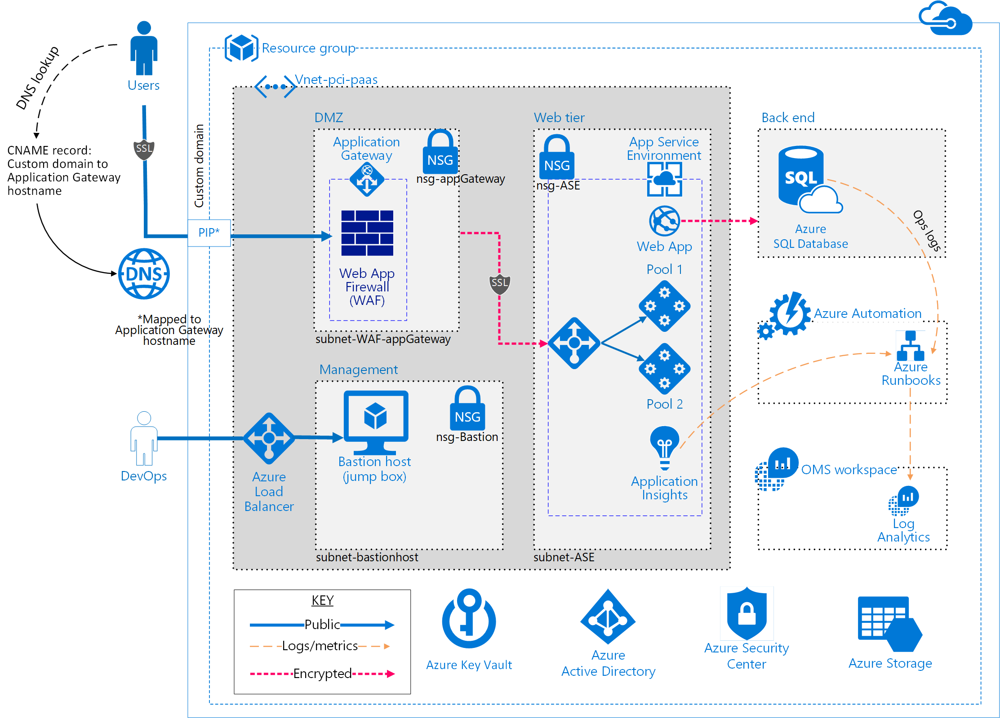

# Azure Solutions Blueprint for PCI DSS-Compliant Environments

## Overview

The Azure Solutions Blueprint for PCI DSS-Compliant Environments provides guidance for the deployment of a PCI DSS-compliant Platform-as-a-Service (PaaS) environment suitable for handling sensitive payment card data. It showcases a common reference architecture and is designed to simplify adoption of Microsoft Azure. This foundational architecture illustrates an end-to-end solution to meet the needs of organizations seeking a cloud-based approach to reducing the burden and cost of deployment.

This foundational architecture meets the requirements of stringent Payment Card Industry Data Security Standards (PCI DSS 3.2) for the collection, storage, and retrieval of payment card data. It demonstrates the proper handling of credit card data (including card number, expiration, and verification data) in a secure, compliant multi-tier environment deployed as an end-to-end Azure-based solution. For more information about PCI DSS 3.2 requirements and this solution, see [PCI DSS Requirements - High-Level Overview](./pci-requirements.md).

This architecture is intended to serve as a foundation for customers to adjust to their specific requirements, and should not be used as-is in a production environment. Deploying an application into this environment without modification is not sufficient to completely meet the requirements of a PCI DSS-compliant solution. Please note the following:
- This foundational architecture provides a baseline to help customers use Microsoft Azure in a PCI DSS-compliant manner.
- Achieving PCI DSS-compliance requires that an accredited Qualified Security Assessor (QSA) certify a production customer solution.
- Customers are responsible for conducting appropriate security and compliance reviews of any solution built using this foundational architecture, as requirements may vary based on the specifics of each customer’s implementation and geography.  

For a quick overview of how this solution works, watch this [brief video](https://aka.ms/pciblueprintvideo) explaining and demonstrating its deployment.

## Solution components

The foundational architecture is comprised of the following components:

- **Architectural diagram**. The diagram shows the reference architecture used for the Contoso Webstore solution.
- **Deployment templates**. In this deployment, [Azure Resource Manager templates](https://docs.microsoft.com/en-us/azure/azure-resource-manager/resource-group-overview#template-deployment) are used to automatically deploy the components of the architecture into Microsoft Azure by specifying configuration parameters during setup.
- **Automated deployment scripts**. These scripts help deploy the end-to-end solution. The scripts consist of:
    - A module installation and [global administrator](https://docs.microsoft.com/en-us/azure/active-directory/active-directory-assign-admin-roles-azure-portal) setup script is used to install and verify that required PowerShell modules and global administrator roles are configured correctly.
    - An installation PowerShell script is used to deploy the end-to-end solution, provided via a .zip file and a .bacpac file that contain a pre-built demo web application with SQL database sample content. The source code for this solution is available for review [here](https://github.com/Microsoft/azure-sql-security-sample).

## Architectural diagram



## User scenario

The foundational architecture addresses the use case below.

> This scenario illustrates how a fictitious webstore moved their payment card processing to an Azure-based solution. The solution handles collection of basic user information including payment data. The solution does not process payments with this cardholder data; once the data is collected, customers are responsible for initiating and completing transactions with a payment processor. For more information, see the "Review and Guidance for Implementation" document at the [Microsoft Service Trust Portal](http://aka.ms/stp).

### Use case
A small webstore called *Contoso Webstore* is ready to move their payment system to the cloud. They have selected Microsoft Azure to host the process for purchasing and to allow a clerk to collect credit card payments from their customers.

The administrator is looking for a solution that can be quickly deployed to achieve his goals in for a cloud-born solution. He will use this proof-of-concept (POC) to discuss with his stakeholders how Azure can be used to collect, store, and retrieve payment card data while complying with stringent Payment Card Industry Data Security Standard (PCI DSS) requirements.

> You will be responsible for conducting appropriate security and compliance reviews of any solution built with the architecture used by this POC, as requirements may vary based on the specifics of your implementation and geography. PCI DSS requires that you work directly with an accredited Qualified Security Assessor to certify your production-ready solution.

### Elements of the foundational architecture

The foundational architecture is designed with the following fictitious elements:

Domain site `contosowebstore.com`

User roles used to illustrate the use case, and provide insight into the user interface.

#### Role: Site and subscription admin

|Item      |Example|
|----------|------|
|Username: |`adminXX@contosowebstore.com`|
| Name: |`Global Admin Azure PCI Samples`|
|User type:| `Subscription Administrator and Azure Active Directory Global Administrator`|

* The admin account cannot read credit card information unmasked. All actions are logged.
* The admin account cannot manage or log into SQL Database.
* The admin account can manage Active Directory and subscription.

#### Role: SQL administrator

|Item      |Example|
|----------|------|
|Username: |`sqlAdmin@contosowebstore.com`|
| Name: |`SQLADAdministrator PCI Samples`|
| First name: |`SQL AD Administrator`|
|Last name: |`PCI Samples`|
|User type:| `Administrator`|

* The sqladmin account cannot view unfiltered credit card information. All actions are logged.
* The sqladmin account can manage SQL database.

#### Role: Clerk

|Item      |Example|
|----------|------|
|Username:| `receptionist_EdnaB@contosowebstore.com`|
| Name: |`Edna Benson`|
| First name:| `Edna`|
|Last name:| `Benson`|
| User type: |`Member`|

Edna Benson is the receptionist and business manager. She is responsible for ensuring that customer information is accurate and billing is completed. Edna is the user logged in for all interactions with the Contoso Webstore demo website. Edna has the following rights: 

- Edna can create and read customer information
- Edna can modify customer information.
- Edna can overwrite or replace credit card number, expiration, and CVV information.

> In the Contoso Webstore, the user is automatically as the **Edna** user for testing the capabilities of the deployed environment.

### Contoso Webstore - Estimated pricing

This foundation architecture and example web application have a monthly fee structure and a usage cost per hour which must be considered when sizing the solution. These costs can be estimated using the [Azure costing calculator](https://azure.microsoft.com/en-us/pricing/calculator/). As of September 2017, the estimated monthly cost for this solution is $XXX. These costs will vary based on the usage amount and are subject to change. It is incumbent on the customer to calculate their estimated monthly costs at the time of deployment for a more accurate estimate. 

This solution used the following Azure services. Details of the deployment architecture are located in the [Deployment Architecture](#deployment-architecture) section.

>- Application Gateway
>- Azure Active Directory
>- App Service Environment
>- OMS Log Analytics
>- Azure Key Vault
>- Network Security Groups
>- Azure SQL DB
>- Azure Load Balancer
>- Application Insights
>- Azure Security Center
>- Azure Web App
>- Azure Automation
>- Azure Automation Runbooks
>- Azure DNS
>- Azure Virtual Network
>- Azure Virtual Machine
>- Azure Resource Group and Policies
>- Azure Blob Storage
>- Azure Active Directory role-based access control (RBAC)

## Deployment architecture

The following section details the development and implementation elements.

### Network segmentation and security


#### Application Gateway

The foundational architecture reduces the risk of security vulnerabilities using an Application Gateway with web application firewall (WAF), and the OWASP ruleset enabled. Additional capabilities include:

- [End-to-End-SSL] (https://docs.microsoft.com/en-us/azure/application-gateway/application-gateway-end-to-end-ssl-powershell)
- Enable [SSL Offload](https://docs.microsoft.com/en-us/azure/application-gateway/application-gateway-ssl-portal)
- Disable [TLS v1.0 and v1.1](https://docs.microsoft.com/en-us/azure/application-gateway/application-gateway-end-to-end-ssl-powershell)
- [Web application firewall](https://docs.microsoft.com/en-us/azure/application-gateway/application-gateway-webapplicationfirewall-overview)(WAF mode)
- [Prevention mode](https://docs.microsoft.com/en-us/azure/application-gateway/application-gateway-web-application-firewall-portal) with OWASP 3.0 ruleset
- Enable [diagnostics logging](https://docs.microsoft.com/en-us/azure/application-gateway/application-gateway-diagnostics)
- [Custom health probes](https://docs.microsoft.com/en-us/azure/application-gateway/application-gateway-create-gateway-portal)
- [Azure Security Center](https://azure.microsoft.com/en-us/services/security-center) and [Azure Advisor](https://docs.microsoft.com/en-us/azure/advisor/advisor-security-recommendations) provide additional protection and notifications. Azure Security Center also provides a reputation system.

#### Virtual network

The foundational architecture defines a private virtual network with an address space of 10.0.0.0/16.

#### Network security groups

Each of the network tiers has a dedicated network security group (NSG):
- A DMZ network security group for firewall and Application Gateway WAF
- An NSG for management jumpbox/bastion host 
- An NSG for the app service environment

Each of the NSGs have specific ports and protocols opened for the secure and correct operation of the solution. For more information, see [PCI Guidance - Network Security Groups](#network-security-groups).

Each of the NSGs have specific ports and protocols opened for the secure and
correct working of the solution. In addition, the following configurations are enabled for each NSG:
- Enabled [diagnostic logs and events](https://docs.microsoft.com/en-us/azure/virtual-network/virtual-network-nsg-manage-log) are stored in storage account 
- Connected OMS Log Analytics to the [NSG's diagnostics](https://github.com/krnese/AzureDeploy/blob/master/AzureMgmt/AzureMonitor/nsgWithDiagnostics.json)

#### Subnets
 Ensure each subnet is associated with its corresponding NSG.

#### Custom domain SSL certificates
 HTTPS traffic is enabled using a custom domain SSL certificate.

### Data at rest
To meet encrypted data-at-rest requirements, all [Azure Storage](https://azure.microsoft.com/en-us/services/storage/) uses the following:

#### Azure Storage
- [Storage Service Encryption](https://docs.microsoft.com/en-us/azure/storage/storage-service-encryption)

#### Azure SQL Database

A PaaS SQL Database instance is used to showcase database security measures:
- Enable [AD Authentication and Authorization](https://docs.microsoft.com/en-us/azure/sql-database/sql-database-aad-authentication)
- Enable [auditing](https://docs.microsoft.com/en-us/azure/sql-database/sql-database-auditing-get-started)
- Enable [Transparent Data Encryption](https://docs.microsoft.com/en-us/sql/relational-databases/security/encryption/transparent-data-encryption-with-azure-sql-database)
- Enable [SQL DB Firewall rules](https://docs.microsoft.com/en-us/azure/sql-database/sql-database-firewall-configureallowing) (allowing for ASE worker pools and client IP management)
- Enable [Threat Detection](https://docs.microsoft.com/en-us/azure/sql-database/sql-database-threat-detection-get-started)
- Enable [Always Encrypted columns](https://docs.microsoft.com/en-us/azure/sql-database/sql-database-always-encrypted-azure-key-vault)
- Enable [Dynamic Data Masking](https://docs.microsoft.com/en-us/azure/sql-database/sql-database-dynamic-data-masking-get-started) (using the post-deployment PowerShell script)

### Logging and auditing

[Operations Management Suite (OMS)](https://docs.microsoft.com/en-us/azure/operations-management-suite/) provides the Contoso Webstore with extensive logging of all system and user activity, include cardholder data logging. Changes can be reviewed and verified for accuracy. 

- **Activity Logs:**  [Activity logs](https://docs.microsoft.com/en-us/azure/monitoring-and-diagnostics/monitoring-overview-activity-logs) provide insight into the operations that were performed on resources in your subscription.
- **Diagnostic Logs:**  [Diagnostic logs](https://docs.microsoft.com/en-us/azure/monitoring-and-diagnostics/monitoring-overview-of-diagnostic-logs) are all logs emitted by every resource. These logs include Windows event system logs, Azure Blob storage, tables, and queue logs.
- **Firewall Logs:**  The Application Gateway provides full diagnostic and access logs. Firewall logs are available for Application Gateway resources that have WAF enabled.
- **Log Archiving:**  All diagnostic logs are configured to write to a centralized and encrypted Azure storage account for archival with a defined retention period (2 days). Logs are then connected to Azure Log Analytics for processing, storing, and dashboarding. [Log Analytics](https://azure.microsoft.com/en-us/services/log-analytics) is an OMS service that helps collect and analyze data generated by resources in your cloud and on-premises environments.

### Encryption and secrets management

The Contoso Webstore encrypts all credit card data, and uses Azure Key Vault to manage keys, preventing retrieval of CHD.

- [Azure Key Vault](https://azure.microsoft.com/en-us/services/key-vault/) helps safeguard cryptographic keys and secrets used by cloud applications and services. 
- [SQL TDE](https://docs.microsoft.com/en-us/sql/relational-databases/security/encryption/transparent-data-encryption-tde) is used to encrypt all customer cardholder data, expiry date, and CVV.
- Data is stored on disk using [Azure Disk Encryption](https://docs.microsoft.com/en-us/azure/security/azure-security-disk-encryption) and BitLocker.

### Identity management

The following technologies provide identity management capabilities in the Azure environment.
- [Azure Active Directory (Azure AD)](https://azure.microsoft.com/en-us/services/active-directory/) is the Microsoft's multi-tenant cloud-based directory and identity management service. All users for the solution were created in Azure Active Directory, including users accessing the SQL Database.
- Authentication to the app is performed via the [Azure AD application](https://docs.microsoft.com/en-us/azure/active-directory/develop/active-directory-integrating-applications) and associated service principals. Additionally, the SQL DB Column Encryption is conducted using the AD app. Refer to this sample from the Azure SQL DB team for more details.
    - https://docs.microsoft.com/en-us/azure/active-directory/develop/active-directory-integrating-applications
    - https://docs.microsoft.com/en-us/azure/sql-database/sql-database-always-encrypted-azure-key-vault
    - https://github.com/Microsoft/azure-sql-security-sample
    - [Azure Active Directory Identity Protection](https://docs.microsoft.com/en-us/azure/active-directory/active-directory-identityprotection) detects potential vulnerabilities affecting your organization’s identities, configures automated responses to detected suspicious actions related to your organization’s identities, and investigates suspicious incidents and takes appropriate action to resolve them.
    - [Azure Role-based Access Control (RBAC)](https://docs.microsoft.com/en-us/azure/active-directory/role-based-access-control-configure) enables precisely focused access management for Azure. Specific configurations exist for:
        - Subscription access is limited to the subscription administrator.
        - Azure Key Vault access is restricted to all users.
    
### Web and compute resources

#### Web Apps

The [Web Apps](https://azure.microsoft.com/en-us/services/app-service/web/) feature in Azure App Service lets developers rapidly build, deploy, and manage powerful websites and web apps. Build standards-based web apps and APIs using .NET, Node.js, PHP, Python, and Java. Deliver both web and mobile apps for employees or customers using a single back end. Securely deliver APIs that enable additional apps and devices.

#### Azure App Service

With [App
Service](https://azure.microsoft.com/en-us/services/app-service/?b=16.52), develop powerful applications for any platform or device, faster than ever before. Meet rigorous performance, scalability, security, and compliance requirements using a single back end. [Additional reading about deploying ASE.](http://sabbour.me/how-to-run-an-app-service-behind-a-waf-enabled-application-gateway/)

#### Virtual Machine

As the App Service Environment is secured and locked down, there needs to be a mechanism to allow for any DevOps releases or changes that might be necessary, such as the ability to monitor the web app using Kudu. Virtual machine is secured behind NAT Load Balancer which allows you to connect VM on a port other than TCP 3389. 

A virtual machine was stood up as a Jumpbox / Bastion host with the following configurations:

-   [Antimalware extension](https://docs.microsoft.com/en-us/azure/security/azure-security-antimalware)
-   [OMS Monitoring extension](https://docs.microsoft.com/en-us/azure/virtual-machines/virtual-machines-windows-extensions-oms)
-   [VM Diagnostics extension](https://docs.microsoft.com/en-us/azure/virtual-machines/virtual-machines-windows-extensions-diagnostics-template)
-   [BitLocker Encrypted Disk](https://docs.microsoft.com/en-us/azure/security/azure-security-disk-encryption) using Azure Key Vault (respects Azure Government, PCI DSS, HIPAA and other requirements).
-   An [AutoShutDown Policy](https://azure.microsoft.com/en-us/blog/announcing-auto-shutdown-for-vms-using-azure-resource-manager/) to reduce consumption of virtual machine resources when not in use.

#### App Service Environment

[Azure App Service Environment (ASE)](https://docs.microsoft.com/en-us/azure/app-service/app-service-environment/intro) is an Azure App Service feature that provides a fully isolated and dedicated environment for securely running App Service apps at high scale. it is a Premium service plan used by this foundational architecture to enable PCI DSS compliance.

ASEs are isolated to running only a single customer's applications, and are always deployed into a virtual network. Customers have fine-grained control over both inbound and outbound application network traffic, and applications can establish high-speed secure connections over virtual networks to on-premises corporate resources.

Use of ASEs for this architecture allowed for the following controls/configurations:
- Host inside a secured Virtual Network and Network security rules
- ASE configured with Self-signed ILB certificate for HTTPS communication
- [Internal Load Balancing mode](https://docs.microsoft.com/en-us/azure/app-service-web/app-service-environment-with-internal-load-balancer) (mode 3)
- Disable [TLS 1.0](https://docs.microsoft.com/en-us/azure/app-service-web/app-service-app-service-environment-custom-settings) - a TLS protocol which is deprecated from a PCI DSS standpoint
- Change [TLS Cipher](https://docs.microsoft.com/en-us/azure/app-service-web/app-service-app-service-environment-custom-settings)
- Control [inbound traffic N/W ports](https://docs.microsoft.com/en-us/azure/app-service-web/app-service-app-service-environment-control-inbound-traffic) 
- [WAF – Restrict Data](https://docs.microsoft.com/en-us/azure/app-service-web/app-service-app-service-environment-web-application-firewall)
- Allow [SQL Database traffic](https://docs.microsoft.com/en-us/azure/app-service-web/app-service-app-service-environment-network-architecture-overview)

### Security and malware protection

[Azure Security Center](https://azure.microsoft.com/en-us/services/security-center/) provides a centralized view of the security state of all your Azure resources. At a glance, you can verify that the appropriate security controls are in place and configured correctly, and you can quickly identify any resources that require attention.  

[Azure Advisor](https://docs.microsoft.com/en-us/azure/advisor/advisor-overview) is a personalized cloud consultant that helps you follow best practices to optimize your Azure deployments. It analyzes your resource configuration and usage telemetry and then recommends solutions that can help you improve the cost effectiveness, performance, high availability, and security of your Azure resources.

[Microsoft Antimalware](https://docs.microsoft.com/en-us/azure/security/azure-security-antimalware) 
for Azure Cloud Services and Virtual Machines is real-time protection capability that helps identify and remove viruses, spyware, and other malicious software, with configurable alerts when known malicious or unwanted software attempts to install itself or run on your Azure systems.

### Operations management

#### Application Insights

Use [Application Insights](https://azure.microsoft.com/en-us/services/application-insights/) to gain actionable insights through application performance management and instant analytics.

#### Log analytics

[Log Analytics](https://azure.microsoft.com/en-us/services/log-analytics/) is a service in Operations Management Suite (OMS) that helps you collect and analyze data generated by resources in your cloud and on-premises environments.

#### OMS solutions

The following OMS solutions are pre-installed as part of the foundational architecture:
- [Activity Log Analytics](https://docs.microsoft.com/en-us/azure/monitoring-and-diagnostics/monitoring-overview-activity-logs)
- [Azure Networking Analytics](https://docs.microsoft.com/en-us/azure/log-analytics/log-analytics-azure-networking-analytics?toc=%2fazure%2foperations-management-suite%2ftoc.json)
- [Azure SQL Analytics](https://docs.microsoft.com/en-us/azure/log-analytics/log-analytics-azure-sql)
- [Change Tracking](https://docs.microsoft.com/en-us/azure/log-analytics/log-analytics-change-tracking?toc=%2fazure%2foperations-management-suite%2ftoc.json)
- [Key Vault Analytics](https://docs.microsoft.com/en-us/azure/log-analytics/log-analytics-azure-key-vault?toc=%2fazure%2foperations-management-suite%2ftoc.json)
- [Service Map](https://docs.microsoft.com/en-us/azure/operations-management-suite/operations-management-suite-service-map)
- [Security and Audit](https://www.microsoft.com/en-us/cloud-platform/security-and-compliance)
- [Antimalware](https://docs.microsoft.com/en-us/azure/log-analytics/log-analytics-malware?toc=%2fazure%2foperations-management-suite%2ftoc.json)
- [Update Management](https://docs.microsoft.com/en-us/azure/operations-management-suite/oms-solution-update-management)

### Security Center integration

Default deployment is intended to provide a baseline of security center recommendations, indicating a healthy and secure configuration state. You can enable data collection from the Azure Security Center. For more information, see [Azure Security Center - Getting Started](https://docs.microsoft.com/en-us/azure/security-center/security-center-get-started).

## Deploying the solution

The components for deploying this solution are available in the [PCI Blueprint code repository][code-repo]. The deployment of the foundational architecture requires several steps executed via Microsoft PowerShell v5. To connect to the website, you must provide a custom domain name (such as contoso.com). This is specified using the `-customHostName` switch in step 2. For more information, see [Buy a custom domain name for Azure Web Apps](https://docs.microsoft.com/en-us/azure/app-service-web/custom-dns-web-site-buydomains-web-app). A custom domain name is not required to successfully deploy and run the solution, but you will be unable to connect to the website for demonstration purposes.

If you encounter any issues during the deployment, see [FAQ and troubleshooting](https://github.com/Azure/pci-paas-webapp-ase-sqldb-appgateway-keyvault-oms/blob/master/pci-faq.md]

It is highly recommended that a clean installation of PowerShell be used to deploy the solution. Alternatively, verify that you are using the latest modules required for proper execution of the installation scripts. In this example, we log into a Windows 10 virtual machine and execute the following commands (note that this enables the custom domain command):

1. Install required modules and set up the administrator roles correctly.
```powershell
 .\0-Setup-AdministrativeAccountAndPermission.ps1 
    -azureADDomainName contosowebstore.com
    -tenantId XXXXXXXX-XXXX-XXXX-XXXX-XXXXXXXXXXXX
    -subscriptionId XXXXXXXX-XXXX-XXXX-XXXX-XXXXXXXXXXXX
    -configureGlobalAdmin 
    -installModules
```
For detailed usage instructions, see [Script Instructions - Setup Administrative Account and Permission](https://github.com/Azure/pci-paas-webapp-ase-sqldb-appgateway-keyvault-oms/blob/master/0-Setup-AdministrativeAccountAndPermission.md).

2. Install the solution-update-management 
 ```powershell
.\1-DeployAndConfigureAzureResources.ps1 
    -resourceGroupName contosowebstore
    -globalAdminUserName adminXX@contosowebstore.com 
    -globalAdminPassword **************
    -azureADDomainName contosowebstore.com 
    -subscriptionID XXXXXXXX-XXXX-XXXX-XXXX-XXXXXXXXXXXX 
    -suffix PCIcontosowebstore
    -customHostName contosowebstore.com
    -sqlTDAlertEmailAddress edna@contosowebstore.com 
    -enableSSL
    -enableADDomainPasswordPolicy 
```

For detailed usage instructions, see [Script Instructions - Deploy and Configure Azure Resources](https://github.com/Azure/pci-paas-webapp-ase-sqldb-appgateway-keyvault-oms/blob/master/1-DeployAndConfigureAzureResources.md).

3. Deploy OMS logging and resources
 ```powershell
.\2-EnableOMSLoggingOnResources.ps1 
    -resourceGroupName contosowebstore 
    -globalAdminUserName adminXX@contosowebstore.com 
    -globalAdminPassword **************
    -subscriptionID XXXXXXXX-XXXX-XXXX-XXXX-XXXXXXXXXXXX
```

For detailed usage instructions, see [Script Instructions - Payment Sample Dataset](https://github.com/Azure/pci-paas-webapp-ase-sqldb-appgateway-keyvault-oms/blob/master/pci-sample-dataset.md). 


## Threat model

A data flow diagram (DFD) and sample threat model for the Contoso Webstore are available in the Documents section of the [code repository][code-repo].


For more information, see the [PCI Blueprint Threat Model](https://aka.ms/pciblueprintthreatmodel).

## Customer responsibility matrix

Customers are responsible for retaining a copy of the [Responsibility Summary Matrix](https://aka.ms/pciblueprintcrm32), which outlines the PCI DSS requirements that are the responsibility of the customer and those which are the responsibility of Microsoft Azure.

## Disclaimer and acknowledgements

*September 2017*

- This document is for informational purposes only. MICROSOFT AND AVYAN MAKE NO WARRANTIES, EXPRESS, IMPLIED, OR STATUTORY, AS TO THE INFORMATION IN THIS DOCUMENT. This document is provided “as-is.” Information and views expressed in this document, including URL and other Internet website references, may change without notice. Customers reading this document bear the risk of using it.  
- This document does not provide customers with any legal rights to any intellectual property in any Microsoft or Avyan product or solutions.  
- Customers may copy and use this document for internal reference purposes.  
- NOTE: Certain recommendations in this paper may result in increased data, network, or compute resource usage in Azure, and may increase a customer’s Azure license or subscription costs.  
- The solution in this document is intended as a foundational architecture and must not be used as-is for production purposes. Achieving PCI compliance requires that customers consult with their Qualified Security Assessor.  
- All customer names, transaction records, and any related data on this page are fictitious, created for the purpose of this foundational architecture and provided for illustration only. No real association or connection is intended, and none should be inferred.  
- This solution was developed jointly by Microsoft and Avyan Consulting, and is available under the [MIT License](https://opensource.org/licenses/MIT).
- This solution has been reviewed by Coalfire, Microsoft’s PCI-DSS auditor. The [PCI Compliance Review](https://aka.ms/pciblueprintprocessingoverview) provides an independent, third-party review of the solution, and components that need to be addressed. 

### Document authors

* *Frank Simorjay (Microsoft)*  
* *Gururaj Pandurangi (Avyan Consulting)*


[code-repo]: https://github.com/Azure/pci-paas-webapp-ase-sqldb-appgateway-keyvault-oms "Code Repository"
