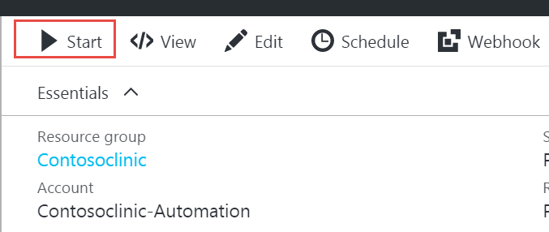
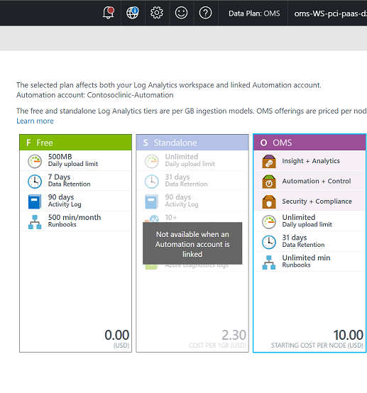
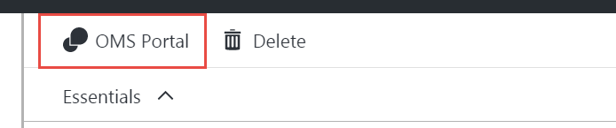
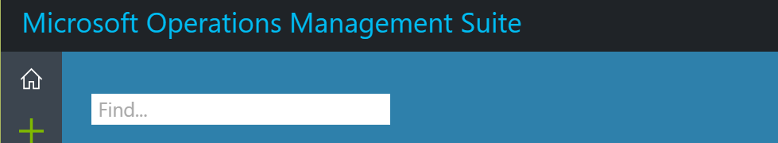
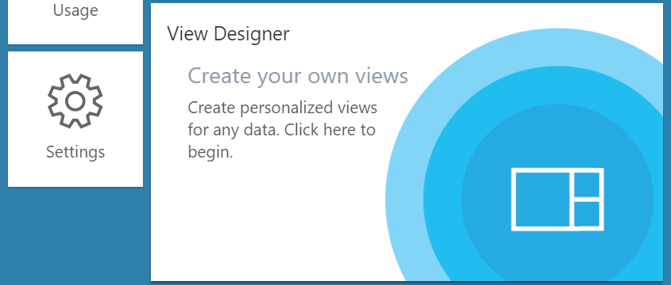
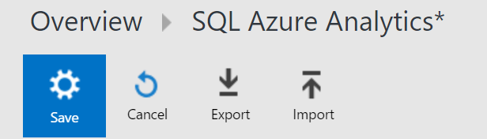
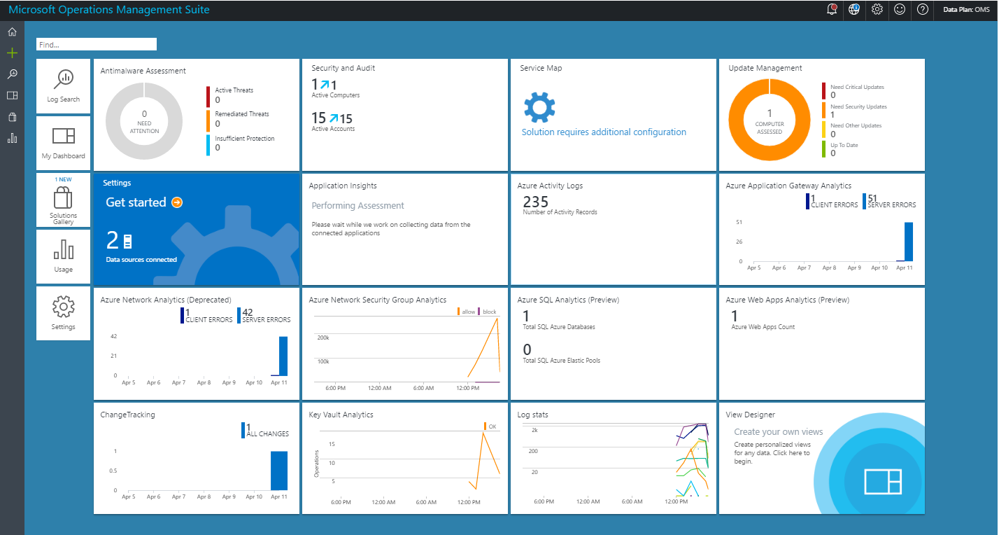

# Automated Foundational Architecture for PCI DSS-Compliant Environments
## Data set deployment

This document provides details for managing the user-level experience of the deployed solution. This portion of the deployment helps illustrate how the database, users, and data records help meet the PCI DSS compliance requirements. The steps in this section illustrate how record protection requirements are enabled by encrypting customer records that contain payment card data, establishing monitoring to collect logs, and maintaining security.

## One-Step Deployment
As outlined in the [overview](./index.md) you can deploy SQL encryption and monitoring with the following steps.

1. Deploy OMS logging and resources
```powershell
    .\2-EnableOMSLoggingOnResources.ps1 
    -resourceGroupName contosowebstore 
    -globalAdminUserName adminXX@contosowebstore.onmicrosoft.com 
    -globalAdminPassword **************
    -subscriptionID XXXXXXXX-XXXX-XXXX-XXXX-XXXXXXXXXXXX
```

For detailed usage instructions, [EDIT URL -> ] review the `2-EnableOMSLoggingOnResources.ps1`)` script in the [code repository][code-repo].
  
## Testing Transparent Data Encryption (TDE)

At this point, the foundational architecture is fully deployed. Two administrative user accounts can now be added using SQL Management Studio.

Open SQL Server Management Studio using the Active Directory username and password. In our example, this is the `sqladmin@contosowebstore.onmicrosoft.com` account.

The following connection information should be used to connect to your SQL
Server Management Studio:
- Server Type:` Database Engine`
- Server name: Your server string. In this example, use `contosowebstore.onmicrosoft.com`.
- Authentication: **Use Active Directory Password Authentication**
- Username: Use the AD SQL user account you set up in pre-deployment. In this example, use: `sqladmin@contosowebstore.onmicrosoft.com`.
- Password: The password for your AD SQL user account. In this example, use: `your PASSWORD`

- Create a new query and run the following command to see the customer records secured:
```SQL
    SELECT * FROM [dbo].[customers]
```

You will need to edit the `3-GrantAccessOnDB.sql` script located in the [code repository][code-repo].

-   Replace `XXXX` with your AD domain name. For our example, use: `contosowebstore.onmicrosoft.com`.

You can copy the script from the deployment file and run it in a new SQL query.

## Enabling Logging and Monitoring (Manually)

The following sections address security controls that are required to enable
extensive logging, monitoring, security detection, and anti-malware protection. The following was done using the '2-EnableOMSLoggingOnResources.ps1' script.

### Operations Management Suite (OMS) configuration

During the deployment step, OMS scripts were created and installed. In this configuration step, the OMS instance is configured.

>**NOTE**: Pricing the default **free tier** will not be sufficient for this solution to operate correctly; you will be required to change to the **OMS tier**.

### Start the collection for OMS

1. Sign in to the Azure Portal with an account that is a member of the Subscription Admins role and co-administrator of the subscription.

2. Click **Automation Accounts**.

3. In the Automation Accounts blade, select your automation. For example: `contosowebstore-Automation`

4.  In Process Automation, click **Runbooks**. For example: `contosowebstore-Automation – Runbooks`

5.  Select the **scheduleIngestion** runbook that was installed by the post-installation script.

6.  Click **Start** to launch the OMS data intake runbook.

7.  Click **Yes**

    

8.  Return to your runbook blade

9.  Select the **sqlAzureIngestion** runbook that was installed by the post-installation script.

10.  Click **Start** to launch the OMS data intake runbook.

11.  Click **Yes**.

12.  Return to your runbook blade.

13.  Select the **webAzureIngestion** runbook that was installed by the post-installation script.

14.  Click **Start** to launch the OMS data intake runbook.

15.  Click **Yes**.

#### Upgrade your OMS instance

1.  Sign into the Azure Portal with an account that is a member of the Subscription Admins role and co-administrator of the subscription.

2.  Click **Log Analytics**.

3.  Click **Pricing Tier**.

4.  Select the **Per Node (OMS)** plan to continue with this solution.
    
    

5.  Click **OK**.


#### Install OMS Dashboards view

Installing the OMS Dashboard view requires deployment of the scripts located in the `omsDashboards` folder of the [code repository][code-repo].

>**NOTE:** OMS Dashboard will not install correctly until information has been collected for a period of time. If you receive an error when running the dashboard import, it is due to the lack of collected data. It is recommended that you wait at least 10 minutes to ensure data is available in OMS.

1.  Open **Log Analytics**.

2.  Select your OMS Log Analytics in your list of items. In this example: `oms-WS-pci-paas-dzwhejjrwbwdy`.

3.  Click **Log Analytics**.

4.  Click **OMS Portal**.

    

5.  The Microsoft Operations Management Suite will open in a new browser window or tab.

    

6.  Click **View Designer** on your Microsoft Operations Management Suite home page.

    

7.  In the designer, select **Import**.

8.  For the SQL monitoring solution, import the file with OMSSQL in the file name. In this example:
    `\\omsDashboards\\OMSSQLDBAzureMonitoringSolution.omsview`

9.  Select **Save**.

    

10. Repeat steps 8 through 11 for the web application monitoring solution, importing the file with OMSWebApp in the file name. In this example: 
    `\\omsDashboards\\OMSWebAppAzureMonitoringSolution.omsview`

At this point, the monitoring configuration of your SQL Server, database, and web apps is complete. You can now review your data collection in OMS.



### Upgrade Azure Security Center to review Security Advisor messages

Azure Security Center was enabled in the deployment of your subscription. However, to ensure that the anti-malware and threat detection capabilities are enabled, you will need to enable the solution with a standard-tier data plan.

1.  Sign in to the Azure Portal with an account that is a member of the Subscription Admins role and co-administrator of the subscription.

2.  Click **Security Center**.

3.  Click the banner that reads, “Your security experience may be limited. Click here to learn more.”

4.  Select your subscription.

5.  Click **Pricing tier**.

6.  Select the **Standard tier – Free Trial**.

7.  Click **Select**.

Default deployment is intended to provide a baseline of security center recommendations, indicating a healthy and secure configuration state. You can enable data collection from the Azure Security Center. For more information, see [Azure Security Center - Getting Started](https://docs.microsoft.com/en-us/azure/security-center/security-center-get-started).

[Azure Advisor](https://docs.microsoft.com/en-us/azure/advisor/advisor-overview) is a personalized cloud consultant that helps you follow best practices to optimize your Azure deployments. It analyzes your resource configuration and usage telemetry and then recommends solutions that can help you improve the cost effectiveness, performance, high availability, and security of your Azure resources.

 1. Select **Browse**, and then scroll to **Azure Advisor**. 
 2. The Advisor dashboard displays personalized recommendations for the Contoso Webstore subscription.
 
> NOTE: Currently, the OMS Monitoring agent is automatically installed along with the bastion host deployment. To prevent OMS conflicts, the Security Center VM agent is not deployed with this solution.

### To Enable Kudu Access

The Web App service is contained within a virtual network (VNet) that is not accessible publicly. Deploying new service capabilities such as a Kudu console requires a Virtual Machine within the same Virtual Network that has access to the Web App internal IP. 

You will also need to establish DNS resolution of the domains specific to the Web App. This can be done by creating a DNS A-record that resolves to the App Service Environment's Internal Load Balancer IP address, and you will need to include CNames for the following:
> *, *.scm, ftp, publish 

If you are deploying this solution in an isolated environment which does not have access to  a DNS server, you can create a virtual machine that is hosted in the VNet and update its host file mapping to include the App Service Environment's Internal Load Balancer **IP address**. For example: 
    ` 10.10.0.73	www.contosowebstore.com	www.scm.contosowebstore.com`	

Verify your connection for Kudu by browsing to your domain name. In our example, browse to: `http://www.contosowebstore.com`. Note that this verification will be limited until the post-deployment process is completed.


[code-repo]: https://github.com/Azure/pci-paas-webapp-ase-sqldb-appgateway-keyvault-oms "Code Repository"
