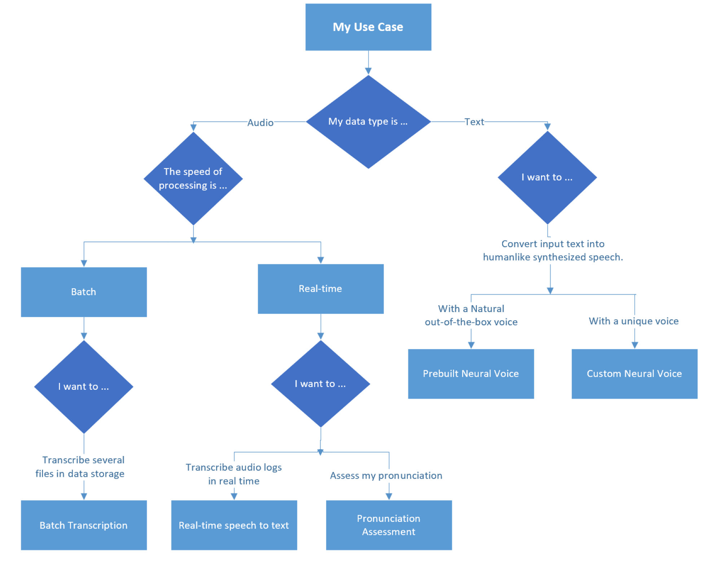

# Azure AI Speech service capabilities guide 

[Azure AI services](/azure/ai-services/what-are-ai-services) help developers and organizations rapidly create intelligent, cutting-edge, market-ready, and responsible applications with out-of-the-box and prebuilt and customizable APIs and models. 

This article covers [Azure AI Speech service](https://azure.microsoft.com/products/ai-services/ai-speech), which provides speech to text and text to speech capabilities. You can transcribe speech to text with high accuracy, produce natural-sounding text to speech voices, translate spoken audio, and use speaker recognition during conversations.

> [!NOTE]
> Use [Azure AI Service for Language](/azure/ai-services/language-service/overview) if you want to gather insights on terms or phrases or get detailed contextual analysis of spoken or written language.

## Capabilities

The following table provides a list of capabilities available in Azure AI Speech service.

- [Speech-to-text](/azure/ai-services/speech-service/index-speech-to-text) can convert audio streams to text in real time or in batch.
- [Text-to-speech](/azure/ai-services/speech-service/text-to-speech) enables applications to convert text to human-like speech.
- [Speech translation](/azure/ai-services/speech-service/speech-translation) provides multi-language speech-to-speech and speech-to-text translation of audio streams.

## How to choose a speech service

This flow chart can help you choose a speech capability that suits your needs:

The left side of the diagram illustrates audio-to-audio or audio-to-text processes.

- Speech-to-text is used to convert speech from an audio source to a text format.
- Speech-to-speech is used to translate speech in one language to speech in another language.

The right side of the diagram illustrates text-to-audio processes.

- Text-to-speech is used to generate spoken audio from a text source.

## Use cases

The following table provides a list of possible use cases for Azure AI Speech service.

| Use case | Service to use | Description |
|----------|-----------------|---------------|
| [Captioning](/azure/ai-services/speech-service/captioning-concepts)| Speech-to-text |  Learn how to synchronize captions with your input audio, apply profanity filters, get partial results, apply customizations, and identify spoken languages for multilingual scenarios.|
| [Audio Content Creation](/azure/ai-services/speech-service/text-to-speech#more-about-neural-text-to-speech-features) | Speech-to-text |  You can use neural voices to make interactions with chatbots and voice assistants more natural and engaging, convert digital texts such as e-books into audiobooks and enhance in-car navigation systems. |
| [Call Center](/azure/ai-services/speech-service/call-center-overview) | Speech-to-text |  Transcribe calls in real-time or process a batch of calls, redact personally identifying information, and extract insights such as sentiment to help with your call center use case.|
| [Language learning](/azure/ai-services/speech-service/language-learning-overview)| Speech-to-text| Provide pronunciation assessment feedback to language learners, support real-time transcription for remote learning conversations, and read aloud teaching materials with neural voices.
| [Voice assistants](/azure/ai-services/speech-service/voice-assistants)| Text-to-speech | Create natural, human like conversational interfaces for their applications and experiences. The voice assistant feature provides fast, reliable interaction between a device and an assistant implementation.|

## Contributors

*This article is maintained by Microsoft. It was originally written by the following contributors.*

Principal authors:

- [Kruti Mehta](https://www.linkedin.com/in/thekrutimehta) | Azure Senior Fast-Track Engineer
- [Oscar Shimabukuro](https://www.linkedin.com/in/oscarshk/) | Senior Cloud Solution Architect

Other contributors:

- [Mick Alberts](https://www.linkedin.com/in/mick-alberts-a24a1414/) | Technical Writer
- [Ashish Chahuan](https://www.linkedin.com/in/a69171115/) | Senior Cloud Solution Architect
- [Brandon Cowen](https://www.linkedin.com/in/brandon-cowen-1658211b/) | Senior Cloud Solution Architect
- [Manjit Singh](https://www.linkedin.com/in/manjit-singh-0b922332) | Software Engineer
- [Christina Skarpathiotaki](https://www.linkedin.com/in/christinaskarpathiotaki/) | Senior Cloud Solution Architect
- [Nathan Widdup](https://www.linkedin.com/in/nwiddup) | Azure Senior Fast-Track Engineer

*To see nonpublic LinkedIn profiles, sign in to LinkedIn.*

## Next steps

- [What is the Speech service?](/azure/ai-services/speech-service/overview)
- [Learning path: Develop natural language processing solutions with Azure AI Services](/training/paths/develop-language-solutions-azure-ai/)
- [Learning path: Develop natural language processing solutions with Azure AI Services](/training/paths/develop-language-solutions-azure-ai/)

## Related resources

- [Language and document processing with Azure AI services](language-api.md)
- [Types of vision API services](vision-api.md)
