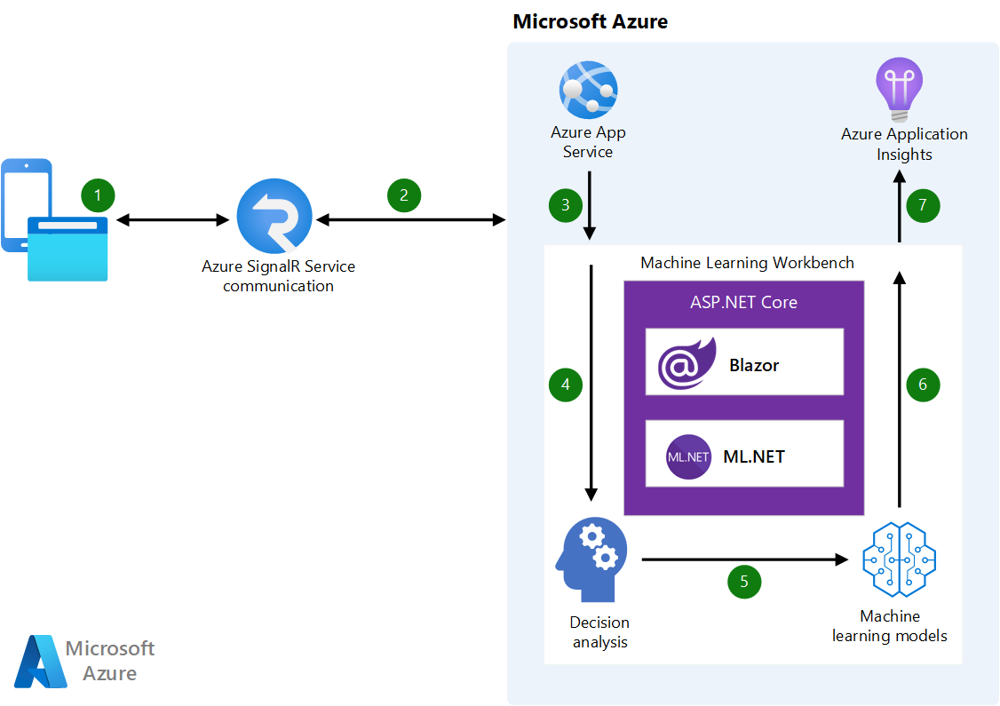

This scenario describes a web application, called the Baseball Machine Learning Workbench, which provides an interface for non-technical users to use artificial intelligence (AI) and machine learning (ML) to perform decision analysis techniques. These techniques help you rapidly gain insights and make informed predictions.

## Architecture



*Download a [Visio file](https://arch-center.azureedge.net/baseball-machine-learning-workbench-diagram.vsdx) of this architecture.*

### Dataflow

The processing sequence in this solution flows as follows:

1. The user accesses the workbench application with any browser. They choose which analysis method to employ and then which player to analyze.

2. SignalR brokers two-way communication with the server in real time.

3. [Azure App Service](/azure/app-service/) hosts the application, including AI logic with the machine learning models.

4. One of three different decision analysis mechanisms is utilized, depending on which mode the user has selected.

5. Historical data is analyzed using the designated set of rules or ML models in ML.NET, operating in-memory for quick inference.

6. Blazor Server surfaces the results to the end user's browser, updating only the portions of the interface that have changed, and transmits back to the user via SignalR.

7. [Azure Application Insights](/azure/azure-monitor/app/app-insights-overview) is optionally used to monitor performance and instrumentation resources as needed.

### Components

The following assets and technologies were used to craft the Baseball Machine Learning Workbench:

- [Azure App Service](https://azure.microsoft.com/services/app-service) enables you to build and host web applications in the programming language of your choice without managing infrastructure.

- [.NET Core 3.1](/dotnet/core/) is an open-source, cross-platform, general-purpose development framework that runs on Windows, Linux, and macOS platforms.

- [ML.NET](https://dotnet.microsoft.com/apps/machinelearning-ai/ml-dotnet) is a cross-platform, open-source framework for creating machine learning and artificial intelligence models using .NET. It is used in the inference sections of this application.

- [Blazor Server](https://dotnet.microsoft.com/apps/aspnet/web-apps/blazor) lets you build interactive web UIs using C\# instead of JavaScript, as in this solution. In this architecture, Blazor renders the UI on the server and pushes HTML and other changes out to the browser.

- [SignalR](https://dotnet.microsoft.com/apps/aspnet/signalr) provides asynchronous communication between the browser and the server (including Blazor). It handles event updates, UI updates, and any processing done on the server (such as model inference).

- [Visual Studio 2022](https://visualstudio.microsoft.com/vs/) is the software programming environment used for this project. This architecture uses cross-platform components, so either the Windows or Mac version can be used.

- [Azure Application Insights](/azure/azure-monitor/app/app-insights-overview), a feature of [Azure Monitor](https://azure.microsoft.com/services/monitor), can be used for performance monitoring and analytics and to drive autoscaling.

## Scenario details

This solution uses historical baseball data to generate National Baseball Hall of Fame insights. Machine intelligence powers the what-if analysis, decision thresholding, and improvements over traditional rule-based systems. User-friendly interface controls set adjustable parameters and surface the results in real time, with clear visual cues to highlight positive or negative outcomes.

The architecture provides rapid results by using in-memory models and rapid two-way communication between the user and server. Delta rendering pushes down only modified content to the web browser, updating the display without having to reload the entire page. This solution can scale to tens of in-memory models serving hundreds of concurrent sessions in real time.

This article explains the architecture of the Baseball Machine Learning Workbench, where to get the source code for it, and how to deploy it. You can also [view a live demo of this solution](https://aka.ms/BaseballMLWorkbench).

### Potential use cases

This solution is ideal for the sports and finance industries. Consider this scenario for the following use cases:

- Decision analysis system replacement with AI and ML

- AI-assisted decision support systems or decision management systems

- Fantasy baseball

- Financial forecasting

- Business goal and objective modeling (budgeting and project planning, for example)

## Considerations

These considerations implement the pillars of the Azure Well-Architected Framework, which is a set of guiding tenets that can be used to improve the quality of a workload. For more information, see [Microsoft Azure Well-Architected Framework](/azure/architecture/framework).

### Scalability

This solution uses the prediction engine functionality in ML.NET to scale the model response times. Object pooling allows the ML.NET models to be accessed by multiple requests in a thread-safe manner. Learn more about ML.NET object pooling in [Deploy a model in an ASP.NET Core Web API](/dotnet/machine-learning/how-to-guides/serve-model-web-api-ml-net).

Azure App Service is used for hosting the workbench in the cloud. With App Service, you can automatically scale the number of instances that run your app, letting you keep up with customer demand. For more information on autoscale, see [Autoscaling best practices](../../best-practices/auto-scaling.md) in the Azure Architecture Center.

In Blazor Server, the state of many components might be maintained concurrently by the server. Because of this maintenance, memory exhaustion is a concern that must be addressed. For guidance on how to author a Blazor Server app to help ensure the best use of server memory, see [Threat mitigation guidance for ASP.NET Core Blazor Server](/aspnet/core/security/blazor/server/threat-mitigation). Applying these best practices allows a server-side Blazor application to scale to thousands of concurrent users—even on relatively small server hosts.

General guidance on designing scalable solutions is provided in the Azure Architecture Center's [Performance efficiency checklist](/azure/architecture/framework/scalability/performance-efficiency).

### Resiliency and support

Use .NET Core 3.1.x because it is a Long Term Support (LTS) release. Although Blazor Server is also available in .NET Core 3.0, that is not an LTS release and thus continuing compatibility with future component updates is not assured. [Learn more about the .NET Core Support Policy](https://dotnet.microsoft.com/platform/support/policy/dotnet-core).

## Deploy this scenario

All of the source code for this scenario is available in the [Baseball Machine Learning Workbench repository](https://github.com/bartczernicki/MachineLearning-BaseballPrediction-BlazorApp). This solution is open source and provided with an [MIT License](https://github.com/bartczernicki/MachineLearning-BaseballPrediction-BlazorApp/blob/master/LICENSE.md).

### Prerequisites

For online deployments, you must have an existing Azure account. If you need one, create a [free Azure account](https://azure.microsoft.com/free/?WT.mc_id=A261C142F) before you begin.

For deployment as an Azure application instance, you need the [Visual Studio 2019 IDE](https://visualstudio.microsoft.com/vs/) and you must have [Git installed locally](https://git-scm.com/book/en/v2/Getting-Started-Installing-Git).

The historical baseball data used for the analysis and machine learning models comes from [Sean Lahman's Baseball Database](http://www.seanlahman.com/baseball-archive/statistics), which is licensed under a [Creative Commons Attribution-ShareAlike 3.0 Unported License](https://creativecommons.org/licenses/by-sa/3.0/). The Major League Baseball data is public domain.

### Deployment to Azure

1. Make sure you have your Azure subscription information handy.

2. Start by cloning the [workbench GitHub repository](https://github.com/bartczernicki/MachineLearning-BaseballPrediction-BlazorApp):

    ```git
    git clone https://github.com/bartczernicki/MachineLearning-BaseballPrediction-BlazorApp.git
    ```

3. Follow the instructions provided in the [GETSTARTED.md file](https://github.com/bartczernicki/MachineLearning-BaseballPrediction-BlazorApp/blob/master/GETSTARTED.md).

### Alternative: Docker container

This application is also available as a complete, ready-to-run [Docker container downloadable from Docker Hub](https://hub.docker.com/r/bartczernicki/baseballmachinelearningworkbench).

The container can be run locally (offline) in your own environment. It can also be deployed online in an [Azure Container Instance](/azure/container-instances/container-instances-overview). Instructions for getting started with either use case are provided in the main GitHub repo's Get Started documentation:

- [Run the Docker Container locally in your own environment](https://github.com/bartczernicki/MachineLearning-BaseballPrediction-BlazorApp/blob/master/GETSTARTED.md#2-run-the-docker-container-locally-in-your-own-environment)

- [Publish Docker Container to the Azure Cloud using Azure Container Instances](https://github.com/bartczernicki/MachineLearning-BaseballPrediction-BlazorApp/blob/master/GETSTARTED.md#3-publish-docker-container-to-the-azure-cloud-using-azure-container-instances)

## Next steps

- [Baseball HOF prediction using R mlr and DALEX packages](https://github.com/bartczernicki/BaseballHOFPredictionWithMlrAndDALEX) is a GitHub repo using R and cutting edge "black box" model techniques to explain ML.NET models related to this workload
- [Azure App Service overview](/azure/app-service/overview)
- [Blazor documentation](/aspnet/core/blazor)
- [ML.NET documentation](/dotnet/machine-learning)
- [ASP.NET Core Blazor hosting models](/aspnet/core/blazor/hosting-models?view=aspnetcore-3.1&preserve-view=true)
- [MLOps (DevOps for Machine Learning)](https://azure.microsoft.com/services/machine-learning/mlops/) helps data science teams deliver innovation faster, increasing the pace of ML model development
- Learn about the [National Baseball Hall of Fame voting process and rules](https://www.baseball-reference.com/bullpen/Hall_of_Fame)
- [XAI Stories: Case Studies for Explainable Artificial Intelligence](https://pbiecek.github.io/xai_stories/) (Warsaw University of Technology and University of Warsaw, 2020)

## Related resources

- [Build an enterprise-grade conversational bot](/azure/architecture/reference-architectures/ai/conversational-bot)
- [Scale AI and machine learning initiatives in regulated industries](/azure/architecture/example-scenario/ai/scale-ai-and-machine-learning-in-regulated-industries)
- [Homomorphic encryption with SEAL](/azure/architecture/solution-ideas/articles/homomorphic-encryption-seal)
