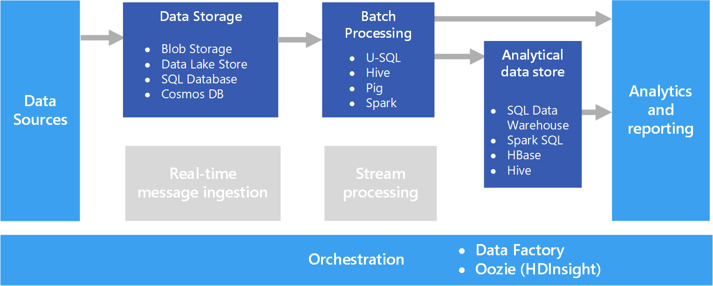

A common big data scenario is batch processing of data at rest. In this scenario, the source data is loaded into data storage, either by the source application itself or by an orchestration workflow. The data is then processed in-place by a parallelized job, which can also be initiated by the orchestration workflow. The processing may include multiple iterative steps before the transformed results are loaded into an analytical data store, which can be queried by analytics and reporting components.

For example, the logs from a web server might be copied to a folder and then processed overnight to generate daily reports of web activity.

## When to use this solution

Batch processing is used in a variety of scenarios, from simple data transformations to a more complete ETL (extract-transform-load) pipeline. In a big data context, batch processing may operate over very large data sets, where the computation takes significant time. (For example, see [Lambda architecture](../big-data/index.yml#lambda-architecture).) Batch processing typically leads to further interactive exploration, provides the modeling-ready data for machine learning, or writes the data to a data store that is optimized for analytics and visualization.

One example of batch processing is transforming a large set of flat, semi-structured CSV or JSON files into a schematized and structured format that is ready for further querying. Typically the data is converted from the raw formats used for ingestion (such as CSV) into binary formats that are more performant for querying because they store data in a columnar format, and often provide indexes and inline statistics about the data.

## Challenges

- **Data format and encoding**. Some of the most difficult issues to debug happen when files use an unexpected format or encoding. For example, source files might use a mix of UTF-16 and UTF-8 encoding, or contain unexpected delimiters (space versus tab), or include unexpected characters. Another common example is text fields that contain tabs, spaces, or commas that are interpreted as delimiters. Data loading and parsing logic must be flexible enough to detect and handle these issues.

- **Orchestrating time slices**. Often source data is placed in a folder hierarchy that reflects processing windows, organized by year, month, day, hour, and so on. In some cases, data may arrive late. For example, suppose that a web server fails, and the logs for March 7th don't end up in the folder for processing until March 9th. Are they just ignored because they're too late? Can the downstream processing logic handle out-of-order records?

## Architecture

A batch processing architecture has the following logical components, shown in the diagram above.

- **Data storage**. Typically a distributed file store that can serve as a repository for high volumes of large files in various formats. Generically, this kind of store is often referred to as a data lake.

- **Batch processing**. The high-volume nature of big data often means that solutions must process data files using long-running batch jobs to filter, aggregate, and otherwise prepare the data for analysis. Usually these jobs involve reading source files, processing them, and writing the output to new files.

- **Analytical data store**. Many big data solutions are designed to prepare data for analysis and then serve the processed data in a structured format that can be queried using analytical tools.

- **Analysis and reporting**. The goal of most big data solutions is to provide insights into the data through analysis and reporting.

- **Orchestration**. With batch processing, typically some orchestration is required to migrate or copy the data into your data storage, batch processing, analytical data store, and reporting layers.

## Technology choices

The following technologies are recommended choices for batch processing solutions in Azure.

### Data storage

- **Azure Storage Blob Containers**. Many existing Azure business processes already use Azure blob storage, making this a good choice for a big data store.
- **Azure Data Lake Store**. Azure Data Lake Store offers virtually unlimited storage for any size of file, and extensive security options, making it a good choice for extremely large-scale big data solutions that require a centralized store for data in heterogeneous formats.

For more information, see [Data storage](../technology-choices/data-storage.md).

<!-- markdownlint-disable MD024 -->

### Batch processing

<!-- markdownlint-enable MD024 -->

- **U-SQL**. U-SQL is the query processing language used by Azure Data Lake Analytics. It combines the declarative nature of SQL with the procedural extensibility of C#, and takes advantage of parallelism to enable efficient processing of data at massive scale.
- **Hive**. Hive is a SQL-like language that is supported in most Hadoop distributions, including HDInsight. It can be used to process data from any HDFS-compatible store, including Azure blob storage and Azure Data Lake Store.
- **Pig**. Pig is a declarative big data processing language used in many Hadoop distributions, including HDInsight. It is particularly useful for processing data that is unstructured or semi-structured.
- **Spark**. The Spark engine supports batch processing programs written in a range of languages, including Java, Scala, and Python. Spark uses a distributed architecture to process data in parallel across multiple worker nodes.

For more information, see [Batch processing](../technology-choices/batch-processing.md).

### Analytical data store

- **Azure Synapse Analytics**. Azure Synapse is a managed service based on SQL Server database technologies and optimized to support large-scale data warehousing workloads.
- **Spark SQL**. Spark SQL is an API built on Spark that supports the creation of dataframes and tables that can be queried using SQL syntax.
- **HBase**. HBase is a low-latency NoSQL store that offers a high-performance, flexible option for querying structured and semi-structured data.
- **Hive**. In addition to being useful for batch processing, Hive offers a database architecture that is conceptually similar to that of a typical relational database management system. Improvements in Hive query performance through innovations like the Tez engine and Stinger initiative mean that Hive tables can be used effectively as sources for analytical queries in some scenarios.

For more information, see [Analytical data stores](../technology-choices/analytical-data-stores.md).

### Analytics and reporting

- **Azure Analysis Services**. Many big data solutions emulate traditional enterprise business intelligence architectures by including a centralized online analytical processing (OLAP) data model (often referred to as a cube) on which reports, dashboards, and interactive "slice and dice" analysis can be based. Azure Analysis Services supports the creation of tabular models to meet this need.
- **Power BI**. Power BI enables data analysts to create interactive data visualizations based on data models in an OLAP model or directly from an analytical data store.
- **Microsoft Excel**. Microsoft Excel is one of the most widely used software applications in the world, and offers a wealth of data analysis and visualization capabilities. Data analysts can use Excel to build document data models from analytical data stores, or to retrieve data from OLAP data models into interactive PivotTables and charts.

For more information, see [Analytics and reporting](../technology-choices/analysis-visualizations-reporting.md).

### Orchestration

- **Azure Data Factory**. Azure Data Factory pipelines can be used to define a sequence of activities, scheduled for recurring temporal windows. These activities can initiate data copy operations as well as Hive, Pig, MapReduce, or Spark jobs in on-demand HDInsight clusters; U-SQL jobs in Azure Date Lake Analytics; and stored procedures in Azure Synapse or Azure SQL Database.
- **Oozie** and **Sqoop**. Oozie is a job automation engine for the Apache Hadoop ecosystem and can be used to initiate data copy operations as well as Hive, Pig, and MapReduce jobs to process data and Sqoop jobs to copy data between HDFS and SQL databases.

For more information, see [Pipeline orchestration](../technology-choices/pipeline-orchestration-data-movement.md)

## Contributors

*This article is maintained by Microsoft. It was originally written by the following contributors.*

Principal author:

- [Zoiner Tejada](https://www.linkedin.com/in/zoinertejada) | CEO and Architect

# Next steps

- [How to use batching to improve Azure SQL Database and Azure SQL Managed Instance application performance](/azure/azure-sql/performance-improve-use-batching)
- [Batch Processing (Analysis Services)](/analysis-services/multidimensional-models/batch-processing-analysis-services)
- [Tutorial: Do batch processing with .NET for Apache Spark](/dotnet/spark/tutorials/batch-processing)

# Related resources

- [Big data architectures](index.yml)
- [Choose a batch processing technology in Azure](../technology-choices/batch-processing.md)
- [High-volume batch transaction processing](../../example-scenario/mainframe/process-batch-transactions.yml)