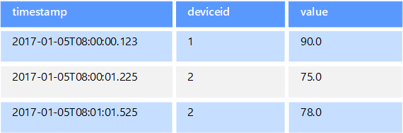
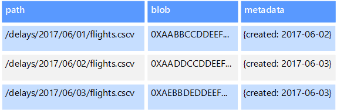
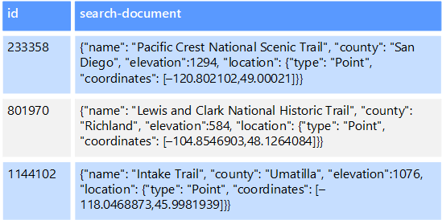

A *non-relational database* is a database that does not use the tabular schema of rows and columns found in most traditional database systems. Instead, non-relational databases use a storage model that is optimized for the specific requirements of the type of data being stored. For example, data may be stored as simple key/value pairs, as JSON documents, or as a graph consisting of edges and vertices.

What all of these data stores have in common is that they don't use a [relational model](../index.md). Also, they tend to be more specific in the type of data they support and how data can be queried. For example, time series data stores are optimized for queries over time-based sequences of data. However, graph data stores are optimized for exploring weighted relationships between entities. Neither format would generalize well to the task of managing transactional data.

The term *NoSQL* refers to data stores that do not use SQL for queries. Instead, the data stores use other programming languages and constructs to query the data. In practice, "NoSQL" means "non-relational database," even though many of these databases do support SQL-compatible queries. However, the underlying query execution strategy is usually very different from the way a traditional RDBMS would execute the same SQL query.

The following sections describe the major categories of non-relational or NoSQL database.

## Document data stores

A document data store manages a set of named string fields and object data values in an entity that's referred to as a *document*. These data stores typically store data in the form of JSON documents. Each field value could be a scalar item, such as a number, or a compound element, such as a list or a parent-child collection. The data in the fields of a document can be encoded in various ways, including XML, YAML, JSON, BSON, or even stored as plain text. The fields within documents are exposed to the storage management system, enabling an application to query and filter data by using the values in these fields.

Typically, a document contains the entire data for an entity. What items constitute an entity are application-specific. For example, an entity could contain the details of a customer, an order, or a combination of both. A single document might contain information that would be spread across several relational tables in a relational database management system (RDBMS). A document store does not require that all documents have the same structure. This free-form approach provides a great deal of flexibility. For example, applications can store different data in documents in response to a change in business requirements.

The application can retrieve documents by using the document key. The key is a unique identifier for the document, which is often hashed, to help distribute data evenly. Some document databases create the document key automatically. Others enable you to specify an attribute of the document to use as the key. The application can also query documents based on the value of one or more fields. Some document databases support indexing to facilitate fast lookup of documents based on one or more indexed fields.

Many document databases support in-place updates, enabling an application to modify the values of specific fields in a document without rewriting the entire document. Read and write operations over multiple fields in a single document are typically atomic.

Relevant Azure service:

- [Azure Cosmos DB](https://azure.microsoft.com/services/cosmos-db/)

## Columnar data stores

A columnar or column-family data store organizes data into columns and rows. In its simplest form, a column-family data store can appear very similar to a relational database, at least conceptually. The real power of a column-family database lies in its denormalized approach to structuring sparse data, which stems from the column-oriented approach to storing data.

You can think of a column-family data store as holding tabular data with rows and columns, but the columns are divided into groups known as column families. Each column family holds a set of columns that are logically related and are typically retrieved or manipulated as a unit. Other data that is accessed separately can be stored in separate column families. Within a column family, new columns can be added dynamically, and rows can be sparse (that is, a row doesn't need to have a value for every column).

The following diagram shows an example with two column families, `Identity` and `Contact Info`. The data for a single entity has the same row key in each column family. This structure, where the rows for any given object in a column family can vary dynamically, is an important benefit of the column-family approach, making this form of data store highly suited for storing data with varying schemas.

Unlike a key/value store or a document database, most column-family databases physically store data in key order, rather than by computing a hash. The row key is considered the primary index and enables key-based access via a specific key or a range of keys. Some implementations allow you to create secondary indexes over specific columns in a column family. Secondary indexes let you retrieve data by columns value, rather than row key.

On disk, all of the columns within a column family are stored together in the same file, with a specific number of rows in each file. With large data sets, this approach creates a performance benefit by reducing the amount of data that needs to be read from disk when only a few columns are queried together at a time.

Read and write operations for a row are typically atomic within a single column family, although some implementations provide atomicity across the entire row, spanning multiple column families.

Relevant Azure service:

- [Azure Cosmos DB for Apache Cassandra](/azure/cosmos-db/cassandra-introduction)
- [HBase in HDInsight](/azure/hdinsight/hdinsight-hbase-overview)

## Key/value data stores

A key/value store is essentially a large hash table. You associate each data value with a unique key, and the key/value store uses this key to store the data by using an appropriate hashing function. The hashing function is selected to provide an even distribution of hashed keys across the data storage.

Most key/value stores only support simple query, insert, and delete operations. To modify a value (either partially or completely), an application must overwrite the existing data for the entire value. In most implementations, reading or writing a single value is an atomic operation. If the value is large, writing may take some time.

An application can store arbitrary data as a set of values, although some key/value stores impose limits on the maximum size of values. The stored values are opaque to the storage system software. Any schema information must be provided and interpreted by the application. Essentially, values are blobs and the key/value store simply retrieves or stores the value by key.

Key/value stores are highly optimized for applications performing simple lookups using the value of the key, or by a range of keys, but are less suitable for systems that need to query data across different tables of keys/values, such as joining data across multiple tables.

Key/value stores are also not optimized for scenarios where querying or filtering by non-key values is important, rather than performing lookups based only on keys. For example, with a relational database, you can find a record by using a WHERE clause to filter the non-key columns, but key/values stores usually do not have this type of lookup capability for values, or if they do, it requires a slow scan of all values.

A single key/value store can be extremely scalable, as the data store can easily distribute data across multiple nodes on separate machines.

Relevant Azure services:

- [Azure Cosmos DB for Table](/azure/cosmos-db/table-introduction)
- [Azure Cache for Redis](https://azure.microsoft.com/services/cache/)
- [Azure Table Storage](https://azure.microsoft.com/services/storage/tables/)

## Graph data stores

A graph data store manages two types of information, nodes and edges. Nodes represent entities, and edges specify the relationships between these entities. Both nodes and edges can have properties that provide information about that node or edge, similar to columns in a table. Edges can also have a direction indicating the nature of the relationship.

The purpose of a graph data store is to allow an application to efficiently perform queries that traverse the network of nodes and edges, and to analyze the relationships between entities. The following diagram shows an organization's personnel data structured as a graph. The entities are employees and departments, and the edges indicate reporting relationships and the department in which employees work. In this graph, the arrows on the edges show the direction of the relationships.

This structure makes it straightforward to perform queries such as "Find all employees who report directly or indirectly to Sarah" or "Who works in the same department as John?" For large graphs with lots of entities and relationships, you can perform complex analyses quickly. Many graph databases provide a query language that you can use to traverse a network of relationships efficiently.

Relevant Azure service:

- [Azure Cosmos DB Graph API](/azure/cosmos-db/graph-introduction)

## Time series data stores

Time series data is a set of values organized by time, and a time series data store is optimized for this type of data. Time series data stores must support a very high number of writes, as they typically collect large amounts of data in real time from a large number of sources. Time series data stores are optimized for storing telemetry data. Scenarios include IoT sensors or application/system counters. Updates are rare, and deletes are often done as bulk operations.

Although the records written to a time series database are generally small, there are often a large number of records, and total data size can grow rapidly. Time series data stores also handle out-of-order and late-arriving data, automatic indexing of data points, and optimizations for queries described in terms of windows of time. This last feature enables queries to run across millions of data points and multiple data streams quickly, in order to support time series visualizations, which is a common way that time series data is consumed.

For more information, see [Time series solutions](../scenarios/time-series.yml)

Relevant Azure services:

- [Azure Time Series Insights](https://azure.microsoft.com/services/time-series-insights/)
- [OpenTSDB with HBase on HDInsight](/azure/hdinsight/hdinsight-hbase-overview)

## Object data stores

Object data stores are optimized for storing and retrieving large binary objects or blobs such as images, text files, video and audio streams, large application data objects and documents, and virtual machine disk images. An object consists of the stored data, some metadata, and a unique ID for accessing the object. Object stores are designed to support files that are individually very large, as well provide large amounts of total storage to manage all files.

Some object data stores replicate a given blob across multiple server nodes, which enables fast parallel reads. This process, in turn, enables the scale-out querying of data contained in large files, because multiple processes, typically running on different servers, can each query the large data file simultaneously.

One special case of object data stores is the network file share. Using file shares enables files to be accessed across a network using standard networking protocols like server message block (SMB). Given appropriate security and concurrent access control mechanisms, sharing data in this way can enable distributed services to provide highly scalable data access for basic, low-level operations such as simple read and write requests.

Relevant Azure services:

- [Azure Blob Storage](https://azure.microsoft.com/services/storage/blobs/)
- [Azure Data Lake Store](https://azure.microsoft.com/services/data-lake-store/)
- [Azure File Storage](https://azure.microsoft.com/services/storage/files/)

## External index data stores

External index data stores provide the ability to search for information held in other data stores and services. An external index acts as a secondary index for any data store, and can be used to index massive volumes of data and provide near real-time access to these indexes.

For example, you might have text files stored in a file system. Finding a file by its file path is quick, but searching based on the contents of the file would require a scan of all of the files, which is slow. An external index lets you create secondary search indexes and then quickly find the path to the files that match your criteria. Another example application of an external index is with key/value stores that only index by the key. You can build a secondary index based on the values in the data, and quickly look up the key that uniquely identifies each matched item.

The indexes are created by running an indexing process. This can be performed using a pull model, triggered by the data store, or using a push model, initiated by application code. Indexes can be multidimensional and may support free-text searches across large volumes of text data.

External index data stores are often used to support full text and web-based search. In these cases, searching can be exact or fuzzy. A fuzzy search finds documents that match a set of terms and calculates how closely they match. Some external indexes also support linguistic analysis that can return matches based on synonyms, genre expansions (for example, matching "dogs" to "pets"), and stemming (for example, searching for "run" also matches "ran" and "running").

Relevant Azure service:

- [Azure Search](https://azure.microsoft.com/services/search/)

## Typical requirements

Non-relational data stores often use a different storage architecture from that used by relational databases. Specifically, they tend toward having no fixed schema. Also, they tend not to support transactions, or else restrict the scope of transactions, and they generally don't include secondary indexes for scalability reasons.

The following compares the requirements for each of the non-relational data stores:

| Requirement | Document data | Column-family data | Key/value data | Graph data |
| --- | --- | --- | --- | --- |
| Normalization | Denormalized | Denormalized | Denormalized | Normalized |
| Schema | Schema on read | Column families defined on write, column schema on read | Schema on read | Schema on read |
| Consistency (across concurrent transactions) | Tunable consistency, document-level guarantees | Column-family&ndash;level guarantees | Key-level guarantees | Graph-level guarantees |
| Atomicity (transaction scope) | Collection | Table | Table | Graph |
| Locking Strategy | Optimistic (lock free) | Pessimistic (row locks) | Optimistic (ETag) |
| Access pattern | Random access | Aggregates on tall/wide data | Random access | Random access |
| Indexing | Primary and secondary indexes | Primary and secondary indexes | Primary index only | Primary and secondary indexes |
| Data shape | Document | Tabular with column families containing columns | Key and value | Graph containing edges and vertices |
| Sparse | Yes | Yes | Yes | No |
| Wide (lots of columns/attributes) | Yes | Yes | No | No |
| Datum size | Small (KBs) to medium (low MBs) | Medium (MBs) to Large (low GBs) | Small (KBs) | Small (KBs) |
| Overall Maximum Scale | Very Large (PBs) | Very Large (PBs) | Very Large (PBs) | Large (TBs) |

| Requirement | Time series data | Object data | External index data |
| --- | --- | --- | --- |
| Normalization | Normalized | Denormalized | Denormalized |
| Schema | Schema on read | Schema on read | Schema on write |
| Consistency (across concurrent transactions) | N/A | N/A | N/A |
| Atomicity (transaction scope) | N/A | Object | N/A |
| Locking Strategy | N/A | Pessimistic (blob locks) | N/A |
| Access pattern | Random access and aggregation | Sequential access | Random access |
| Indexing | Primary and secondary indexes | Primary index only | N/A |
| Data shape | Tabular | Blob and metadata | Document |
| Sparse | No | N/A | No |
| Wide (lots of columns/attributes) |  No | Yes | Yes |
| Datum size | Small (KBs) | Large (GBs) to Very Large (TBs) | Small (KBs) |
| Overall Maximum Scale | Large (low TBs)  | Very Large (PBs) | Large (low TBs) |

## Contributors

*This article is maintained by Microsoft. It was originally written by the following contributors.*

Principal author:

- [Zoiner Tejada](https://www.linkedin.com/in/zoinertejada) | CEO and Architect

## Next steps

- [Relational vs. NoSQL data](/dotnet/architecture/cloud-native/relational-vs-nosql-data)
- [Understand distributed NoSQL databases](/azure/cosmos-db/distributed-nosql)
- [Microsoft Azure Data Fundamentals: Explore non-relational data in Azure](/training/paths/azure-data-fundamentals-explore-non-relational-data)
- [Implement a non-relational data model](/training/modules/implement-non-relational-data-model)

## Related resources

- [Databases architecture design](../databases-architecture-design.yml)
- [Understand data store models](../../guide/technology-choices/data-store-overview.md)
- [Scalable order processing](../../example-scenario/data/ecommerce-order-processing.yml)
- [Near real-time lakehouse data processing](../../example-scenario/data/real-time-lakehouse-data-processing.yml)
