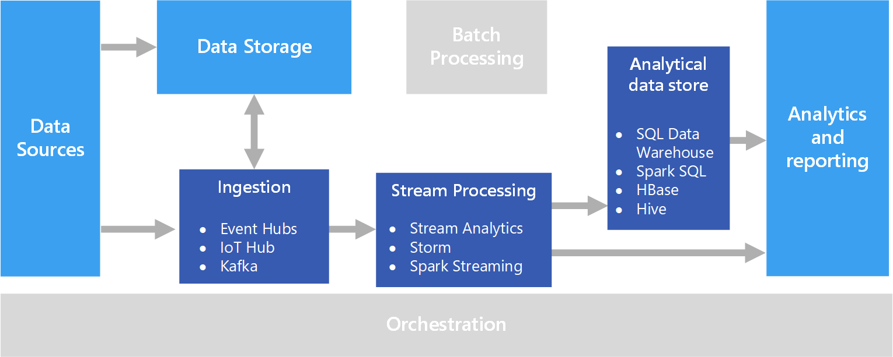

Real time processing deals with streams of data that are captured in real-time and processed with minimal latency to generate real-time (or near-real-time) reports or automated responses. For example, a real-time traffic monitoring solution might use sensor data to detect high traffic volumes. This data could be used to dynamically update a map to show congestion, or automatically initiate high-occupancy lanes or other traffic management systems.

Real-time processing is defined as the processing of unbounded stream of input data, with very short latency requirements for processing &mdash; measured in milliseconds or seconds. This incoming data typically arrives in an unstructured or semi-structured format, such as JSON, and has the same processing requirements as [batch processing](./batch-processing.yml), but with shorter turnaround times to support real-time consumption.

Processed data is often written to an analytical data store, which is optimized for analytics and visualization. The processed data can also be ingested directly into the analytics and reporting layer for analysis, business intelligence, and real-time dashboard visualization.

## Challenges

One of the big challenges of real-time processing solutions is to ingest, process, and store messages in real time, especially at high volumes. Processing must be done in such a way that it does not block the ingestion pipeline. The data store must support high-volume writes. Another challenge is being able to act on the data quickly, such as generating alerts in real time or presenting the data in a real-time (or near-real-time) dashboard.

## Architecture

A real-time processing architecture has the following logical components.

- **Real-time message ingestion.** The architecture must include a way to capture and store real-time messages to be consumed by a stream processing consumer. In simple cases, this service could be implemented as a simple data store in which new messages are deposited in a folder. But often the solution requires a message broker, such as Azure Event Hubs, that acts as a buffer for the messages. The message broker should support scale-out processing and reliable delivery.

- **Stream processing.** After capturing real-time messages, the solution must process them by filtering, aggregating, and otherwise preparing the data for analysis.

- **Analytical data store.** Many big data solutions are designed to prepare data for analysis and then serve the processed data in a structured format that can be queried using analytical tools.

- **Analysis and reporting.** The goal of most big data solutions is to provide insights into the data through analysis and reporting.

## Technology choices

The following technologies are recommended choices for real-time processing solutions in Azure.

### Real-time message ingestion

- **Azure Event Hubs**. Azure Event Hubs is a messaging solution for ingesting millions of event messages per second. The captured event data can be processed by multiple consumers in parallel. While Event Hubs natively supports AMQP (Advanced Message Queuing Protocol 1.0), it also provides a binary compatibility layer that allows applications using the Kafka protocol (Kafka 1.0 and above) to process events using Event Hubs with no application changes.
- **Azure IoT Hub**. Azure IoT Hub provides bi-directional communication between Internet-connected devices, and a scalable message queue that can handle millions of simultaneously connected devices.
- **Apache Kafka**. Kafka is an open source message queuing and stream processing application that can scale to handle millions of messages per second from multiple message producers, and route them to multiple consumers. Kafka is available in Azure as an HDInsight cluster type, with Azure Events for Kafka, and also available via ConfluentCloud through our partnership with Confluent.

For more information, see [Real-time message ingestion](../technology-choices/real-time-ingestion.md).

### Data storage

- **Azure Storage Blob Containers** or **Azure Data Lake Store**. Incoming real-time data is usually captured in a message broker (see above), but in some scenarios, it can make sense to monitor a folder for new files and process them as they are created or updated. Additionally, many real-time processing solutions combine streaming data with static reference data, which can be stored in a file store. Finally, file storage may be used as an output destination for captured real-time data for archiving, or for further batch processing in a [lambda architecture](../big-data/index.yml#lambda-architecture).

For more information, see [Data storage](../technology-choices/data-storage.md).

### Stream processing

- **Azure Stream Analytics**. Azure Stream Analytics can run perpetual queries against an unbounded stream of data. These queries consume streams of data from storage or message brokers, filter and aggregate the data based on temporal windows, and write the results to sinks such as storage, databases, or directly to reports in Power BI. Stream Analytics uses a SQL-based query language that supports temporal and geospatial constructs, and can be extended using JavaScript.
- **Storm**. Apache Storm is an open source framework for stream processing that uses a topology of spouts and bolts to consume, process, and output the results from real-time streaming data sources. You can provision Storm in an Azure HDInsight cluster, and implement a topology in Java or C#.
- **Spark Streaming**. Apache Spark is an open source distributed platform for general data processing. Spark provides the Spark Streaming API, in which you can write code in any supported Spark language, including Java, Scala, and Python. Spark 2.0 introduced the Spark Structured Streaming API, which provides a simpler and more consistent programming model. Spark 2.0 is available in an Azure HDInsight cluster.

For more information, see [Stream processing](../technology-choices/stream-processing.md).

### Analytical data store

- **Azure Synapse Analytics**, **Azure Data Explorer**, **HBase**, **Spark**, or **Hive**. Processed real-time data can be stored in a relational database by Synapse Analytics, Azure Data Explorer, a NoSQL store such as HBase, or as files in distributed storage over which Spark or Hive tables can be defined and queried.

For more information, see [Analytical data stores](../technology-choices/analytical-data-stores.md).

### Analytics and reporting

- **Azure Analysis Services**, **Power BI**, and **Microsoft Excel**. Processed real-time data that is stored in an analytical data store can be used for historical reporting and analysis in the same way as batch processed data. Additionally, Power BI can be used to publish real-time (or near-real-time) reports and visualizations from analytical data sources where latency is sufficiently low, or in some cases directly from the stream processing output.

For more information, see [Analytics and reporting](../technology-choices/analysis-visualizations-reporting.md).

In a purely real-time solution, most of the processing orchestration is managed by the message ingestion and stream processing components. However, in a lambda architecture that combines batch processing and real-time processing, you may need to use an orchestration framework such as Azure Data Factory or Apache Oozie and Sqoop to manage batch workflows for captured real-time data.

## Contributors

*This article is maintained by Microsoft. It was originally written by the following contributors.*

Principal author:

- [Zoiner Tejada](https://www.linkedin.com/in/zoinertejada) | CEO and Architect

## Next steps

- [Real-time event processing with Azure Stream Analytics](/azure/stream-analytics/stream-analytics-real-time-event-processing-reference-architecture)
- [Choose a real-time analytics and streaming processing technology on Azure](/azure/stream-analytics/streaming-technologies)
- [Explore fundamentals of real-time analytics](/training/modules/explore-fundamentals-stream-processing)
- [No-code stream processing through Azure Stream Analytics](/azure/stream-analytics/no-code-stream-processing)

## Related resources

- [Stream processing with Azure Stream Analytics](../../reference-architectures/data/stream-processing-stream-analytics.yml)
- [Choose a real-time message ingestion technology in Azure](../technology-choices/real-time-ingestion.md)
- [Real-time analytics on big data architecture](../../solution-ideas/articles/real-time-analytics.yml)
- [Real-time asset tracking and management](../../solution-ideas/articles/real-time-asset-tracking-mgmt-iot-central.yml)
