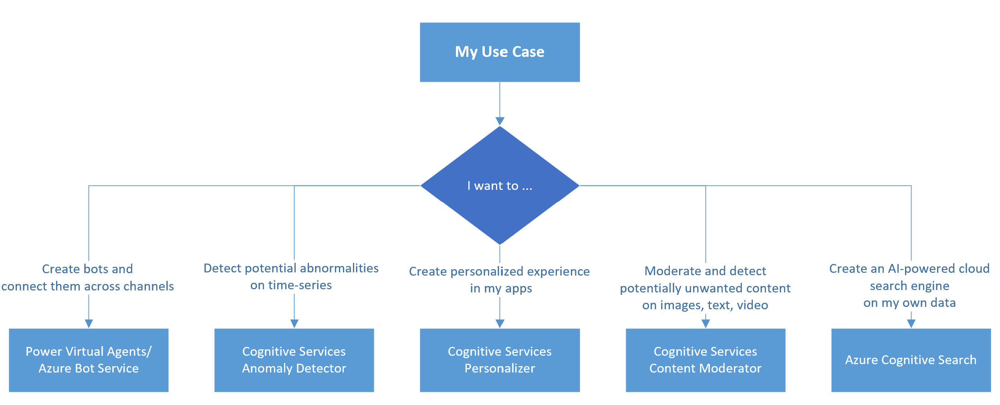

Azure Cognitive Service for Decision is a cloud-based service that provides Natural Language Processing (NLP) features to provide recommendations for informed and efficient decision-making. They help with making smart decisions faster.

Azure OpenAI Service provides REST API access to OpenAI's powerful language models including the GPT-3, Codex and Embeddings model series. These models can be easily adapted to your specific task including but not limited to content generation, summarization, semantic search, and natural language to code translation. Users can access the service through REST APIs, Python SDK, or our web-based interface in the Azure OpenAI Studio

## Key considerations

- **Type of Data:** Text/Image/Video
- **Processing Mechanism:** Batch/Real-Time
- **Algorithm Used:** Pre-built/Custom

The following flow chart helps you how to go about choosing the Decision/Open-AI service based on your processing needs

### Common Use Cases

1. **Azure Bot Service**
Power Virtual Agents is available as both *a standalone web app*, and as *a discrete app within Microsoft Teams*. Some of the ways that Power Virtual Agents bots have been used include:
    - COVID-19 infection rate and tracking information.
    - Sales help and support issues
    - Opening hours and store information
    - Employee health and vacation benefits
    - Common employee questions for businesses

2. **Anomaly Detector**
Anomaly Detector ingests *time-series data of all types* and selects the best anomaly detection algorithm. The Anomaly Detector API enables you to monitor and detect abnormalities in your time series data without having to know machine learning . It uses univariate and multivariate APIs to monitor data over time.You can use it for either *batch validation or real-time inference*. It helps with
    - **Detect anomalies in your streaming data** by using previously seen data points to determine if your latest one is an anomaly.
    - **Detect anomalies in your an entire data series at one time.** This operation generates a model using your entire time series data, with each point analyzed with the same model.
    - **Detect any trend change points** in your an entire data series at one time. This operation generates a model using your entire time series data, with each point analyzed with the same model.

3. **Personalizer**
Azure Personalizer is a cloud-based service that helps your applications choose the **best content item to show your users**.Personalizer's ability to select the best content item is based on the contextual information it receives.Personalizer uses *reinforcement learning* to select the best item (action) based on collective behavior and reward scores across all users. Actions are the content items, such as news articles, specific movies, or products.

4. **Content Moderator**
The service is capable of scanning *text, image, and video* content for potential risky, offensive, or undesirable aspects
    - **Text Moderation** - Scans text for offensive content, sexually explicit or suggestive content, profanity, and personal data. Can use both pre-built or custom models
    - **Image Moderation** - Scans images for adult or racy content, detects text in images with the Optical Character Recognition (OCR) capability, and detects faces.Can use both pre-built or custom models
    - **Video Moderation** - Scans videos for adult or racy content and returns time markers for said content.Only supports in-built models as of today

5. **Applied OpenAI Services**
Azure Cognitive Services with task-specific AI, built-in business logic, programming, orchestration and customization to bring you ready-to-deploy AI solutions. Common use cases include
    - [Azure Cognitive Search](/azure/search/search-what-is-azure-search) - Azure Cognitive Search is the only cloud search service with built-in AI capabilities that enrich all types of information to help you identify and explore relevant content at scale.
    - [Content Filtering](/azure/cognitive-services/openai/concepts/content-filter)
    - [Embeddings](/azure/cognitive-services/openai/concepts/understand-embeddings)

### Contributors

*This article is maintained by Microsoft. It was originally written by the following contributors.*
Principal authors:

- [Kruti Mehta](https://www.linkedin.com/in/thekrutimehta) | Azure Senior Fast-track Engineer
- [Christina Skarpathiotaki](https://www.linkedin.com/in/christinaskarpathiotaki/) | Senior Cloud Solution Architect

Co-authors:

- [Manjit Singh](https://www.linkedin.com/in/manjit-singh-0b922332) | Software Engineer
- [Nathan Widdup](https://www.linkedin.com/in/nwiddup) | Azure Senior Fast-track Engineer
- [Ashish Chahuan](https://www.linkedin.com/in/a69171115/) | Senior Cloud Solution Architect
- [Oscar Shimabukuro](https://www.linkedin.com/in/oscarshk/) | Senior Cloud Solution Architect
- [Brandon Cowen](https://www.linkedin.com/in/brandon-cowen-1658211b/) | Senior Cloud Solution Architect

### Next steps

- [Power Virtual Agents-Bots](https://learn.microsoft.com/power-virtual-agents/fundamentals-what-is-power-virtual-agents)
- [Anomaly Detector](/azure/cognitive-services/anomaly-detector/)
- [Content Moderator](/azure/cognitive-services/content-moderator/)
- [Personalizer](/azure/cognitive-services/personalizer/what-is-personalizer)
- [Azure Open AI](/azure/cognitive-services/openai/overview)
- [Decision API's Bifurcations](https://techcommunity.microsoft.com/t5/fasttrack-for-azure/azure-cognitive-services-decision-api-s-azure-ai-applied/ba-p/3520408)

### Learning Paths

- [Learning path: Provision and manage Azure Cognitive Services](/training/paths/provision-manage-azure-cognitive-services)]
- [Learning path: Identify principals and practices for Responsible AI](/training/paths/responsible-ai-business-principles/)
- [Learning path: Introduction to responsible bots](/training/modules/responsible-bots-introduction/)
- [Learning path: Get started with artificial intelligence](/training/paths/get-started-with-artificial-intelligence-on-azure/)
