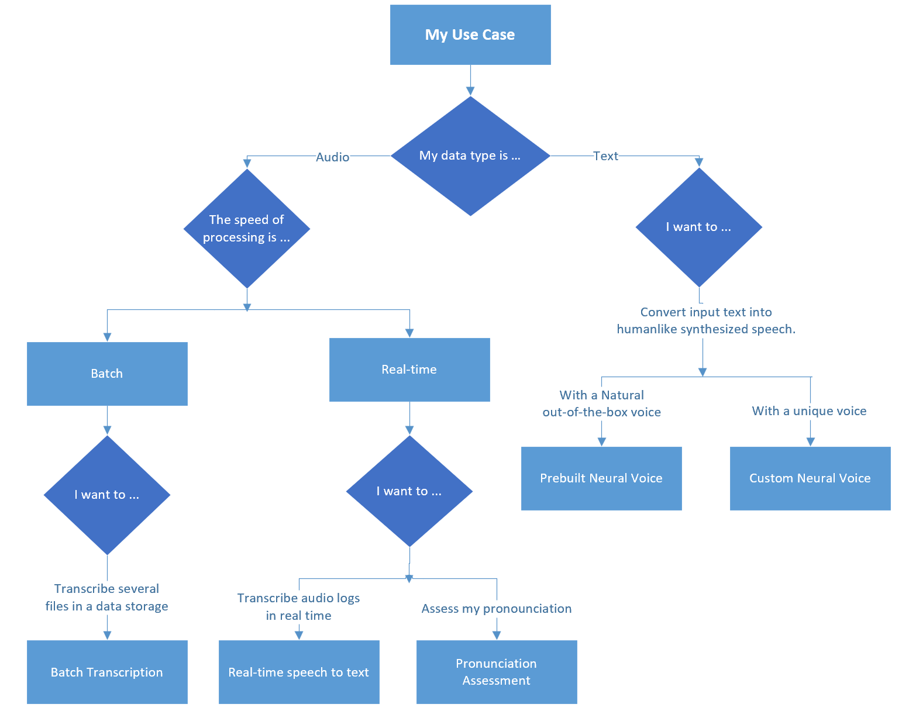

# Different types of speech API services

Azure Cognitive Speech service is used to perform spoken language transformations such as speech-to-text, text-to-speech, speech translation and speaker recognition.

> [!NOTE]
> Use [Azure Cognitive Search for Language](/azure/cognitive-services/language-service/overview) if you wish to gather deeper insights on terms or phrases, or detailed contextual analysis of spoken or written languages.

## Service categories

- [Speech-to-text](/azure/cognitive-services/speech-service/index-speech-to-text) - Speech-to-text can convert audio streams to text in real-time or in batch.
- [Text-to-speech](/azure/cognitive-services/speech-service/text-to-speech) - Text-to-speech enables applications to convert text to humanlike speech.
- [Speech translation](/azure/cognitive-services/speech-service/speech-translation) - Speech translation supports multi-language speech-to-speech and speech-to-text translation of audio streams.

## Key considerations

- **Type of Data:** Text/Audio
- **Processing Mechanism:** Batch/Real-Time

The following flow chart helps you how to go about choosing the Speech service based on your processing needs

In the above diagram the left side of the graph focusses on input data type : the Audio Format to output data type Audio/Text

1. Speech-to-text - used to transcribe speech from an audio source to text format.
2. Speech-to-speech (Speech Translation) - used to translate speech in one language to text or speech in another.

The right side of the graph focusses on input data type Text to output data type as Audio Format

1. Text-to-speech - used to generate spoken audio from a text source.

## Common use cases

The following table lists some of the common use cases.  

| Use Case | Type of Service to Use |
|----------|-----------------|
| Providing closed captions for recorded or live videos | Speech-to-text |
| Creating a transcript of a phone call or meeting | Speech-to-text |
| Automated note dictation | Speech-to-text |
| Determining intended user input for further processing | |
| Generating spoken responses to user input. | Text-to-speech |
| Creating voice menus for telephone systems. | Text-to-speech |
| Reading email or text messages aloud in hands-free scenarios. | Text-to-speech |
| Broadcasting announcements in public locations, such as railway stations or airports. | Text-to-speech |
| Real-time closed captioning for a speech or simultaneous two-way translation of a spoken conversation | Speech-to-speech |

### Contributors

*This article is maintained by Microsoft. It was originally written by the following contributors.*

Principal authors:

- [Kruti Mehta](https://www.linkedin.com/in/thekrutimehta) | Azure Senior Fast-track Engineer
- [Oscar Shimabukuro](https://www.linkedin.com/in/oscarshk/) | Senior Cloud Solution Architect

Co-authors:

- [Manjit Singh](https://www.linkedin.com/in/manjit-singh-0b922332) | Software Engineer
- [Nathan Widdup](https://www.linkedin.com/in/nwiddup) | Azure Senior Fast-track Engineer
- [Ashish Chahuan](https://www.linkedin.com/in/a69171115/) | Senior Cloud Solution Architect
- [Christina Skarpathiotaki](https://www.linkedin.com/in/christinaskarpathiotaki/) | Senior Cloud Solution Architect
- [Brandon Cowen](https://www.linkedin.com/in/brandon-cowen-1658211b/) | Senior Cloud Solution Architect

### Next steps

- [What is Azure Cognitive Service for Speech](/azure/cognitive-services/speech-service/overview)
- [Speech API's Bifurcations](https://techcommunity.microsoft.com/t5/fasttrack-for-azure/azure-cognitive-services-speech-api-s-azure-ai-applied-services/ba-p/3509510)

### Learning paths

- [Learning path: Provision and manage Azure Cognitive Services](/training/paths/provision-manage-azure-cognitive-services)]
- [Learning path: Process and Translate Speech with Azure Cognitive Speech Services](/training/paths/process-translate-speech-azure-cognitive-speech-services/)
