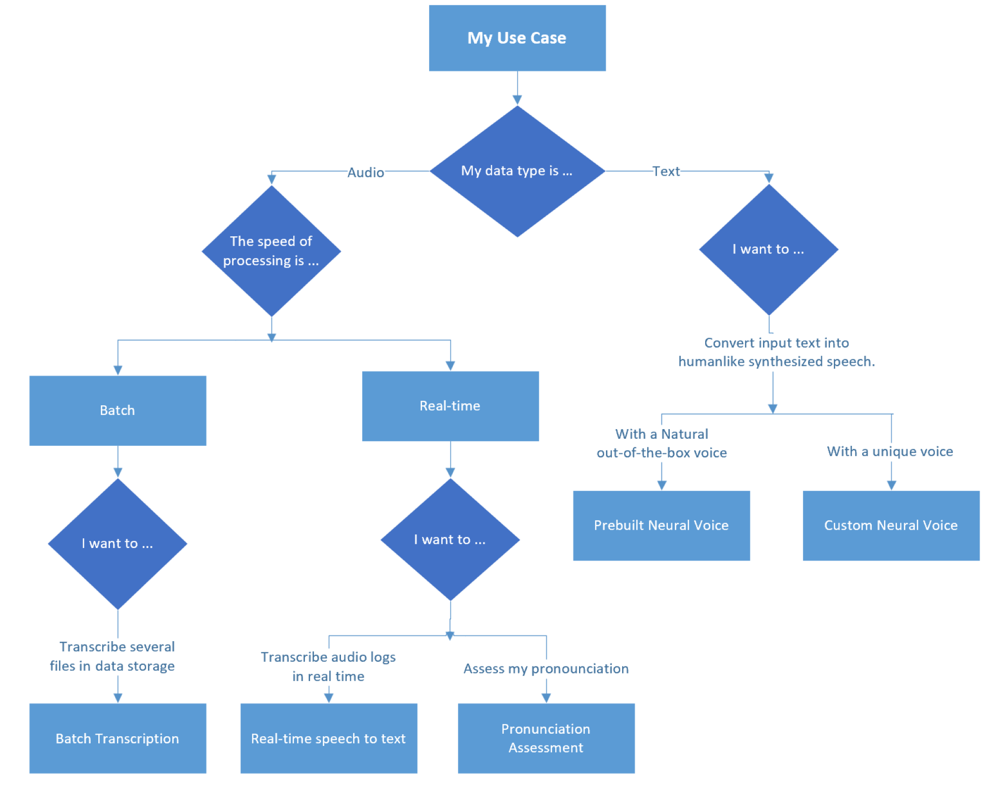

# Types of speech API services

You can use the Azure Cognitive Services Speech service to perform spoken language transformations, including speech-to-text, text-to-speech, speech translation, and speaker recognition.

> [!NOTE]
> Use [Azure Cognitive Service for Language](/azure/cognitive-services/language-service/overview) if you want to gather insights on terms or phrases or get detailed contextual analysis of spoken or written language.

## Services

- [Speech-to-text](/azure/cognitive-services/speech-service/index-speech-to-text) can convert audio streams to text in real time or in batch.
- [Text-to-speech](/azure/cognitive-services/speech-service/text-to-speech) enables applications to convert text to human-like speech.
- [Speech translation](/azure/cognitive-services/speech-service/speech-translation) provides multi-language speech-to-speech and speech-to-text translation of audio streams.

## How to choose a speech service

This flow chart can help you choose the speech service that suits your needs:

The left side of the diagram illustrates audio-to-audio or audio-to-text processes. 

- Speech-to-text is used to convert speech from an audio source to a text format.
- Speech-to-speech is used to translate speech in one language to speech in another language.

The right side of the diagram illustrates text-to-audio processes.

- Text-to-speech is used to generate spoken audio from a text source.

## Common use cases

The following table recommends services for some common use cases.

| Use case | Service to use |
|----------|-----------------|
| Provide closed captions for recorded or live videos | Speech-to-text |
| Create a transcript of a phone call or meeting | Speech-to-text |
| Implement automated note dictation | Speech-to-text |
| Determine intended user input for further processing | Speech-to-text|
| Generate spoken responses to user input | Text-to-speech |
| Create voice menus for telephone systems | Text-to-speech |
| Read email or text messages aloud in hands-free scenarios | Text-to-speech |
| Broadcast announcements in public locations, like railway stations or airports | Text-to-speech |
| Produce real-time closed captioning for a speech or simultaneous two-way translation of a spoken conversation | Speech-to-text |

## Contributors

*This article is maintained by Microsoft. It was originally written by the following contributors.*

Principal authors:

- [Kruti Mehta](https://www.linkedin.com/in/thekrutimehta) | Azure Senior Fast-Track Engineer
- [Oscar Shimabukuro](https://www.linkedin.com/in/oscarshk/) | Senior Cloud Solution Architect

Other contributors:

- [Mick Alberts](https://www.linkedin.com/in/mick-alberts-a24a1414/) | Technical Writer
- [Ashish Chahuan](https://www.linkedin.com/in/a69171115/) | Senior Cloud Solution Architect 
- [Brandon Cowen](https://www.linkedin.com/in/brandon-cowen-1658211b/) | Senior Cloud Solution Architect
- [Manjit Singh](https://www.linkedin.com/in/manjit-singh-0b922332) | Software Engineer
- [Christina Skarpathiotaki](https://www.linkedin.com/in/christinaskarpathiotaki/) | Senior Cloud Solution Architect
- [Nathan Widdup](https://www.linkedin.com/in/nwiddup) | Azure Senior Fast-Track Engineer

*To see nonpublic LinkedIn profiles, sign in to LinkedIn.*

## Next steps

- [What is the Speech service?](/azure/cognitive-services/speech-service/overview)
- [Speech APIs blog post](https://techcommunity.microsoft.com/t5/fasttrack-for-azure/azure-cognitive-services-speech-api-s-azure-ai-applied-services/ba-p/3509510)
- [Learning path: Provision and manage Azure Cognitive Services](/training/paths/provision-manage-azure-cognitive-services)
- [Learning path: Process and translate speech with Azure Cognitive Speech Services](/training/paths/process-translate-speech-azure-cognitive-speech-services/)

## Related resources

- [Types of decision APIs and Applied AI Services](decision-applied-ai.md)
- [Types of language API services](language-api.md)
- [Types of vision API services](vision-api.md)