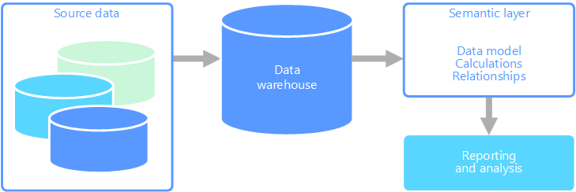

# Semantic modeling

A semantic data model is a conceptual model that describes the meaning of the data elements it contains. Organizations often have their own terms for things, sometimes with synonyms, or even different meanings for the same term. For example, an inventory database might track a piece of equipment with an asset ID and a serial number, but a sales database might refer to the serial number as the asset ID. There is no simple way to relate these values without a model that describes the relationship. 

Semantic modeling provides a level of abstraction over the database schema, so that users don't need to know the underlying data structures. This makes it easier for end users to query data without performing aggregates and joins over the underlying schema. Also, usually columns are renamed to more user-friendly names, so that the context and meaning of the data are more obvious.

Semantic modeling is predominately used for read-heavy scenarios, such as analytics and business intelligence (OLAP), as opposed to more write-heavy transactional data processing (OLTP). This is mostly due to the nature of a typical semantic layer:

- Aggregation behaviors are set so that reporting tools display them properly.
- Business logic and calculations are defined.
- Time-oriented calculations are included.
- Data is often integrated from multiple sources. 

Traditionally, the semantic layer is placed over a data warehouse for these reasons.

There are two primary types of semantic models:

* **Tabular**. Uses relational modeling constructs (model, tables, columns). Internally, metadata is inherited from OLAP modeling constructs (cubes, dimensions, measures). Code and script use OLAP metadata.
* **Multidimensional**. Uses traditional OLAP modeling constructs (cubes, dimensions, measures).

Relevant Azure service:
- [Azure Analysis Services](https://azure.microsoft.com/services/analysis-services/)

## Example use case

An organization has data stored in a large database. It wants to make this data available to business users and customers to create their own reports and do some analysis. One option is just to give those users direct access to the database. However, there are several drawbacks to doing this, including managing security and controlling access. Also, the design of the database, including the names of tables and columns, may be hard for a user to understand. Users would need to know which tables to query, how those tables should be joined, and other business logic that must be applied to get the correct results. Users would also need to know a query language like SQL even to get started. Typically this leads to multiple users reporting the same metrics but with different results.

Another option is to encapsulate all of the information that users need into a semantic model. The semantic model can be more easily queried by users with a reporting tool of their choice. The data provided by the semantic model is pulled from a data warehouse, ensuring that all users see a single version of the truth. The semantic model also provides friendly table and column names, relationships between tables, descriptions, calculations, and row-level security.

## Typical traits of semantic modeling

Semantic modeling and analytical processing tends to have the following traits:

| Requirement | Description |
| --- | --- |
| Normalization | Highly normalized |
| Schema | Schema on write, strongly enforced|
| Uses Transactions | No |
| Locking Strategy | None |
| Updateable | No (typically requires recomputing cube) |
| Appendable | No (typically requires recomputing cube) |
| Workload | Heavy reads, read-only |
| Indexing | Multidimensional indexing |
| Datum size | Small to medium sized |
| Model | Multidimensional |
| Data shape:| Cube or star/snowflake schema |
| Query flexibility | Highly flexible |
| Scale: | Large (10s-100s GBs) |

## See also

- [Data warehousing](../scenarios/data-warehousing.md)
- [Online analytical processing (OLAP)](../scenarios/online-analytical-processing.md)