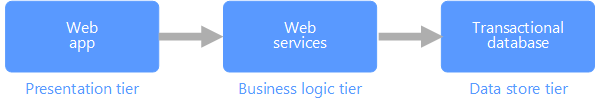

# Transactional data

Transactional data is information that tracks the interactions related to an organization's activities. These interactions are typically business transactions, such as payments received from customers, payments made to suppliers, products moving through inventory, orders taken, or services delivered. Transactional events, which represent the transactions themselves, typically contain a time dimension, some numerical values, and references to other data. 

Transactions typically need to be *atomic* and *consistent*. Atomicity means that an entire transaction always succeeds or fails as one unit of work, and is never left in a half-completed state. If a transaction cannot be completed, the database system must roll back any steps that were already done as part of that transaction. In a traditional RDBMS, this rollback happens automatically if a transaction cannot be completed. Consistency means that transactions always leave the data in a valid state. (These are very informal descriptions of atomicity and consistency. There are more formal definitions of these properties, such as [ACID](https://en.wikipedia.org/wiki/ACID).)

Transactional databases can support strong consistency for transactions using various locking strategies, such as pessimistic locking, to ensure that all data is strongly consistent within the context of the enterprise, for all users and processes. 

The most common deployment architecture that uses transactional data is the data store tier in a 3-tier architecture. A 3-tier architecture typically consists of a presentation tier, business logic tier, and data store tier. A related deployment architecture is the [N-tier](/azure/architecture/guide/architecture-styles/n-tier) architecture, which may have multiple middle-tiers handling business logic.

## Typical traits of transactional data

Transactional data tends to have the following traits:

| Requirement | Description |
| --- | --- |
| Normalization | Highly normalized |
| Schema | Schema on write, strongly enforced|
| Consistency | Strong consistency, ACID guarantees |
| Integrity | High integrity |
| Uses transactions | Yes |
| Locking strategy | Pessimistic or optimistic|
| Updateable | Yes |
| Appendable | Yes |
| Workload | Heavy writes, moderate reads |
| Indexing | Primary and secondary indexes |
| Datum size | Small to medium sized |
| Model | Relational |
| Data shape | Tabular |
| Query flexibility | Highly flexible |
| Scale | Small (MBs) to Large (a few TBs) | 

## See Also

[Online Transaction Processing](../scenarios/online-transaction-processing.md)
