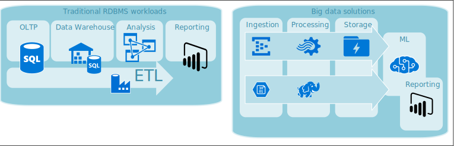

This article provides an overview of the Azure database solutions described in Azure Architecture Center.

Azure Database solutions include both traditional relational database management system (RDBMS) and big data solutions.

RDBMS workloads include online transaction processing (OLTP) and online analytical processing (OLAP).
Data from multiple sources in the organization can be consolidated into a data warehouse.
You can use an extract, transform, and load (ETL) process to move and transform the source data.

A big data architecture is designed to handle the ingestion, processing, and analysis of large or complex data.
Big data solutions typically involve a large amount of non-relational data, which traditional RDBMS systems aren't well suited to store.
This type of database is referred to as *NoSQL* (not only SQL).

This article provides resources to learn about Azure databases. It outlines paths to implement the architectures that meet your needs, and best practices to keep in mind as you design your solutions.

There are many architectures for you to draw from to address your database needs.
We also provide solution ideas for you to build on, which include links to all the components you need.

## Learn about databases on Azure

If you're new to databases on Azure, the best place to start is Microsoft Learn. This free online platform provides videos and tutorials for hands-on learning. Microsoft Learn offers learning paths that are based on your job role, such as developer or data analyst.

[You can browse Azure data modules](/training/browse/?products=azure&terms=database) or use this learning path to understand [Azure SQL fundamentals](/training/paths/azure-sql-fundamentals).

Here are some Learn modules you might find useful:

- [Choose a data storage approach in Azure](/training/modules/choose-storage-approach-in-azure)
- [Design your migration to Azure](/training/modules/design-your-migration-to-azure)
- [Deploy Azure SQL Database](/training/modules/deploy-azure-sql-database)
- [Explore Azure database and analytics services](/training/modules/azure-database-fundamentals)
- [Secure your Azure SQL Database](/training/modules/secure-your-azure-sql-database)

## Path to production

To find options helpful for dealing with relational data, consider these resources:

- To learn about resources for gathering data from multiple sources and how to and apply data transformations within the data pipeline, see [Extract, transform, and load (ETL)](../data-guide/relational-data/etl.yml).
- To learn about Online analytical processing (OLAP), which organizes large business databases and supports complex analysis, see [Online analytical processing](../data-guide/relational-data/online-analytical-processing.yml).
- Online transaction processing systems record business interactions as they occur. For more information, see [Online transaction processing (OLTP)](../data-guide/relational-data/online-transaction-processing.md).

A *non-relational database* doesn't use the tabular schema of rows and columns. For more information, see [Non-relational data and NoSQL](../data-guide/big-data/non-relational-data.yml).

To learn about data lakes, which hold a large amount of data in its native, raw format, see [Data lakes](../data-guide/scenarios/data-lake.md).

A big data architecture can handle ingestion, processing, and analysis of data that is too large or too complex for traditional database systems.

- For more information, see [Big data architectures](../data-guide/big-data/index.yml).
- To learn about designing a system that scales well as data grows, see [Build a scalable system for massive data](../data-guide/scenarios/build-scalable-database-solutions-azure-services.md).
- To learn more about Azure Databricks, an Apache Spark–based analytics service for big data analytics and AI solutions, see [Monitoring Azure Databricks](../databricks-monitoring/index.md).

A hybrid cloud is an IT environment that combines public cloud and on-premises datacenters. For more information, see [Extend on-premises data solutions to the cloud](../data-guide/scenarios/hybrid-on-premises-and-cloud.md).

Azure Cosmos DB is a fully managed NoSQL database service for modern app development. For more information, see [Azure Cosmos DB resource model](/azure/cosmos-db/account-databases-containers-items).

To learn about the options for transferring data to and from Azure, see [Transfer data to and from Azure](../data-guide/scenarios/data-transfer.md).

## Best practices

Review these best practices when designing your solutions.

| Best practices | Description |
|--------------- |------------ |
| [Data management patterns](../patterns/category/data-management.md) | Data management is the key element of cloud applications. It influences most quality attributes. |
| [Transactional Outbox pattern with Azure Cosmos DB](../best-practices/transactional-outbox-cosmos.yml) | Learn how to use the Transactional Outbox pattern for reliable messaging and guaranteed delivery of events. |
| [Distribute your data globally with Azure Cosmos DB](/azure/cosmos-db/distribute-data-globally) | To achieve low latency and high availability, some applications need to be deployed in datacenters that are close to their users. |
| [Use the best data store for the job](/azure/architecture/guide/design-principles/use-best-data-store) | Pick the storage technology that is the best fit for your data and how it will be used. |
| [Security in Azure Cosmos DB](/azure/cosmos-db/database-security) | Security best practices help prevent, detect, and respond to database breaches. |
| [Secure data solutions](../data-guide/scenarios/securing-data-solutions.md) | Address concerns around increased accessibility to data in the cloud and how to secure it. |
| [Continuous backup with point-in-time restore in Azure Cosmos DB](/azure/cosmos-db/continuous-backup-restore-introduction) | Learn about Azure Cosmos DB point-in-time restore feature. |
| [Achieve high availability with Azure Cosmos DB](/azure/cosmos-db/high-availability) | Azure Cosmos DB provides multiple features and configuration options to achieve high availability. |
| [High availability for Azure SQL Database and SQL Managed Instance](/azure/azure-sql/database/high-availability-sla) | The database shouldn't be a single point of failure in your architecture. |

## Azure SQL Database security baselines

Security is a vital part of any database solution.

- [Azure security baseline for Azure SQL Database](/security/benchmark/azure/baselines/sql-database-security-baseline)
- [Azure security baseline for Azure Database Migration Service](/security/benchmark/azure/baselines/database-migration-security-baseline)

## Technology choices

There are many options for technologies to use with Azure Databases.
These articles help you choose the best technologies for your needs.

- [Choose an analytical data store in Azure](../data-guide/technology-choices/analytical-data-stores.md)
- [Choose a data analytics technology in Azure](../data-guide/technology-choices/analysis-visualizations-reporting.md)
- [Choose a batch processing technology in Azure](../data-guide/technology-choices/batch-processing.md)
- [Choose a big data storage technology in Azure](../data-guide/technology-choices/data-storage.md)
- [Choose a data pipeline orchestration technology in Azure](../data-guide/technology-choices/pipeline-orchestration-data-movement.md)
- [Choose a real-time message ingestion technology in Azure](../data-guide/technology-choices/real-time-ingestion.md)
- [Choose a search data store in Azure](../data-guide/technology-choices/search-options.md)
- [Choose a stream processing technology in Azure](../data-guide/technology-choices/stream-processing.md)

## Stay current with databases

Refer to [Azure updates](https://azure.microsoft.com/updates/?category=databases) to keep current with Azure Databases technology.

## Related resources

These architectures use database technologies.

- [SQL Managed Instance with customer-managed keys](../example-scenario/data/sql-managed-instance-cmk.yml)
- [Optimized storage with logical data classification](../solution-ideas/articles/optimized-storage-logical-data-classification.yml)
- [Globally distributed applications using Azure Cosmos DB](../solution-ideas/articles/globally-distributed-mission-critical-applications-using-cosmos-db.yml)

Here are some other resources:

- [Adatum Corporation scenario for data management and analytics in Azure](/azure/cloud-adoption-framework/scenarios/data-management/architectures/reference-architecture-adatum)
- [Lamna Healthcare scenario for data management and analytics in Azure](/azure/cloud-adoption-framework/scenarios/data-management/architectures/reference-architecture-lamna)
- [Optimize administration of SQL Server instances](../hybrid/azure-arc-sql-server.yml)
- [Processing free-form text for search](../data-guide/scenarios/search.yml)
- [Relecloud scenario for data management and analytics in Azure](/azure/cloud-adoption-framework/scenarios/data-management/architectures/reference-architecture-relecloud)
- [Working with CSV and JSON files for data solutions](../data-guide/scenarios/csv-and-json.md)

### Example solutions

These solution ideas are some of the example approaches that you can adapt to your needs.

- [Data cache](../solution-ideas/articles/data-cache-with-redis-cache.yml)
- [Enterprise data warehouse](../solution-ideas/articles/enterprise-data-warehouse.yml)
- [Loan credit risk and default modeling](../solution-ideas/articles/loan-credit-risk-analyzer-and-default-modeling.yml)
- [Messaging](../solution-ideas/articles/messaging.yml)
- [Mining equipment monitoring](../solution-ideas/articles/monitor-mining-equipment.yml)
- [Multi-region web app with private connectivity to database](../example-scenario/sql-failover/app-service-private-sql-multi-region.yml)
- [Serverless apps using Azure Cosmos DB](../solution-ideas/articles/serverless-apps-using-cosmos-db.yml)

### Similar database products

If you're familiar with Amazon Web Services (AWS) or Google Cloud, refer to the following comparisons:

- [Relational database technologies on Azure and AWS](../aws-professional/databases.md)
- [Google Cloud to Azure services comparison - Data platform](../gcp-professional/services.md#data-platform)

## Next steps

Refer to the [Azure Data Architecture Guide](index.md) for more details.
