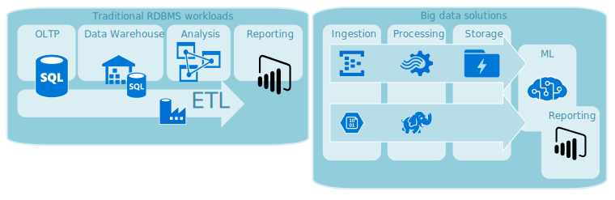

This article provides an overview of the Azure database solutions described in Azure Architecture Center.

Azure Database solutions include both traditional Relational Database Management System (RDBMS) and big data solutions.

RDBMS workloads include online transaction processing (OLTP) and online analytical processing (OLAP).
Data from multiple sources in the organization might be consolidated into a data warehouse. You might use an extract, transform, and load (ETL) process to move and transform the source data.

A big data architecture is designed to handle the ingestion, processing, and analysis large or complex data.
Big data solutions typically involve a large amount of non-relational data, which traditional RDBMS systems aren't well suited to store.
This type of database is referred to as *Not only SQL* or *NoSQL*.

## Learn about databases on Azure

If you're new to databases on Azure, the best place to learn more is with Microsoft Learn, a free, online training platform.
You'll find videos, tutorials, and hands-on learning for specific products and services.
Microsoft Learn offers learning paths based on your job role, such as developer or data analyst.

[You can browse Azure data modules](/learn/browse/?products=azure&terms=database) or use this Learning Path to understand [Azure SQL fundamentals](/learn/paths/azure-sql-fundamentals).

Here are some Learn modules you might find useful:

- [Choose a data storage approach in Azure](/learn/modules/choose-storage-approach-in-azure)
- [Design your migration to Azure](/learn/modules/design-your-migration-to-azure)
- [Deploy Azure SQL Database](/learn/modules/deploy-azure-sql-database)
- [Explore Azure database and analytics services](/learn/modules/azure-database-fundamentals)
- [Secure your Azure SQL Database](/learn/modules/secure-your-azure-sql-database)

## Path to production

INTRO TEXT

To learn about resources for gathering data from multiple sources and how to and apply data transformation within the data pipeline, see [Extract, transform, and load (ETL)](../data-guide/relational-data/etl.yml).

To learn about Online analytical processing (OLAP), which organizes large business databases and supports complex analysis, see [Online analytical processing](../data-guide/relational-data/online-analytical-processing.yml).

A *non-relational database* does not use the tabular schema of rows and columns. For more information, see [Non-relational data and NoSQL](../data-guide/big-data/non-relational-data.yml).

To learn about designing a system that scales well as data grows, see [Build a scalable system for massive data](../data-guide/scenarios/build-scalable-database-solutions-azure-services.yml).

A big data architecture can handle ingestion, processing, and analysis of data that is too large or complex for traditional database systems. For more information, see [Big data architectures](../data-guide/big-data.yml).

In a big data architecture, you might need an analytical data store that serves processed data in a structured format that can be queried using analytical tools. For more information, see [Choose an analytical data store in Azure](../data-guide/technology-choices/analytical-data-stores.yml).

To learn about data lakes, which hold a large amount of data in its native, raw format, see [Data lakes](../data-guide/scenarios/data-lake.yml).

A hybrid cloud is an IT environment that combines public cloud and on-premises datacenters. For more information, see [Extend on-premises data solutions to the cloud](../data-guide/scenarios/hybrid-on-premises-and-cloud.yml).

Azure Cosmos DB is a fully managed NoSQL database service for modern app development. For more information, see [Azure Cosmos DB resource model](../cosmos-db/account-databases-containers-items.yml).

Azure Databricks is a fast, powerful Apache Spark–based analytics service for big data analytics and AI solutions. For more information, see [Monitoring Azure Databricks](../databricks-monitoring.yml).

To learn about the options for transferring data to and from Azure, see [Transfer data to and from Azure](../data-guide/scenarios/data-transfer.yml).

## Best practices

INTRO TEXT

- [Data management patterns](../patterns/category/data-management.yml)
  Data management is the key element of cloud applications.
  It influences most quality attributes.

- [Transactional Outbox pattern with Azure Cosmos DB](../best-practices/transactional-outbox-cosmos.yml)
  Learn how to use the Transactional Outbox pattern for reliable messaging and guaranteed delivery of events.

- [Distribute your data globally with Azure Cosmos DB](../cosmos-db/distribute-data-globally.yml)
  To achieve low latency and high availability, some applications need to be deployed in datacenters that are close to their users.

- [Use the best data store for the job](../guide/design-principles/use-the-best-data-store.yml)
  Pick the storage technology that is the best fit for your data and how it will be used.

- [Security in Azure Cosmos DB](../cosmos-db/database-security.yml)
  Security best practices help prevent, detect, and respond to database breaches.

- [Secure data solutions](../data-guide/scenarios/securing-data-solutions.yml)
  Address concerns around increased accessibility to data in the cloud and how to secure it.

- [Continuous backup with point-in-time restore in Azure Cosmos DB](../cosmos-db/continuous-backup-restore-introduction.yml)
  Learn about Azure Cosmos DB's point-in-time restore feature.

- [Achieve high availability with Cosmos DB](../cosmos-db/high-availability.yml)
  Cosmos DB provides multiple features and configuration options to achieve high availability.

- [High availability for Azure SQL Database and SQL Managed Instance](../azure-sql/database/high-availability-sla.yml)
  The database shouldn't be a single point of failure in your architecture.

## Azure SQL Database security baselines

- [Azure security baseline for Azure SQL Database](https://docs.microsoft.com/security/benchmark/azure/baselines/sql-database-security-baseline)
- [Azure security baseline for Azure Database Migration Service](https://docs.microsoft.com/security/benchmark/azure/baselines/database-migration-security-baseline)

## Technology choices

There are many options for technologies to use with Azure Databases.
These articles help you choose the best technologies for your needs.

- [Choose an analytical data store in Azure](../data-guide/technology-choices/analytical-data-stores.yml)
- [Choose a data analytics technology in Azure](../data-guide/technology-choices/analysis-visualizations-reporting.yml)
- [Choose a batch processing technology in Azure](../data-guide/technology-choices/batch-processing.yml)
- [Choose a big data storage technology in Azure](../data-guide/technology-choices/data-storage.yml)
- [Choose a data pipeline orchestration technology in Azure](../data-guide/technology-choices/pipeline-orchestration-data-movement.yml)
- [Choose a real-time message ingestion technology in Azure](../data-guide/technology-choices/real-time-ingestion.yml)
- [Choose a search data store in Azure](../data-guide/technology-choices/search-options.yml)
- [Choose a stream processing technology in Azure](../data-guide/technology-choices/stream-processing.yml)

## Stay current with databases

Refer to [Azure updates](https://azure.microsoft.com/updates/?category=databases) to keep current with Azure Databases technology.

## Additional resources

INTRO TEXT

- [Serverless apps using Cosmos DB](../solution-ideas/articles/serverless-apps-using-cosmos-db.yml)

- [Mining equipment monitoring](../solution-ideas/articles/monitor-mining-equipment.yml)

- [Messaging](../solution-ideas/articles/messaging.yml)

- [Loan credit risk and default modeling](../solution-ideas/articles/loan-credit-risk-analyzer-and-default-modeling.yml)

- [Enterprise data warehouse](../solution-ideas/articles/enterprise-data-warehouse.yml)

- [Data cache](../solution-ideas/articles/data-cache-with-redis-cache.yml)

- [SQL Managed Instance with customer-managed keys](../example-scenario/data/sql-managed-instance-cmk.yml)

- [Optimized storage with logical data classification](../solution-ideas/articles/optimized-storage-logical-data-classification.yml)

- [Optimize administration of SQL Server instances](../hybrid/azure-arc-sql-server.yml)

- [Multi-region web app with private connectivity to database](../example-scenario/sql-failover/app-service-private-sql-multi-region.yml)

- [Globally distributed applications using Cosmos DB](../solution-ideas/articles/globally-distributed-mission-critical-applications-using-cosmos-db.yml)

- [Lamna Healthcare scenario for data management and analytics in Azure](/azure/cloud-adoption-framework/scenarios/data-management/architectures/reference-architecture-lamna)

- [Relecloud scenario for data management and analytics in Azure](/azure/cloud-adoption-framework/scenarios/data-management/architectures/reference-architecture-relecloud)

- [Adatum Corporation scenario for data management and analytics in Azure](/azure/cloud-adoption-framework/scenarios/data-management/architectures/reference-architecture-adatum)

