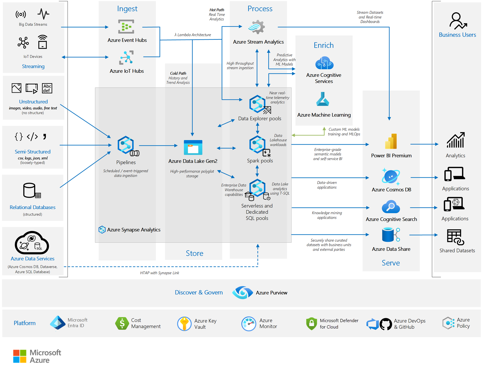

## Use case definition
To support this worked example, the fictitious firm "Contoso" is used with an Azure Data Platform based upon Microsoft Reference Architectures.

### Data Service - Component View
Contoso has implemented the following foundational Azure architecture, which is a subset of the [Enterprise Landing Zone](/azure/cloud-adoption-framework/ready/landing-zone/#azure-landing-zone-conceptual-architecture) design.

*The numbers in the following descriptions correspond to the preceding diagram.*

### Contoso's Azure Foundations - Workflow

1. **Enterprise enrollment** - Contoso's top parent enterprise enrollment within Azure reflecting its commercial agreement with Microsoft, its organizational account structure and available Azure subscriptions. It provides the billing foundation for subscriptions and how the digital estate is administered.
1. **Identity and access management** – The components required to provide identity, authentication, resource access and authorization services across Contoso's Azure estate.
1. **Management group and subscription organization** - A scalable group hierarchy aligned to the data platform's core capabilities, allowing operationalization at scale using centrally managed security and governance where workloads have clear separation. Management groups provide a governance scope over the subscriptions.
1. **Management subscription** - A dedicated subscription for the various management level  functions of required to support the data platform.
1. **Connectivity subscription** - A dedicated subscription for the connectivity functions of the data platform enabling it to identify named services, determine secure routing and communication across and between internal and external services.
1. **Landing zone subscription** – One-to-many subscriptions for Azure native, online applications, internal and external facing workloads and resources
1. **DevOps platform** - The DevOps platform that supports the entire Azure estate. This platform contains the code base source control repository and CI/CD pipelines enabling automated deployments of infrastructure as code (IaC).

> [!NOTE]
> Many customers still retain a large infrastructure as a service (IaaS) footprint. To provide recovery capabilities across IaaS, the key component to be added is [Azure Site Recovery](/azure/site-recovery/site-recovery-overview). [Site Recovery](/azure/site-recovery/site-recovery-faq) orchestrates and automates the replication of Azure VMs between regions, on-premises virtual machines and physical servers to Azure, and on-premises machines to a secondary datacenter.

Within this foundational structure, Contoso has implemented the following elements to support its enterprise business intelligence needs, aligned to the guidance in [Analytics end-to-end with Azure Synapse](/azure/architecture/example-scenario/dataplate2e/data-platform-end-to-end).

*Contoso's data platform*

### Contoso's Data Platform - Workflow

The workflow is read from left to right, following the flow of data:

- **Data sources** - The sources or types of data that the data platform can consume from.
- **Ingest** - The Platform's capability to ingest data from various sources of varying structure and speed. This design reflects a [Lambda architecture](/azure/architecture/data-guide/big-data/#lambda-architecture).
- **Store** - The capability to securely store data at scale that has been ingested onto the platform.
- **Process** - The Platform's capability to process data, making it "fit for purpose" for downstream processes like cleansing, standardizing and modeling. The pre-processing of data typically ensures that it's in a "position and a condition, ready for use."
- **Enrich** - The capability to enhance data processed on the platform via statistical, machine learning, or other modeling techniques or prebuilt Azure AI services.
- **Serve** - The Platform's capability to shape and present data for downstream consumption.
- **Data consumers** - The individuals, applications or downstream processes that consume data from the platforms' various serving touchpoints.
- **Discover and govern** - The Platform's capabilities to govern the data it contains and ensure it's indexed, discoverable/searchable, well-described, with full lineage, and is transparent to its end users and consuming processes.
- **Platform** - The foundation upon which the platform is built, that is, Contoso's Azure foundations as described previously.

> [!NOTE]
> For many customers, the conceptual level of the Data Platform reference architecture that's used aligns, but the physical implementation might vary. For example, ELT (extract, load, transform) processes might be performed through [Azure Data Factory](/azure/data-factory/), and data modeling by [Azure SQL server](/azure/azure-sql/?view=azuresql). To address this concern, the following [Stateful vs stateless components](#stateful-vs-stateless-components) section provides guidance.

For the Data Platform, Contoso has selected the lowest recommended production service tiers for all components and has chosen to adopt a "Redeploy on disaster" disaster recovery (DR) strategy based upon an operating cost-minimization approach.

The following sections provide a baseline understanding of the DR process and levers available to customers to uplift this posture.

## Azure service and component view

The following tables present a breakdown of each Azure service and component used across the Contoso – Data platform, with options for DR uplift.
> [!NOTE]
> The following sections are organized by stateful versus stateless services.

### Stateful foundational components

- **Microsoft Entra ID including role entitlements**
    - Component recovery responsibility: Microsoft
    - Workload/configuration recovery responsibility: Microsoft
    - Contoso SKU selection: Premium P1
    - DR uplift options: Microsoft Entra reliability is part of its software as a service (SaaS) offering.
    - Notes
        - [Advancing service resilience in Microsoft Entra ID](https://azure.microsoft.com/en-us/blog/advancing-service-resilience-in-azure-active-directory-with-its-backup-authentication-service/)

- **Azure Key Vault**
    - Component recovery responsibility: Microsoft
    - Workload/configuration recovery responsibility: Microsoft
    - Contoso SKU selection: N/A
    - DR uplift options: N/A, Covered as part of the Azure service.

- **Recovery Services Vault**
    - Component recovery responsibility: Microsoft
    - Workload/configuration recovery responsibility: Microsoft
    - Contoso SKU selection: Default (geo-redundant storage (GRS))
    - DR uplift options: Enabling [Cross Region Restore](/azure/backup/backup-create-rs-vault#set-cross-region-restore) creates data restoration in the secondary, [paired region](/azure/reliability/cross-region-replication-azure).
    - Notes
        - While locally redundant storage (LRS) and zone-redundant storage (ZRS) are available, it requires configuration activities from the default setting.

- **Azure DevOps**
    - Component recovery responsibility: Microsoft
    - Workload/configuration recovery responsibility: Microsoft
    - Contoso SKU selection: DevOps Services
    - DR uplift options: DevOps [service and data reliability](/azure/devops/organizations/security/data-protection?view=azure-devops#data-availability) is part of its SaaS offering.
    - Notes
        - DevOps Server as the on-premises offering remains the customer's responsibility for disaster recovery.
        - If third party services (SonarCloud, Jfrog Artifactory, Jenkins build servers for example) are used, they remain the customer's responsibility for recovery from a disaster.
        - If IaaS VMs are used within the DevOps toolchain, they remain the customer's responsibility for recovery from a disaster.

### Stateless Foundational Components

- **Subscriptions**
    - Component recovery responsibility: Microsoft
    - Workload/configuration recovery responsibility: Microsoft
    - Contoso SKU selection: N/A
    - DR uplift options: N/A, Covered as part of the Azure service.

- **Management Groups**
    - Component recovery responsibility: Microsoft
    - Workload/configuration recovery responsibility: Microsoft
    - Contoso SKU selection: N/A
    - DR uplift options: N/A, Covered as part of the Azure service.

- **Azure Monitor**
    - Component recovery responsibility: Microsoft
    - Workload/configuration recovery responsibility: Microsoft
    - Contoso SKU selection: N/A
    - DR uplift options: N/A, Covered as part of the Azure service.

- **Cost Management**
    - Component recovery responsibility: Microsoft
    - Workload/configuration recovery responsibility: Microsoft
    - Contoso SKU selection: N/A
    - DR uplift options: N/A, Covered as part of the Azure service.

- **Microsoft Defender for Cloud**
    - Component recovery responsibility: Microsoft
    - Workload/configuration recovery responsibility: Microsoft
    - Contoso SKU selection: N/A
    - DR uplift options: N/A, Covered as part of the Azure service.

- **Azure DNS**
    - Component recovery responsibility: Microsoft
    - Workload/configuration recovery responsibility: Microsoft
    - Contoso SKU selection: Single Zone - Public
    - DR uplift options: N/A, DNS is highly available by design.

- **Network Watcher**
    - Component recovery responsibility: Microsoft
    - Workload/configuration recovery responsibility: Microsoft
    - Contoso SKU selection: N/A
    - DR uplift options: N/A, Covered as part of the Azure service.

- **Virtual Networks, including Subnets, user-defined route (UDR) & network security groups (NSG)**
    - Component recovery responsibility: Contoso
    - Workload/configuration recovery responsibility: Contoso
    - Contoso SKU selection: N/A
    - DR uplift options: [VNETs can be replicated](/azure/virtual-network/virtual-network-disaster-recovery-guidance#business-continuity) into the secondary, paired region.

- **Azure Firewall**
    - Component recovery responsibility: Contoso
    - Workload/configuration recovery responsibility: Contoso
    - Contoso SKU selection: Standard
    - DR uplift options: Azure Firewall is [highly available by design](/azure/firewall/features#built-in-high-availability) and can be created with [Availability Zones](/azure/firewall/deploy-availability-zone-powershell) for increased availability.

- **Azure DDoS**
    - Component recovery responsibility: Microsoft
    - Workload/configuration recovery responsibility: Contoso
    - Contoso SKU selection: DDoS Network Protection
    - DR uplift options: N/A, Covered as part of the Azure service.

- **ExpressRoute Circuit**
    - Component recovery responsibility: Contoso, connectivity partner and Microsoft
    - Workload/configuration recovery responsibility: Connectivity partner and Microsoft
    - Contoso SKU selection: Standard
    - DR uplift options:
        - ExpressRoute can be uplifted to use [private peering](/azure/expressroute/designing-for-disaster-recovery-with-expressroute-privatepeering), delivering a geo-redundant service.
        - ExpressRoute also has [high availability (HA) designs](/azure/expressroute/designing-for-high-availability-with-expressroute) available.
        - [Site-to-Site VPN connection](/azure/expressroute/use-s2s-vpn-as-backup-for-expressroute-privatepeering) can be used as a backup for ExpressRoute.
    - Notes
        - The ExpressRoute has [inbuilt redundancy](/azure/expressroute/expressroute-introduction#redundancy), with each circuit consisting of two connections to two Microsoft Enterprise edge routers (MSEEs) at an ExpressRoute Location from the connectivity provider/client's network edge.
        - [ExpressRoute premium](/azure/expressroute/expressroute-faqs#what-is-expressroute-premium) circuit enables access to all Azure regions globally.

- **VPN Gateway**
    - Component recovery responsibility: Contoso
    - Workload/configuration recovery responsibility: Contoso
    - Contoso SKU selection: Single Zone - VpnGw1
    - DR uplift options: A VPN gateway can be deployed into an [Availability Zone](/azure/reliability/availability-zones-overview) with the VpnGw#AZ SKUs to provide a [zone redundant service](/azure/vpn-gateway/about-zone-redundant-vnet-gateways).

- **Azure Load Balancer**
    - Component recovery responsibility: Contoso
    - Workload/configuration recovery responsibility: Contoso
    - Contoso SKU selection: Standard
    - DR uplift options:
        - A load balancer can be configured for [Zone redundancy within a region with availability zones](/azure/load-balancer/load-balancer-standard-availability-zones). If so, the data path survives as long as one zone within the region remains healthy.
        - Depending on the primary region, a [cross-region load balancer](/azure/load-balancer/cross-region-overview#build-cross-region-solution-on-existing-azure-load-balancer) can be deployed for a highly available, cross regional deployment.
    - Notes
        - [Azure Traffic Manager](/azure/traffic-manager/traffic-manager-overview) is a DNS-based traffic load balancer. This service supports the distribution of traffic for public-facing applications across the global Azure regions. This solution provides protection from a regional outage within a high availability design.

### Stateful data platform-specific services

- **Storage Account: Azure Data Lake Gen2**
    - Component recovery responsibility: Microsoft
    - Workload/configuration recovery responsibility: Contoso
    - Contoso SKU selection: LRS
    - DR uplift options: Storage Accounts have a broad range of [data redundancy](/azure/storage/common/storage-redundancy) options from primary region redundancy up to secondary region redundancy.
    - Notes
        - GRS is recommended to uplift redundancy, providing a copy of the data in the paired region.

- **Azure Event Hubs**
    - Component recovery responsibility: Microsoft
    - Workload/configuration recovery responsibility: Contoso
    - Contoso SKU selection: Standard
    - DR uplift options: Enable [availability zones](/azure/event-hubs/event-hubs-geo-dr?tabs=portal#availability-zones) for zone-level resilience (continued operation during a single zone failure). For region-wide disruptions add the [geo-disaster recovery](/azure/event-hubs/event-hubs-geo-dr?tabs=portal) capability to support failover and subsequent recovery procedures.
    - Notes
        - By design, Event Hubs geo-disaster recovery doesn't replicate data, therefore there are several [considerations to keep in mind](/azure/event-hubs/event-hubs-geo-dr?tabs=portal#considerations) for failover and fallback.

- **Azure IoT Hubs**
    - Component recovery responsibility: Microsoft
    - Workload/configuration recovery responsibility: Contoso
    - Contoso SKU selection: Standard
    - DR uplift options:
    - IoT Hub resilience (continuity during localized faults) can be increased by a [cross regional HA implementation](/azure/iot-hub/iot-hub-ha-dr#achieve-cross-region). Cross-region deployment plus failover processes address recoverability.
        - Microsoft provides the following [guidance for HA/DR options](/azure/iot-hub/iot-hub-ha-dr#choose-the-right-hadr-option).
    - Notes
        - IoT Hub provides Microsoft-Initiated Failover and Manual Failover by replicating data to the paired region for each IoT hub.
        - IoT Hub provides [Intra-Region HA](/azure/iot-hub/iot-hub-ha-dr#intra-region-ha) and automatically uses an availability zone if created in a [predefined set of Azure regions](/azure/iot-hub/iot-hub-ha-dr#availability-zones).

- **Azure Stream Analytics**
    - Component recovery responsibility: Microsoft
    - Workload/configuration recovery responsibility: Contoso
    - Contoso SKU selection: Standard
    - DR uplift options: While Azure Stream Analytics is a fully managed platform as a service (PaaS) offering, it doesn't provide automatic geo-failover. [Geo-redundancy](/azure/stream-analytics/geo-redundancy) can be achieved by deploying identical Stream Analytics jobs in multiple Azure regions.

- **Azure Machine Learning**
    - Component recovery responsibility: Contoso and Microsoft
    - Workload/configuration recovery responsibility: Contoso
    - Contoso SKU selection: General Purpose, D Series instances
    - DR uplift options:
        - Azure Machine Learning depends on multiple Azure services, some of which are [provisioned in the customer's subscription](/azure/machine-learning/how-to-high-availability-machine-learning#understand-azure-services-for-azure-machine-learning). As such, the customer remains responsible for the high-availability configuration of these services.
        - Resiliency can be uplifted via a [multi-regional deployment](/azure/machine-learning/how-to-high-availability-machine-learning#plan-for-multi-regional-deployment).
    - Notes:
        - Azure Machine Learning itself doesn't [provide automatic failover or disaster recovery](/azure/machine-learning/how-to-high-availability-machine-learning).

- **Power BI**
    - Component recovery responsibility: Microsoft
    - Workload/configuration recovery responsibility: Microsoft
    - Contoso SKU selection: Power BI Pro
    - DR uplift options: N/A, Power BI's reliability is part of its SaaS offering.
    - Notes
        - Power BI resides in the Office365 tenancy, not that of Azure.
        - [Power BI uses Azure Availability Zones](/power-bi/enterprise/service-admin-failover#what-does--high-availability--mean-for-power-bi-) to protect Power BI reports, applications and data from datacenter failures.
        - In the case of regional failure, Power BI will [failover to a new region](/power-bi/enterprise/service-admin-failover#what-is-a-power-bi-failover-), usually in the same geographical location, as noted in the [Microsoft Trust Center](https://www.microsoft.com/en-us/trust-center/product-overview?rtc=1).

- **Azure Cosmos DB**
    - Component recovery responsibility: Microsoft
    - Workload/configuration recovery responsibility: Microsoft
    - Contoso SKU selection: Single Region Write with Periodic backup
    - DR uplift options:
        - Single-region accounts might lose availability following a regional outage. Resiliency can be uplifted to a [single write region and at least a second (read) region and enable Service-Managed failover](/azure/cosmos-db/high-availability#availability).
        - It's [recommended](/azure/cosmos-db/high-availability#availability) that Azure Cosmos DB accounts used for production workloads to enable automatic failover. In the absence of this configuration, the account experiences loss of write availability for all the duration of the write region outage, as manual failover won't succeed due to lack of region connectivity.
    - Notes
        - To protect against data loss in a region, Azure Cosmos DB provides two [different backup modes](/azure/cosmos-db/high-availability#durability) - *Periodic* and *Continuous.*
        - [Regional failovers](/azure/cosmos-db/high-availability#availability) are detected and handled in the Azure Cosmos DB client. They don't require any changes from the application.
        - The following guidance describes the [impact of a region outage based upon the Cosmos DB configuration](/azure/cosmos-db/high-availability#what-to-expect-during-a-region-outage).

- **Azure Data Share**
    - Component recovery responsibility: Microsoft
    - Workload/configuration recovery responsibility: Microsoft
    - Contoso SKU selection: N/A
    - DR uplift options: the Azure Data Share reliability can be uplifted by [HA deployment into a secondary region](/azure/data-share/disaster-recovery#achieving-business-continuity-for-azure-data-share).

- **Microsoft Purview**
    - Component recovery responsibility: Microsoft
    - Workload/configuration recovery responsibility: Contoso
    - Contoso SKU selection: N/A
    - DR uplift options: N/A
    - Notes
        - As of October 2024, [Microsoft Purview doesn't support automated business continuity and disaster recovery (BCDR)](/azure/purview/disaster-recovery#achieve-business-continuity-for-azure-purview). Until that support is added, the customer is responsible for all backup and restore activities.

### Stateless data platform-specific services

- **Azure Synapse: Pipelines**
    - Component recovery responsibility: Microsoft
    - Workload/configuration recovery responsibility: Contoso
    - Contoso SKU selection: Computed Optimized Gen2
    - Notes
        - If Self-Hosted Data Pipelines are used, they remain the customer's responsibility for recovery from a disaster.

- **Azure Synapse: Data Explorer Pools**
    - Component recovery responsibility: Microsoft
    - Workload/configuration recovery responsibility: Contoso
    - Contoso SKU selection: Computed Optimized, Small (4 cores)
    - DR uplift options: N/A, Synapse reliability is part of its SaaS offering.
    - Notes
        - Availability Zones are enabled by default for [Synapse Data Explorer](/azure/synapse-analytics/data-explorer/data-explorer-compare) where available.

- **Azure Synapse: Spark Pools**
    - Component recovery responsibility: Microsoft
    - Workload/configuration recovery responsibility: Contoso
    - Contoso SKU selection: Computed Optimized, Small (4 cores)
    - DR uplift options: N/A, Synapse reliability is part of its SaaS offering.
    - Notes
        - Currently, Azure Synapse Analytics only supports disaster recovery for [dedicated SQL pools](/azure/synapse-analytics/sql-data-warehouse/backup-and-restore#geo-backups-and-disaster-recovery) and [doesn't support it for Apache Spark pools](https://techcommunity.microsoft.com/t5/microsoft-defender-for-cloud/microsoft-defender-for-key-vault-deploy-to-azure-synapse/ba-p/3201308).

- **Azure Synapse: Serverless and Dedicated SQL Pools**
    - Component recovery responsibility: Microsoft
    - Workload/configuration recovery responsibility: Contoso
    - Contoso SKU selection: Computed Optimized Gen2
    - DR uplift options: N/A, Synapse reliability is part of its SaaS offering.
    - Notes
        - Azure Synapse Analytics [automatically takes snapshots](/azure/cloud-adoption-framework/migrate/azure-best-practices/analytics/azure-synapse#database-restore-points) throughout the day to create restore points that are available for seven days.
        - Azure Synapse Analytics performs a [standard geo-backup](/azure/cloud-adoption-framework/migrate/azure-best-practices/analytics/azure-synapse#disaster-recovery) once per day to a paired datacenter. The recovery point objective (RPO) for a geo-restore is 24 hours.
        - If Self-Hosted Data Pipelines are used, they remain the customers responsibility recovery from a disaster.

- **Azure AI services**
    - Component recovery responsibility: Microsoft
    - Workload/configuration recovery responsibility: Microsoft
    - Contoso SKU selection: Pay As You Go
    - DR uplift options: N/A, the APIs for AI services are hosted by [Microsoft-managed data centers](/azure/ai-services/what-are-ai-services#regional-availability).
    - Notes
        - If AI services has been deployed via customer deployed [Docker containers](/azure/ai-services/cognitive-services-container-support), recovery remains the responsibility of the customer.

- **Azure AI Search**
    - Component recovery responsibility: Microsoft
    - Workload/configuration recovery responsibility: Microsoft
    - Contoso SKU selection: Standard S1
    - DR uplift options:
        - AI Search can be raised to an [HA design](/azure/search/search-performance-optimization#high-availability) by using replicas across [availability zones](/azure/search/search-performance-optimization#availability-zones) and regions.
        - [Multiple services in separate regions](/azure/search/search-performance-optimization#multiple-services-in-separate-geographic-regions) can extend the resiliency further.
    - Notes
        - In AI Search business continuity (and disaster recovery) is achieved through multiple AI Search services.
        - there's [no built-in mechanism for disaster recovery](/azure/search/search-performance-optimization#disaster-recovery-and-service-outages). If continuous service is required during a catastrophic failure, the recommendation is to have a second service in a different region, and implementing a geo-replication strategy to ensure indexes are fully redundant across all services.

## Stateful vs stateless components
The speed of innovation across the Microsoft product suite and Azure, in particular, means the component set that we've used for this worked example quickly evolves. To future-proof against providing stale guidance and extend this guidance to components not explicitly covered in this document, the following section provides some instruction based upon the coarse-grain classification of state.

A component/service can be described as stateful if it's designed to remember preceding events or user interactions. Stateless means there's no record of previous interactions, and each interaction request has to be handled based entirely on information that comes with it.

For a DR scenario that calls for redeployment:

- Components/services that are "stateless", like Azure Functions and Azure Data Factory pipelines, can be redeployed from source control with at least a smoke test to validate availability before being introduced into the broader system.
- Components/services that are "stateful", like Azure SQL Database and storage accounts, require more attention.
    - When procuring the component, a key decision is selecting the data redundancy feature. This decision typically focuses on a trade-off between availability and durability with operating costs.
- Datastores also need a data backup strategy. The data redundancy functionality of the underlying storage mitigates this risk for some designs, while others, like SQL databases need a separate backup process.
    - If necessary, the component can be redeployed from source control with a validated configuration via a smoke-test.
    - A redeployed datastore must have its dataset rehydrated. Rehydration can be accomplished through data redundancy (when available) or a backup dataset. When rehydration has been completed, it must be validated for accuracy and completeness.
        - Depending on the nature of the backup process, the backup datasets might require validation before being applied. Backup process corruption or errors might result in an earlier backup being used in place of the latest version available.
    - Any delta between the component date/timestamp and the current date should be addressed by reexecuting or replaying the data ingestion processes from that point forward.
    - Once the component's dataset is up to date, it can be introduced into the broader system.

## Other key services
This section contains high availability (HA) and DR guidance for other key Azure data components and services.

- **Azure Databricks** - DR guidance can be found in the [product documentation](/azure/databricks/administration-guide/disaster-recovery).
- **Azure Analysis Services** - HA guidance can be found in the [product documentation](/azure/analysis-services/analysis-services-bcdr).
- **Azure Database for MySQL**
    - *Flexible Server* HA guidance can be found in the [product documentation](/azure/mysql/flexible-server/concepts-business-continuity).
    - *Single Server* HA guidance can be found in the [product documentation](/azure/mysql/single-server/concepts-business-continuity).
- **SQL**
    - *SQL on Azure VMs* guidance can be found in the [product documentation](/azure/azure-sql/virtual-machines/windows/business-continuity-high-availability-disaster-recovery-hadr-overview).
    - *Azure SQL and Azure SQL Managed Instance* guidance can be found in the [product documentation](/azure/azure-sql/database/business-continuity-high-availability-disaster-recover-hadr-overview?view=azuresql).

## Next steps
Now that you've learned about the scenario's architecture, you can learn about the [scenario details](../disaster-recovery/dr-for-azure-data-platform-scenario-details.yml).

## Related resources

- [DR for Azure Data Platform - Overview](dr-for-azure-data-platform-overview.yml)
- [DR for Azure Data Platform - Scenario details](dr-for-azure-data-platform-scenario-details.yml)
- [DR for Azure Data Platform - Recommendations](dr-for-azure-data-platform-recommendations.yml)
