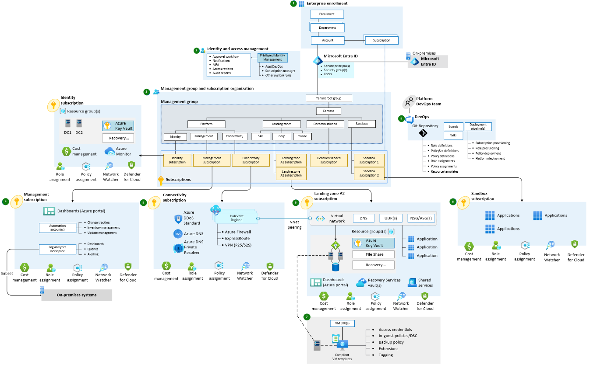

## Use case definition
To support this worked example, the fictitious firm "Contoso" is used with an Azure Data Platform based upon Microsoft Reference Architectures.

### Data Service - Component View
Contoso has implemented the following foundational Azure architecture, which is a subset of the [Enterprise Landing Zone](/azure/cloud-adoption-framework/ready/landing-zone/#azure-landing-zone-conceptual-architecture) design.

*The numbers in the following descriptions correspond to the preceding diagram.*

### Contoso's Azure Foundations - Workflow

1. **Enterprise enrollment** - Contoso's top parent enterprise enrollment within Azure reflecting its commercial agreement with Microsoft, its organizational account structure and available Azure subscriptions. It provides the billing foundation for subscriptions and how the digital estate is administered.
1. **Identity and access management** – The components required to provide identity, authentication, resource access and authorization services across Contoso's Azure estate.
1. **Management group and subscription organization** - A scalable group hierarchy aligned to the data platform's core capabilities, allowing operationalization at scale using centrally managed security and governance where workloads have clear separation. Management groups provide a governance scope over the subscriptions.
1. **Management subscription** - A dedicated subscription for the various management level  functions of required to support the data platform.
1. **Connectivity subscription** - A dedicated subscription for the connectivity functions of the data platform enabling it to identify named services, determine secure routing and communication across and between internal and external services.
1. **Landing zone subscription** – One-to-many subscriptions for Azure native, online applications, internal and external facing workloads and resources
1. **DevOps platform** - The DevOps platform that supports the entire Azure estate. This platform contains the code base source control repository and CI/CD pipelines enabling automated deployments of infrastructure as code (IaC).

> [!NOTE]
> Many customers still retain a large infrastructure as a service (IaaS) footprint. To provide recovery capabilities across IaaS, the key component to be added is [Azure Site Recovery](/azure/site-recovery/site-recovery-overview). [Site Recovery](/azure/site-recovery/site-recovery-faq) orchestrates and automates the replication of Azure VMs between regions, on-premises virtual machines and physical servers to Azure, and on-premises machines to a secondary datacenter.

Within this foundational structure, Contoso implements the following elements to support its enterprise business intelligence (BI) needs. These elements align with the [Data platform end-to-end guidance](/azure/architecture/example-scenario/dataplate2e/data-platform-end-to-end).

The following diagram shows the Contoso data platform.

:::image type="complex" border="false" source="../images/azure-analytics-end-to-end.svg" alt-text="Architecture diagram that shows a modern data platform that uses Microsoft Fabric." lightbox="../images/azure-analytics-end-to-end.svg":::
   The diagram shows a detailed architecture of a solution built on Microsoft Fabric. On the left, the architecture begins with diverse data sources that include on-premises systems, Amazon Web Services, Google Cloud Storage, and structured and unstructured data. Eventstreams ingest real-time data and on-premises databases mirror data to cloud platforms like Azure SQL Database, Azure Databricks, and Snowflake. A lakehouse stores raw and semistructured formats and Fabric Data Warehouse stores structured analytics. Shortcuts enable access across environments to enhance agility and integration. On the right, notebooks, stored procedures, DataFlow Gen2 in Fabric, and pipelines within Fabric process stored data. Advanced analytics and machine learning models enrich the data before and after it serves users. A lakehouse and SQL analytics endpoints, data agents, and Power BI make processed data available and provide visualizations to ensure high-quality, actionable insights. At the bottom, the platform layer supports the entire architecture with services like Microsoft Purview for governance, Microsoft Entra ID for identity management, and Azure Key Vault for secure secrets. GitHub and Azure DevOps enable continuous integration and continuous deployment (CI/CD). Azure Policy enforces compliance, the workspace monitoring feature in Fabric provides monitoring, and Copilot in Fabric provides AI-assisted development.
:::image-end:::

*Amazon Simple Storage Service (AWS S3), Amazon Web Services (AWS), AWS Kinesis, Google Cloud Storage, Google Cloud, Google Cloud Pub/Sub, and Snowflake are either registered trademarks or trademarks of their respective owners. Apache® and Apache Kafka are either registered trademarks or trademarks of the Apache Software Foundation in the United States and/or other countries. No endorsement by the respective trademark owners is implied by the use of these marks.*

### The Contoso data platform - Workflow

The workflow reads from left to right and shows the flow of data.

- **Data sources:** The sources and types of data that the platform can ingest.

- **Ingest**

  - Ingest structured, semistructured, and unstructured data into [OneLake](/fabric/onelake/onelake-overview) by using [Fabric Data Factory](/fabric/data-factory/data-factory-overview), [eventstreams](/fabric/real-time-intelligence/event-streams/overview), [notebooks](/fabric/data-engineering/how-to-use-notebook), [shortcuts](/fabric/onelake/onelake-shortcuts), or [mirroring](/fabric/mirroring/overview).

  - Use Data Factory for batch extract, transform, and load (ETL) and extract, load, and transform (ELT) pipelines. Use eventstreams for real-time ingestion via the [Real-Time Intelligence hub](/fabric/real-time-hub/real-time-hub-overview).

  - [Mirror supported databases](/fabric/mirroring/overview#types-of-mirroring) for near real-time replication or use shortcuts to access external data without copying the data into OneLake.

  -  Use [eventstreams](/fabric/real-time-intelligence/event-streams/overview) to enable real-time ingestion and support a [Lambda architecture](/azure/architecture/data-guide/big-data/#lambda-architecture).

- **Store**

  - OneLake stores all ingested data. OneLake is the unified data lake in Microsoft Fabric that serves as the foundation for all Fabric experiences. OneLake supports open formats like Delta, Parquet, and comma-separated values (CSV). It also provides built-in geo-redundancy and [business continuity and disaster recovery (BCDR) options](/fabric/onelake/onelake-disaster-recovery) to ensure durability and resilience. With OneLake as the foundation, Fabric provides specialized services to organize and manage data.

    - The [lakehouse](/fabric/data-engineering/lakehouse-overview) combines the flexibility of a data lake with the structured query capabilities of a data warehouse. It supports large-scale analytics and machine learning workloads while enforcing schemas to keep data organized and manageable.

    - The [data warehouse](/fabric/data-warehouse/data-warehousing) is a managed, scalable SQL-based environment optimized for structured queries and enterprise analytics. It delivers high performance for BI and reporting workloads.

    - The [eventhouse](/fabric/real-time-intelligence/eventhouse) manages real-time event streaming and processing. It ingests and analyzes time-sensitive data for scenarios like Internet of Things (IoT) telemetry and operational monitoring.

    - The mirrored database provides near real-time replication of operational data from sources like Azure SQL Database or Azure Cosmos DB into OneLake. This approach keeps analytics up to date without requiring complex ETL processes.

- **Process**

  - Fabric provides multiple ways to process and transform data. Choose your approach based on your workload and skill set. Whether you use low-code ETL flows, perform advanced data engineering, apply real-time analytics, or require embedded business logic, Fabric provides tools that work with data in OneLake. You ensure that data remains cleansed, enriched, and prepared for analytics or machine learning.

    - [Notebooks in Fabric](/fabric/data-engineering/how-to-use-notebook) perform advanced transformations, data cleansing, and enrichment by using languages like PySpark or Apache Spark SQL.

    - [DataFlow Gen2](/fabric/data-factory/create-first-dataflow-gen2) connects to multiple data sources and performs low-code ETL transformations. This approach is ideal for ingesting and shaping data from multiple sources.

    - Stored procedures that you run in your Fabric SQL environment apply business logic or batch transformations directly on your OneLake tables.

    - [Eventstreams](/fabric/real-time-intelligence/event-streams/overview) process real-time data as it flows into your eventhouse. They apply transformations, filters, and enrichment to incoming events before storage, so streaming data is immediately shaped for analytics or downstream applications. This approach is ideal for scenarios that require instant insights, anomaly detection, or Real-Time Intelligence dashboards.

- **Serve**

  - Serve curated data through [SQL analytics endpoints](/fabric/database/sql/tutorial-use-analytics-endpoint), which provide secure, governed access to [lakehouse](/fabric/data-engineering/lakehouse-overview), [data warehouse](/fabric/data-warehouse/data-warehousing) and [mirrored databases](/fabric/mirroring/overview) without exposing underlying data or direct connections to the data sources.

  - Create a [semantic model](/power-bi/connect-data/service-datasets-understand) in [Direct Lake storage mode](/fabric/fundamentals/direct-lake-overview) to optimize performance and share governed datasets with business users for self-service analytics.

  - Build [Real-Time Intelligence dashboards](/fabric/real-time-intelligence/dashboard-real-time-create) in the Real-Time Intelligence hub in Fabric to visualize streaming data and enable instant insights for operational decision-making.

  - Expose data programmatically via the [Fabric API for GraphQL](/fabric/data-engineering/api-graphql-overview). This API lets developers query multiple curated data sources efficiently through a single endpoint.

- **Enrich**

  - Use data science tools in Fabric with Azure Machine Learning to build, train, and deploy machine learning models. These models run directly on the Fabric unified data foundation. This approach enriches datasets and delivers real-time predictive insights within analytics experiences.

  - [Copilot in Power BI](/power-bi/create-reports/copilot-introduction) is designed for business users, analysts, and report creators who want to get insights without writing complex queries or building visuals manually. It uses generative AI to help create reports, summarize data, and generate visuals from natural language prompts.

  - Use the [data agent](/fabric/data-science/concept-data-agent) in Fabric to explore insights through natural language interactions. With Microsoft Foundry integration, the data agent provides access to enterprise data and enables data-driven decision-making.

- **Data share**

  - [External data sharing](/fabric/governance/external-data-sharing-overview) in Fabric enables a provider tenant to securely share OneLake data with a consumer tenant. This capability supports cross-tenant access and collaboration without moving data. In the previous diagram, a provider tenant is the organization that shares data externally, and a consumer tenant is the organization that accesses and uses that shared data.

  - Disaster recovery (DR) for external data sharing ensures that shared data remains available and consistent during outages or failures. Key aspects include the following components:

    - Geo-redundancy: OneLake data resides in geo-replicated regions, so shared datasets remain available if the primary region experiences downtime.

    - Failover support: When a regional outage occurs, the provider tenant's DR strategy redirects access to the secondary region, which ensures continuity for consumer tenants.

    - Metadata synchronization: Sharing configurations, like permissions and access policies, are replicated across regions to preserve external sharing integrity during failover.

- **Discover and govern:** Use [Microsoft Purview](/fabric/governance/microsoft-purview-fabric), the [OneLake catalog](/fabric/governance/onelake-catalog-overview), and Fabric governance tools to manage lineage, metadata, and access control.

- **Platform:** Fabric provides an end-to-end, unified software as a service (SaaS) analytics platform with centralized data storage in OneLake and embedded AI capabilities. Microsoft Entra ID manages identity and access control. [Workspace monitoring](/fabric/fundamentals/workspace-monitoring-overview) and cost management deliver operational visibility and optimization. Azure DevOps and GitHub support development and deployment workflows for CI/CD, and Azure Policy enforces consistent governance across resources. Fabric also supports bring your own key (BYOK) through Key Vault, which lets you manage and control encryption keys for securing data at rest.

> [!NOTE]
> For many customers, the conceptual level of the Data Platform reference architecture that's used aligns, but the physical implementation might vary. For example, ELT (extract, load, transform) processes might be performed through [Azure Data Factory](/azure/data-factory/), and data modeling by [Azure SQL server](/azure/azure-sql/?view=azuresql). To address this concern, the following [Stateful vs stateless components](#stateful-vs-stateless-components) section provides guidance.

For the Data Platform, Contoso has selected the lowest recommended production service tiers for all components and has chosen to adopt a "Redeploy on disaster" disaster recovery (DR) strategy based upon an operating cost-minimization approach.

The following sections provide a baseline understanding of the DR process and levers available to customers to uplift this posture.

## Azure service and component view

The following tables present a breakdown of each Azure service and component used across the Contoso – Data platform, with options for DR uplift.
> [!NOTE]
> The following sections are organized by stateful versus stateless services.

### Stateful foundational components

- **Microsoft Entra ID including role entitlements**
    - Component recovery responsibility: Microsoft
    - Workload/configuration recovery responsibility: Microsoft
    - Contoso SKU selection: Premium P1
    - DR uplift options: Microsoft Entra reliability is part of its software as a service (SaaS) offering.
    - Notes:
        - [Advancing service resilience in Microsoft Entra ID](https://azure.microsoft.com/en-us/blog/advancing-service-resilience-in-azure-active-directory-with-its-backup-authentication-service/)

- **Azure Key Vault**
    - Component recovery responsibility: Microsoft
    - Workload/configuration recovery responsibility: Microsoft
    - Contoso SKU selection: N/A
    - DR uplift options: N/A, Covered as part of the Azure service.

- **Azure DevOps**
    - Component recovery responsibility: Microsoft
    - Workload/configuration recovery responsibility: Microsoft
    - Contoso SKU selection: DevOps Services
    - DR uplift options: DevOps [service and data reliability](/azure/devops/organizations/security/data-protection?view=azure-devops#data-availability) is part of its SaaS offering.
    - Notes:
        - DevOps Server as the on-premises offering remains the customer's responsibility for disaster recovery.
        - If non-Microsoft services (like SonarCloud, JFrog Artifactory, and Jenkins build servers) are used, they remain the customer's responsibility for recovery from a disaster.
        - If IaaS VMs are used within the DevOps toolchain, they remain the customer's responsibility for recovery from a disaster.

- **GitHub**
    - Component recovery responsibility: GitHub (Microsoft)
    - Workload/configuration recovery responsibility: GitHub (Microsoft)
    - Contoso SKU selection: GitHub Enterprise Cloud
    - DR uplift options:
      - Users can [back up repositories](https://docs.github.com/en/enterprise-cloud@latest/repositories/archiving-a-github-repository/backing-up-a-repository) for DR purposes.
      - Users can follow [DR guidance for GitHub Codespaces](https://docs.github.com/enterprise-cloud@latest/codespaces/reference/disaster-recovery-for-github-codespaces) to prepare for the possibility of a regional outage. If an entire region experiences a service disruption, locally redundant copies of data become temporarily unavailable.
    - Notes:
      - GitHub Enterprise Server (self-hosted or on-premises) is the customer's responsibility for DR, including backup and restore of repositories and configuration.
      - Non-Microsoft integrations, like CI/CD tools and artifact repositories, are the customer's responsibility for recovery.  
      - If GitHub Actions runners are hosted on customer-managed infrastructure (VMs or containers), their recovery is also the customer's responsibility.

### Stateless foundational components

- **Subscriptions**
    - Component recovery responsibility: Microsoft
    - Workload/configuration recovery responsibility: Microsoft
    - Contoso SKU selection: N/A
    - DR uplift options: N/A, Covered as part of the Azure service.

- **Management Groups**
    - Component recovery responsibility: Microsoft
    - Workload/configuration recovery responsibility: Microsoft
    - Contoso SKU selection: N/A
    - DR uplift options: N/A, Covered as part of the Azure service.

- **Azure Monitor**
    - Component recovery responsibility: Microsoft
    - Workload/configuration recovery responsibility: Microsoft
    - Contoso SKU selection: N/A
    - DR uplift options: N/A, Covered as part of the Azure service.

- **Microsoft Cost Management**
    - Component recovery responsibility: Microsoft
    - Workload/configuration recovery responsibility: Microsoft
    - Contoso SKU selection: N/A
    - DR uplift options: N/A, Covered as part of the Azure service.

- **Microsoft Defender for Cloud**
    - Component recovery responsibility: Microsoft
    - Workload/configuration recovery responsibility: Microsoft
    - Contoso SKU selection: N/A
    - DR uplift options: N/A, Covered as part of the Azure service.

- **Azure DNS**
    - Component recovery responsibility: Microsoft
    - Workload/configuration recovery responsibility: Microsoft
    - Contoso SKU selection: Single Zone - Public
    - DR uplift options: Not applicable. DNS is highly available by design.

- **Virtual networks, including subnets, user-defined routes (UDRs), and network security groups (NSGs)**
    - Component recovery responsibility: Contoso
    - Workload/configuration recovery responsibility: Contoso
    - Contoso SKU selection: N/A
    - DR uplift options: [Virtual networks can be replicated](/azure/virtual-network/virtual-network-disaster-recovery-guidance#business-continuity) into the secondary, paired region.

- **Azure Firewall**
    - Component recovery responsibility: Contoso
    - Workload/configuration recovery responsibility: Contoso
    - Contoso SKU selection: Standard
    - DR uplift options: Azure Firewall is [highly available by design](/azure/firewall/features#built-in-high-availability) and can be created with [Availability Zones](/azure/firewall/deploy-availability-zone-powershell) for increased availability.

- **Azure DDoS**
    - Component recovery responsibility: Microsoft
    - Workload/configuration recovery responsibility: Contoso
    - Contoso SKU selection: DDoS Network Protection
    - DR uplift options: N/A, Covered as part of the Azure service.

- **ExpressRoute Circuit**
    - Component recovery responsibility: Contoso, connectivity partner and Microsoft
    - Workload/configuration recovery responsibility: Connectivity partner and Microsoft
    - Contoso SKU selection: Standard
    - DR uplift options:
        - ExpressRoute can be uplifted to use [private peering](/azure/expressroute/designing-for-disaster-recovery-with-expressroute-privatepeering), delivering a geo-redundant service.
        - ExpressRoute also has [high availability (HA) designs](/azure/expressroute/designing-for-high-availability-with-expressroute) available.
        - [Site-to-Site VPN connection](/azure/expressroute/use-s2s-vpn-as-backup-for-expressroute-privatepeering) can be used as a backup for ExpressRoute.
    - Notes:
        - The ExpressRoute has [inbuilt redundancy](/azure/expressroute/expressroute-introduction#redundancy), with each circuit consisting of two connections to two Microsoft Enterprise edge routers (MSEEs) at an ExpressRoute Location from the connectivity provider/client's network edge.
        - [ExpressRoute premium](/azure/expressroute/expressroute-faqs#what-is-expressroute-premium) circuit enables access to all Azure regions globally.

- **VPN Gateway**
    - Component recovery responsibility: Contoso
    - Workload/configuration recovery responsibility: Contoso
    - Contoso SKU selection: Single Zone - VpnGw1
    - DR uplift options: A VPN gateway can be deployed into an [Availability Zone](/azure/reliability/availability-zones-overview) with the VpnGw#AZ SKUs to provide a [zone redundant service](/azure/vpn-gateway/about-zone-redundant-vnet-gateways).

### Stateful data platform-specific services

- **Storage Account: Azure Data Lake Gen2**
    - Component recovery responsibility: Microsoft
    - Workload/configuration recovery responsibility: Contoso
    - Contoso SKU selection: LRS
    - DR uplift options: Storage Accounts have a broad range of [data redundancy](/azure/storage/common/storage-redundancy) options from primary region redundancy up to secondary region redundancy.
    - Notes:
        - GRS is recommended to uplift redundancy, providing a copy of the data in the paired region.

- **Azure Database for PostgreSQL flexible server**
    - Component recovery responsibility: Microsoft
    - Workload/configuration recovery responsibility: Contoso
    - Contoso SKU selection: Standard
    - DR uplift options: Enable [availability zones](/azure/event-hubs/event-hubs-geo-dr?tabs=portal#availability-zones) for zone-level resilience (continued operation during a single zone failure). For region-wide disruptions add the [geo-disaster recovery](/azure/event-hubs/event-hubs-geo-dr?tabs=portal) capability to support failover and subsequent recovery procedures.
    - Notes:
        - By design, Event Hubs geo-disaster recovery doesn't replicate data, therefore there are several [considerations to keep in mind](/azure/event-hubs/event-hubs-geo-dr?tabs=portal#considerations) for failover and fallback.

- **Azure Databricks**
    - Component recovery responsibility: Microsoft
    - Workload/configuration recovery responsibility: Contoso
    - Contoso SKU selection: Premium or Enterprise tier
    - DR uplift options:
    - IoT Hub resilience (continuity during localized faults) can be increased by a [cross regional HA implementation](/azure/iot-hub/iot-hub-ha-dr#achieve-cross-region). Cross-region deployment plus failover processes address recoverability.
        - Microsoft provides the following [guidance for HA/DR options](/azure/iot-hub/iot-hub-ha-dr#choose-the-right-hadr-option).
    - Notes:
        - IoT Hub provides Microsoft-Initiated Failover and Manual Failover by replicating data to the paired region for each IoT hub.
        - IoT Hub provides [Intra-Region HA](/azure/iot-hub/iot-hub-ha-dr#intra-region-ha) and automatically uses an availability zone if created in a [predefined set of Azure regions](/azure/iot-hub/iot-hub-ha-dr#availability-zones).

- **Azure Data Explorer**
    - Component recovery responsibility: Microsoft
    - Workload/configuration recovery responsibility: Contoso
    - Contoso SKU selection: Pay as you go (or cluster size based on workload)
    - DR uplift options:
      - Azure Data Explorer doesn't provide automatic regional failover. For DR, deploy multiple clusters in paired regions (active-active or active-passive) and replicate ingestion pipelines.
      - Use zone-redundant storage (ZRS) for intraregion resiliency, and select **Availability zones** during cluster creation to protect against zone-level failures. For regional resiliency, combine ZRS with a multiple-cluster architecture and ingestion redundancy through Event Hubs or IoT Hub.
    - Note:
      - For more information, see [BCDR for Azure Data Explorer](/azure/data-explorer/business-continuity-overview).
  
- **Azure Event Hubs**
    - Component recovery responsibility: Microsoft
    - Workload/configuration recovery responsibility: Contoso
    - Contoso SKU selection: Standard, Premium, and Dedicated tiers
    - DR uplift options:
      - Enable geo-disaster recovery for metadata replication across paired namespaces.
      - For full data replication, use geo-replication (Premium and Dedicated tiers only).
    - Notes:
      - Geo-disaster recovery replicates metadata only, not event data.
      - Geo-replication replicates metadata and data for business continuity.
      - For more information, see [Azure Event Hubs geo-disaster recovery](/azure/event-hubs/event-hubs-geo-dr).

- **Azure Machine Learning**
    - Component recovery responsibility: Contoso and Microsoft
    - Workload/configuration recovery responsibility: Contoso
    - Contoso SKU selection: General Purpose, D Series instances
    - DR uplift options:
        - Azure Machine Learning depends on multiple Azure services, some of which are [provisioned in the customer's subscription](/azure/machine-learning/how-to-high-availability-machine-learning#understand-azure-services-for-azure-machine-learning). As such, the customer remains responsible for the high-availability configuration of these services.
        - Resiliency can be uplifted via a [multi-regional deployment](/azure/machine-learning/how-to-high-availability-machine-learning#plan-for-multi-regional-deployment).
    - Notes:
        - Azure Machine Learning itself doesn't [provide automatic failover or disaster recovery](/azure/machine-learning/how-to-high-availability-machine-learning).

- **Azure SQL Database**
    - Component recovery responsibility: Microsoft
    - Workload/configuration recovery responsibility: Contoso
    - Contoso SKU selection: Business Critical or Premium tier recommended
    - DR uplift options:
      - Enable failover groups for automatic cross-region failover.
      - Use active geo-replication for readable secondary databases.
      - Configure geo-redundant backup storage for geo-restore capability.
    - Notes:
      - For more information, see [DR for SQL Database](/azure/azure-sql/database/disaster-recovery-guidance).

- **Dataverse**
    - Component recovery responsibility: Microsoft
    - Workload/configuration recovery responsibility: Microsoft
    - Contoso SKU selection: Not applicable
    - DR uplift options:
      - Use built-in DR with Azure availability zones for in-region resilience.
      - Configure self-service cross-region failover for production environments.
    - Notes:
      - For more information, see [BCDR for Dynamics 365 and Microsoft Power Platform](/power-platform/admin/business-continuity-disaster-recovery).

- **Power BI**
    - Component recovery responsibility: Microsoft
    - Workload/configuration recovery responsibility: Microsoft
    - Contoso SKU selection: Power BI Pro
    - DR uplift options: N/A, Power BI's reliability is part of its SaaS offering.
    - Notes:
        - Power BI resides in the Office365 tenancy, not that of Azure.
        - [Power BI uses Azure Availability Zones](/power-bi/enterprise/service-admin-failover#what-does--high-availability--mean-for-power-bi-) to protect Power BI reports, applications and data from datacenter failures.
        - In the case of regional failure, Power BI will [failover to a new region](/power-bi/enterprise/service-admin-failover#what-is-a-power-bi-failover-), usually in the same geographical location, as noted in the [Microsoft Trust Center](https://www.microsoft.com/en-us/trust-center/product-overview?rtc=1).

- **Azure Cosmos DB**
    - Component recovery responsibility: Microsoft
    - Workload/configuration recovery responsibility: Microsoft
    - Contoso SKU selection: Single Region Write with Periodic backup
    - DR uplift options:
        - Single-region accounts might lose availability following a regional outage. Resiliency can be uplifted to a [single write region and at least a second (read) region and enable Service-Managed failover](/azure/cosmos-db/high-availability#availability).
        - Use [Azure Cosmos DB accounts](/azure/cosmos-db/high-availability#availability) for production workloads to enable automatic failover. Without this configuration, the account loses write availability for the duration of a write region outage because manual failover can't succeed without region connectivity.
    - Notes:
        - To protect against data loss in a region, Azure Cosmos DB provides two [different backup modes](/azure/cosmos-db/high-availability#durability) - *Periodic* and *Continuous.*
        - [Regional failovers](/azure/cosmos-db/high-availability#availability) are detected and handled in the Azure Cosmos DB client. They don't require any changes from the application.
        - The following guidance describes the [impact of a region outage based upon the Cosmos DB configuration](/azure/cosmos-db/high-availability#what-to-expect-during-a-region-outage).

- **Azure Data Share**
    - Component recovery responsibility: Microsoft
    - Workload/configuration recovery responsibility: Microsoft
    - Contoso SKU selection: N/A
    - DR uplift options: the Azure Data Share reliability can be uplifted by [HA deployment into a secondary region](/azure/data-share/disaster-recovery#achieving-business-continuity-for-azure-data-share).

- **Microsoft Purview**
    - Component recovery responsibility: Microsoft
    - Workload/configuration recovery responsibility: Contoso
    - Contoso SKU selection: N/A
    - DR uplift options: N/A
    - Notes:
      - [Microsoft Purview doesn't support automated BCDR](/azure/purview/disaster-recovery#achieve-business-continuity-for-azure-purview). The customer manages backup and restore activities.

- **Fabric: OneLake**
    - Component recovery responsibility: Microsoft
    - Workload/configuration recovery responsibility: Contoso
    - Contoso SKU selection: Fabric capacity
    - DR uplift options:
      - Enable BCDR for Fabric capacity.
    - Notes:
      - For more information, see [DR and data protection for OneLake](/fabric/onelake/onelake-disaster-recovery).

- **Fabric: SQL database in Fabric**
    - Component recovery responsibility: Microsoft
    - Workload/configuration recovery responsibility: Contoso
    - Contoso SKU selection: Fabric capacity
    - DR uplift options:
      - Enable DR capacity in Fabric for cross-region replication of SQL database data via OneLake.
      - Perform manual geo-backup or geo-replication for active-active setups across regions.
    - Notes:
      - For more information, see [Experience-specific DR for SQL database](/fabric/security/experience-specific-guidance#sql-database).

- **Fabric: Data Engineer**
    - Component recovery responsibility: Microsoft
    - Workload/configuration recovery responsibility: Contoso
    - Contoso SKU selection: Fabric capacity
    - DR uplift options:
      - Enable DR capacity in Fabric for cross-region replication of lakehouse data via OneLake.
      - Perform manual geo-backup or geo-replication for active-active setups across regions.
    - Notes:
      - You can redeploy notebooks via CI/CD.
      - For more information, see [Experience-specific DR for Data Engineer](/fabric/security/experience-specific-guidance#data-engineering).

- **Fabric: Data Warehouse**
    - Component recovery responsibility: Microsoft
    - Workload/configuration recovery responsibility: Contoso
    - Contoso SKU selection: Fabric capacity
    - DR uplift options:
      - Perform manual geo-backup or geo-replication for active-active setups across regions.
      - Enable DR capacity in Fabric for cross-region replication of warehouse data via OneLake.
    - Notes:
      - For more information, see [Experience-specific DR for Data Warehouse](/fabric/security/experience-specific-guidance#data-warehouse).
      - For customers who need cross-regional DR and fully automated business continuity, we recommend that you keep two Fabric warehouse setups in different regions. Maintain code and data parity by performing regular deployments and data ingestion at both sites.

- **Fabric: SQL analytics endpoint**
    - Component recovery responsibility: Microsoft
    - Workload/configuration recovery responsibility: Contoso
    - Contoso SKU selection: Fabric capacity
    - DR uplift options:
      - Enable DR capacity in Fabric for cross-region replication of lakehouse and warehouse data via OneLake.
      - Use CI/CD pipelines to redeploy SQL objects, like views, stored procedures, and security roles, in the DR region.
      - Use the metadata sync API or perform a UI refresh to ensure that the SQL endpoint schema remains up to date after failover.
    - Notes:
      - The SQL analytics endpoint provides read-only access to Delta Lake tables stored in OneLake.

- **Fabric: Mirrored database**
    - Component recovery responsibility: Microsoft
    - Workload/configuration recovery responsibility: Contoso
    - Contoso SKU selection: Fabric capacity
    - DR uplift options:
      - Manual geo-backup or geo-replication for active-active setups across regions.
    - Notes:
      - Mirrored databases from the primary region remain unavailable to customers and the settings aren't replicated to the secondary region.
      - Recreate a mirrored database in another workspace from a different region.

### Stateless data platform-specific services

- **Foundry**
    - Component recovery responsibility: Microsoft
    - Workload/configuration recovery responsibility: Contoso
    - Contoso SKU selection: Enterprise
    - DR uplift options:
      - Deploy multi-region Foundry workspaces to ensure redundancy for model hosting and orchestration.
      - Enable geo-redundant storage for datasets, model artifacts, and prompt flows by using Azure Storage with GRS or read-access GRS (RA-GRS).
    - Notes:
      - For more information about BCDR with Foundry agent service, see [Customer-enabled DR](/azure/ai-foundry/how-to/agent-service-disaster-recovery).

- **Fabric: Real-Time Intelligence**
    - Component recovery responsibility: Microsoft
    - Workload/configuration recovery responsibility: Contoso
    - Contoso SKU selection: Fabric capacity
    - DR uplift options:
      - Use geo-replication for active-active setups across regions.
    - Notes:
      - For customers that require cross-regional DR and automated business continuity, maintain two Real-Time Intelligence environments in different regions. Ensure parity by replicating data, eventstream configurations, KQL queries, and ingestion pipelines regularly.
      - For more information, see [Experience-specific DR for Real-Time Intelligence](/fabric/security/experience-specific-guidance#real-time-intelligence).

- **Fabric: Data Factory**
    - Component recovery responsibility: Microsoft
    - Workload/configuration recovery responsibility: Contoso
    - Contoso SKU selection: Fabric capacity
    - DR uplift options:
      - Use a cross-region pipeline deployment.
    - Notes:
      - Redeploy pipelines via CI/CD.
      - When on‑premises or virtual network data gateways are used in data pipelines, they must be reconfigured when you move to a workspace in a different region.
      - For more information, see [Experience-specific DR for Data Factory](/fabric/security/experience-specific-guidance#data-factory).

- **Fabric: Data Science**
    - Component recovery responsibility: Microsoft
    - Workload/configuration recovery responsibility: Contoso
    - Contoso SKU selection: Fabric capacity
    - DR uplift options:
      - Create workspaces in two different regions. Then copy your data and import notebooks, machine learning experiments, and models into the secondary workspace.
    - Notes:
      - DR for Data Science requires you to manually copy and re-create resources in a secondary region because this workload doesn't include built-in cross-region replication.
      - For more information, see [DR for Data Science](/fabric/data-science/data-science-disaster-recovery).

## Stateful vs. stateless components
The speed of innovation across the Microsoft product suite and Azure, in particular, means the component set that we've used for this worked example quickly evolves. To future-proof against providing stale guidance and extend this guidance to components not explicitly covered in this article, the following section provides some instruction based upon the coarse-grain classification of state.

A component or service is considered stateful when it retains information from previous events or interactions. Examples include lakehouses, eventhouses, and warehouses, which store data and metadata that must be protected and recovered. By contrast, stateless components keep no record of prior interactions. Each request is processed independently by using only the information provided at that moment. Examples include Data Factory and notebooks, which orchestrate or process data without persisting information and depend on external stateful components for storage.

For a DR scenario that calls for redeployment:

- Components/services that are stateless, like Azure Functions and Azure Data Factory pipelines, can be redeployed from source control with at least a smoke test to validate availability before being introduced into the broader system.
- Components/services that are stateful, like Azure SQL Database and storage accounts, require more attention.
    - When you procure a component, a key decision is the selection of its data redundancy feature. This choice typically requires you to balance availability and durability with operating costs.
- Datastores also need a data backup strategy. The data redundancy functionality of the underlying storage mitigates this risk for some designs, while others, like SQL databases need a separate backup process.
    - If necessary, the component can be redeployed from source control with a validated configuration via a smoke-test.
    - A redeployed datastore must have its dataset rehydrated. Rehydration can be accomplished through data redundancy (when available) or a backup dataset. When rehydration has been completed, it must be validated for accuracy and completeness.
        - Depending on the nature of the backup process, the backup datasets might require validation before being applied. Backup process corruption or errors might result in an earlier backup being used in place of the latest version available.
    - Any delta between the component date/timestamp and the current date should be addressed by reexecuting or replaying the data ingestion processes from that point forward.
    - Once the component's dataset is up to date, it can be introduced into the broader system.

## Other key services

This section contains high availability (HA) and DR guidance for other key Azure data components and services.

- **Azure Analysis Services:** For more information, see [Analysis Services HA](/analysis-services/azure-analysis-services/analysis-services-bcdr).  

- **Azure Database for MySQL:**

  - For more information, see [Business continuity with Azure Database for MySQL flexible server](/azure/mysql/flexible-server/concepts-business-continuity) and [Azure Database for MySQL documentation](/azure/mysql/).

- **SQL:**

  - For more information, see [Business continuity and HADR for SQL Server on Azure VMs](/azure/azure-sql/virtual-machines/windows/business-continuity-high-availability-disaster-recovery-hadr-overview) and [Business continuity in SQL Database](/azure/azure-sql/database/business-continuity-high-availability-disaster-recover-hadr-overview).

- **Azure AI services:** If AI services are deployed through customer-managed [Docker containers](/azure/ai-services/cognitive-services-container-support), the customer is responsible for recovery.

- **Azure AI Search:** This service doesn't include a [built-in mechanism for DR](/azure/reliability/reliability-ai-search#disaster-recovery-and-service-outages). If you require continuous service during a catastrophic failure, deploy a second service in a different region and implement a geo-replication strategy to ensure that indexes remain fully redundant across all services.  

- **IoT Hub:** IoT Hub provides Microsoft-initiated failover and manual failover by replicating data to the paired region for each IoT hub. IoT Hub also provides [intraregion HA](/azure/iot-hub/how-to-schedule-broadcast-jobs?pivots=programming-language-csharp#intra-region-ha) and automatically uses an availability zone if it's created in a [predefined set of Azure regions](/azure/iot-hub/how-to-schedule-broadcast-jobs?pivots=programming-language-csharp#availability-zones).

- **Azure Stream Analytics:** Stream Analytics is a fully managed platform as a service (PaaS) offering, but it doesn't provide automatic geo-failover. Achieve [geo-redundancy](/azure/stream-analytics/geo-redundancy) by deploying identical Stream Analytics jobs in multiple Azure regions.

- **Data Share:** Enhance resiliency by [deploying Data Share resources in a secondary region](/azure/data-share/disaster-recovery#achieving-business-continuity-for-azure-data-share).

## Next steps

Now that you've learned about the scenario's architecture, you can learn about the [scenario details](../disaster-recovery/dr-for-azure-data-platform-scenario-details.yml).

## Related resources

- [DR for Azure Data Platform - Overview](dr-for-azure-data-platform-overview.yml)
- [DR for Azure Data Platform - Scenario details](dr-for-azure-data-platform-scenario-details.yml)
- [DR for Azure Data Platform - Recommendations](dr-for-azure-data-platform-recommendations.yml)
