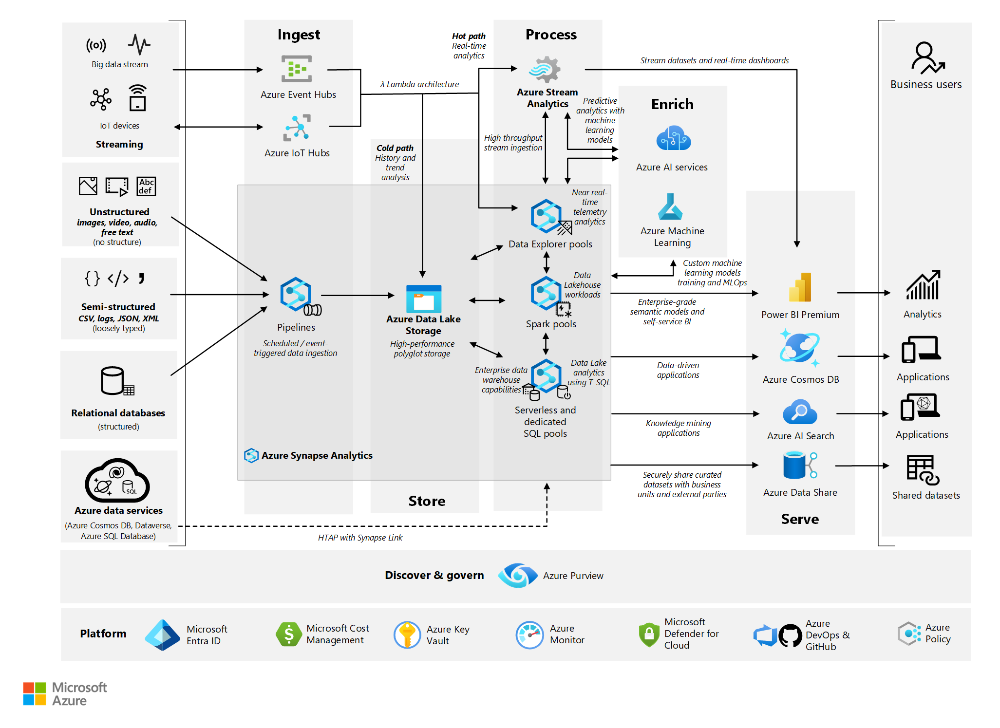

## Use case definition

To support this worked example, the fictitious firm "Contoso" will be used with an Azure data platform based upon Microsoft reference architectures.

Business Continuity and Disaster Recovery (BCDR) across Microsoft Azure services operates under a shared responsibility model. Microsoft is responsible for ensuring the availability, resilience, and security of the underlying infrastructure and platform services. However, customers are accountable, among other things, for implementing disaster recovery strategies tailored to their specific workloads. This includes configuring cross-regional failover, backup and restore mechanisms, and application-level recovery processes. Microsoft provides tools, guidance, and best practices to help customers design and validate BCDR plans that meet their recovery time objectives (RTO) and recovery point objectives (RPO). For more details, refer to the [Shared responsibility in the cloud](/azure/security/fundamentals/shared-responsibility).

### Data Service - Component View
Contoso has implemented the following foundational Azure architecture, which is a subset of the [Enterprise Landing Zone](/azure/cloud-adoption-framework/ready/landing-zone/#azure-landing-zone-conceptual-architecture) design.

*The numbers in the following descriptions correspond to the preceding diagram above.*

### Contoso's Azure Foundations - Workflow

1. **Enterprise enrollment** - Contoso's top parent enterprise enrollment within Azure reflecting its commercial agreement with Microsoft, its organizational account structure and available Azure subscriptions. It provides the billing foundation for subscriptions and how the digital estate is administered.
1. **Identity and access management** – The components required to provide identity, authentication, resource access and authorization services across Contoso's Azure estate.
1. **Management group and subscription organization** - A scalable group hierarchy aligned to the data platform's core capabilities, allowing operationalization at scale using centrally managed security and governance where workloads have clear separation. Management groups provide a governance scope above subscriptions.
1. **Management subscription** - A dedicated subscription for the various management level  functions of required to support the data platform.
1. **Connectivity subscription** - A dedicated subscription for the connectivity functions of the data platform enabling it to identify named services, determine secure routing and communication across and between internal and external services.
1. **Landing zone subscription** – One-to-many subscriptions for Azure native, online applications, internal and external facing workloads and resources
1. **DevOps platform** - The DevOps platform that supports the entire Azure estate. This platform contains the code base source control repository and CI/CD pipelines enabling automated deployments of infrastructure as code (IaC).

> [!NOTE]
> Many customers still retain a large infrastructure as a service (IaaS) footprint. To provide recovery capabilities across IaaS, the key component to be added is [Azure Site recovery](/azure/site-recovery/site-recovery-overview). [Site Recovery](/azure/site-recovery/site-recovery-faq) will orchestrate and automate the replication of Azure VMs between regions, on-premises virtual machines and physical servers to Azure, and on-premises machines to a secondary datacenter.

Within this foundational structure, Contoso has implemented the following elements to support its enterprise business intelligence needs, aligned to the guidance in [Data platform end-to-end](/azure/architecture/example-scenario/dataplate2e/data-platform-end-to-end).

*Contoso's data platform*

### Contoso's Data Platform - Workflow

The workflow is read left to right, following the flow of data:

- **Data sources**
  - The sources or types of data that the data platform can consume from.
    
- **Ingest**
    - Ingest structured, semi-structured, and unstructured data into OneLake using Data Factory, Event Streams, Notebooks, Shortcuts, or Mirroring.
    - Use Data Factory for batch ETL/ELT pipelines and Event Streams for real-time ingestion via Real-Time Hub.
    - Mirror supported databases for near real-time replication or use Shortcuts to access external data without copying.
    - Use Data Factory in Fabric for orchestrating ingestion pipelines. Real-time ingestion is supported via Event Streams, enabling a [Lambda architecture](/azure/architecture/data-guide/big-data/#lambda-architecture).
        
- **Store**
    - All ingested data is stored in OneLake, Microsoft Fabric's unified data lake.
    - OneLake supports open formats like Delta, Parquet, and CSV with built-in geo-redundancy and BCDR options.
- **Process**
    - Use Data Engineering (Spark) or Data Factory to transform and prepare data for analytics.
    - Run KQL queries on Eventhouse (Kusto DB) for real-time analytics and event-driven insights.
- **Serve**
    - Serve curated data via Lakehouse, Warehouse, or mirrored database endpoints using SQL Analytics Endpoints.
    - Create a semantic model in Direct Lake storage mode and share with business users.
    - Build real-time dashboards in Real-Time Intelligence (RTI) hub in Microsoft Fabric for discovering instant insights from streaming data.
    - Expose data through Microsoft Fabric API for GraphQL and query multiple data sources quickly and efficiently.
- **Enrich**
    - Use data science experiences for ML modeling, AutoML, and Azure ML integration to enrich datasets.
    - Empower data scientists to train and deploy models directly on Fabric’s unified data foundation with Azure ML, delivering real-time predictive insights seamlessly into analytics experiences for end users.
    - Interact with Data agent in Microsoft Fabric to uncover insights through chat. Access to enterprise data with Azure AI Foundry integration with Data agent for data-driven decision-making.
- **Discover and govern**
    - Use Purview integration, OneLake catalog, and Microsoft Fabric governance tools for lineage, metadata, and access control.
- **Platform**
    - Fabric provides an end-to-end, unified SaaS analytics platform unified SaaS experience with centralized data storage with OneLake and embedded AI capabilities.

> [!NOTE]
> For many customers, the conceptual level of the Data Platform reference architecture used will align, but the physical implementation may vary. For example, ELT (extract, load, transform) processes may be performed through [Azure Data Factory](/azure/data-factory/), and data modeling by [Azure SQL server](/azure/azure-sql/?view=azuresql). To address this concern, the [Stateful vs stateless components](#stateful-vs-stateless-components) section below will provide guidance.

For the Data Platform, Contoso has selected the lowest recommended production service tiers for all components and has chosen to adopt a "Redeploy on disaster" disaster recovery (DR) strategy based upon an operating cost-minimization approach.

The following sections will provide a baseline understanding of the DR process and levers available to customers to uplift this posture.

## Azure service and component view

The following tables present a breakdown of each Azure service and component used across the Contoso – Data platform, with options for DR uplift.
> [!NOTE]
> The sections below are organized by stateful vs stateless services.

### Stateful foundational components

- **Microsoft Entra ID including role entitlements**
    - Component recovery responsibility: Microsoft
    - Workload/configuration recovery responsibility: Microsoft
    - Contoso SKU selection: Premium P1
    - DR uplift options: the Microsoft Entra resiliency is part of its software as a service (SaaS) offering.
    - Notes
        - [Advancing service resilience in Microsoft Entra ID](https://azure.microsoft.com/en-us/blog/advancing-service-resilience-in-azure-active-directory-with-its-backup-authentication-service/)

- **Azure Key Vault**
    - Component recovery responsibility: Microsoft
    - Workload/configuration recovery responsibility: Microsoft
    - Contoso SKU selection: N/A
    - DR uplift options: N/A, Covered as part of the Azure service.

- **Recovery Services Vault**
    - Component recovery responsibility: Microsoft
    - Workload/configuration recovery responsibility: Microsoft
    - Contoso SKU selection: Default (geo-redundant storage (GRS))
    - DR uplift options: Enabling [Cross Region Restore](/azure/backup/backup-create-rs-vault#set-cross-region-restore) creates data restoration in the secondary, [paired region](/azure/reliability/cross-region-replication-azure).
    - Notes
        - While locally redundant storage (LRS) and zone-redundant storage (ZRS) are available, it requires configuration activities from the default setting.

- **Azure DevOps**
    - Component recovery responsibility: Microsoft
    - Workload/configuration recovery responsibility: Microsoft
    - Contoso SKU selection: DevOps Services
    - DR uplift options: DevOps [service and data resiliency](/azure/devops/organizations/security/data-protection?view=azure-devops#data-availability) is part of its SaaS offering.
    - Notes
        - DevOps Server as the on-premises offering will remain the customer's responsibility for disaster recovery.
        - If third party services (SonarCloud, Jfrog Artifactory, Jenkins build servers for example) are used, they'll remain the customer's responsibility for recovery from a disaster.
        - If IaaS VMs are used within the DevOps toolchain, they'll remain the customer's responsibility for recovery from a disaster.

### Stateless Foundational Components

- **Subscriptions**
    - Component recovery responsibility: Microsoft
    - Workload/configuration recovery responsibility: Microsoft
    - Contoso SKU selection: N/A
    - DR uplift options: N/A, Covered as part of the Azure service.

- **Management Groups**
    - Component recovery responsibility: Microsoft
    - Workload/configuration recovery responsibility: Microsoft
    - Contoso SKU selection: N/A
    - DR uplift options: N/A, Covered as part of the Azure service.

- **Azure Monitor**
    - Component recovery responsibility: Microsoft
    - Workload/configuration recovery responsibility: Microsoft
    - Contoso SKU selection: N/A
    - DR uplift options: N/A, Covered as part of the Azure service.

- **Cost Management**
    - Component recovery responsibility: Microsoft
    - Workload/configuration recovery responsibility: Microsoft
    - Contoso SKU selection: N/A
    - DR uplift options: N/A, Covered as part of the Azure service.

- **Microsoft Defender for Cloud**
    - Component recovery responsibility: Microsoft
    - Workload/configuration recovery responsibility: Microsoft
    - Contoso SKU selection: N/A
    - DR uplift options: N/A, Covered as part of the Azure service.

- **Azure DNS**
    - Component recovery responsibility: Microsoft
    - Workload/configuration recovery responsibility: Microsoft
    - Contoso SKU selection: Single Zone - Public
    - DR uplift options: N/A, DNS is highly available by design.

- **Network Watcher**
    - Component recovery responsibility: Microsoft
    - Workload/configuration recovery responsibility: Microsoft
    - Contoso SKU selection: N/A
    - DR uplift options: N/A, Covered as part of the Azure service.

- **Virtual Networks, including Subnets, user-defined route (UDR) & network security groups (NSG)**
    - Component recovery responsibility: Contoso
    - Workload/configuration recovery responsibility: Contoso
    - Contoso SKU selection: N/A
    - DR uplift options: [VNETs can be replicated](/azure/virtual-network/virtual-network-disaster-recovery-guidance#business-continuity) into the secondary, paired region.

- **Azure Firewall**
    - Component recovery responsibility: Contoso
    - Workload/configuration recovery responsibility: Contoso
    - Contoso SKU selection: Standard
    - DR uplift options: Azure Firewall is [highly available by design](/azure/firewall/features#built-in-high-availability) and can be created with [Availability Zones](/azure/firewall/deploy-availability-zone-powershell) for increased availability.

- **Azure DDoS**
    - Component recovery responsibility: Microsoft
    - Workload/configuration recovery responsibility: Contoso
    - Contoso SKU selection: DDoS Network Protection
    - DR uplift options: N/A, Covered as part of the Azure service.

### Stateful data platform-specific services

- **Storage Account: Azure Data Lake Gen2**
    - Component recovery responsibility: Microsoft
    - Workload/configuration recovery responsibility: Contoso
    - Contoso SKU selection: LRS
    - DR uplift options: Storage Accounts have a broad range of [data redundancy](/azure/storage/common/storage-redundancy) options from primary region redundancy up to secondary region redundancy.
    - Notes
        - GRS is recommended to uplift redundancy, providing a copy of the data in the paired region.

- **Azure Machine Learning**
    - Component recovery responsibility: Contoso and Microsoft
    - Workload/configuration recovery responsibility: Contoso
    - Contoso SKU selection: General Purpose, D Series instances
    - DR uplift options:
        - Azure Machine Learning depends on multiple Azure services, some of which are [provisioned in the customer's subscription](/azure/machine-learning/how-to-high-availability-machine-learning#understand-azure-services-for-azure-machine-learning). As such, the customer remains responsible for the high-availability configuration of these services.
        - Resiliency can be uplifted via a [multi-regional deployment](/azure/machine-learning/how-to-high-availability-machine-learning#plan-for-multi-regional-deployment).
    - Notes:
        - Azure Machine Learning itself doesn't [provide automatic failover or disaster recovery](/azure/machine-learning/how-to-high-availability-machine-learning).

- **Power BI**
    - Component recovery responsibility: Microsoft
    - Workload/configuration recovery responsibility: Microsoft
    - Contoso SKU selection: Power BI Pro
    - DR uplift options: N/A, Power BI's resiliency is part of its SaaS offering.
    - Notes
        - Power BI resides in the Office365 tenancy, not that of Azure.
        - [Power BI uses Azure Availability Zones](/power-bi/enterprise/service-admin-failover#what-does--high-availability--mean-for-power-bi-) to protect Power BI reports, applications and data from datacenter failures.
        - In the case of regional failure, Power BI will [failover to a new region](/power-bi/enterprise/service-admin-failover#what-is-a-power-bi-failover-), usually in the same geographical location, as noted in the [Microsoft Trust Center](https://www.microsoft.com/en-us/trust-center/product-overview?rtc=1).

- **Microsoft Purview**
    - Component recovery responsibility: Microsoft
    - Workload/configuration recovery responsibility: Contoso
    - Contoso SKU selection: N/A
    - DR uplift options: N/A
    - Notes
        - As of October 2024, [Microsoft Purview doesn't support automated business continuity and disaster recovery (BCDR)](/azure/purview/disaster-recovery#achieve-business-continuity-for-azure-purview). Until that support is added, the customer is responsible for all backup and restore activities.

 - **Microsoft Fabric: OneLake**
    - Component recovery responsibility: Microsoft
    - Workload/configuration recovery responsibility: Contoso
    - Contoso SKU selection: Fabric Capacity
    - DR uplift options:
        - Enable BCDR for Fabric capacity.
    - Notes
        - For further details regarding disaster recovery for OneLake, refer to [Disaster recovery and data protection for OneLake](/fabric/onelake/onelake-disaster-recovery).

- **Microsoft Fabric: SQL database in Fabric**
    - Component recovery responsibility: Microsoft
    - Workload/configuration recovery responsibility: Contoso
    - Contoso SKU selection: Fabric Capacity
    - DR uplift options:
        - Manual geo-backup or geo-replication for active/active setups across regions.
    - Notes
        - Geo-redundancy must be manually configured.
        - For further details regarding disaster recovery for SQL Databse in Fabric, refer to [Experience-specific disaster recovery guidance - SQL Database](/fabric/security/experience-specific-guidance#sql-database).

- **Microsoft Fabric: Data Engineering**
    - Component recovery responsibility: Microsoft
    - Workload/configuration recovery responsibility: Contoso
    - Contoso SKU selection: Fabric Capacity (Memory Optimized SKU)
    - DR uplift options:
        - Backup notebooks, Spark job definitions, and Lakehouse data in a workspace in another region.
    - Notes
        - Notebooks can be redployed via CI/CD.
        - For further details regarding disaster recovery for Data Engineering in Fabric, refer to [Experience-specific disaster recovery guidance - Data Engineering](/fabric/security/experience-specific-guidance#data-engineering).
        
- **Microsoft Fabric: Data Warehouse**
    - Component recovery responsibility: Microsoft
    - Workload/configuration recovery responsibility: Contoso
    - Contoso SKU selection: Fabric Capacity
    - DR uplift options:
        - Manual geo-backup or geo-replication for active/active setups across regions.
    - Notes
        - Follow step-by-step guides for [Experience-specific disaster recovery guidance - Data Warehouse](/fabric/security/experience-specific-guidance#data-warehouse).
        - For customers who need cross-regional disaster recovery and fully automated business continuity, we recommend keeping two Fabric Warehouse setups in two different regions and maintaining code and data parity by doing regular deployments and data ingestion to both sites.

- **Microsoft Fabric: Mirrored Database**
    - Component recovery responsibility: Microsoft
    - Workload/configuration recovery responsibility: Contoso
    - Contoso SKU selection: Fabric Capacity
    - DR uplift options:
        - Manual geo-backup or geo-replication for active/active setups across regions.
    - Note:
        - Mirrored databases from the primary region remain unavailable to customers and the settings aren't replicated to the secondary region.
        - Recreate mirrored database in another workspace from a different region.
      
### Stateless data platform-specific services

  - **Azure AI Foundry**
    - Component recovery responsibility: Microsoft
    - Workload/configuration recovery responsibility: Microsoft
    - Contoso SKU selection: Pay As You Go
    - DR uplift options: Applications utilizing Azure OpenAI resources that require strong resiliency and business continuity may need to take extra measures to reinforce their model infrastructure [Business Continuity and Disaster Recovery (BCDR) considerations with Azure OpenAI in Azure AI Foundry Models](/azure/ai-foundry/openai/how-to/business-continuity-disaster-recovery)
    - Notes
        - Refer to [Customer-enabled disaster recovery](/azure/ai-foundry/how-to/disaster-recovery) for guidance on business continuity and disaster recovery with Azure AI Foundry.

- **Microsoft Fabric: Real-Time Intelligence**
    - Component recovery responsibility: Microsoft
    - Workload/configuration recovery responsibility: Contoso
    - Contoso SKU selection: Fabric Capacity
    - DR uplift options:
        - Configure two or more KQL databases in different regions, and keep data and policies in sync between the databases. 
    - Notes
        - Refer to recovery procedures for [Experience-specific disaster recovery guidance - Real-Time Intelligence](/fabric/security/experience-specific-guidance#real-time-intelligence).   

- **Microsoft Fabric: Data Factory**
    - Component recovery responsibility: Microsoft
    - Workload/configuration recovery responsibility: Contoso
    - Contoso SKU selection: Fabric Capacity
    - DR uplift options:
        - Cross-region pipeline deployment.
    - Notes
        - Pipelines can be redeployed via CI/CD.
        - When On-Prem or vNet Data Gateway are used in data pipelines, the gateways need to be reconfigured in another workspace from a different region.
        - Follow step-by-step guides for [Experience-specific disaster recovery guidance - Data Factory](/fabric/security/experience-specific-guidance#data-factory).

- **Microsoft Fabric: Data Science**
    - Component recovery responsibility: Microsoft
    - Workload/configuration recovery responsibility: Contoso
    - Contoso SKU selection: Fabric Capacity
    - DR uplift options:
        - Create workspaces in two different regions, then copy your data and import notebooks, machine learning experiments and models into the secondary workspace.
    - Notes
        - Disaster recovery for Data Science in Microsoft Fabric involves manual copying and recreation of resources in a secondary region, with no built-in cross region replication.
        - For further details regarding disaster recovery for Fabric Data Science, refer to [Disaster recovery guidance for Fabric Data Science](/fabric/data-science/data-science-disaster-recovery).

## Stateful vs stateless components

The speed of innovation across the Microsoft product suite and Azure, in particular, means the component set that we've used for this worked example will quickly evolve. To future-proof against providing stale guidance and extend this guidance to components not explicitly covered in this document, the section below provides some instruction based upon the coarse-grain classification of state.

A component/service can be described as stateful if it's designed to remember preceding events or user interactions. Stateless means there's no record of previous interactions, and each interaction request has to be handled based entirely on information that comes with it.

For a DR scenario that calls for redeployment:

- Components/services that are "stateless", like Azure Functions and Azure Data Factory pipelines, can be redeployed from source control with at least a smoke test to validate availability before being introduced into the broader system.
- Components/services that are "stateful", like Azure SQL Database and storage accounts, require more attention.
    - When procuring the component, a key decision will be selecting the data redundancy feature. This decision typically focuses on a trade-off between availability and durability with operating costs.
- Datastores will also need a data backup strategy. The data redundancy functionality of the underlying storage mitigates this risk for some designs, while others, like SQL databases will need a separate backup process.
    - If necessary, the component can be redeployed from source control with a validated configuration via a smoke-test.
    - A redeployed datastore must have its dataset rehydrated. Rehydration can be accomplished through data redundancy (when available) or a backup dataset. When rehydration has been completed, it must be validated for accuracy and completeness.
        - Depending on the nature of the backup process, the backup datasets may require validation before being applied. Backup process corruption or errors may result in an earlier backup being used in place of the latest version available.
    - Any delta between the component date/timestamp and the current date should be addressed by reexecuting or replaying the data ingestion processes from that point forward.
    - Once the component's dataset is up to date, it can be introduced into the broader system.

## Next steps
Now that you've learned about the scenario's architecture, you can learn about the [scenario details](../disaster-recovery/dr-for-azure-data-platform-scenario-details.yml).

## Related resources

- [DR for Azure Data Platform - Overview](dr-for-azure-data-platform-overview.yml)
- [DR for Azure Data Platform - Scenario details](dr-for-azure-data-platform-scenario-details.yml)
- [DR for Azure Data Platform - Recommendations](dr-for-azure-data-platform-recommendations.yml)
