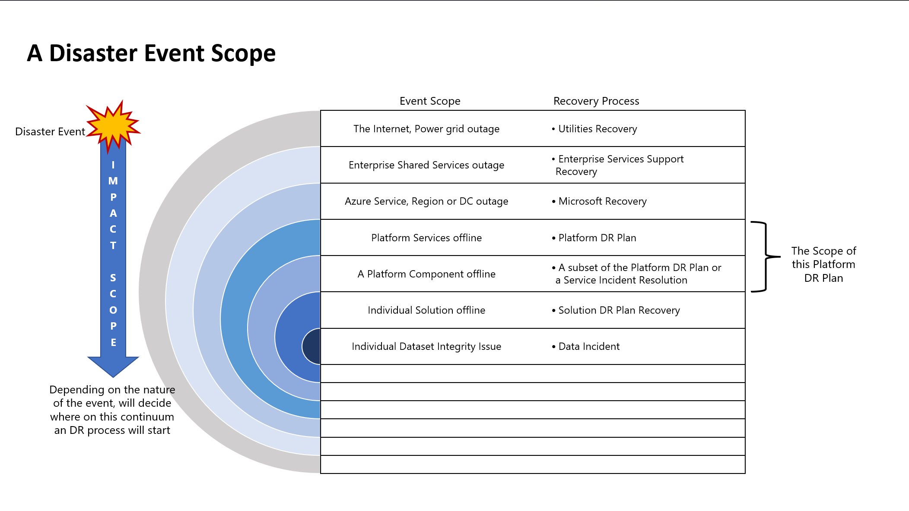
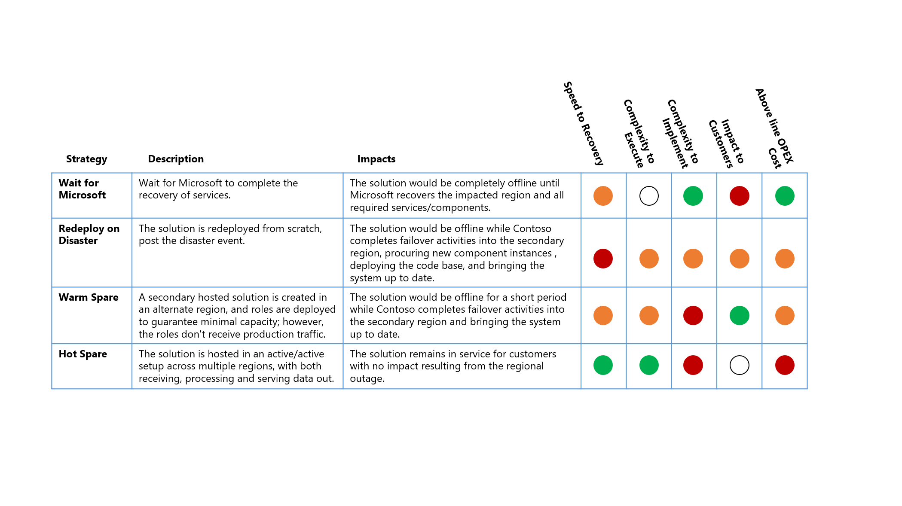

## Lessons learned

1. Ensure all the parties involved understand the difference between High Availability and Disaster Recovery: a common pitfall is to confuse the two concepts and mismatch the solutions associated with them 
1. Discuss with the business stakeholders about their expectations regarding the following aspects to define the Recovery Point Objectives (RPO) and Recovery Time Objectives (RTO):
    1. How much downtime they can tolerate, keeping in mind that usually, the faster the recovery, the higher the cost
    1. The type of incidents they want to be protected from, mentioning the related likelihood of such event. For example, the probability of a server going down is higher than a natural disaster that impacts all the datacenters across a region
    1. What impact does the system being unavailable has on their business?
    1. The OPEX budget for the solution moving forward
1. Consider what degraded service options your end-users can accept. These may include:
    1. Still having access to visualization dashboards even without the most up-to-date data that is, if the ingestion pipelines don't work, end-users still have access to their data
    1. Having read access but no write access
1. Your target RTO and RPO metrics can define what disaster recovery strategy you choose to implement:
    1. Active/Active
    1. Active/Passive
    1. Active/Redeploy on disaster
    1. Rely on Microsoft's SLA
1. Ensure you understand all the components that might impact the availability of your systems, such as:
    1. Identity management
    1. Networking topology
    1. Secret/key management
    1. Data sources
    1. Automation/job scheduler
    1. Source repository and deployment pipelines (GitHub, Azure DevOps)
1. Early detection of outages is also a way to decrease RTO and RPO values significantly. Here are a few aspects that should be covered:
    1. Define what an outage is and how it maps to Microsoft’s definition of an outage. The Microsoft definition is available on the [Azure Service Level Agreement](https://azure.microsoft.com/en-us/support/legal/sla/) page at the product or service level.
    1. An efficient monitoring and alerting system with accountable teams to review those metrics and alerts in a timely manner will help meet the goal.
1. Composite SLAs mean that the more components you have in your architecture, the higher the probability of a failure. You could use composite SLA to define an outage
1. Regarding subscription design, the additional infrastructure for disaster recovery can be stored in the original subscription. PaaS services like ADLS Gen2 or Azure Data Factory typically have native features that allow fail over to secondary instances in other regions while staying contained in the original subscription. Some customers might want to consider having a dedicated resource group for resources used only in DR scenarios for cost purposes
    1. It should be noted that [subscription limits](/azure/azure-resource-manager/management/azure-subscription-service-limits) may act as a constraint for this approach.
    1. Other constraints may include the design complexity and management controls to ensure the DR resource groups aren't used for BAU workflows
1. Design the DR workflow based on a solution’s criticality and dependencies. For example, don't try to rebuild an Azure Analysis Services instance before your data warehouse is up and running, as it will trigger an error. Leave development labs later in the process, recover core enterprise solutions first
1. Try to identify recovery tasks that can be parallelized across solutions, reducing the total RTO
1. If Azure Data Factory is used within a solution, don't forget to include Self-Hosted integration runtimes in the scope. [Azure Site Recovery](/azure/site-recovery/site-recovery-overview) is ideal for those machines
1. Manual operations should be automated as much as possible to avoid human errors, especially when under pressure. It's recommended to:
    1. Adopt resource provisioning through ARM templates or PowerShell scripts
    1. Adopt versioning of source code and resource configuration
    1. Use CI/CD release pipelines rather than click-ops
1. As you have a plan for fail over, you should consider procedures to failback to the primary instances
1. Define clear indicators/metrics to validate that the fail over has been success and solutions are up and running or that the situation is back to normal (also know as primary functional)
1. Decide if your SLAs should remain the same after a fail over or if you allow for degraded service
    1. This decision will greatly depend on the business service process being supported. For example, the fail over for a room-booking system will look much different than a core operational system
1. An RTO/RPO definition should be based on specific user scenarios/solutions rather than at the infrastructure level. It will give you more granularity on what processes and components should be recovered first if there's an outage or disaster
1. Ensure you include capacity checks in the target region before moving forward with a fail over: If there's a major disaster, be mindful that many customers will try to fail over to the same paired region at the same time, which can cause delays or contention in provisioning the resources
    1. If these risks are unacceptable, either an Active/Active or Active/Passive DR strategy should be considered
1. A disaster recovery plan should be created and maintained to document the recovery process and the action owners. Also, consider that people might be on leave, so be sure to include secondary contacts.
1. Regular disaster recovery drills should be performed to validate the DR plan workflow, that it meets the required RTO/RPO, and to train the responsible teams
    1. Data and configuration backups should also be regularly tested to ensure they are "fit for purpose" to support any recovery activities
1. Early collaboration with teams responsible for networking, identity, and resource provisioning will enable agreement on the most optimal solution regarding:
    1. How to redirect users and traffic from your primary to your secondary site. Concepts such as DNS redirection or the use of specific tooling like Azure Traffic Manager can be evaluated
    1. How to provide access and rights to the secondary site in a timely and secure manner
1. During a disaster, effective communication between the many parties involved is key to the efficient and rapid execution of the plan:
    1. Decision makers
    2. Incident response team
    3. Impacted internal audience
    4. External teams
1. Orchestration of the different resources at the right time will ensure efficiency in the disaster recovery plan execution

## Considerations

### Anti-patterns

- **Copy/Paste this article series**
This article series is intended to provide guidance to customers looking for the next level of detail for an Azure-specific DR process. As such, it’s based upon the generic Microsoft IP and reference architectures rather than any single customer-specific Azure implementation.  
While the detail provided will help support a solid foundational understanding, customers must apply their own specific context, implementation, and requirements before obtaining a “fit for purpose” DR strategy and process.

- **Treating DR as a tech-only process**
Business stakeholders play a critical role in defining the requirements for DR and completing the business validation steps required to confirm a service recovery.
Ensuring that Business stakeholders are engaged across all DR activities will provide a DR process that is “fit for purpose”, represents business value, and is executable

- **"Set and forget" DR plans**
Azure is constantly evolving, as are individual customer’s use of various components and services. A “fit for purpose” DR process must evolve with them. 
Either via the SDLC process or periodic reviews, customers should regularly revisit their DR plan. The goal is to ensure the validity of the service recovery plan and that any deltas across components, services or solutions have been accounted for.

- **Paper-based assessments**
While the end-to-end simulation of a DR event will be difficult across a modern data eco-system, efforts should be made to get as close as possible to a complete simulation across impacted components. Regularly recurring full drills will build the “muscle memory” required by the organization to be able to execute the DR plan with confidence.

- **Relying on Microsoft to do it all**
Within the Microsoft Azure services, there's a clear [division of responsibility](/azure/availability-zones/business-continuity-management-program#shared-responsibility-model), anchored by the cloud service tier used:

Even if a full [SaaS stack](https://azurecharts.com/overview/?f=saas) is used, the customer will still retain the responsibility to ensure the accounts, identities, and data is correct/up-to-date, along with the devices used to interact with the Azure services.

## Event scope and strategy

### Disaster event scope

Different events will have a different scope of impact and, therefore, a different response. The following diagram illustrates this for a disaster event:

### Disaster strategy options

There are four high-level options for a [disaster recovery strategy](/azure/architecture/resiliency/recovery-loss-azure-region#strategies):

- **Wait for Microsoft** - As the name suggests, the solution is offline until the complete recovery of services in the impacted region by Microsoft. Once recovered, the solution is validated by the customer and then brought up-to-date for service recovery
- **Redeploy on Disaster** - The solution is redeployed manually into an available region from scratch, post-disaster event
- **Warm Spare (Active/Passive)** - A secondary hosted solution is created in an alternate region, and components are deployed to guarantee minimal capacity; however, the components don't receive production traffic. The secondary services in the alternative region may be “turned off” or running at a lower performance level until such time as a DR event is occurs
- **Hot Spare (Active/Active)** - The solution is hosted in an active/active setup across multiple regions. The secondary hosted solution receives, processes, and serves data as part of the larger system

### DR strategy impacts

While the operating cost attributed to the higher levels of service resiliency often dominates the [Key Design Decision](/azure/architecture/framework/cost/tradeoffs#cost-vs-reliability) (KDD) for a DR strategy. There are other important considerations.

>[!NOTE]
>[Cost Optimization](/azure/architecture/framework/cost/) is one of the five pillars of architectural excellence with Azure’s [Well-Architected Framework](/azure/architecture/framework/). Its goal is to reduce unnecessary expenses and improve operational efficiencies

The DR scenario for this worked example is a complete Azure regional outage that directly impacts the primary region that hosts the Contoso Data Platform. 
For this outage scenario, the relative impact on the four high-level DR Strategies are:

*Classification Key*

- **Recovery Time Objective (RTO)** – the expected elapsed time from the disaster event to platform service recovery
- **Complexity to Execute**– the complexity for the organization to execute the recovery activities
- **Complexity to Implement** - the complexity for the organization to implement the DR strategy
- **Impact to Customers** - the direct impact to customers of the data platform service from the DR strategy
- **Above line OPEX cost** - the extra cost expected from implementing this strategy like increased monthly billing for Azure for additional components and additional resources required to support

>[!NOTE]
>The above table should be read as a comparison between the options - a strategy that has a green indicator is better for that classification than another strategy with a yellow or red indicator

## Next steps
Now that you've learned about the recommendations related to the scenario, you can learn how to  [deploy this scenario](../disaster-recovery/dr-for-azure-data-platform-deploy-this-scenario.yml)

## Related resources

- [DR for Azure Data Platform - Overview](dr-for-azure-data-platform-overview.yml)
- [DR for Azure Data Platform - Architecture](dr-for-azure-data-platform-architecture.yml)
- [DR for Azure Data Platform - Scenario details](dr-for-azure-data-platform-scenario-details.yml)
- [DR for Azure Data Platform - Summary](dr-for-azure-data-platform-summary.yml)
