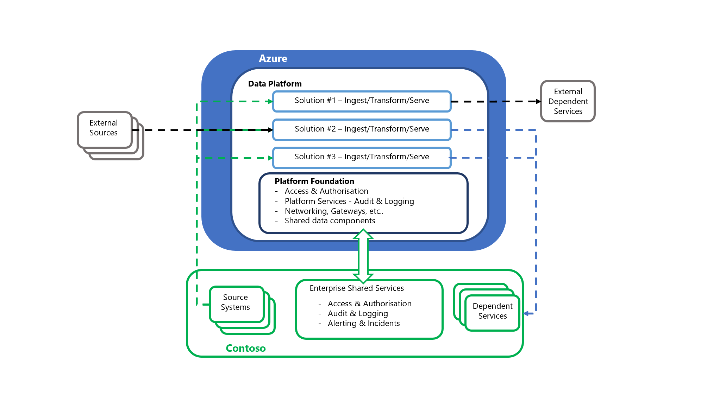

## Data service topology

At a high-level the data service topology for Contoso’s data platform can be illustrated as:

This logical diagram abstracts the key functions of the Contoso data ecosystem into a simplified, high-level view. This abstracted view supports the sections covering the scenario deployments, in line with the DR strategy selection and the segregation of responsibilities in a service recovery process.

## DR Impact vs Customer Activity 
The following sections present a breakdown of Contoso activity necessary across DR events of varying impacts.

### Area: Foundational components

- **Azure Active Directory including role entitlements**
    - Contoso SKU selection: Premium P1
    - DR Impact
        - Azure Data Center Failure: N/A
        - Availability Zone Failure: N/A
        - Azure Regional Failure: N/A
        
- **Management Groups**
    - Contoso SKU selection: N/A
    - DR Impact
        - Azure Data Center Failure: N/A
        - Availability Zone Failure: N/A
        - Azure Regional Failure: N/A
 
- **Subscriptions**
    - Contoso SKU selection: N/A
    - DR Impact
        - Azure Data Center Failure: N/A
        - Availability Zone Failure: N/A
        - Azure Regional Failure: N/A
 
- **Azure Key Vault**
    - Contoso SKU selection: Standard
    - DR Impact
        - Azure Data Center Failure: N/A
        - Availability Zone Failure: N/A
        - Azure Regional Failure: N/A
 
- **Azure Monitor**
    - Contoso SKU selection: N/A
    - DR Impact
        - Azure Data Center Failure: N/A
        - Availability Zone Failure: N/A
        - Azure Regional Failure: N/A
 
- **Microsoft Defender for Cloud**
    - Contoso SKU selection: N/A
    - DR Impact
        - Azure Data Center Failure: N/A
        - Availability Zone Failure: N/A
        - Azure Regional Failure: N/A

- **Cost Management**
    - Contoso SKU selection: N/A
    - DR Impact
        - Azure Data Center Failure: N/A
        - Availability Zone Failure: N/A
        - Azure Regional Failure: N/A
         
- **Azure DNS**
    - Contoso SKU selection: N/A
    - DR Impact
        - Azure Data Center Failure: N/A
        - Availability Zone Failure: N/A
        - Azure Regional Failure: N/A

- **Network Watcher**
    - Contoso SKU selection: N/A
    - DR Impact
        - Azure Data Center Failure: N/A
        - Availability Zone Failure: N/A
        - Azure Regional Failure: N/A

- **Recovery Services Vault**
    - Contoso SKU selection: Default (GRS)
    - DR Impact
        - Azure Data Center Failure: N/A
        - Availability Zone Failure: N/A
        - Azure Regional Failure: N/A
    - Notes 
        - [Cross Region Restore](/azure/backup/backup-create-recovery-services-vault#set-cross-region-restore) will enable DR drills and the customer failing over to the secondary region
  
- **Virtual Networks, including Subnets, UDR & NSGs**
    - Contoso SKU selection: N/A
    - DR Impact
        - Azure Data Center Failure: N/A
        - Availability Zone Failure: N/A
        - Azure Regional Failure: Contoso would need to redeploy the Foundation and Data platform VNets with their attached UDRs & NSGs into the secondary region
    - Notes
        - [Traffic Manager](/azure/traffic-manager/traffic-manager-overview) can be used to geo-route traffic between regions that hold replica VNet structures. If they have the same address space, they can't be connected to the on-premises network, as it would cause routing issues. At the time of a disaster and loss of a VNet in one region, you can connect the other VNet in the available region, with the matching address space to your on-premises network 

- **Resource Groups**
    - Contoso SKU selection: N/A
    - DR Impact
        - Azure Data Center Failure: N/A
        - Availability Zone Failure: N/A
        - Azure Regional Failure: Contoso would need to redeploy the Foundation and Data platform Resource groups into the secondary region
    - Notes
        - This activity would be mitigated by implementing the “Warm Spare” strategy, having the network and resource group topology available in the secondary region

- **Azure Firewall**
    - Contoso SKU selection: Standard
    - DR Impact
        - Azure Data Center Failure: N/A
        - Availability Zone Failure: Contoso would need to validate availability and redeploy if necessary
        - Azure Regional Failure: Contoso would need to redeploy the Foundation Azure Firewalls into the secondary region
    - Notes
        - Azure Firewall can be created with [Availability Zones](/en-au/azure/firewall/deploy-availability-zone-powershell) for increased availability
        - A “Warm Spare” strategy would mitigate this activity

- **Azure DDoS**
    - Contoso SKU selection: Network Protection
    - DR Impact
        - Azure Data Center Failure: N/A
        - Availability Zone Failure: N/A
        - Azure Regional Failure: Contoso would need to create a [DDoS protection plan](/azure/ddos-protection/ddos-disaster-recovery-guidance#business-continuity) for the Foundation’s VNETs within the secondary region

- **ExpressRoute – Circuit**
    - Contoso SKU selection: Standard
    - DR Impact
        - Azure Data Center Failure: N/A
        - Availability Zone Failure: N/A
        - Azure Regional Failure: N/A
    - Notes
        - The physical circuit would remain the responsibility of Microsoft and the connectivity partner to recover

- **VPN Gateway**
    - Contoso SKU selection: VpnGw1
    - DR Impact
        - Azure Data Center Failure: N/A
        - Availability Zone Failure: Contoso would need to validate availability and redeploy if necessary 
        - Azure Regional Failure: Contoso would need to redeploy the Foundation VPN Gateways into the secondary region
    - Notes
        - VPN Gateways can be created with [Availability Zones](/azure/vpn-gateway/about-zone-redundant-vnet-gateways) for increased availability
        - A “Warm Spare” strategy would mitigate this activity

- **Load Balancer**
    - Contoso SKU selection: Standard
    - DR Impact
        - Azure Data Center Failure: N/A
        - Availability Zone Failure: Contoso would need to validate availability and redeploy if necessary 
        - Azure Regional Failure: Contoso would need to redeploy the Foundation Load Balancers into the secondary region
    - Notes
        - Depending on the primary region, either a [zone redundant](/azure/load-balancer/load-balancer-standard-availability-zones) or [cross-regional](/azure/load-balancer/cross-region-overview#build-cross-region-solution-on-existing-azure-load-balancer) design could be used to uplift this posture

- **Azure DevOps**
    - Contoso SKU selection: DevOps Services
    - DR Impact
        - Azure Data Center Failure: N/A
        - Availability Zone Failure: N/A
        - Azure Regional Failure: N/A
    - Notes 
        - DevOps Services is [built upon the Azure backbone](/azure/devops/organizations/security/data-protection?view=azure-devops#built-on-azure) and uses [Azure blob storage with geo-replication](/azure/devops/organizations/security/data-protection?view=azure-devops#data-redundancy) to ensure resiliency

### Area: Data Platform components

- **Storage Account – Azure Data Lake Gen2**
    - Contoso SKU selection: LRS
    - DR Impact
        - Azure Data Center Failure: N/A
        - Availability Zone Failure: Contoso would need to validate availability and redeploy if necessary
        - Azure Regional Failure: Contoso would need to redeploy the Data Platform Storage Accounts and rehydrate them with data in the secondary region
    - Notes 
        - Storage Accounts have a broad range of [data redundancy](/azure/storage/common/storage-redundancy) options from primary region redundancy up to secondary region redundancy
        - For Secondary region redundancy data is replicated to the [secondary region asynchronously](/azure/storage/common/storage-redundancy#redundancy-in-a-secondary-region). A failure that affects the primary region may result in data loss if the primary region can't be recovered. Azure Storage typically has an RPO of less than 15 minutes
        - In the case of a regional outage, Storage accounts which, are geo-redundant, would be available in the secondary region as LRS. Additional configuration would need to be applied to uplift these components in the secondary region to be geo-redundant

- **Azure Synapse - Pipelines**
    - Contoso SKU selection: Computed Optimized Gen2   
    - DR Impact
        - Azure Data Center Failure: N/A
        - Availability Zone Failure: N/A
        - Azure Regional Failure: Contoso would need to deploy and [restore](/azure/synapse-analytics/sql-data-warehouse/sql-data-warehouse-restore-from-geo-backup) the Data Platform Azure Synapse Analytics into the secondary region and redeploy the pipelines
    - Notes
        - Automatic restore points are [deleted after seven days](/azure/synapse-analytics/sql-data-warehouse/backup-and-restore#restore-point-retention)
        - [User-defined restore points](/azure/synapse-analytics/sql-data-warehouse/backup-and-restore#user-defined-restore-points) are available. Currently (Mar 2023), there's a ceiling of 42 user-defined restore points that are automatically [deleted after seven days](/azure/synapse-analytics/sql-data-warehouse/backup-and-restore#restore-point-retention)
        - Synapse can also perform a DB restore in the local or remote region, and then immediately PAUSE the instance. This process will only incur storage costs – and have zero compute costs. This offers a way to keep a ”live” DB copy at specific intervals

- **Azure Event Hubs**
    - Contoso SKU selection: Standard
    - DR Impact
        - Azure Data Center Failure: N/A
        - Availability Zone Failure: N/A
        - Azure Regional Failure: Contoso would need to redeploy the Event Hubs instance into the secondary region
    - Notes
        - When you use the Azure portal, zone redundancy via support for availability zones is [automatically enabled](/azure/event-hubs/event-hubs-geo-dr?tabs=portal#availability-zones), this can be disabled via using the Azure CLI or PowerShell commands
        - This resiliency can be extended to cover a full region outage with [Geo-disaster recovery](/azure/event-hubs/event-hubs-geo-dr)

- **Azure IoT Hubs**
    - Contoso SKU selection: Standard
    - DR Impact
        - Azure Data Center Failure: N/A
        - Availability Zone Failure: N/A
        - Azure Regional Failure: Contoso would need to redeploy the IoT Hub into the secondary region
    - Notes
        - IoT Hub provides [Intra-Region HA](/azure/iot-hub/iot-hub-ha-dr#intra-region-ha) and will automatically use an availability zone if created in a [predefined set of Azure regions](/azure/iot-hub/iot-hub-ha-dr#availability-zones)

- **Azure Stream Analytics**
    - Contoso SKU selection: Standard
    - DR Impact
        - Azure Data Center Failure: N/A
        - Availability Zone Failure: N/A
        - Azure Regional Failure: Contoso would need to redeploy the IoT Hub into the secondary region
    - Notes
        - A key feature of Stream Analytics is its ability to recover from [Node failure](/azure/stream-analytics/stream-analytics-concepts-checkpoint-replay#job-recovery-from-node-failure-including-os-upgrade)

- **Azure Cognitive Services**
    - Contoso SKU selection: Pay As You Go
    - DR Impact
        - Azure Data Center Failure: N/A
        - Availability Zone Failure: N/A
        - Azure Regional Failure: N/A

- **Azure Machine Learning**
    - Contoso SKU selection: General Purpose – D Series instances
    - DR Impact
        - Azure Data Center Failure: Contoso would need to validate availability and redeploy if necessary
        - Availability Zone Failure: Contoso would need to validate availability and redeploy if necessary
        - Azure Regional Failure: Contoso would need to redeploy Machine Learning into the secondary region
    - Notes
        - While the Machine Learning infrastructure is managed by Microsoft; the [associated resources are managed by the customer](/azure/machine-learning/how-to-high-availability-machine-learning#understand-azure-services-for-azure-machine-learning). Only Key Vault is highly available by default
        - Depending on the service criticality supported, Microsoft recommends a [multi-regional deployment](/azure/machine-learning/how-to-high-availability-machine-learning#plan-for-multi-regional-deployment)

- **Azure Synapse – Data Explorer Pools**
    - Contoso SKU selection: Computed Optimized, Small (4 cores)
    - DR Impact
        - Azure Data Center Failure: N/A
        - Availability Zone Failure: N/A
        - Azure Regional Failure: Contoso would need to redeploy Azure Synapse – Data Explorer Pools and pipelines into the secondary region

- **Azure Synapse – Spark Pools**
    - Contoso SKU selection: Compute Optimized Gen2
    - DR Impact
        - Azure Data Center Failure: N/A
        - Availability Zone Failure: N/A
        - Azure Regional Failure: Contoso would need to redeploy Azure Synapse – Spark Pools and pipelines into the secondary region 
    - Notes
        - If an [external Hive metastore](/azure/synapse-analytics/spark/apache-spark-external-metastore) is used, this will also need a recovery strategy in place
            - [Azure Site Recovery](/azure/site-recovery/site-recovery-sql) can be used for a SQL Server metastore
            - A [MySQL](/azure/mysql/concepts-business-continuity#recover-from-an-azure-regional-data-center-outage) metastore would use the geo-restore feature or cross-regional read replicas 

- **Azure Synapse – Serverless and Dedicated SQL Pools**
    - Contoso SKU selection: Compute Optimized Gen2
    - DR Impact
        - Azure Data Center Failure: N/A
        - Availability Zone Failure: N/A
        - Azure Regional Failure: Contoso would need to deploy and [restore](/azure/synapse-analytics/sql-data-warehouse/sql-data-warehouse-restore-from-geo-backup) the Data Platform Azure Synapse Analytics into the secondary region 
    - Notes
        - Automatic restore points are [deleted after seven days](/azure/synapse-analytics/sql-data-warehouse/backup-and-restore#restore-point-retention)
        - [User-defined restore points](/azure/synapse-analytics/sql-data-warehouse/backup-and-restore#user-defined-restore-points) are available. Currently (Mar 2023), there's a ceiling of 42 user-defined restore points that are automatically [deleted after seven days](/azure/synapse-analytics/sql-data-warehouse/backup-and-restore#restore-point-retention)
        - Synapse can also perform a DB restore in the local or remote region, and then immediately PAUSE the instance.  This will only incur storage costs – and have zero compute costs. This solution offers a way to keep a ”live” DB copy at specific intervals

- **Power BI**
    - Contoso SKU selection: Power BI Pro
    - DR Impact
        - Azure Data Center Failure: N/A
        - Availability Zone Failure: N/A
        - Azure Regional Failure: N/A
    - Notes
        - The customer will [not need to do anything](/power-bi/admin/service-admin-failover#how-does-microsoft-decide-to-fail-over-) if the outage is decided/declared by Power BI team
            - A Failed-over Power BI service instance [only supports read operations](/power-bi/admin/service-admin-failover#what-is-a-power-bi-failover-). Reports that use Direct Query or Live connect [won't work during a failover](/power-bi/enterprise/service-admin-failover#do-gateways-function-in-failover-mode-)

- **Azure Cosmos DB**
    - Contoso SKU selection: Single Region Write with Periodic backup
    - DR Impact
        - Azure Data Center Failure: N/A
        - Availability Zone Failure: N/A
        - Azure Regional Failure: Contoso should monitor, ensuring there are [enough provisioned RUs](/azure/cosmos-db/high-availability#what-to-expect-during-a-region-outage) in the remaining regions to support read & write activities
    - Notes
        - [Single-region accounts may lose availability](/azure/cosmos-db/high-availability#availability) following a regional outage. To ensure high availability of your Cosmos DB instance, configure it with a single write region and at least a second (read) region and enable Service-Managed failover
        - To avoid the loss of write availability, it advised that production workloads are configured with "enable service-managed failover", enabling automatic failover to [available regions](/azure/cosmos-db/high-availability#availability)

- **Azure Cognitive Search**
    - Contoso SKU selection: Standard S1
    - DR Impact
        - Azure Data Center Failure: Contoso would need to validate availability and redeploy if necessary
        - Availability Zone Failure: Contoso would need to validate availability and redeploy if necessary
        - Azure Regional Failure: Contoso would need to redeploy the Cognitive Search into the secondary region
    - Notes
        - there's [no built-in mechanism for disaster recovery](/azure/search/search-performance-optimization#disaster-recovery-and-service-outages)
        - Implementing multiple Cognitive Search replicas across [availability zones](/azure/search/search-performance-optimization#availability-zones) will address the data center outage risk 

- **Azure Data Share**
    - Contoso SKU selection: N/A
    - DR Impact
        - Azure Data Center Failure: Contoso would need to validate availability and redeploy if necessary
        - Availability Zone Failure: Contoso would need to validate availability and redeploy if necessary
        - Azure Regional Failure: Contoso would need to redeploy the Data Share into the secondary region
    - Notes
        - Azure Data Share isn't currently supported by [Availability Zones](/azure/availability-zones/az-region)
        - Uplifting Data Share to a [HA deployment](/azure/data-share/disaster-recovery#achieving-business-continuity-for-azure-data-share) will address each of these outage risks 

- **Purview**
    - Contoso SKU selection: N/A
    - DR Impact
        - Azure Data Center Failure: N/A
        - Availability Zone Failure: Contoso would need to validate availability and redeploy if necessary
        - Azure Regional Failure: Contoso would need to deploy an instance of Purview into the secondary region
    - Notes
        - This activity would be mitigated by implementing the “Warm Spare” strategy, having a second instance of Azure Purview available in the secondary region
        - A ”Warm Spare” approach has the following [key callouts](/azure/purview/disaster-recovery#achieve-business-continuity-for-microsoft-purview):
            - The primary and secondary Azure Purview accounts can't be configured to the same Azure Data Factory, Azure Data Share and Synapse Analytics accounts, if applicable. As a result, the lineage from Azure Data Factory and Azure Data Share can't be seen in the secondary Azure Purview accounts
            - The integration runtimes are specific to an Azure Purview account. Hence, if scans must run in primary and secondary Azure Purview accounts in parallel, multiple self-hosted integration runtimes must be maintained

>[!NOTE]
> This section is intended as general guidance. The vendor’s documentation on disaster recovery, redundancy and backup should be consulted for the correct approach for a new component/service under consideration.
>
> “Azure Data Center Failure” covers the situation where the impacted region does not have [Availability Zones](/azure/availability-zones/az-overview) offered.
>
> If new/updated configuration or releases occurred at the point of the disaster event, these should be checked and redeployed (if necessary) as part of the work to bring the platform up to the current date.

## Next steps
Now that you've learned about the scenario details, you can learn about [recommendations related to this scenario](../disaster-recovery/dr-for-azure-data-platform-recommendations.yml)

## Related resources

- [DR for Azure Data Platform - Overview](dr-for-azure-data-platform-overview.yml)
- [DR for Azure Data Platform - Architecture](dr-for-azure-data-platform-architecture.yml)
- [DR for Azure Data Platform - Deploy this scenario](dr-for-azure-data-platform-deploy-this-scenario.yml)
- [DR for Azure Data Platform - Summary](dr-for-azure-data-platform-summary.yml)
