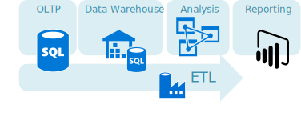
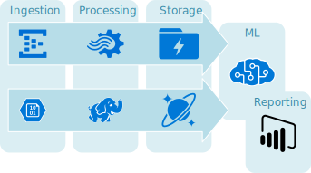

# Azure Data Architecture Guide

This guide presents a structured approach for designing data-centric solutions on Microsoft Azure. It is based on proven practices derived from customer engagements.

> [!NOTE]
> Learn more about adopting your systems for data governance, analytics, and data management, in [Cloud adoption for data management](/azure/cloud-adoption-framework/scenarios/data-management).

## Introduction

The cloud is changing the way applications are designed, including how data is processed and stored. Instead of a single general-purpose database that handles all of a solution's data, _polyglot persistence_ solutions use multiple, specialized data stores, each optimized to provide specific capabilities. The perspective on data in the solution changes as a result. There are no longer multiple layers of business logic that read and write to a single data layer. Instead, solutions are designed around a *data pipeline* that describes how data flows through a solution, where it is processed, where it is stored, and how it is consumed by the next component in the pipeline.

## How this guide is structured

This guide is structured around two general categories of data solution, *traditional RDBMS workloads* and *big data solutions*.

**Traditional RDBMS workloads**. These workloads include [online transaction processing (OLTP)](/azure/architecture/data-guide/relational-data/online-transaction-processing) and [online analytical processing (OLAP)](/azure/architecture/data-guide/relational-data/online-analytical-processing). Data in OLTP systems is typically relational data with a predefined schema and a set of constraints to maintain referential integrity. Often, data from multiple sources in the organization may be consolidated into a [data warehouse](/azure/architecture/data-guide/relational-data/data-warehousing), using an [ETL process](/azure/architecture/data-guide/relational-data/etl) to move and transform the source data.

**Big data solutions**. A [big data architecture](/azure/architecture/data-guide/big-data/) is designed to handle the ingestion, processing, and analysis of data that is too large or complex for traditional database systems. The data may be processed [in batch](/azure/architecture/data-guide/big-data/batch-processing) or [in real time](/azure/architecture/data-guide/big-data/real-time-processing). Big data solutions typically involve a large amount of [non-relational data](/azure/architecture/data-guide/big-data/non-relational-data), such as key-value data, [JSON documents](/azure/architecture/data-guide/scenarios/csv-and-json), or [time series data](/azure/architecture/data-guide/scenarios/time-series). Often traditional RDBMS systems are not well-suited to store this type of data. The term *NoSQL* refers to a family of databases designed to hold non-relational data. The term isn't quite accurate, because many non-relational data stores support SQL compatible queries. The term *NoSQL* stands for "Not only SQL".

These two categories are not mutually exclusive, and there is overlap between them, but we feel that it's a useful way to frame the discussion. Within each category, the guide discusses **common scenarios**, including relevant Azure services and the appropriate architecture for the scenario. In addition, the guide compares **technology choices** for data solutions in Azure, including open source options. Within each category, we describe the key selection criteria and a capability matrix, to help you choose the right technology for your scenario.

This guide is not intended to teach you data science or database theory &mdash; you can find entire books on those subjects. Instead, the goal is to help you select the right data architecture or data pipeline for your scenario, and then select the Azure services and technologies that best fit your requirements. If you already have an architecture in mind, you can skip directly to the technology choices.

## Next steps

* Relational data:
    * [Extract, transform, and load (ETL)](/azure/architecture/data-guide/relational-data/etl)
    * [Online analytical processing (OLAP)](/azure/architecture/data-guide/relational-data/online-analytical-processing)
    * [Online transaction processing (OLTP)](/azure/architecture/data-guide/relational-data/online-transaction-processing)
    * [Data warehousing in Microsoft Azure](/azure/architecture/data-guide/relational-data/data-warehousing)
* Non-relational data:
    * [Non-relational data and NoSQL](/azure/architecture/data-guide/big-data/non-relational-data)
    * [Processing free-form text for search](/azure/architecture/data-guide/scenarios/search)
    * [Time series data](/azure/architecture/data-guide/scenarios/time-series)
    * [Working with CSV and JSON files for data solutions](/azure/architecture/data-guide/scenarios/csv-and-json)
* [Build a scalable system for massive data](/azure/architecture/data-guide/scenarios/build-scalable-database-solutions-azure-services)
* Big data:
    * [Big data architectures](/azure/architecture/data-guide/big-data/)
    * [Batch processing](/azure/architecture/data-guide/big-data/batch-processing)
    * [Real time processing](/azure/architecture/data-guide/big-data/real-time-processing)
* Technology choices:
    * [Choose an analytical data store in Azure](/azure/architecture/data-guide/technology-choices/analytical-data-stores)
    * [Choose a data analytics and reporting technology in Azure](/azure/architecture/data-guide/technology-choices/analysis-visualizations-reporting)
    * [Choose a batch processing technology in Azure](/azure/architecture/data-guide/technology-choices/batch-processing)
    * [Data lakes](/azure/architecture/data-guide/scenarios/data-lake)
    * [Choose a big data storage technology in Azure](/azure/architecture/data-guide/technology-choices/data-storage)
    * [Choose a data pipeline orchestration technology in Azure](/azure/architecture/data-guide/technology-choices/pipeline-orchestration-data-movement)
    * [Choose a real-time message ingestion technology in Azure](/azure/architecture/data-guide/technology-choices/real-time-ingestion)
    * [Choose a search data store in Azure](/azure/architecture/data-guide/technology-choices/search-options)
    * [Choose a stream processing technology in Azure](/azure/architecture/data-guide/technology-choices/stream-processing)
* Additional scenarios:
    * [Data management patterns](/azure/architecture/patterns/category/data-management)
    * [Transactional Outbox pattern with Azure Cosmos DB](/azure/architecture/best-practices/transactional-outbox-cosmos)
    * [Transfer data to and from Azure](/azure/architecture/data-guide/scenarios/data-transfer)
    * [Extend on-premises data solutions to the cloud](/azure/architecture/data-guide/scenarios/hybrid-on-premises-and-cloud)
    * [Secure data solutions](/azure/architecture/data-guide/scenarios/securing-data-solutions)
    * [Tenancy models for SaaS applications](/azure/architecture/isv/application-tenancy)
