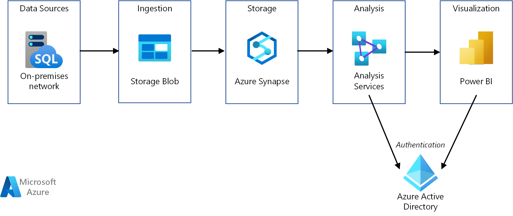

<!-- cSpell:ignore LLAP Oozie DWUs -->

A data warehouse is a centralized repository of integrated data from one or more disparate sources. Data warehouses store current and historical data and are used for reporting and analysis of the data.

*Download a [Visio file](https://arch-center.azureedge.net/enterprise-bi-synapse.vsdx) of this architecture.*

To move data into a data warehouse, data is periodically extracted from various sources that contain important business information. As the data is moved, it can be formatted, cleaned, validated, summarized, and reorganized. Alternatively, the data can be stored in the lowest level of detail, with aggregated views provided in the warehouse for reporting. In either case, the data warehouse becomes a permanent data store for reporting, analysis, and business intelligence (BI).

## Data warehouse architectures

The following reference architectures show end-to-end data warehouse architectures on Azure:

- [Enterprise BI in Azure with Azure Synapse Analytics](/azure/architecture/example-scenario/analytics/enterprise-bi-synapse). This reference architecture implements an extract, load, and transform (ELT) pipeline that moves data from an on-premises SQL Server database into Azure Synapse.
- [Automated enterprise BI with Azure Synapse and Azure Data Factory](../../reference-architectures/data/enterprise-bi-adf.yml). This reference architecture shows an ELT pipeline with incremental loading, automated using Azure Data Factory.

## When to use this solution

Choose a data warehouse when you need to turn massive amounts of data from operational systems into a format that is easy to understand. Data warehouses don't need to follow the same terse data structure you may be using in your OLTP databases. You can use column names that make sense to business users and analysts, restructure the schema to simplify relationships, and consolidate several tables into one. These steps help guide users who need to create reports and analyze the data in BI systems, without the help of a database administrator (DBA) or data developer.

Consider using a data warehouse when you need to keep historical data separate from the source transaction systems for performance reasons. Data warehouses make it easy to access historical data from multiple locations, by providing a centralized location using common formats, keys, and data models.

Because data warehouses are optimized for read access, generating reports is faster than using the source transaction system for reporting.

Other benefits include:

- The data warehouse can store historical data from multiple sources, representing a single source of truth.
- You can improve data quality by cleaning up data as it is imported into the data warehouse.
- Reporting tools don't compete with the transactional systems for query processing cycles. A data warehouse allows the transactional system to focus on handling writes, while the data warehouse satisfies the majority of read requests.
- A data warehouse can consolidate data from different software.
- Data mining tools can find hidden patterns in the data using automatic methodologies.
- Data warehouses make it easier to provide secure access to authorized users, while restricting access to others. Business users don't need access to the source data, removing a potential attack vector.
- Data warehouses make it easier to create business intelligence solutions, such as [OLAP cubes](online-analytical-processing.yml).

## Challenges

Properly configuring a data warehouse to fit the needs of your business can bring some of the following challenges:

- Committing the time required to properly model your business concepts. Data warehouses are information driven. You must standardize business-related terms and common formats, such as currency and dates. You also need to restructure the schema in a way that makes sense to business users but still ensures accuracy of data aggregates and relationships.

- Planning and setting up your data orchestration. Consider how to copy data from the source transactional system to the data warehouse, and when to move historical data from operational data stores into the warehouse.

- Maintaining or improving data quality by cleaning the data as it is imported into the warehouse.

## Data warehousing in Azure

You may have one or more sources of data, whether from customer transactions or business applications. This data is traditionally stored in one or more [OLTP](online-transaction-processing.md) databases. The data could be persisted in other storage mediums such as network shares, Azure Storage Blobs, or a data lake. The data could also be stored by the data warehouse itself or in a relational database such as Azure SQL Database. The purpose of the analytical data store layer is to satisfy queries issued by analytics and reporting tools against the data warehouse. In Azure, this analytical store capability can be met with Azure Synapse, or with Azure HDInsight using Hive or Interactive Query. In addition, you will need some level of orchestration to move or copy data from data storage to the data warehouse, which can be done using Azure Data Factory or Oozie on Azure HDInsight.

There are several options for implementing a data warehouse in Azure, depending on your needs. The following lists are broken into two categories, [symmetric multiprocessing](https://en.wikipedia.org/wiki/Symmetric_multiprocessing) (SMP) and [massively parallel processing](https://en.wikipedia.org/wiki/Massively_parallel) (MPP).

SMP:

- [Azure SQL Database](/azure/sql-database)
- [SQL Server in a virtual machine](/sql/sql-server/sql-server-technical-documentation)

MPP:

- [Azure Synapse Analytics (formerly Azure Data Warehouse)](/azure/sql-data-warehouse/sql-data-warehouse-overview-what-is)
- [Apache Hive on HDInsight](/azure/hdinsight/hadoop/hdinsight-use-hive)
- [Interactive Query (Hive LLAP) on HDInsight](/azure/hdinsight/interactive-query/apache-interactive-query-get-started)

As a general rule, SMP-based warehouses are best suited for small to medium data sets (up to 4-100 TB), while MPP is often used for big data. The delineation between small/medium and big data partly has to do with your organization's definition and supporting infrastructure. (See [Choosing an OLTP data store](online-transaction-processing.md#scalability-capabilities).)

Beyond data sizes, the type of workload pattern is likely to be a greater determining factor. For example, complex queries may be too slow for an SMP solution, and require an MPP solution instead. MPP-based systems usually have a performance penalty with small data sizes, because of how jobs are distributed and consolidated across nodes. If your data sizes already exceed 1 TB and are expected to continually grow, consider selecting an MPP solution. However, if your data sizes are smaller, but your workloads are exceeding the available resources of your SMP solution, then MPP may be your best option as well.

The data accessed or stored by your data warehouse could come from a number of data sources, including a data lake, such as [Azure Data Lake Storage](/azure/data-lake-store). For a video session that compares the different strengths of MPP services that can use Azure Data Lake, see [Azure Data Lake and Azure Data Warehouse: Applying Modern Practices to Your App](https://azure.microsoft.com/resources/videos/build-2016-azure-data-lake-and-azure-data-warehouse-applying-modern-practices-to-your-app).

SMP systems are characterized by a single instance of a relational database management system sharing all resources (CPU/Memory/Disk). You can scale up an SMP system. For SQL Server running on a VM, you can scale up the VM size. For Azure SQL Database, you can scale up by selecting a different service tier.

MPP systems can be scaled out by adding more compute nodes (which have their own CPU, memory, and I/O subsystems). There are physical limitations to scaling up a server, at which point scaling out is more desirable, depending on the workload. However, the differences in querying, modeling, and data partitioning mean that MPP solutions require a different skill set.

When deciding which SMP solution to use, see [A closer look at Azure SQL Database and SQL Server on Azure VMs](/azure/sql-database/sql-database-paas-vs-sql-server-iaas#business-motivations-for-choosing-databases-managed-instances-or-sql-virtual-machines).

Azure Synapse (formerly Azure SQL Data Warehouse) can also be used for small and medium datasets, where the workload is compute and memory intensive. Read more about Azure Synapse patterns and common scenarios:

- [Azure SQL Data Warehouse Workload Patterns and Anti-Patterns](#data-warehousing-in-azure)

- [Azure SQL Data Warehouse loading patterns and strategies](/archive/blogs/sqlcat/azure-sql-data-warehouse-loading-patterns-and-strategies)

- [Migrating data to Azure SQL Data Warehouse in practice](/archive/blogs/sqlcat/migrating-data-to-azure-sql-data-warehouse-in-practice)

- [Common ISV application patterns using Azure SQL Data Warehouse](/archive/blogs/sqlcat/common-isv-application-patterns-using-azure-sql-data-warehouse)

## Key selection criteria

To narrow the choices, start by answering these questions:

- Do you want a managed service rather than managing your own servers?

- Are you working with extremely large data sets or highly complex, long-running queries? If yes, consider an MPP option.

- For a large data set, is the data source structured or unstructured? Unstructured data may need to be processed in a big data environment such as Spark on HDInsight, Azure Databricks, Hive LLAP on HDInsight, or Azure Data Lake Analytics. All of these can serve as ELT (Extract, Load, Transform) and ETL (Extract, Transform, Load) engines. They can output the processed data into structured data, making it easier to load into Azure Synapse or one of the other options. For structured data, Azure Synapse has a performance tier called Optimized for Compute, for compute-intensive workloads requiring ultra-high performance.

- Do you want to separate your historical data from your current, operational data? If so, select one of the options where [orchestration](../technology-choices/pipeline-orchestration-data-movement.md) is required. These are standalone warehouses optimized for heavy read access, and are best suited as a separate historical data store.

- Do you need to integrate data from several sources, beyond your OLTP data store? If so, consider options that easily integrate multiple data sources.

- Do you have a multitenancy requirement? If so, Azure Synapse is not ideal for this requirement. For more information, see [Azure Synapse Patterns and Anti-Patterns](#data-warehousing-in-azure).

- Do you prefer a relational data store? If so, choose an option with a relational data store, but also note that you can use a tool like PolyBase to query non-relational data stores if needed. If you decide to use PolyBase, however, run performance tests against your unstructured data sets for your workload.

- Do you have real-time reporting requirements? If you require rapid query response times on high volumes of singleton inserts, choose an option that supports real-time reporting.

- Do you need to support a large number of concurrent users and connections? The ability to support a number of concurrent users/connections depends on several factors.

  - For Azure SQL Database, refer to the [documented resource limits](/azure/sql-database/sql-database-resource-limits) based on your service tier.

  - SQL Server allows a maximum of 32,767 user connections. When running on a VM, performance will depend on the VM size and other factors.

  - Azure Synapse has limits on concurrent queries and concurrent connections. For more information, see [Concurrency and workload management in Azure Synapse](/azure/sql-data-warehouse/sql-data-warehouse-develop-concurrency). Consider using complementary services, such as [Azure Analysis Services](/azure/analysis-services/analysis-services-overview), to overcome limits in Azure Synapse.

- What sort of workload do you have? In general, MPP-based warehouse solutions are best suited for analytical, batch-oriented workloads. If your workloads are transactional by nature, with many small read/write operations or multiple row-by-row operations, consider using one of the SMP options. One exception to this guideline is when using stream processing on an HDInsight cluster, such as Spark Streaming, and storing the data within a Hive table.

## Capability Matrix

The following tables summarize the key differences in capabilities.

### General capabilities

| Capability | Azure SQL Database | SQL Server (VM) | Azure Synapse | Apache Hive on HDInsight | Hive LLAP on HDInsight |
| --- | --- | --- | --- | --- | --- | -- |
| Is managed service | Yes | No | Yes | Yes 1 | Yes 1 |
| Requires data orchestration (holds copy of data/historical data) | No | No | Yes | Yes | Yes |
| Easily integrate multiple data sources | No | No | Yes | Yes | Yes |
| Supports pausing compute | No | No | Yes | No 2 | No 2 |
| Relational data store | Yes | Yes |  Yes | No | No |
| Real-time reporting | Yes | Yes | No | No | Yes |
| Flexible backup restore points | Yes | Yes | No 3 | Yes 4 | Yes 4 |
| SMP/MPP | SMP | SMP | MPP | MPP | MPP |

[1] Manual configuration and scaling.

[2] HDInsight clusters can be deleted when not needed, and then re-created. Attach an external data store to your cluster so your data is retained when you delete your cluster. You can use Azure Data Factory to automate your cluster's lifecycle by creating an on-demand HDInsight cluster to process your workload, then delete it once the processing is complete.

[3] With Azure Synapse, you can restore a database to any available restore point within the last seven days. Snapshots start every four to eight hours and are available for seven days. When a snapshot is older than seven days, it expires and its restore point is no longer available.

[4] Consider using an [external Hive metastore](/azure/hdinsight/hdinsight-hadoop-provision-linux-clusters#metastore-settings) that can be backed up and restored as needed. Standard backup and restore options that apply to Blob Storage or Data Lake Storage can be used for the data, or third-party HDInsight backup and restore solutions, such as [Imanis Data](https://azure.microsoft.com/blog/imanis-data-cloud-migration-backup-for-your-big-data-applications-on-azure-hdinsight) can be used for greater flexibility and ease of use.

### Scalability capabilities

| Capability | Azure SQL Database | SQL Server (VM) |  Azure Synapse | Apache Hive on HDInsight | Hive LLAP on HDInsight |
| --- | --- | --- | --- | --- | --- | -- |
| Redundant regional servers for high availability  | Yes | Yes | Yes | No | No |
| Supports query scale out (distributed queries)  | No | No | Yes | Yes | Yes |
| Dynamic scalability | Yes | No | Yes 1 | No | No |
| Supports in-memory caching of data | Yes |  Yes | Yes | Yes | Yes |

[1] Azure Synapse allows you to scale up or down by adjusting the number of data warehouse units (DWUs). See [Manage compute power in Azure Synapse](/azure/sql-data-warehouse/sql-data-warehouse-manage-compute-overview).

### Security capabilities

| Capability |           Azure SQL Database            |  SQL Server in a virtual machine  | Azure Synapse |   Apache Hive on HDInsight    |    Hive LLAP on HDInsight     |
|-------------------------|-----------------------------------------|-----------------------------------|--------------------|-------------------------------|-------------------------------|
|     Authentication      | SQL / Azure Active Directory (Azure AD) | SQL / Azure AD / Active Directory |   SQL / Azure AD   | local / Azure AD 1 | local / Azure AD 1 |
|      Authorization      |                   Yes                   |                Yes                |        Yes         |              Yes              |       Yes 1        |
|        Auditing         |                   Yes                   |                Yes                |        Yes         |              Yes              |       Yes 1        |
| Data encryption at rest |            Yes 2             |         Yes 2          |  Yes 2  |       Yes 2        |       Yes 1        |
|   Row-level security    |                   Yes                   |                Yes                |        Yes         |              No               |       Yes 1        |
|   Supports firewalls    |                   Yes                   |                Yes                |        Yes         |              Yes              |       Yes 3        |
|  Dynamic data masking   |                   Yes                   |                Yes                |        Yes         |              No               |       Yes 1        |

[1] Requires using a [domain-joined HDInsight cluster](/azure/hdinsight/domain-joined/apache-domain-joined-introduction).

[2] Requires using Transparent Data Encryption (TDE) to encrypt and decrypt your data at rest.

[3] Supported when [used within an Azure Virtual Network](/azure/hdinsight/hdinsight-extend-hadoop-virtual-network).

## Contributors

*This article is maintained by Microsoft. It was originally written by the following contributors.*

Principal author:

- [Zoiner Tejada](https://www.linkedin.com/in/zoinertejada) | CEO and Architect

*To see non-public LinkedIn profiles, sign in to LinkedIn.*

## Next steps

Read more about securing your data warehouse:

- [Securing your SQL Database](/azure/sql-database/sql-database-security-overview#network-security)
- [Secure a database in Azure Synapse](/azure/sql-data-warehouse/sql-data-warehouse-overview-manage-security)
- [Extend Azure HDInsight using an Azure Virtual Network](/azure/hdinsight/hdinsight-extend-hadoop-virtual-network)
- [Enterprise-level Hadoop security with domain-joined HDInsight clusters](/azure/hdinsight/domain-joined/apache-domain-joined-introduction)

## Related resources

- [Enterprise BI in Azure with Azure Synapse Analytics](../../example-scenario/analytics/enterprise-bi-synapse.yml)
- [Automated enterprise BI with Azure Synapse and Azure Data Factory](../../reference-architectures/data/enterprise-bi-adf.yml)
- [Logical data warehouse with Azure Synapse serverless SQL pools](../../solution-ideas/articles/logical-data-warehouse.yml)
- [Enterprise data warehouse](../../solution-ideas/articles/enterprise-data-warehouse.yml)
