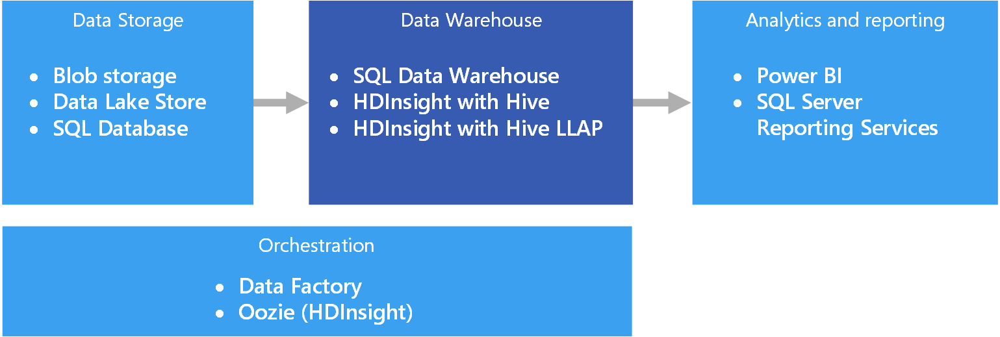

# Data warehousing and data marts

A data warehouse is a central, organizational, relational repository of integrated data from one or more disparate sources, across many or all subject areas. Data warehouses store current and historical data and are used for reporting and analysis of the data in different ways.

To move data into a data warehouse, it is extracted on a periodic basis from various sources that contain important business information. As the data is moved, it can be formatted, cleaned, validated, summarized, and reorganized. Alternately, the data can be stored in the lowest level of detail, with aggregated views provided in the warehouse for reporting. In either case, the data warehouse becomes a permanent storage space for data used for reporting, analysis, and forming important business decisions using business intelligence (BI) tools.

## Data marts and operational data stores

Managing data at scale is complex, and it is becoming less common to have a single data warehouse that represents all data across the entire enterprise. Instead, organizations create smaller, more focused data warehouses, called *data marts*, that expose the desired data for analytics purposes. An orchestration process populates the data marts from data maintained in an operational data store. The operational data store acts as an intermediary between the source transactional system and the data mart. Data managed by the operational data store is a cleaned version of the data present in the source transactional system, and is typically a subset of the historical data that is maintained by the data warehouse or data mart. 

## When to use this solution

Choose a data warehouse when you need to turn massive amounts of data from operational systems into a format that is easy to understand, current, and accurate. Data warehouses do not need to follow the same terse data structure you may be using in your operational/OLTP databases. You can use column names that make sense to business users and analysts, restructure the schema to simplify data relationships, and consolidate several tables into one. These steps help guide users who need to create ad hoc reports, or create reports and analyze the data in BI systems, without the help of a database administrator (DBA) or data developer.

Consider using a data warehouse when you need to keep historical data separate from the source transaction systems for performance reasons. Data warehouses make it easy to access historical data from multiple locations, by providing a centralized location using common formats, common keys, common data models, and common access methods.

Data warehouses are optimized for read access, resulting in faster report generation compared to running reports against the source transaction system. In addition, data warehouses provide the following benefits:

* All historical data from multiple sources can be stored and accessed from a data warehouse as the single source of truth.
* You can improve data quality by cleaning up data as it is imported into the data warehouse, providing more accurate data as well as providing consistent codes and descriptions.
* Reporting tools do not compete with the transactional source systems for query processing cycles. A data warehouse allows the transactional system to focus predominantly on handling writes, while the data warehouse satisfies the majority of read requests.
* A data warehouse can help consolidate data from different software.
* Data mining tools can help you find hidden patterns using automatic methodologies against data stored in your warehouse.
* Data warehouses make it easier to provide secure access to authorized users, while restricting access to others. There is no need to grant business users access to the source data, thereby removing a potential attack vector against one or more production transaction systems.
* Data warehouses make it easier to create business intelligence solutions on top of the data, such as [OLAP cubes](online-analytical-processing.md).

## Challenges

Properly configuring a data warehouse to fit the needs of your business can bring some of the following challenges:

* Committing the time required to properly model your business concepts. This is an important step, as data warehouses are information driven, where concept mapping drives the rest of the project. This involves standardizing business-related terms and common formats (such as currency and dates), and restructuring the schema in a way that makes sense to business users but still ensures accuracy of data aggregates and relationships.
* Planning and setting up your data orchestration. Consideration include how to copy data from the source transactional system to the data warehouse, and when to move historical data out of your operational data stores and into the warehouse.
* Maintaining or improving data quality by cleaning the data as it is imported into the warehouse.

## Data warehousing in Azure

In Azure, you may have one or more sources of data, whether from customer transactions, or from various business applications used by various departments. This data is traditionally stored in one or more [OLTP](online-transaction-processing.md) databases. The data could be persisted in other storage mediums such as network shares, Azure Storage Blobs, or a data lake. The data could also be stored by the data warehouse itself or in a relational database such as Azure SQL Database. The purpose of the analytical data store layer is to satisfy queries issued by analytics and reporting tools against the data warehouse or data mart. In Azure, this analytical store capability can be met with Azure SQL Data Warehouse, or with Azure HDInsight using Hive or Interactive Query. In addition, you will need some level of orchestration to periodically move or copy data from data storage to the data warehouse, which can be done using Azure Data Factory or Oozie on Azure HDInsight.

There are several options for implementing a data warehouse in Azure, depending on your needs. The following lists are broken into two categories, [symmetric multiprocessing](https://en.wikipedia.org/wiki/Symmetric_multiprocessing) (SMP) and [massively parallel processing](https://en.wikipedia.org/wiki/Massively_parallel) (MPP). 

SMP:

- [Azure SQL Database](/azure/sql-database/)
- [SQL Server in a virtual machine](/sql/sql-server/sql-server-technical-documentation)

MPP:

- [Azure Data Warehouse](/azure/sql-data-warehouse/sql-data-warehouse-overview-what-is)
- [Apache Hive on HDInsight](/azure/hdinsight/hadoop/hdinsight-use-hive)
- [Interactive Query (Hive LLAP) on HDInsight](/azure/hdinsight/interactive-query/apache-interactive-query-get-started)

As a general rule, SMP-based warehouses are best suited for small to medium data sets (up to 4-100 TB), while MPP is often used for big data. The delineation between small/medium and big data partly has to do with your organization's definition and supporting infrastructure. (See [Choosing an OLTP data store](online-transaction-processing.md#scalability-capabilities).) 

Beyond data sizes, the type of workload pattern is likely to be a greater determining factor. For example, complex queries may be too slow for an SMP solution, and require an MPP solution instead. MPP-based systems are likely to impose a performance penalty with small data sizes, due to the way jobs are distributed and consolidated across nodes. If your data sizes already exceed 1 TB and are expected to continually grow, consider selecting an MPP solution. However, if your data sizes are less than this, but your workloads are exceeding the available resources of your SMP solution, then MPP may be your best option as well.

The data accessed or stored by your data warehouse could come from a number of data sources, including a data lake, such as [Azure Data Lake Store](/azure/data-lake-store/). For a video session that compares the different strengths of MPP services that can use Azure Data Lake, see [Azure Data Lake and Azure Data Warehouse: Applying Modern Practices to Your App](https://azure.microsoft.com/resources/videos/build-2016-azure-data-lake-and-azure-data-warehouse-applying-modern-practices-to-your-app/).

SMP systems are characterized by a single instance of a relational database management system sharing all resources (CPU/Memory/Disk). You can scale up an SMP system. For SQL Server running on a VM, you can scale up the VM size. For Azure SQL Database, you can scale up by selecting a different service tier. 

MPP systems can be scaled out by adding more compute nodes (which have their own CPU, memory and I/O subsystems). There are physical limitations to scaling up a server, at which point scaling out is more desirable, depending on the workload. However, MPP solutions require a different skillset, due to variances in querying, modeling, partitioning of data, and other factors unique to parallel processing. 

When deciding which SMP solution to use, see [A closer look at Azure SQL Database and SQL Server on Azure VMs](/azure/sql-database/sql-database-paas-vs-sql-server-iaas#a-closer-look-at-azure-sql-database-and-sql-server-on-azure-vms). 

Azure SQL Data Warehouse can also be used for small and medium datasets, where the workload is compute and memory intensive. Read more about SQL Data Warehouse patterns and common scenarios:

- [SQL Data Warehouse Patterns and Anti-Patterns](https://blogs.msdn.microsoft.com/sqlcat/2017/09/05/azure-sql-data-warehouse-workload-patterns-and-anti-patterns/)
- [SQL Data Warehouse Loading Patterns and Strategies](https://blogs.msdn.microsoft.com/sqlcat/2017/05/17/azure-sql-data-warehouse-loading-patterns-and-strategies/)
- [Migrating Data to Azure SQL Data Warehouse](https://blogs.msdn.microsoft.com/sqlcat/2016/08/18/migrating-data-to-azure-sql-data-warehouse-in-practice/)
- [Common ISV Application Patterns Using Azure SQL Data Warehouse](https://blogs.msdn.microsoft.com/sqlcat/2017/09/05/common-isv-application-patterns-using-azure-sql-data-warehouse/)

## Key selection criteria

To narrow the choices, start by answering these questions:

- Do you want a managed service rather than managing your own servers?

- Are you working with extremely large data sets or highly complex, long-running queries? If yes, consider an MPP option. 

- For a large data set, is the data source structured or unstructured? Unstructured data may need to be processed in a big data environment such as Spark on HDInsight, Azure Databricks, Hive LLAP on HDInsight, or Azure Data Lake Analytics. All of these can serve as ELT (Extract, Load, Transform) and ETL (Extract, Transform, Load) engines. They can output the processed data into structured data, making it easier to load into SQL Data Warehouse or one of the other options. For structured data, SQL Data Warehouse has a performance tier called Optimized for Compute, for compute-intensive workloads requiring ultra-high performance.

- Do you want to separate your historical data from your current, operational data? If so, select one of the options where [orchestration](../technology-choices/pipeline-orchestration-data-movement.md) is required. These are standalone warehouses optimized for heavy read access, and are best suited as a separate historical data store.

- Do you need to integrate data from several sources, beyond your OLTP data store? If so, consider options that easily integrate multiple data sources. 

- Do you have a multi-tenancy requirement? If so, SQL Data Warehouse is not ideal for this requirement. For more information, see [SQL Data Warehouse Patterns and Anti-Patterns](https://blogs.msdn.microsoft.com/sqlcat/2017/09/05/azure-sql-data-warehouse-workload-patterns-and-anti-patterns/).

- Do you prefer a relational data store? If so, narrow your options to those with a relational data store, but also note that you can use a tool like PolyBase to query non-relational data stores if needed. If you decide to use PolyBase, however, run performance tests against your unstructured data sets for your workload.

- Do you have real-time reporting requirements? If you require rapid query response times on high volumes of singleton inserts, narrow your options to those that can support real-time reporting.

- Do you need to support a large number of concurrent users and connections? The ability to support a number of concurrent users/connections depends on several factors. 

    - For Azure SQL Database, refer to the [documented resource limits](/azure/sql-database/sql-database-resource-limits) based on your service tier. 
    
    - SQL Server allows a maximum of 32,767 user connections. When running on a VM, performance will depend on the VM size and other factors. 
    
    - SQL Data Warehouse has limits on concurrent queries and concurrent connections. For more information, see [Concurrency and workload management in SQL Data Warehouse](/azure/sql-data-warehouse/sql-data-warehouse-develop-concurrency). Consider using complementary services, such as [Azure Analysis Services](/azure/analysis-services/analysis-services-overview), to overcome limits in SQL Data Warehouse.

- What sort of workload do you have? In general, MPP-based warehouse solutions are best suited for analytical, batch-oriented workloads. If your workloads are transactional by nature, with many small read/write operations or multiple row-by-row operations, consider using one of the SMP options. One exception to this guideline is when using stream processing on an HDInsight cluster, such as Spark Streaming, and storing the data within a Hive table.

## Capability Matrix

The following tables summarize the key differences in capabilities.

### General capabilities

| | Azure SQL Database | SQL Server (VM) | SQL Data Warehouse | Apache Hive on HDInsight | Hive LLAP on HDInsight |
| --- | --- | --- | --- | --- | --- | -- |
| Is managed service | Yes | No | Yes | Yes 1 | Yes 1 |
| Requires data orchestration (holds copy of data/historical data) | No | No | Yes | Yes | Yes |
| Easily integrate multiple data sources | No | No | Yes | Yes | Yes |
| Supports pausing compute | No | No | Yes | No 2 | No 2 |
| Relational data store | Yes | Yes |  Yes | No | No |
| Real-time reporting | Yes | Yes | No | No | Yes |
| Flexible backup restore points | Yes | Yes | No 3 | Yes 4 | Yes 4 |
| SMP/MPP | SMP | SMP | MPP | MPP | MPP |

[1] Manual configuration and scaling.

[2] HDInsight clusters can be deleted when not needed, and then re-created. Attach an external data store to your cluster so your data is retained when you delete your cluster. You can use Azure Data Factory to automate your cluster's lifecycle by creating an on-demand HDInsight cluster to process your workload, then delete it once the processing is complete.

[3] With SQL Data Warehouse, you can restore a database to any available restore point within the last seven days. Snapshots start every four to eight hours and are available for seven days. When a snapshot is older than seven days, it expires and its restore point is no longer available.

[4] Consider using an [external Hive metastore](/azure/hdinsight/hdinsight-hadoop-provision-linux-clusters#use-hiveoozie-metastore) that can be backed up and restored as needed. Standard backup and restore options that apply to Blob Storage or Data Lake Store can be used for the data, or third party HDInsight backup and restore solutions, such as [Imanis Data](https://azure.microsoft.com/blog/imanis-data-cloud-migration-backup-for-your-big-data-applications-on-azure-hdinsight/) can be used for greater flexibility and ease of use.

### Scalability capabilities

| | Azure SQL Database | SQL Server (VM) |  SQL Data Warehouse | Apache Hive on HDInsight | Hive LLAP on HDInsight |
| --- | --- | --- | --- | --- | --- | -- |
| Redundant regional servers for high availability  | Yes | Yes | Yes | No | No |
| Supports query scale out (distributed queries)  | No | No | Yes | Yes | Yes |
| Dynamic scalability | Yes | No | Yes 1 | No | No |
| Supports in-memory caching of data | Yes |  Yes | No | Yes | Yes |

[1] SQL Data Warehouse allows you to scale up or down by adjusting the number of data warehouse units (DWUs). See [Manage compute power in Azure SQL Data Warehouse](/azure/sql-data-warehouse/sql-data-warehouse-manage-compute-overview).

### Security capabilities

|                         |           Azure SQL Database            |  SQL Server in a virtual machine  | SQL Data Warehouse |   Apache Hive on HDInsight    |    Hive LLAP on HDInsight     |
|-------------------------|-----------------------------------------|-----------------------------------|--------------------|-------------------------------|-------------------------------|
|     Authentication      | SQL / Azure Active Directory (Azure AD) | SQL / Azure AD / Active Directory |   SQL / Azure AD   | local / Azure AD 1 | local / Azure AD 1 |
|      Authorization      |                   Yes                   |                Yes                |        Yes         |              Yes              |       Yes 1        |
|        Auditing         |                   Yes                   |                Yes                |        Yes         |              Yes              |       Yes 1        |
| Data encryption at rest |            Yes 2             |         Yes 2          |  Yes 2  |       Yes 2        |       Yes 1        |
|   Row-level security    |                   Yes                   |                Yes                |        Yes         |              No               |       Yes 1        |
|   Supports firewalls    |                   Yes                   |                Yes                |        Yes         |              Yes              |       Yes 3        |
|  Dynamic data masking   |                   Yes                   |                Yes                |        Yes         |              No               |       Yes 1        |

[1] Requires using a [domain-joined HDInsight cluster](/azure/hdinsight/domain-joined/apache-domain-joined-introduction).

[2] Requires using Transparent Data Encryption (TDE) to encrypt and decrypt your data at rest.

[3] Supported when [used within an Azure Virtual Network](/azure/hdinsight/hdinsight-extend-hadoop-virtual-network).

Read more about securing your data warehouse:

* [Securing your SQL Database](/azure/sql-database/sql-database-security-overview#connection-security)
* [Secure a database in SQL Data Warehouse](/azure/sql-data-warehouse/sql-data-warehouse-overview-manage-security)
* [Extend Azure HDInsight using an Azure Virtual Network](/azure/hdinsight/hdinsight-extend-hadoop-virtual-network)
* [Enterprise-level Hadoop security with domain-joined HDInsight clusters](/azure/hdinsight/domain-joined/apache-domain-joined-introduction)

