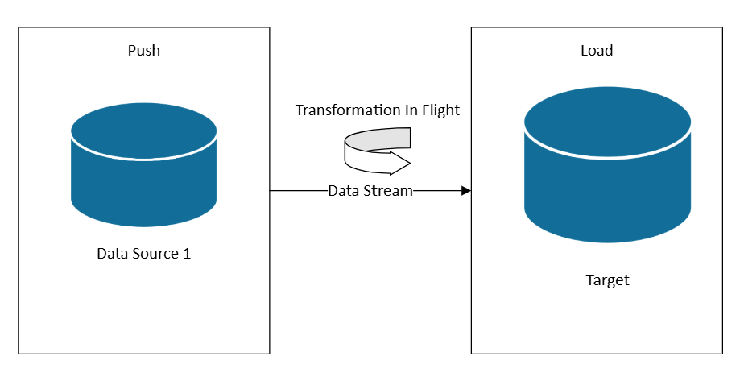

Organizations commonly need to gather data from multiple sources in various formats and move it to one or more data stores. The destination might not be the same type of data store as the source, and the data often needs to be shaped, cleaned, or transformed before loading.

Various tools, services, and processes help address these challenges. Regardless of the approach, you need to coordinate the work and apply data transformations within the data pipeline. The following sections highlight the common methods and practices for these tasks.

## Extract, transform, load (ETL) process

Extract, transform, load (ETL) is a data integration process that consolidates data from diverse sources into a unified data store. During the transformation phase, data is modified according to business rules using a specialized engine. This often involves staging tables that temporarily hold data as it is processed and ultimately loaded into its destination.

The data transformation that takes place usually involves various operations, such as filtering, sorting, aggregating, joining data, cleaning data, deduplicating, and validating data.

Often, the three ETL phases run in parallel to save time. For example, while data is being extracted, a transformation process can work on data already received and prepare it for loading, and a loading process can begin working on the prepared data, rather than waiting for the entire extraction process to complete. You typically design parallelization around data partition boundaries (date, tenant, shard key) to avoid write contention and enable idempotent retries.

Relevant service:

- [Data factory in Microsoft Fabric](/fabric/data-factory/activity-overview)

Other tools:

- [SQL Server Integration Services (SSIS)](/sql/integration-services/sql-server-integration-services)

## Extract, load, transform (ELT)

Extract, load, transform (ELT) differs from ETL solely in where the transformation takes place. In the ELT pipeline, the transformation occurs in the target data store. Instead of using a separate transformation engine, the processing capabilities of the target data store are used to transform data. This simplifies the architecture by removing the transformation engine from the pipeline. Another benefit to this approach is that scaling the target data store also scales the ELT pipeline performance. However, ELT only works well when the target system is powerful enough to transform the data efficiently.

Typical use cases for ELT fall within the big data realm. For example, you might start by extracting source data to flat files in scalable storage, such as a Hadoop Distributed File System (HDFS), Azure blob storage, or Azure Data Lake Storage Gen2. Technologies such as Spark, Hive, or PolyBase, can then be used to query the source data. The key point with ELT is that the data store used to perform the transformation is the same data store where the data is ultimately consumed. This data store reads directly from the scalable storage, instead of loading the data into its own separate storage. This approach skips data copy steps present in ETL, which often can be time consuming for large data sets. Some workloads materialize transformed tables or views to improve query performance or enforce governance rules; ELT doesn't always imply purely virtualized transformations.

The final phase of the ELT pipeline typically transforms the source data into a format that's more efficient for the types of queries that need to be supported. For example, the data might be partitioned by commonly filtered keys. ELT might also use optimized storage formats like Parquet, which is a columnar storage format that organizes data by column to enable compression, [predicate pushdown](/sql/relational-databases/indexes/columnstore-indexes-query-performance), and efficient analytic scans.

Relevant Microsoft service:

- [Microsoft Fabric Data Warehouse](/fabric/data-warehouse/data-warehousing)
- [Microsoft Fabric Lakehouse](/fabric/data-engineering/lakehouse-overview)
- [Microsoft Fabric Data Pipelines](/fabric/data-factory)

## Choosing ETL or ELT

The choice between these approaches depends on your requirements.

Choose ETL when:

- You need to offload heavy transformations away from a constrained target system
- Complex business rules require specialized transformation engines
- Regulatory or compliance requirements mandate curated staging audits before loading

Choose ELT when:

- Your target system is a modern data warehouse or lakehouse with elastic compute scaling
- You need to preserve raw data for exploratory analysis or future schema evolution
- Transformation logic benefits from the target system's native capabilities

## Data flow and control flow

In the context of data pipelines, the control flow ensures the orderly processing of a set of tasks. To enforce the correct processing order of these tasks, precedence constraints are used. You can think of these constraints as connectors in a workflow diagram, as shown in the following image. Each task has an outcome, such as success, failure, or completion. Any subsequent task doesn't initiate processing until its predecessor has completed with one of these outcomes.

Control flows execute data flows as a task. In a data flow task, data is extracted from a source, transformed, or loaded into a data store. The output of one data flow task can be the input to the next data flow task, and data flows can run in parallel. Unlike control flows, you can't add constraints between tasks in a data flow. You can, however, add a data viewer to observe the data as it is processed by each task.

In the diagram, there are several tasks within the control flow, one of which is a data flow task. One of the tasks is nested within a container. Containers can be used to provide structure to tasks, providing a unit of work. One such example is for repeating elements within a collection, such as files in a folder or database statements.

Relevant service:

- [Data factory in Microsoft Fabric](/fabric/data-factory/activity-overview)

## Reverse ETL

Reverse ETL is the process of moving transformed, modeled data from analytical systems into operational tools and applications. Unlike traditional ETL, which flows data from operational systems to analytics, reverse ETL activates insights by pushing curated data back to where business users can act on it. In a reverse ETL pipeline, data flows from data warehouses, lakehouses, or other analytical stores to operational systems such as:

- Customer relationship management (CRM) platforms
- Marketing automation tools
- Customer support systems
- Workload databases

The approach still follows an extraction, transformation, and load process. The transformation step is where you convert from the specific format used by your data warehouse or other analytics system to align to your target system's.

See [Reverse extract, transform, & load (ETL) with Azure Cosmos DB for NoSQL](/azure/cosmos-db/nosql/reverse-extract-transform-load) for an example.

## Streaming data and hot path architectures

When you need [Lambda hot path or Kappa architectures](/azure/architecture/databases/guide/big-data-architectures), you can subscribe to data sources as data is generated. Unlike ETL or ELT, which operate on datasets in scheduled batches, real-time streaming processes data as it arrives, enabling immediate insights and actions.

In a streaming architecture, data is ingested from event sources into a message broker or event hub (such as Azure Event Hubs or Kafka), then processed by a stream processor (such as Fabric Real-Time Intelligence, Azure Stream Analytics, or Apache Flink). The processor applies transformations such as filtering, aggregating, enriching, or joining with reference data—all in motion—before routing results to downstream systems like dashboards, alerts, or databases.

This approach is ideal for scenarios where low latency and continuous updates are critical, such as:

- Monitoring manufacturing equipment for anomalies
- Detecting fraud in financial transactions
- Powering real-time dashboards for logistics or operations
- Triggering alerts based on sensor thresholds

### Reliability considerations for streaming

- Use checkpointing to guarantee at-least-once processing and recover from failures
- Design transformations to be idempotent to handle potential duplicate processing
- Implement [watermarking](/azure/databricks/structured-streaming/watermarks) for late-arriving events and out-of-order processing
- Use dead letter queues for messages that can't be processed

## Technology choices

Data stores:

- [Online Transaction Processing (OLTP) data stores](./online-transaction-processing.md#oltp-in-azure)
- [Online Analytical Processing (OLAP) data stores](./online-analytical-processing.md#olap-in-azure)
- [Data warehouses](./data-warehousing.yml)

Pipeline and orchestration:

- [Pipeline orchestration](../technology-choices/pipeline-orchestration-data-movement.md)
- [Microsoft Fabric Data Factory](/fabric/data-factory/) (modern orchestration)
- [Azure Data Factory](/azure/data-factory/) (hybrid and non-Fabric scenarios)

Lakehouse and modern analytics:

- [Microsoft Fabric Lakehouse](/fabric/data-engineering/lakehouse-overview)
- [Microsoft Fabric Data Warehouse](/fabric/data-warehouse/)

## Next steps

> [!div class="nextstepaction"]
> [Fabric decision guide for data transformation](/fabric/fundamentals/decision-guide-pipeline-dataflow-spark)
