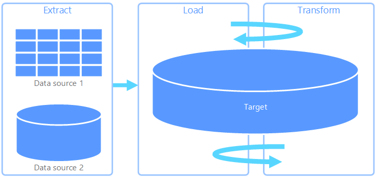
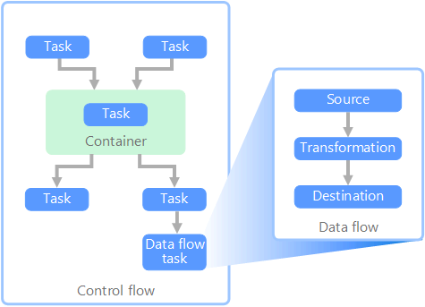

# Extract, transform, and load (ETL)

A common problem that organizations face is how to gather data from multiple sources, in multiple formats, and move it to one or more data stores. The destination may not be the same type of data store as the source, and often the format is different, or the data needs to be shaped or cleaned before loading it into its final destination.

Various tools, services, and processes have been developed over the years to help address these challenges. No matter the process used, there is a common need to coordinate the work and apply some level of data transformation within the data pipeline. The following sections highlight the common methods used to perform these tasks.

## Extract, transform, and load (ETL) process

Extract, transform, and load (ETL) is a data pipeline used to collect data from various sources, transform the data according to business rules, and load it into a destination data store. The transformation work in ETL takes place in a specialized engine, and often involves using staging tables to temporarily hold data as it is being transformed and ultimately loaded to its destination.

The data transformation that takes place usually involves various operations, such as filtering, sorting, aggregating, joining data, cleaning data, deduplicating, and validating data.

Often, the three ETL phases are run in parallel to save time. For example, while data is being extracted, a transformation process could be working on data already received and prepare it for loading, and a loading process can begin working on the prepared data, rather than waiting for the entire extraction process to complete.

Relevant Azure service:

- [Azure Data Factory v2](https://azure.microsoft.com/services/data-factory/)

Other tools:

- [SQL Server Integration Services (SSIS)](/sql/integration-services/sql-server-integration-services)

## Extract, load, and transform (ELT)

Extract, load, and transform (ELT) differs from ETL solely in where the transformation takes place. In the ELT pipeline, the transformation occurs in the target data store. Instead of using a separate transformation engine, the processing capabilities of the target data store are used to transform data. This simplifies the architecture by removing the transformation engine from the pipeline. Another benefit to this approach is that scaling the target data store also scales the ELT pipeline performance. However, ELT only works well when the target system is powerful enough to transform the data efficiently.

Typical use cases for ELT fall within the big data realm. For example, you might start by extracting all of the source data to flat files in scalable storage such as Hadoop distributed file system (HDFS) or Azure Data Lake Store. Technologies such as Spark, Hive, or PolyBase can then be used to query the source data. The key point with ELT is that the data store used to perform the transformation is the same data store where the data is ultimately consumed. This data store reads directly from the scalable storage, instead of loading the data into its own proprietary storage. This approach skips the data copy step present in ETL, which can be a time consuming operation for large data sets.

In practice, the target data store is a [data warehouse](./data-warehousing.md) using either a Hadoop cluster (using Hive or Spark) or a Azure Synapse Analytics. In general, a schema is overlaid on the flat file data at query time and stored as a table, enabling the data to be queried like any other table in the data store. These are referred to as external tables because the data does not reside in storage managed by the data store itself, but on some external scalable storage.

The data store only manages the schema of the data and applies the schema on read. For example, a Hadoop cluster using Hive would describe a Hive table where the data source is effectively a path to a set of files in HDFS. In Azure Synapse, PolyBase can achieve the same result &mdash; creating a table against data stored externally to the database itself. Once the source data is loaded, the data present in the external tables can be processed using the capabilities of the data store. In big data scenarios, this means the data store must be capable of massively parallel processing (MPP), which breaks the data into smaller chunks and distributes processing of the chunks across multiple machines in parallel.

The final phase of the ELT pipeline is typically to transform the source data into a final format that is more efficient for the types of queries that need to be supported. For example, the data may be partitioned. Also, ELT might use optimized storage formats like Parquet, which stores row-oriented data in a columnar fashion and provides optimized indexing.

Relevant Azure service:

- [Azure Synapse](/azure/sql-data-warehouse/sql-data-warehouse-overview-what-is)
- [HDInsight with Hive](/azure/hdinsight/hadoop/hdinsight-use-hive)
- [Azure Data Factory v2](https://azure.microsoft.com/services/data-factory/)
- [Oozie on HDInsight](/azure/hdinsight/hdinsight-use-oozie-linux-mac)

Other tools:

- [SQL Server Integration Services (SSIS)](/sql/integration-services/sql-server-integration-services)

## Data flow and control flow

In the context of data pipelines, the control flow ensures orderly processing of a set of tasks. To enforce the correct processing order of these tasks, precedence constraints are used. You can think of these constraints as connectors in a workflow diagram, as shown in the image below. Each task has an outcome, such as success, failure, or completion. Any subsequent task does not initiate processing until its predecessor has completed with one of these outcomes.

Control flows execute data flows as a task. In a data flow task, data is extracted from a source, transformed, or loaded into a data store. The output of one data flow task can be the input to the next data flow task, and data flows can run in parallel. Unlike control flows, you cannot add constraints between tasks in a data flow. You can, however, add a data viewer to observe the data as it is processed by each task.

In the diagram above, there are several tasks within the control flow, one of which is a data flow task. One of the tasks is nested within a container. Containers can be used to provide structure to tasks, providing a unit of work. One such example is for repeating elements within a collection, such as files in a folder or database statements.

Relevant Azure service:

- [Azure Data Factory v2](https://azure.microsoft.com/services/data-factory/)

Other tools:

- [SQL Server Integration Services (SSIS)](/sql/integration-services/sql-server-integration-services)

## Technology choices

- [Online Transaction Processing (OLTP) data stores](./online-transaction-processing.md#oltp-in-azure)
- [Online Analytical Processing (OLAP) data stores](./online-analytical-processing.md#olap-in-azure)
- [Data warehouses](./data-warehousing.md)
- [Pipeline orchestration](../technology-choices/pipeline-orchestration-data-movement.md)

## Next steps

The following reference architectures show end-to-end ELT pipelines on Azure:

- [Enterprise BI in Azure with Azure Synapse](../../reference-architectures/data/enterprise-bi-synapse.md)
- [Automated enterprise BI with Azure Synapse and Azure Data Factory](../../reference-architectures/data/enterprise-bi-adf.md)
